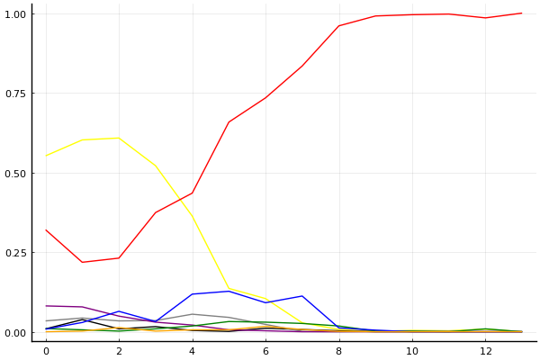

2020 시즌 2 개인전 결승전 1회전

## 경기 결과

| 트랙 | 박인수 | 박현수 | 이재혁 | 정승하 | 유영혁 | 송용준 | 최영훈 | 김지민 |
|:---|---:|---:|---:|---:|---:|---:|---:|---:|
| [카멜롯 펜드래건 캐슬](../pendragon) | 4 | 7 | -1 | 3 | 1 | 0 | 10 | 5 |
| [광산 위험한 제련소](../jeryeonso) | 4 | -1 | 5 | 3 | 1 | 0 | 10 | 7 |
| [동화 이상한 나라의 문](../gate) | 4 | 3 | 10 | 5 | 1 | 7 | -1 | 0 |
| [공동묘지 해골성 대탐험](../skullcastle) | -1 | 0 | 4 | 5 | 1 | 7 | 10 | 3 |
| [어비스 숨겨진 바닷길](../hiddenoceanroad) | 0 | 1 | 10 | 3 | -1 | 7 | 4 | 5 |
| [아이스 아찔한 헬기 점프](../heli) | 3 | 10 | 5 | 0 | -1 | 4 | 1 | 7 |
| [황금문명 오르에트 황금 좌표](../coordinate) | 0 | 3 | 10 | -1 | 1 | 5 | 7 | 4 |
| [[리버스] 해적 로비 절벽의 전투](../rlobby) | 5 | 7 | 10 | 1 | 3 | 4 | -1 | 0 |
| [대저택 은밀한 지하실](../jeotaek) | 7 | 1 | 10 | 5 | 4 | 3 | -1 | 0 |
| [아이스 부서진 빙산](../boobing) | 10 | -5 | 4 | 3 | 7 | 5 | 1 | 0 |
| [아이스 부서진 빙산](../boobing) | 10 | -1 | 7 | 1 | 0 | 4 | 3 | 5 |
| [[리버스] 해적 로비 절벽의 전투](../rlobby) | 4 | 5 | 0 | 7 | 3 | 10 | -1 | 1 |
| [어비스 숨겨진 바닷길](../hiddenoceanroad) | 5 | 7 | 10 | 4 | 0 | -1 | 1 | 3 |
| __total__ |__55__ |__37__ |__84__ |__39__ |__20__ |__55__ |__43__ |__40__ |

## 시뮬레이션

### 1st 확률

x축: 트랙, y축: 확률
1번: 옐로우, 2번: 블랙, 3번: 레드, 4번: 화이트(회색), 5번: 퍼플, 6번: 그린, 7번: 블루, 8번: 오렌지

| 트랙 | 박인수 | 박현수 | 이재혁 | 정승하 | 유영혁 | 송용준 | 최영훈 | 김지민 |
|:---|---:|---:|---:|---:|---:|---:|---:|---:|
| 초기 | 0.552 | 0.009 | 0.320 | 0.034 | 0.081 | 0.010 | 0.008 | 0.000 |
| 카멜롯 펜드래건 캐슬 | 0.602 | 0.038 | 0.218 | 0.043 | 0.078 | 0.006 | 0.029 | 0.002 |
| 광산 위험한 제련소 | 0.608 | 0.009 | 0.231 | 0.034 | 0.049 | 0.002 | 0.064 | 0.013 |
| 동화 이상한 나라의 문 | 0.521 | 0.016 | 0.374 | 0.035 | 0.030 | 0.009 | 0.032 | 0.002 |
| 공동묘지 해골성 대탐험 | 0.363 | 0.004 | 0.435 | 0.055 | 0.021 | 0.018 | 0.118 | 0.006 |
| 어비스 숨겨진 바닷길 | 0.136 | 0.001 | 0.658 | 0.045 | 0.006 | 0.032 | 0.127 | 0.006 |
| 아이스 아찔한 헬기 점프 | 0.104 | 0.011 | 0.734 | 0.023 | 0.003 | 0.030 | 0.091 | 0.017 |
| 황금문명 오르에트 황금 좌표 | 0.028 | 0.007 | 0.834 | 0.001 | 0.000 | 0.026 | 0.112 | 0.007 |
| [리버스] 해적 로비 절벽의 전투 | 0.007 | 0.003 | 0.960 | 0.000 | 0.000 | 0.018 | 0.012 | 0.001 |
| 대저택 은밀한 지하실 | 0.001 | 0.000 | 0.991 | 0.001 | 0.000 | 0.002 | 0.005 | 0.000 |
| 아이스 부서진 빙산 | 0.004 | 0.000 | 0.995 | 0.000 | 0.000 | 0.002 | 0.000 | 0.000 |
| 아이스 부서진 빙산 | 0.003 | 0.000 | 0.997 | 0.000 | 0.000 | 0.000 | 0.000 | 0.000 |
| [리버스] 해적 로비 절벽의 전투 | 0.008 | 0.000 | 0.985 | 0.000 | 0.000 | 0.009 | 0.000 | 0.000 |
| 어비스 숨겨진 바닷길 | 0.000 | 0.000 | 1.000 | 0.000 | 0.000 | 0.000 | 0.000 | 0.000 |

### Advance 확률

x축: 트랙, y축: 확률
1번: 옐로우, 2번: 블랙, 3번: 레드, 4번: 화이트(회색), 5번: 퍼플, 6번: 그린, 7번: 블루, 8번: 오렌지

| 트랙 | 박인수 | 박현수 | 이재혁 | 정승하 | 유영혁 | 송용준 | 최영훈 | 김지민 |
|:---|---:|---:|---:|---:|---:|---:|---:|---:|
| 초기 | 0.795 | 0.055 | 0.662 | 0.141 | 0.284 | 0.066 | 0.031 | 0.009 |
| 카멜롯 펜드래건 캐슬 | 0.848 | 0.137 | 0.517 | 0.143 | 0.251 | 0.040 | 0.110 | 0.011 |
| 광산 위험한 제련소 | 0.814 | 0.061 | 0.539 | 0.145 | 0.163 | 0.019 | 0.260 | 0.047 |
| 동화 이상한 나라의 문 | 0.803 | 0.060 | 0.698 | 0.141 | 0.106 | 0.050 | 0.157 | 0.022 |
| 공동묘지 해골성 대탐험 | 0.631 | 0.042 | 0.681 | 0.192 | 0.068 | 0.064 | 0.352 | 0.031 |
| 어비스 숨겨진 바닷길 | 0.358 | 0.023 | 0.849 | 0.187 | 0.027 | 0.136 | 0.423 | 0.041 |
| 아이스 아찔한 헬기 점프 | 0.334 | 0.068 | 0.894 | 0.106 | 0.005 | 0.162 | 0.411 | 0.090 |
| 황금문명 오르에트 황금 좌표 | 0.140 | 0.054 | 0.963 | 0.037 | 0.002 | 0.157 | 0.601 | 0.093 |
| [리버스] 해적 로비 절벽의 전투 | 0.103 | 0.124 | 0.996 | 0.013 | 0.002 | 0.249 | 0.503 | 0.069 |
| 대저택 은밀한 지하실 | 0.152 | 0.097 | 0.998 | 0.023 | 0.000 | 0.337 | 0.423 | 0.049 |
| 아이스 부서진 빙산 | 0.391 | 0.003 | 1.000 | 0.009 | 0.001 | 0.439 | 0.213 | 0.015 |
| 아이스 부서진 빙산 | 0.661 | 0.000 | 1.000 | 0.000 | 0.000 | 0.283 | 0.103 | 0.007 |
| [리버스] 해적 로비 절벽의 전투 | 0.358 | 0.000 | 1.000 | 0.000 | 0.000 | 0.695 | 0.010 | 0.001 |
| 어비스 숨겨진 바닷길 | 1.000 | 0.000 | 1.000 | 0.000 | 0.000 | 1.000 | 0.000 | 0.000 |

## 랭킹 변동

### [전체 랭킹](../singles-full)

| 순위 | 변동 | 이름 | 점수 | 변동 | mu | 변동 | sigma | 변동 |
|---:|---:|:---:|---:|---:|---:|---:|---:|---:|
| 2 / 93 | +1 | [이재혁](../ijaehyeok) | 3363 | +50 | 3594 | +51 | 77 | +0 |
| 3 / 93 | -1 | [박인수](../bakinsu) | 3348 | -31 | 3577 | -32 | 76 | -0 |
| 6 / 93 | +0 | [유영혁](../yuyeonghyeok) | 3118 | -78 | 3346 | -79 | 76 | -0 |
| 8 / 93 | -1 | [정승하](../jeongseungha) | 3108 | -9 | 3336 | -11 | 76 | -1 |
| 10 / 93 | +1 | [송용준](../songyongjun) | 3087 | +44 | 3317 | +42 | 76 | -1 |
| 11 / 93 | -1 | [박현수](../bakhyeonsu) | 3052 | -2 | 3283 | -3 | 77 | -0 |
| 15 / 93 | +0 | [최영훈](../choiyeonghun) | 2998 | -3 | 3226 | -2 | 76 | +0 |
| 20 / 93 | +5 | [김지민](../gimjimin) | 2955 | +47 | 3193 | +39 | 79 | -3 |

### 시즌 랭킹

| 순위 | 변동 | 이름 | 점수 | 변동 | mu | 변동 | sigma | 변동 |
|---:|---:|:---:|---:|---:|---:|---:|---:|---:|
| 1 / 32 | +1 | [이재혁](../ijaehyeok) | 3381 | +179 | 3691 | +121 | 103 | -19 |
| 2 / 32 | -1 | [박인수](../bakinsu) | 3367 | -18 | 3673 | -81 | 102 | -21 |
| 3 / 32 | +3 | [송용준](../songyongjun) | 3179 | +84 | 3455 | +49 | 92 | -11 |
| 4 / 32 | +0 | [정승하](../jeongseungha) | 3153 | +18 | 3455 | -46 | 100 | -21 |
| 5 / 32 | +0 | [박현수](../bakhyeonsu) | 3137 | +7 | 3437 | -48 | 100 | -18 |
| 6 / 32 | -3 | [유영혁](../yuyeonghyeok) | 3092 | -74 | 3378 | -118 | 95 | -15 |
| 8 / 32 | +0 | [최영훈](../choiyeonghun) | 3010 | +38 | 3273 | +18 | 88 | -7 |
| 9 / 32 | +1 | [김지민](../gimjimin) | 3005 | +87 | 3268 | +62 | 88 | -9 |

### 트랙 별 랭킹

#### [[리버스] 해적 로비 절벽의 전투](../rlobby)

| 순위 | 변동 | 이름 | 점수 | 변동 | mu | 변동 | sigma | 변동 |
|:---:|:---:|:---:|---:|---:|---:|---:|---:|---:|
| 1 / 32 | +0 | [박현수](../bakhyeonsu) | 3396 | +165 | 4287 | -180 | 297 | -115 |
| 2 / 32 | +0 | [박인수](../bakinsu) | 3065 | +293 | 3890 | +25 | 275 | -89 |
| 3 / 32 | +5 | [정승하](../jeongseungha) | 2890 | +412 | 3795 | +18 | 302 | -131 |
| 4 / 32 | +2 | [유영혁](../yuyeonghyeok) | 2838 | +179 | 3674 | -114 | 279 | -98 |
| 5 / 32 | +8 | [송용준](../songyongjun) | 2794 | +815 | 3635 | +558 | 280 | -86 |
| 6 / 32 | +4 | [이재혁](../ijaehyeok) | 2742 | +489 | 3626 | +216 | 295 | -91 |
| 8 / 32 | -3 | [김지민](../gimjimin) | 2698 | +14 | 3414 | -131 | 239 | -48 |
| 11 / 32 | -2 | [최영훈](../choiyeonghun) | 2199 | -130 | 2955 | -232 | 252 | -34 |

#### [공동묘지 해골성 대탐험](../skullcastle)

| 순위 | 변동 | 이름 | 점수 | 변동 | mu | 변동 | sigma | 변동 |
|:---:|:---:|:---:|---:|---:|---:|---:|---:|---:|
| 2 / 36 | +0 | [유영혁](../yuyeonghyeok) | 2763 | -48 | 3479 | -119 | 239 | -24 |
| 3 / 36 | +4 | [최영훈](../choiyeonghun) | 2698 | +215 | 3417 | +163 | 240 | -17 |
| 4 / 36 | +0 | [이재혁](../ijaehyeok) | 2675 | +63 | 3366 | -2 | 230 | -22 |
| 5 / 36 | -2 | [박인수](../bakinsu) | 2617 | -171 | 3365 | -234 | 249 | -21 |
| 9 / 36 | +3 | [김지민](../gimjimin) | 2410 | +97 | 3154 | +14 | 248 | -28 |
| 10 / 36 | +11 | [정승하](../jeongseungha) | 2379 | +283 | 3291 | +118 | 304 | -55 |
| 14 / 36 | +9 | [송용준](../songyongjun) | 2333 | +297 | 3123 | +203 | 264 | -31 |
| 16 / 36 | +0 | [박현수](../bakhyeonsu) | 2201 | +25 | 3073 | -106 | 291 | -44 |

#### [광산 위험한 제련소](../jeryeonso)

| 순위 | 변동 | 이름 | 점수 | 변동 | mu | 변동 | sigma | 변동 |
|:---:|:---:|:---:|---:|---:|---:|---:|---:|---:|
| 2 / 57 | +0 | [박인수](../bakinsu) | 3120 | +7 | 3682 | -26 | 188 | -11 |
| 3 / 57 | +0 | [유영혁](../yuyeonghyeok) | 3067 | -42 | 3627 | -73 | 187 | -10 |
| 4 / 57 | +2 | [이재혁](../ijaehyeok) | 2869 | +77 | 3455 | +40 | 195 | -12 |
| 6 / 57 | +2 | [김지민](../gimjimin) | 2824 | +163 | 3546 | +94 | 240 | -23 |
| 8 / 57 | +7 | [최영훈](../choiyeonghun) | 2701 | +230 | 3383 | +183 | 227 | -16 |
| 12 / 57 | -2 | [송용준](../songyongjun) | 2595 | -48 | 3310 | -111 | 238 | -21 |
| 13 / 57 | +0 | [정승하](../jeongseungha) | 2575 | +78 | 3242 | +21 | 222 | -19 |
| 23 / 57 | -2 | [박현수](../bakhyeonsu) | 2093 | -59 | 2830 | -105 | 246 | -15 |

#### [대저택 은밀한 지하실](../jeotaek)

| 순위 | 변동 | 이름 | 점수 | 변동 | mu | 변동 | sigma | 변동 |
|:---:|:---:|:---:|---:|---:|---:|---:|---:|---:|
| 1 / 79 | +0 | [유영혁](../yuyeonghyeok) | 3365 | -7 | 3856 | -27 | 164 | -7 |
| 2 / 79 | +0 | [박인수](../bakinsu) | 3356 | +38 | 3822 | +22 | 156 | -5 |
| 3 / 79 | +2 | [이재혁](../ijaehyeok) | 3181 | +105 | 3710 | +86 | 176 | -6 |
| 5 / 79 | -1 | [최영훈](../choiyeonghun) | 2977 | -102 | 3548 | -129 | 190 | -9 |
| 9 / 79 | +2 | [정승하](../jeongseungha) | 2905 | +68 | 3401 | +47 | 165 | -7 |
| 12 / 79 | +2 | [송용준](../songyongjun) | 2813 | +37 | 3343 | +10 | 177 | -9 |
| 17 / 79 | +2 | [박현수](../bakhyeonsu) | 2587 | +47 | 3299 | -22 | 237 | -23 |
| 23 / 79 | +0 | [김지민](../gimjimin) | 2475 | +14 | 3204 | -57 | 243 | -24 |

#### [동화 이상한 나라의 문](../gate)

| 순위 | 변동 | 이름 | 점수 | 변동 | mu | 변동 | sigma | 변동 |
|:---:|:---:|:---:|---:|---:|---:|---:|---:|---:|
| 2 / 41 | +0 | [박인수](../bakinsu) | 3317 | -39 | 3952 | -87 | 212 | -16 |
| 5 / 41 | -1 | [유영혁](../yuyeonghyeok) | 2996 | -48 | 3622 | -93 | 209 | -15 |
| 8 / 41 | +4 | [이재혁](../ijaehyeok) | 2800 | +200 | 3465 | +158 | 222 | -14 |
| 10 / 41 | +3 | [송용준](../songyongjun) | 2727 | +191 | 3452 | +120 | 242 | -23 |
| 12 / 41 | -3 | [최영훈](../choiyeonghun) | 2646 | -91 | 3256 | -121 | 203 | -10 |
| 14 / 41 | +1 | [정승하](../jeongseungha) | 2546 | +215 | 3320 | +122 | 258 | -31 |
| 16 / 41 | +3 | [박현수](../bakhyeonsu) | 2327 | +188 | 3149 | +73 | 274 | -39 |
| 17 / 41 | +0 | [김지민](../gimjimin) | 2313 | +29 | 3046 | -40 | 244 | -23 |

#### [아이스 부서진 빙산](../boobing)

| 순위 | 변동 | 이름 | 점수 | 변동 | mu | 변동 | sigma | 변동 |
|:---:|:---:|:---:|---:|---:|---:|---:|---:|---:|
| 1 / 52 | +4 | [박인수](../bakinsu) | 3435 | +619 | 4292 | +450 | 286 | -56 |
| 2 / 52 | -1 | [유영혁](../yuyeonghyeok) | 3424 | -225 | 4214 | -422 | 263 | -66 |
| 3 / 52 | -1 | [이재혁](../ijaehyeok) | 3297 | +11 | 4311 | -564 | 338 | -191 |
| 6 / 52 | +0 | [최영훈](../choiyeonghun) | 2846 | +50 | 3560 | -100 | 238 | -50 |
| 7 / 52 | +2 | [정승하](../jeongseungha) | 2760 | +132 | 3608 | -171 | 283 | -101 |
| 12 / 52 | +17 | [송용준](../songyongjun) | 2462 | +997 | 3320 | +678 | 286 | -106 |
| 16 / 52 | +3 | [김지민](../gimjimin) | 2348 | +374 | 3069 | +234 | 241 | -46 |
| 21 / 52 | -4 | [박현수](../bakhyeonsu) | 1841 | -201 | 2827 | -442 | 329 | -80 |

#### [아이스 아찔한 헬기 점프](../heli)

| 순위 | 변동 | 이름 | 점수 | 변동 | mu | 변동 | sigma | 변동 |
|:---:|:---:|:---:|---:|---:|---:|---:|---:|---:|
| 1 / 39 | +1 | [박현수](../bakhyeonsu) | 3172 | +277 | 4134 | +177 | 321 | -33 |
| 2 / 39 | -1 | [이재혁](../ijaehyeok) | 3140 | +40 | 3783 | -6 | 215 | -15 |
| 3 / 39 | +0 | [박인수](../bakinsu) | 2725 | +30 | 3332 | -9 | 202 | -13 |
| 4 / 39 | +8 | [김지민](../gimjimin) | 2650 | +292 | 3470 | +196 | 273 | -32 |
| 6 / 39 | +3 | [송용준](../songyongjun) | 2583 | +157 | 3442 | +30 | 287 | -43 |
| 10 / 39 | -4 | [유영혁](../yuyeonghyeok) | 2420 | -96 | 3089 | -135 | 223 | -13 |
| 13 / 39 | +5 | [최영훈](../choiyeonghun) | 2310 | +68 | 2972 | +17 | 221 | -17 |
| 16 / 39 | -3 | [정승하](../jeongseungha) | 2285 | -26 | 3158 | -151 | 291 | -41 |

#### [어비스 숨겨진 바닷길](../hiddenoceanroad)

| 순위 | 변동 | 이름 | 점수 | 변동 | mu | 변동 | sigma | 변동 |
|:---:|:---:|:---:|---:|---:|---:|---:|---:|---:|
| 2 / 42 | +2 | [이재혁](../ijaehyeok) | 2994 | +299 | 3645 | +226 | 217 | -24 |
| 4 / 42 | -2 | [송용준](../songyongjun) | 2695 | -87 | 3442 | -248 | 249 | -54 |
| 6 / 42 | +0 | [정승하](../jeongseungha) | 2636 | +68 | 3311 | -70 | 225 | -46 |
| 7 / 42 | +2 | [박인수](../bakinsu) | 2576 | +46 | 3151 | -27 | 192 | -24 |
| 10 / 42 | +2 | [최영훈](../choiyeonghun) | 2479 | +98 | 3061 | +18 | 194 | -26 |
| 11 / 42 | -4 | [유영혁](../yuyeonghyeok) | 2461 | -82 | 2991 | -130 | 177 | -16 |
| 12 / 42 | +2 | [김지민](../gimjimin) | 2426 | +243 | 3090 | +116 | 221 | -42 |
| 15 / 42 | +10 | [박현수](../bakhyeonsu) | 2299 | +442 | 3091 | +205 | 264 | -79 |

#### [카멜롯 펜드래건 캐슬](../pendragon)

| 순위 | 변동 | 이름 | 점수 | 변동 | mu | 변동 | sigma | 변동 |
|:---:|:---:|:---:|---:|---:|---:|---:|---:|---:|
| 1 / 32 | +0 | [박인수](../bakinsu) | 2856 | +25 | 3795 | -160 | 313 | -62 |
| 2 / 32 | +0 | [유영혁](../yuyeonghyeok) | 2723 | -33 | 3565 | -154 | 281 | -40 |
| 3 / 32 | +2 | [최영훈](../choiyeonghun) | 2721 | +270 | 3487 | +205 | 255 | -22 |
| 4 / 32 | +2 | [정승하](../jeongseungha) | 2554 | +108 | 3490 | -74 | 312 | -61 |
| 5 / 32 | +5 | [박현수](../bakhyeonsu) | 2536 | +341 | 3431 | +198 | 298 | -48 |
| 6 / 32 | -2 | [송용준](../songyongjun) | 2474 | -25 | 3305 | -132 | 277 | -36 |
| 8 / 32 | -5 | [이재혁](../ijaehyeok) | 2315 | -220 | 3294 | -364 | 327 | -48 |
| 11 / 32 | +4 | [김지민](../gimjimin) | 2192 | +302 | 2947 | +218 | 252 | -28 |

#### [황금문명 오르에트 황금 좌표](../coordinate)

| 순위 | 변동 | 이름 | 점수 | 변동 | mu | 변동 | sigma | 변동 |
|:---:|:---:|:---:|---:|---:|---:|---:|---:|---:|
| 1 / 29 | +1 | [이재혁](../ijaehyeok) | 2906 | +300 | 3907 | +187 | 334 | -38 |
| 2 / 29 | +1 | [송용준](../songyongjun) | 2652 | +135 | 3500 | +16 | 283 | -40 |
| 3 / 29 | -2 | [박인수](../bakinsu) | 2445 | -174 | 3391 | -341 | 316 | -56 |
| 4 / 29 | +2 | [김지민](../gimjimin) | 2424 | +154 | 3282 | +26 | 286 | -43 |
| 5 / 29 | +0 | [박현수](../bakhyeonsu) | 2378 | +90 | 3292 | -71 | 305 | -53 |
| 6 / 29 | +11 | [최영훈](../choiyeonghun) | 2176 | +380 | 2997 | +281 | 274 | -33 |
| 8 / 29 | -4 | [정승하](../jeongseungha) | 2109 | -313 | 3183 | -518 | 358 | -68 |
| 19 / 29 | +1 | [유영혁](../yuyeonghyeok) | 1754 | +293 | 2661 | +142 | 302 | -50 |
