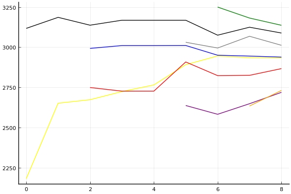

[2020 시즌 2 포스트시즌 방식의 근원지](../season-design-2)! 카트리그 전적/랭킹 블로그 (ver. 1.0). 
__최종 업데이트: 2020-9-12__

## 주요 랭킹
- [팀전 - 최신 팀 파워랭킹](../power-ranking-200912)
- [팀전 - 전체 트랙](../team-full)
- [팀전 - 스피드](../team-speed)
- [팀전 - 아이템](../team-item)
- [팀전 - 에이스 결정전](../team-ace)
- [개인전 - 종합](../singles-full)

## 참고 자료
- 2020-7-13: [개인전 점수-진출확률 변환표](../conversion)

## 사설 
- 2020-7-4: [사설 - 타이브레이커](../tiebreakers)
- 2020-6-26: [사설 - 밴픽](../ban-pick)
- 2020-5-26: [사설 - 개인전 50점/80점 선취제에 필요한 최대 트랙의 수는?](../track-optim)
- 2020-5-24: [2020 시즌 1 마무리 - 그동안 있었던 일](../season-wrapup-2020-1)
- 2020-5-19: [사설 - 내 맘대로 짜보는 리그 3 - 개인전](../season-design-3)
- 2020-5-17: [사설 - 내 맘대로 짜보는 리그 2 - 팀전](../season-design-2)
- 2020-5-13: [사설 - 내 맘대로 짜보는 리그 1](../season-design-1)
- 2020-3-1: [사설 - 2월 22일자 개인전 TMI 승부 예측](../editorial-tmi-0222)
- 2020-1-25: [사설 - 잡다한 생각들](../thoughts)
- 2020-1-17: [사설 - TMI 승부 예측](../editorial-tmi)

## 시즌
- [2020 시즌 2](../2020-2)
- [2020 시즌 1](../2020-1)

__경기 리뷰는 경기 후 2일 이내에 업로드됩니다.__
 

## 분석 방법

[TrueSkill](https://trueskill.org/). 이 방법은 Microsoft Research에서 개발한 방법으로 각 선수의 기량을 두 개의 숫자, 평균 mu(추정된 기량의 위치), 표준편차 sigma(추정된 기량의 불확실성)로 나타내고 베이지안 추론을 통해 추정된 mu와 sigma에 기반하여 순위를 매긴다. 
선수들이 경기를 많이 할수록 일반적으로 선수의 기량을 좀 더 정확히 추정할 수 있을테니 mu는 점점 제자리를 찾아가고, sigma는 점점 줄어들게 된다. 
이 블로그의 모든 분석에서 각 선수는 mu=3000, sigma=1000로 시작. 팀전 랭킹의 mu는 네 명의 mu 합산을 기준으로, sigma는 네 명의 sigma 제곱의 합의 제곱근을 기준으로 계산. 종합 랭킹의 경우 스피드전 또는 아이템전만 참가하는 선수는 1/2명으로 계산하여 이에 맞게 계산식을 적절히 변형함.  

분석의 단위:

- 개인전: 각 트랙의 순위.
- 팀전: 각 트랙의 승패. 이에 따라 기존에 문호준 선수보다 더 성적이 좋은 팀에 있었던 최영훈 선수가 더 높은 순위를 가짐.

[조금 더 자세한 설명 보러가기](../about)

### 순위표
선수들의 순위를 나타낼 때는 mu를 그대로 쓰는 대신 실력을 *보수적으로* 추정하는 값인 mu - k sigma 를 사용한다. k가 클수록 각 선수의 실력이 mu - k sigma 보다 클 확률이 매우 높아진다는 의미에서. 주로 쓰이는 k값은 3이고, 정규분포의 특성에 의해 선수의 실력이 그 값보다 높을 확률은 99% 이상이 된다. 여기에서도 k=3을 사용.

예를 들어, 2020년 1월 1일 시점 박도현의 추정된 mu는 이재혁의 그것보다 높지만 박도현이 지금까지 치른 경기 수가 적어 불확실성 sigma 크기 때문에 그만큼 점수를 깎으므로 박도현이 이재혁보다 밑에 있게 된다.

### 데이터
분석에 사용된 데이터는 [여기](https://github.com/KartRanking/KartRanking/tree/master/dat)에 공개되어 있음.

2015년 카트라이더 리그 에볼루션 이후 모든 팀전, 개인전 TV 방송 경기. 8인전, 7인전, 4인전, 2인전 모두 포함 (2017 케스파 컵과 듀얼레이스 X 포함, 티밍이 있었던 글로벌 슈퍼매치 제외)

## [팀전](../team-power-ranking)

### 순위표

| 순위 | 팀 | 경기 수 | 승 | 패 | 세트 득실 | 트랙 득실 | 승점 |
|---:|---:|---:|---:|---:|---:|---:|---:|
| 1 | SB | 3 | 3 | 0 | 6 | 17 | 9 |
| 2 | ROX | 3 | 3 | 0 | 6 | 13 | 9 |
| 3 | HLE | 4 | 3 | 1 | 2 | 4 | 7 |
| 4 | EST | 3 | 2 | 1 | 2 | 5 | 6 |
| 5 | AF | 3 | 1 | 2 | -2 | -1 | 4 |
| 6 | SGA | 4 | 1 | 3 | -3 | -8 | 4 |
| 7 | STL | 4 | 1 | 3 | -4 | -8 | 3 |
| 8 | MT | 4 | 0 | 4 | -8 | -22 | 0 |

* 순위 산정 기준: 승수-세트 득실-트랙 득실-승자승 순.
* 경기수가 다른 팀들의 경우 승패차-승률-세트 득실-트랙 득실-승자승 순으로 순위 결정([9월 5일 방송 도입부](https://youtu.be/1rHcBg_H5Jk?t=155)). [3팀 이상 동률의 처리 규정에 대해서는 알려지지 않음](../tiebreakers).
* 승점: 공식 기록 아님, 2-0 승 3점, 2-1 승 2점, 1-2 패 1점, 0-2 패 0점. 

### 프리뷰: [15-16경기](../t2020-2-1-4-p)

| __SB__ | 3-0 | 3-1 | 3-2 | __v.__ | 2-3 | 1-3 | 0-3 | __ROX__ |
|---:|---:|---:|---:|:---:|---:|---:|---:|---:|
| __0.5314__ | 0.1779 | 0.1946 | 0.1589 | 스피드 | 0.1585 | 0.1684 | 0.1417 | __0.4686__ |
| __0.4134__ | 0.1156 | 0.1515 | 0.1463 | 아이템 | 0.1612 | 0.2179 | 0.2075 | __0.5866__ |
| __2-0 승__ | | | | __에결__ | | | | __0-2 승__ |
| 0.2197 | | | | 0.5054 | | | | 0.2749 |

| __EST__ | 3-0 | 3-1 | 3-2 | __v.__ | 2-3 | 1-3 | 0-3 | __AF__ |
|---:|---:|---:|---:|:---:|---:|---:|---:|---:|
| __0.5983__ | 0.2723 | 0.1993 | 0.1267 | 스피드 | 0.1096 | 0.1444 | 0.1477 | __0.4017__ |
| __0.8609__ | 0.5031 | 0.2471 | 0.1107 | 아이템 | 0.0555 | 0.0513 | 0.0323 | __0.1391__ |
| __2-0 승__ | | | | __에결__ | | | | __0-2 승__ |
| 0.5151 | | | | 0.4290 | | | | 0.0559 |

### 리뷰: [풀리그 13-14경기](../t2020-2-1-6)

#### 전체

| 순위 | 팀 | 점수 | 변동 | mu | 변동 | sigma | 변동 |
|---:|---:|---:|---:|---:|---:|---:|---:|
| 1 | ROX | 12610 | +0 | 13489 | +0 | 293 | +0 |
| 2 | SB | 12306 | -7 | 13222 | +4 | 305 | +4 |
| 3 | HLE | 12219 | +0 | 13045 | +0 | 275 | +0 |
| 4 | EST | 11495 | +0 | 12842 | +0 | 449 | +0 |
| 5 | AF | 11105 | +246 | 12170 | +208 | 355 | -13 |
| 6 | SGA | 10518 | -213 | 11702 | -257 | 394 | -14 |
| 7 | STL | 9076 | +0 | 11357 | +0 | 760 | +0 |
| 8 | MT | 4983 | -23 | 8305 | -54 | 1107 | -10 |

#### 스피드전

| 순위 | 팀 | 점수 | 변동 | mu | 변동 | sigma | 변동 |
|---:|---:|---:|---:|---:|---:|---:|---:|
| 1 | SB | 12562 | +2 | 13776 | +5 | 405 | +1 |
| 2 | ROX | 12362 | +0 | 13695 | +0 | 444 | +0 |
| 3 | HLE | 12022 | +0 | 13117 | +0 | 365 | +0 |
| 4 | AF | 10899 | +530 | 12508 | +451 | 536 | -26 |
| 5 | SGA | 10640 | -438 | 12365 | -515 | 575 | -26 |
| 6 | EST | 10573 | +0 | 12821 | +0 | 750 | +0 |
| 7 | STL | 8562 | +0 | 11888 | +0 | 1108 | +0 |
| 8 | MT | 4389 | -27 | 8752 | -71 | 1454 | -15 |

#### 아이템전

| 순위 | 팀 | 점수 | 변동 | mu | 변동 | sigma | 변동 |
|---:|---:|---:|---:|---:|---:|---:|---:|
| 1 | ROX | 12421 | +0 | 13665 | +0 | 415 | +0 |
| 2 | HLE | 12274 | +0 | 13433 | +0 | 386 | +0 |
| 3 | SB | 12216 | +1 | 13442 | +5 | 409 | +1 |
| 4 | EST | 11353 | +0 | 12997 | +0 | 548 | +0 |
| 5 | AF | 10219 | +290 | 11806 | +223 | 529 | -23 |
| 6 | SGA | 9195 | -252 | 11328 | -427 | 711 | -58 |
| 7 | STL | 8332 | +0 | 11300 | +0 | 989 | +0 |
| 8 | MT | 4306 | -19 | 8429 | -55 | 1375 | -12 |

* Note: 전체 트랙 모형은 스피드전과 아이템전의 단순 합산이 아니라 별도의 모형임.

__[경기 결과, 개인 별 랭킹 변화 보기](../t2020-2-1-6)__

## 개인전  

### 프리뷰: [개인전 32강 패자부활전](../s2020-2-2-1-p)

#### 승부예측

| 순위 | 최영훈 | 전대웅 | 한승철 | 신종민 | 김지민 | 박도현 | 김승래 | 정유민 |
|:---:|---:|---:|---:|---:|---:|---:|---:|---:|
| 1위 | 0.064 | 0.267 | 0.032 | 0.140 | 0.012 | 0.393 | 0.069 | 0.049 |
| 진출 | 0.451 | 0.781 | 0.323 | 0.646 | 0.179 | 0.866 | 0.472 | 0.395 |
| 탈락 | 0.549 | 0.218 | 0.677 | 0.354 | 0.821 | 0.134 | 0.528 | 0.605 |

#### 랭킹 히스토리

x축: 시즌, y축: 점수
1번: 옐로우, 2번: 블랙, 3번: 레드, 4번: 화이트(회색), 5번: 퍼플, 6번: 그린, 7번: 블루, 8번: 오렌지

__[더 보기...](../s2020-2-1-4-p)__

### 리뷰: [개인전 32강 D조](../s2020-2-1-4)

#### 경기 결과

| 트랙 | 이재혁 | 권승주 | 정승민B | 배성빈 | 박현수 | 김승래 | 이정우 | 정유민 |
|:---|---:|---:|---:|---:|---:|---:|---:|---:|
| [카멜롯 펜드래건 캐슬](../pendragon) | 0 | 1 | 3 | 10 | 4 | 5 | 7 | -1 |
| [어비스 숨겨진 바닷길](../hiddenoceanroad) | 3 | 1 | 0 | 10 | 4 | 5 | -1 | 7 |
| [대저택 은밀한 지하실](../jeotaek) | 7 | -5 | 5 | 1 | 10 | 3 | 0 | 4 |
| [황금문명 오르에트 황금 좌표](../coordinate) | 10 | 0 | 7 | 5 | 1 | -1 | 3 | 4 |
| [[리버스] 해적 로비 절벽의 전투](../rlobby) | 10 | 3 | -1 | 0 | 5 | 4 | 1 | 7 |
| [아이스 아찔한 헬기 점프](../heli) | 5 | 4 | 0 | -1 | 7 | 1 | 10 | 3 |
| [광산 위험한 제련소](../jeryeonso) | 5 | -1 | 4 | 10 | 0 | 7 | 3 | 1 |
| [동화 이상한 나라의 문](../gate) | 7 | 5 | 3 | 10 | 4 | 0 | -1 | 1 |
| [공동묘지 해골성 대탐험](../skullcastle) | 10 | 1 | 0 | 5 | 4 | 7 | -1 | 3 |
| __total__ |__57__ |__9__ |__21__ |__50__ |__39__ |__31__ |__21__ |__29__ |

#### 트랙 별 16강 진출 확률 추이

#### [종합 랭킹 변동](../singles-full)

| 순위 | 변동 | 이름 | 점수 | 변동 | mu | 변동 | sigma | 변동 |
|---:|---:|:---:|---:|---:|---:|---:|---:|---:|
| 3 / 93 | +0 | [이재혁](../ijaehyeok) | 3317 | +4 | 3547 | +6 | 77 | +0 |
| 11 / 93 | +0 | [배성빈](../baeseongbin) | 3059 | +23 | 3290 | +24 | 77 | +0 |
| 19 / 93 | +0 | [김승래](../gimseungrae) | 2938 | -6 | 3166 | -6 | 76 | +0 |
| 21 / 93 | +2 | [박현수](../bakhyeonsu) | 2927 | +25 | 3163 | +22 | 79 | -1 |
| 36 / 93 | +2 | [정유민](../jeongyumin) | 2731 | +97 | 3132 | -42 | 134 | -46 |
| 59 / 93 | NaN | [정승민B](../jeongseungminb) | 2365 | +2365 | 2941 | -59 | 192 | -808 |
| 67 / 93 | NaN | [권승주](../glamint) | 2232 | +2232 | 2818 | -182 | 195 | -805 |
| 68 / 93 | NaN | [이정우](../ijeongu) | 2230 | +2230 | 2831 | -169 | 200 | -800 |

__[더 보기...](../s2020-2-1-4)__

## 둘러보기
- __[Main Post](../main)__
- [2020 시즌 2](../2020-2)
- [2020 시즌 1](../2020-1)



