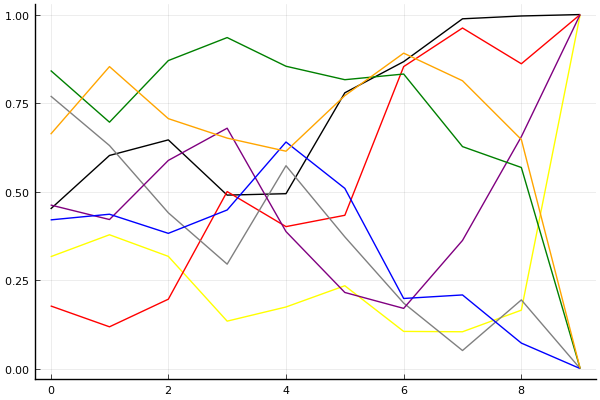

[2020 시즌 2 포스트시즌 방식의 근원지](../season-design-2)! 카트리그 전적/랭킹 블로그 (ver. 1.0). 
__최종 업데이트: 2020-9-20__

## 주요 랭킹
- [팀전 - 최신 팀 파워랭킹](../power-ranking-200916)
- [팀전 - 전체 트랙](../team-full)
- [팀전 - 스피드](../team-speed)
- [팀전 - 아이템](../team-item)
- [팀전 - 에이스 결정전](../team-ace)
- [개인전 - 종합](../singles-full)

## 참고 자료
- 2020-7-13: [개인전 점수-진출확률 변환표](../conversion)

## 사설 
- 2020-7-4: [사설 - 타이브레이커](../tiebreakers)
- 2020-6-26: [사설 - 밴픽](../ban-pick)
- 2020-5-26: [사설 - 개인전 50점/80점 선취제에 필요한 최대 트랙의 수는?](../track-optim)
- 2020-5-24: [2020 시즌 1 마무리 - 그동안 있었던 일](../season-wrapup-2020-1)
- 2020-5-19: [사설 - 내 맘대로 짜보는 리그 3 - 개인전](../season-design-3)
- 2020-5-17: [사설 - 내 맘대로 짜보는 리그 2 - 팀전](../season-design-2)
- 2020-5-13: [사설 - 내 맘대로 짜보는 리그 1](../season-design-1)
- 2020-3-1: [사설 - 2월 22일자 개인전 TMI 승부 예측](../editorial-tmi-0222)
- 2020-1-25: [사설 - 잡다한 생각들](../thoughts)
- 2020-1-17: [사설 - TMI 승부 예측](../editorial-tmi)

## 시즌
- [2020 시즌 2](../2020-2)
- [2020 시즌 1](../2020-1)

__경기 리뷰는 경기 후 2일 이내에 업로드됩니다.__
 

## 분석 방법

[TrueSkill](https://trueskill.org/). 이 방법은 Microsoft Research에서 개발한 방법으로 각 선수의 기량을 두 개의 숫자, 평균 mu(추정된 기량의 위치), 표준편차 sigma(추정된 기량의 불확실성)로 나타내고 베이지안 추론을 통해 추정된 mu와 sigma에 기반하여 순위를 매긴다. 
선수들이 경기를 많이 할수록 일반적으로 선수의 기량을 좀 더 정확히 추정할 수 있을테니 mu는 점점 제자리를 찾아가고, sigma는 점점 줄어들게 된다. 
이 블로그의 모든 분석에서 각 선수는 mu=3000, sigma=1000로 시작. 팀전 랭킹의 mu는 네 명의 mu 합산을 기준으로, sigma는 네 명의 sigma 제곱의 합의 제곱근을 기준으로 계산. 종합 랭킹의 경우 스피드전 또는 아이템전만 참가하는 선수는 1/2명으로 계산하여 이에 맞게 계산식을 적절히 변형함.  

분석의 단위:

- 개인전: 각 트랙의 순위.
- 팀전: 각 트랙의 승패. 이에 따라 기존에 문호준 선수보다 더 성적이 좋은 팀에 있었던 최영훈 선수가 더 높은 순위를 가짐.

[조금 더 자세한 설명 보러가기](../about)

### 순위표
선수들의 순위를 나타낼 때는 mu를 그대로 쓰는 대신 실력을 *보수적으로* 추정하는 값인 mu - k sigma 를 사용한다. k가 클수록 각 선수의 실력이 mu - k sigma 보다 클 확률이 매우 높아진다는 의미에서. 주로 쓰이는 k값은 3이고, 정규분포의 특성에 의해 선수의 실력이 그 값보다 높을 확률은 99% 이상이 된다. 여기에서도 k=3을 사용.

예를 들어, 2020년 1월 1일 시점 박도현의 추정된 mu는 이재혁의 그것보다 높지만 박도현이 지금까지 치른 경기 수가 적어 불확실성 sigma 크기 때문에 그만큼 점수를 깎으므로 박도현이 이재혁보다 밑에 있게 된다.

### 데이터
분석에 사용된 데이터는 [여기](https://github.com/KartRanking/KartRanking/tree/master/dat)에 공개되어 있음.

2015년 카트라이더 리그 에볼루션 이후 모든 팀전, 개인전 TV 방송 경기. 8인전, 7인전, 4인전, 2인전 모두 포함 (2017 케스파 컵과 듀얼레이스 X 포함, 티밍이 있었던 글로벌 슈퍼매치 제외)

## [팀전](../team-power-ranking)

### 순위표

| 순위 | 팀 | 경기 수 | 승 | 패 | 세트 득실 | 트랙 득실 | 승점 |
|---:|---:|---:|---:|---:|---:|---:|---:|
| 1 | SB | 4 | 4 | 0 | 8 | 21 | 12 |
| 2 | EST | 5 | 4 | 1 | 5 | 9 | 11 |
| 3 | HLE | 5 | 4 | 1 | 4 | 8 | 10 |
| 4 | ROX | 4 | 3 | 1 | 4 | 9 | 9 |
| 5 | AF | 4 | 1 | 3 | -3 | -4 | 4 |
| 6 | STL | 4 | 1 | 3 | -4 | -8 | 3 |
| 7 | SGA | 5 | 1 | 4 | -4 | -9 | 5 |
| 8 | MT | 5 | 0 | 5 | -10 | -26 | 0 |

* 순위 산정 기준: 승수-세트 득실-트랙 득실-승자승 순.
* 경기수가 다른 팀들의 경우 승패차-승률-세트 득실-트랙 득실-승자승 순으로 순위 결정([9월 5일 방송 도입부](https://youtu.be/1rHcBg_H5Jk?t=155)). [3팀 이상 동률의 처리 규정에 대해서는 알려지지 않음](../tiebreakers).
* 승점: 공식 기록 아님, 2-0 승 3점, 2-1 승 2점, 1-2 패 1점, 0-2 패 0점. 

### 프리뷰: [19-20경기](../t2020-2-1-5-p)

| __STL__ | 3-0 | 3-1 | 3-2 | __v.__ | 2-3 | 1-3 | 0-3 | __ROX__ |
|---:|---:|---:|---:|:---:|---:|---:|---:|---:|
| __0.1566__ | 0.0449 | 0.0583 | 0.0534 | 스피드 | 0.0806 | 0.1910 | 0.5718 | __0.8434__ |
| __0.0538__ | 0.0115 | 0.0189 | 0.0234 | 아이템 | 0.0477 | 0.1479 | 0.7506 | __0.9462__ |
| __2-0 승__ | | | | __에결__ | | | | __0-2 승__ |
| 0.0084 | | | | 0.1935 | | | | 0.7980 |

| __AF__ | 3-0 | 3-1 | 3-2 | __v.__ | 2-3 | 1-3 | 0-3 | __SB__ |
|---:|---:|---:|---:|:---:|---:|---:|---:|---:|
| __0.0619__ | 0.0103 | 0.0210 | 0.0306 | 스피드 | 0.0845 | 0.2384 | 0.6152 | __0.9381__ |
| __0.0444__ | 0.0068 | 0.0157 | 0.0219 | 아이템 | 0.0698 | 0.2148 | 0.6710 | __0.9556__ |
| __2-0 승__ | | | | __에결__ | | | | __0-2 승__ |
| 0.0027 | | | | 0.1008 | | | | 0.8964 |

### 리뷰: [풀리그 17-18경기](../t2020-2-1-8)

#### 전체

| 순위 | 팀 | 점수 | 변동 | mu | 변동 | sigma | 변동 |
|---:|---:|---:|---:|---:|---:|---:|---:|
| 1 | SB | 12524 | +0 | 13430 | +0 | 302 | +0 |
| 2 | ROX | 12428 | +0 | 13299 | +0 | 290 | +0 |
| 3 | HLE | 12060 | -159 | 12891 | -155 | 277 | +2 |
| 4 | EST | 11321 | -269 | 12484 | -335 | 388 | -22 |
| 5 | AF | 11122 | +0 | 12154 | +0 | 344 | +0 |
| 6 | SGA | 10789 | +271 | 11931 | +229 | 381 | -14 |
| 7 | STL | 9076 | +0 | 11357 | +0 | 760 | +0 |
| 8 | MT | 7779 | +2797 | 10694 | +2389 | 972 | -136 |

#### 스피드전

| 순위 | 팀 | 점수 | 변동 | mu | 변동 | sigma | 변동 |
|---:|---:|---:|---:|---:|---:|---:|---:|
| 1 | SB | 12799 | +0 | 13997 | +0 | 399 | +0 |
| 2 | ROX | 12122 | +0 | 13429 | +0 | 436 | +0 |
| 3 | HLE | 12025 | +3 | 13122 | +5 | 366 | +1 |
| 4 | SGA | 11128 | +488 | 12790 | +425 | 554 | -21 |
| 5 | AF | 10919 | +0 | 12453 | +0 | 511 | +0 |
| 6 | EST | 10532 | -393 | 12369 | -534 | 612 | -47 |
| 7 | STL | 8562 | +0 | 11888 | +0 | 1108 | +0 |
| 8 | MT | 4351 | -37 | 8666 | -85 | 1438 | -16 |

#### 아이템전

| 순위 | 팀 | 점수 | 변동 | mu | 변동 | sigma | 변동 |
|---:|---:|---:|---:|---:|---:|---:|---:|
| 1 | SB | 12373 | +0 | 13570 | +0 | 399 | +0 |
| 2 | ROX | 12319 | +0 | 13534 | +0 | 405 | +0 |
| 3 | HLE | 12064 | -210 | 13211 | -222 | 382 | -4 |
| 4 | EST | 11288 | -71 | 12843 | -109 | 518 | -13 |
| 5 | AF | 10313 | +0 | 11847 | +0 | 511 | +0 |
| 6 | SGA | 9494 | +299 | 11519 | +192 | 675 | -36 |
| 7 | STL | 8332 | +0 | 11300 | +0 | 989 | +0 |
| 8 | MT | 7951 | +3645 | 11378 | +2948 | 1142 | -232 |

* Note: 전체 트랙 모형은 스피드전과 아이템전의 단순 합산이 아니라 별도의 모형임.

__[경기 결과, 개인 별 랭킹 변화 보기](../t2020-2-1-8)__

## 개인전  

### 프리뷰: [개인전 16강 1경기](../s2020-2-3-1-p)

#### 승부예측

| 순위 | 송용준 | 최윤서 | 김기수 | 유영혁 | 정승하 | 최민석 | 김승래 | 한승철 |
|:---:|---:|---:|---:|---:|---:|---:|---:|---:|
| 1위 | 0.083 | 0.050 | 0.060 | 0.557 | 0.174 | 0.019 | 0.050 | 0.032 |
| 승자전 | 0.536 | 0.430 | 0.466 | 0.930 | 0.711 | 0.269 | 0.435 | 0.333 |

#### 랭킹 히스토리

x축: 시즌, y축: 점수
1번: 옐로우, 2번: 블랙, 3번: 레드, 4번: 화이트(회색), 5번: 퍼플, 6번: 그린, 7번: 블루, 8번: 오렌지

__[더 보기...](../s2020-2-3-1-p)__

### 리뷰: [개인전 32강 패자부활전](../s2020-2-2-1)

#### 경기 결과

| 트랙 | 한승철 | 최영훈 | 김지민 | 전대웅 | 김승래 | 박도현 | 정유민 | 신종민 |
|:---|---:|---:|---:|---:|---:|---:|---:|---:|
| [카멜롯 펜드래건 캐슬](../pendragon) | 5 | 7 | 1 | 0 | 3 | -1 | 4 | 10 |
| [아이스 부서진 빙산](../boobing) | 1 | 4 | 5 | 0 | 7 | 10 | 3 | -1 |
| [황금문명 오르에트 황금 좌표](../coordinate) | -1 | 0 | 10 | 1 | 5 | 7 | 4 | 3 |
| [[리버스] 해적 로비 절벽의 전투](../rlobby) | 5 | 4 | 1 | 10 | -1 | 0 | 7 | 3 |
| [광산 위험한 제련소](../jeryeonso) | 5 | 10 | 4 | 0 | -1 | 3 | 1 | 7 |
| [대저택 은밀한 지하실](../jeotaek) | 0 | 5 | 10 | 1 | 3 | 4 | -1 | 7 |
| [아이스 아찔한 헬기 점프](../heli) | 4 | 10 | 5 | 0 | 7 | 1 | 3 | -1 |
| [공동묘지 해골성 대탐험](../skullcastle) | 5 | 4 | -1 | 10 | 7 | 3 | 0 | 1 |
| [동화 이상한 나라의 문](../gate) | 10 | 7 | 0 | -1 | 5 | 3 | 4 | 1 |
| __total__ |__34__ |__51__ |__35__ |__21__ |__35__ |__30__ |__25__ |__30__ |

#### 트랙 별 16강 진출 확률 추이

#### [종합 랭킹 변동](../singles-full)

| 순위 | 변동 | 이름 | 점수 | 변동 | mu | 변동 | sigma | 변동 |
|---:|---:|:---:|---:|---:|---:|---:|---:|---:|
| 8 / 93 | -1 | [박도현](../bakdohyeon) | 3098 | -38 | 3330 | -40 | 77 | -1 |
| 11 / 93 | -2 | [전대웅](../jeondaewoong) | 3037 | -52 | 3266 | -51 | 76 | +0 |
| 14 / 93 | -1 | [신종민](../shinjongmin) | 2992 | -20 | 3222 | -20 | 77 | -0 |
| 15 / 93 | +5 | [최영훈](../choiyeonghun) | 2988 | +55 | 3217 | +55 | 76 | -0 |
| 20 / 93 | -1 | [김승래](../gimseungrae) | 2948 | +10 | 3176 | +9 | 76 | -0 |
| 24 / 93 | +2 | [한승철](../hanseungcheol) | 2894 | +27 | 3127 | +25 | 78 | -1 |
| 33 / 93 | +4 | [김지민](../gimjimin) | 2794 | +75 | 3073 | +53 | 93 | -7 |
| 34 / 93 | +2 | [정유민](../jeongyumin) | 2775 | +44 | 3111 | -21 | 112 | -22 |

__[더 보기...](../s2020-2-2-1)__

## 둘러보기
- __[Main Post](../main)__
- [2020 시즌 2](../2020-2)
- [2020 시즌 1](../2020-1)



