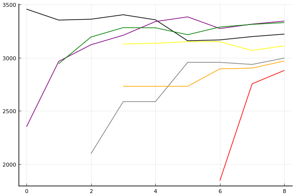
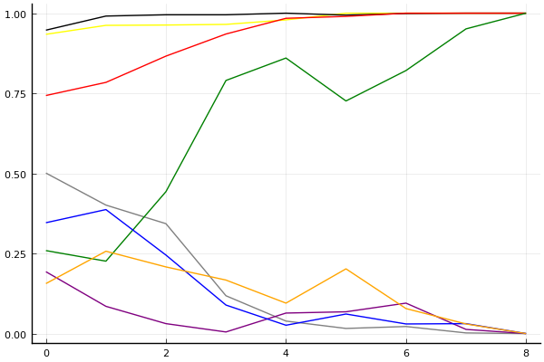

[2020 시즌 2 포스트시즌 방식의 근원지](../season-design-2)! 카트리그 전적/랭킹 블로그 (ver. 1.0). 
__최종 업데이트: 2020-10-9__

## 주요 랭킹
- [팀전 - 최신 팀 파워랭킹](../power-ranking-200916)
- [팀전 - 전체 트랙](../team-full)
- [팀전 - 스피드](../team-speed)
- [팀전 - 아이템](../team-item)
- [팀전 - 에이스 결정전](../team-ace)
- [개인전 - 종합](../singles-full)

## 참고 자료
- 2020-7-13: [개인전 점수-진출확률 변환표](../conversion)

## 사설 
- 2020-7-4: [사설 - 타이브레이커](../tiebreakers)
- 2020-6-26: [사설 - 밴픽](../ban-pick)
- 2020-5-26: [사설 - 개인전 50점/80점 선취제에 필요한 최대 트랙의 수는?](../track-optim)
- 2020-5-24: [2020 시즌 1 마무리 - 그동안 있었던 일](../season-wrapup-2020-1)
- 2020-5-19: [사설 - 내 맘대로 짜보는 리그 3 - 개인전](../season-design-3)
- 2020-5-17: [사설 - 내 맘대로 짜보는 리그 2 - 팀전](../season-design-2)
- 2020-5-13: [사설 - 내 맘대로 짜보는 리그 1](../season-design-1)
- 2020-3-1: [사설 - 2월 22일자 개인전 TMI 승부 예측](../editorial-tmi-0222)
- 2020-1-25: [사설 - 잡다한 생각들](../thoughts)
- 2020-1-17: [사설 - TMI 승부 예측](../editorial-tmi)

## 시즌
- [2020 시즌 2](../2020-2)
- [2020 시즌 1](../2020-1)

__경기 리뷰는 경기 후 2일 이내에 업로드됩니다.__
 

## 분석 방법

[TrueSkill](https://trueskill.org/). 이 방법은 Microsoft Research에서 개발한 방법으로 각 선수의 기량을 두 개의 숫자, 평균 mu(추정된 기량의 위치), 표준편차 sigma(추정된 기량의 불확실성)로 나타내고 베이지안 추론을 통해 추정된 mu와 sigma에 기반하여 순위를 매긴다. 
선수들이 경기를 많이 할수록 일반적으로 선수의 기량을 좀 더 정확히 추정할 수 있을테니 mu는 점점 제자리를 찾아가고, sigma는 점점 줄어들게 된다. 
이 블로그의 모든 분석에서 각 선수는 mu=3000, sigma=1000로 시작. 팀전 랭킹의 mu는 네 명의 mu 합산을 기준으로, sigma는 네 명의 sigma 제곱의 합의 제곱근을 기준으로 계산. 종합 랭킹의 경우 스피드전 또는 아이템전만 참가하는 선수는 1/2명으로 계산하여 이에 맞게 계산식을 적절히 변형함.  

분석의 단위:

- 개인전: 각 트랙의 순위.
- 팀전: 각 트랙의 승패. 이에 따라 기존에 문호준 선수보다 더 성적이 좋은 팀에 있었던 최영훈 선수가 더 높은 순위를 가짐.

[조금 더 자세한 설명 보러가기](../about)

### 순위표
선수들의 순위를 나타낼 때는 mu를 그대로 쓰는 대신 실력을 *보수적으로* 추정하는 값인 mu - k sigma 를 사용한다. k가 클수록 각 선수의 실력이 mu - k sigma 보다 클 확률이 매우 높아진다는 의미에서. 주로 쓰이는 k값은 3이고, 정규분포의 특성에 의해 선수의 실력이 그 값보다 높을 확률은 99% 이상이 된다. 여기에서도 k=3을 사용.

예를 들어, 2020년 1월 1일 시점 박도현의 추정된 mu는 이재혁의 그것보다 높지만 박도현이 지금까지 치른 경기 수가 적어 불확실성 sigma 크기 때문에 그만큼 점수를 깎으므로 박도현이 이재혁보다 밑에 있게 된다.

### 데이터
분석에 사용된 데이터는 [여기](https://github.com/KartRanking/KartRanking/tree/master/dat)에 공개되어 있음.

2015년 카트라이더 리그 에볼루션 이후 모든 팀전, 개인전 TV 방송 경기. 8인전, 7인전, 4인전, 2인전 모두 포함 (2017 케스파 컵과 듀얼레이스 X 포함, 티밍이 있었던 글로벌 슈퍼매치 제외)

## [팀전](../team-power-ranking)

### 순위표

| 순위 | 팀 | 경기 수 | 승 | 패 | 세트 득실 | 트랙 득실 | 승점 |
|---:|---:|---:|---:|---:|---:|---:|---:|
| 1 | SB | 6 | 5 | 1 | 9 | 27 | 16 |
| 2 | ROX | 6 | 5 | 1 | 8 | 20 | 15 |
| 3 | HLE | 6 | 5 | 1 | 6 | 11 | 13 |
| 4 | EST | 6 | 4 | 2 | 3 | 6 | 11 |
| 5 | AF | 6 | 3 | 3 | 0 | 0 | 9 |
| 6 | SGA | 6 | 1 | 5 | -6 | -14 | 5 |
| 7 | STL | 6 | 1 | 5 | -8 | -18 | 3 |
| 8 | MT | 6 | 0 | 6 | -12 | -32 | 0 |

* 순위 산정 기준: 승수-세트 득실-트랙 득실-승자승 순.
* 경기수가 다른 팀들의 경우 승패차-승률-세트 득실-트랙 득실-승자승 순으로 순위 결정([9월 5일 방송 도입부](https://youtu.be/1rHcBg_H5Jk?t=155)). [3팀 이상 동률의 처리 규정에 대해서는 알려지지 않음](../tiebreakers).
* 승점: 공식 기록 아님, 2-0 승 3점, 2-1 승 2점, 1-2 패 1점, 0-2 패 0점. 

### 포스트시즌 업데이트

- 2020-10-05: [김대겸 해설위원 유튜브](https://youtu.be/Df3vo0ENzYk?t=186)를 통해 포스트시즌에서는 8강 풀리그 상위팀에게 밴픽 어드밴티지 있음이 공개됨.

### 프리뷰: [25-28경기](../t2020-2-1-7-p)

| __EST__ | 3-0 | 3-1 | 3-2 | __v.__ | 2-3 | 1-3 | 0-3 | __SB__ |
|---:|---:|---:|---:|:---:|---:|---:|---:|---:|
| __0.0891__ | 0.0184 | 0.0309 | 0.0398 | 스피드 | 0.0967 | 0.2405 | 0.5737 | __0.9109__ |
| __0.2105__ | 0.0489 | 0.0766 | 0.0850 | 아이템 | 0.1399 | 0.2593 | 0.3903 | __0.7895__ |
| __2-0 승__ | | | | __에결__ | | | | __0-2 승__ |
| 0.0188 | | | | 0.2621 | | | | 0.7192 |

| __SGA__ | 3-0 | 3-1 | 3-2 | __v.__ | 2-3 | 1-3 | 0-3 | __STL__ |
|---:|---:|---:|---:|:---:|---:|---:|---:|---:|
| __0.9060__ | 0.6723 | 0.1743 | 0.0594 | 스피드 | 0.0353 | 0.0335 | 0.0252 | __0.0940__ |
| __0.5816__ | 0.2678 | 0.1906 | 0.1232 | 아이템 | 0.1060 | 0.1440 | 0.1684 | __0.4184__ |
| __2-0 승__ | | | | __에결__ | | | | __0-2 승__ |
| 0.5269 | | | | 0.4337 | | | | 0.0393 |

| __MT__ | 3-0 | 3-1 | 3-2 | __v.__ | 2-3 | 1-3 | 0-3 | __AF__ |
|---:|---:|---:|---:|:---:|---:|---:|---:|---:|
| __0.0074__ | 0.0017 | 0.0020 | 0.0037 | 스피드 | 0.0056 | 0.0272 | 0.9598 | __0.9926__ |
| __0.2625__ | 0.0901 | 0.0928 | 0.0796 | 아이템 | 0.0950 | 0.1934 | 0.4491 | __0.7375__ |
| __2-0 승__ | | | | __에결__ | | | | __0-2 승__ |
| 0.0019 | | | | 0.2660 | | | | 0.7320 |

| __ROX__ | 3-0 | 3-1 | 3-2 | __v.__ | 2-3 | 1-3 | 0-3 | __HLE__ |
|---:|---:|---:|---:|:---:|---:|---:|---:|---:|
| __0.6551__ | 0.2548 | 0.2343 | 0.1660 | 스피드 | 0.1328 | 0.1282 | 0.0839 | __0.3449__ |
| __0.6430__ | 0.2356 | 0.2352 | 0.1722 | 아이템 | 0.1313 | 0.1342 | 0.0915 | __0.3570__ |
| __2-0 승__ | | | | __에결__ | | | | __0-2 승__ |
| 0.4212 | | | | 0.4556 | | | | 0.1231 |

### 리뷰: [풀리그 23-24경기](../t2020-2-1-11)

#### 전체

| 순위 | 팀 | 점수 | 변동 | mu | 변동 | sigma | 변동 |
|---:|---:|---:|---:|---:|---:|---:|---:|
| 1 | ROX | 12451 | +0 | 13329 | +0 | 293 | +0 |
| 2 | SB | 12405 | +29 | 13302 | +29 | 299 | -0 |
| 3 | HLE | 12106 | +0 | 12933 | +0 | 275 | +0 |
| 4 | AF | 11444 | +89 | 12435 | +77 | 330 | -4 |
| 5 | EST | 11293 | +0 | 12406 | +0 | 371 | +0 |
| 6 | SGA | 10767 | -22 | 11888 | -43 | 374 | -7 |
| 7 | STL | 9093 | -177 | 11017 | -353 | 641 | -59 |
| 8 | MT | 7516 | +0 | 10295 | +0 | 926 | +0 |

#### 스피드전

| 순위 | 팀 | 점수 | 변동 | mu | 변동 | sigma | 변동 |
|---:|---:|---:|---:|---:|---:|---:|---:|
| 1 | SB | 12511 | +28 | 13668 | +13 | 386 | -5 |
| 2 | ROX | 12226 | +0 | 13528 | +0 | 434 | +0 |
| 3 | HLE | 12073 | +0 | 13159 | +0 | 362 | +0 |
| 4 | AF | 11656 | +119 | 13107 | +106 | 484 | -4 |
| 5 | SGA | 11156 | +28 | 12764 | -26 | 536 | -18 |
| 6 | EST | 10543 | +0 | 12276 | +0 | 578 | +0 |
| 7 | STL | 7821 | -337 | 10832 | -479 | 1004 | -47 |
| 8 | MT | 4323 | +0 | 8594 | +0 | 1424 | +0 |

#### 아이템전

| 순위 | 팀 | 점수 | 변동 | mu | 변동 | sigma | 변동 |
|---:|---:|---:|---:|---:|---:|---:|---:|
| 1 | SB | 12505 | +54 | 13693 | +51 | 396 | -1 |
| 2 | ROX | 12331 | +0 | 13533 | +0 | 401 | +0 |
| 3 | HLE | 12077 | +0 | 13202 | +0 | 375 | +0 |
| 4 | EST | 11367 | +0 | 12857 | +0 | 497 | +0 |
| 5 | AF | 10481 | +263 | 11948 | +219 | 489 | -15 |
| 6 | SGA | 9386 | -108 | 11373 | -146 | 662 | -13 |
| 7 | STL | 8683 | -354 | 11094 | -609 | 804 | -85 |
| 8 | MT | 7663 | +0 | 10945 | +0 | 1094 | +0 |

* Note: 전체 트랙 모형은 스피드전과 아이템전의 단순 합산이 아니라 별도의 모형임.

__[경기 결과, 개인 별 랭킹 변화 보기](../t2020-2-1-11)__

## 개인전  

### 프리뷰: [개인전 16강 승자전](../s2020-2-4-1-p)

#### 승부예측

| 순위 | 정승하 | 유영혁 | 최민석 | 송용준 | 박인수 | 이재혁 | 노준현 | 박현수 |
|:---:|---:|---:|---:|---:|---:|---:|---:|---:|
| 1위 | 0.046 | 0.141 | 0.003 | 0.014 | 0.368 | 0.331 | 0.117 | 0.008 |
| 진출 | 0.458 | 0.691 | 0.117 | 0.230 | 0.883 | 0.866 | 0.656 | 0.193 |

#### 랭킹 히스토리

x축: 시즌, y축: 점수
1번: 옐로우, 2번: 블랙, 3번: 레드, 4번: 화이트(회색), 5번: 퍼플, 6번: 그린, 7번: 블루, 8번: 오렌지

__[더 보기...](../s2020-2-4-1-p)__

### 프리뷰: [개인전 16강 패자전](../s2020-2-4-2-p)

#### 승부예측

| 순위 | 김승래 | 최윤서 | 김기수 | 한승철 | 김지민 | 최영훈 | 우성민 | 배성빈 |
|:---:|---:|---:|---:|---:|---:|---:|---:|---:|
| 1위 | 0.146 | 0.121 | 0.119 | 0.074 | 0.070 | 0.176 | 0.052 | 0.268 |
| 진출 | 0.566 | 0.521 | 0.541 | 0.411 | 0.396 | 0.625 | 0.343 | 0.720 |

#### 랭킹 히스토리

x축: 시즌, y축: 점수
1번: 옐로우, 2번: 블랙, 3번: 레드, 4번: 화이트(회색), 5번: 퍼플, 6번: 그린, 7번: 블루, 8번: 오렌지

__[더 보기...](../s2020-2-4-2-p)__

### 리뷰: [개인전 16강 2경기](../s2020-2-3-2)

#### 경기 결과

## 경기 결과

| 트랙 | 박인수 | 이재혁 | 노준현 | 배성빈 | 우성민 | 박현수 | 최영훈 | 김지민 |
|:---|---:|---:|---:|---:|---:|---:|---:|---:|
| [카멜롯 펜드래건 캐슬](../pendragon) | 7 | 10 | 4 | 0 | -1 | 1 | 3 | 5 |
| [아이스 아찔한 헬기 점프](../heli) | 4 | 10 | 5 | 3 | -1 | 7 | 0 | 1 |
| [[리버스] 해적 로비 절벽의 전투](../rlobby) | 5 | 3 | 7 | -1 | 1 | 10 | 0 | 4 |
| [황금문명 오르에트 황금 좌표](../coordinate) | 4 | 5 | 7 | 0 | 10 | 3 | -1 | 1 |
| [공동묘지 해골성 대탐험](../skullcastle) | 10 | -1 | 4 | 0 | 3 | 1 | 7 | 5 |
| [동화 이상한 나라의 문](../gate) | 10 | 4 | 7 | 5 | 3 | 0 | 1 | -1 |
| [아이스 부서진 빙산](../boobing) | 7 | 10 | 4 | 0 | -1 | 3 | 5 | 1 |
| [광산 위험한 제련소](../jeryeonso) | 3 | 7 | -1 | 4 | 0 | 10 | 1 | 5 |
| __total__ |__50__ |__48__ |__37__ |__11__ |__14__ |__35__ |__16__ |__21__ |

#### 트랙 별 승자전 진출 확률 추이

#### [종합 랭킹 변동](../singles-full)

| 순위 | 변동 | 이름 | 점수 | 변동 | mu | 변동 | sigma | 변동 |
|---:|---:|:---:|---:|---:|---:|---:|---:|---:|
| 2 / 93 | +0 | [박인수](../bakinsu) | 3343 | +23 | 3574 | +23 | 77 | -0 |
| 3 / 93 | +0 | [이재혁](../ijaehyeok) | 3329 | +12 | 3559 | +13 | 77 | +0 |
| 12 / 93 | -2 | [배성빈](../baeseongbin) | 3011 | -47 | 3242 | -48 | 77 | -0 |
| 14 / 93 | +16 | [노준현](../nojunhyeon) | 2999 | +183 | 3427 | +23 | 143 | -53 |
| 18 / 93 | +2 | [박현수](../bakhyeonsu) | 2969 | +42 | 3203 | +40 | 78 | -1 |
| 19 / 93 | -3 | [최영훈](../choiyeonghun) | 2968 | -20 | 3196 | -20 | 76 | -0 |
| 31 / 93 | +2 | [김지민](../gimjimin) | 2835 | +40 | 3099 | +26 | 88 | -5 |
| 33 / 93 | -1 | [우성민](../useongmin) | 2779 | -16 | 3070 | -38 | 97 | -7 |

__[더 보기...](../s2020-2-3-2)__

## 둘러보기
- __[Main Post](../main)__
- [2020 시즌 2](../2020-2)
- [2020 시즌 1](../2020-1)



