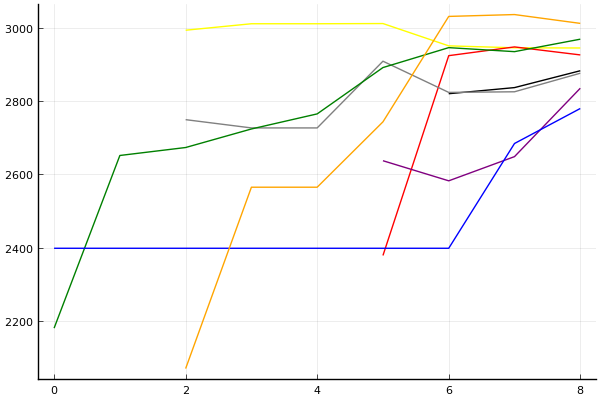
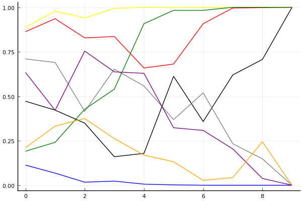

[2020 시즌 2 포스트시즌 방식의 근원지](../season-design-2)! 카트리그 전적/랭킹 블로그 (ver. 1.0). 
__최종 업데이트: 2020-10-14__

## 주요 랭킹
- [팀전 - 최신 팀 파워랭킹](../power-ranking-201014)
- [팀전 - 전체 트랙](../team-full)
- [팀전 - 스피드](../team-speed)
- [팀전 - 아이템](../team-item)
- [팀전 - 에이스 결정전](../team-ace)
- [개인전 - 종합](../singles-full)

## 참고 자료
- 2020-7-13: [개인전 점수-진출확률 변환표](../conversion)

## 사설 
- 2020-10-12: [사설 - 풀리그 방식에서의 에이스 결정전. 다승제는 과연 올바른가](../ace-in-round-robin)
- 2020-7-4: [사설 - 타이브레이커](../tiebreakers)
- 2020-6-26: [사설 - 밴픽](../ban-pick)
- 2020-5-26: [사설 - 개인전 50점/80점 선취제에 필요한 최대 트랙의 수는?](../track-optim)
- 2020-5-24: [2020 시즌 1 마무리 - 그동안 있었던 일](../season-wrapup-2020-1)
- 2020-5-19: [사설 - 내 맘대로 짜보는 리그 3 - 개인전](../season-design-3)
- 2020-5-17: [사설 - 내 맘대로 짜보는 리그 2 - 팀전](../season-design-2)
- 2020-5-13: [사설 - 내 맘대로 짜보는 리그 1](../season-design-1)
- 2020-3-1: [사설 - 2월 22일자 개인전 TMI 승부 예측](../editorial-tmi-0222)
- 2020-1-25: [사설 - 잡다한 생각들](../thoughts)
- 2020-1-17: [사설 - TMI 승부 예측](../editorial-tmi)

## 시즌
- [2020 시즌 2](../2020-2)
- [2020 시즌 1](../2020-1)

__경기 리뷰는 경기 후 2일 이내에 업로드됩니다.__
 

## 분석 방법

[TrueSkill](https://trueskill.org/). 이 방법은 Microsoft Research에서 개발한 방법으로 각 선수의 기량을 두 개의 숫자, 평균 mu(추정된 기량의 위치), 표준편차 sigma(추정된 기량의 불확실성)로 나타내고 베이지안 추론을 통해 추정된 mu와 sigma에 기반하여 순위를 매긴다. 
선수들이 경기를 많이 할수록 일반적으로 선수의 기량을 좀 더 정확히 추정할 수 있을테니 mu는 점점 제자리를 찾아가고, sigma는 점점 줄어들게 된다. 
이 블로그의 모든 분석에서 각 선수는 mu=3000, sigma=1000로 시작. 팀전 랭킹의 mu는 네 명의 mu 합산을 기준으로, sigma는 네 명의 sigma 제곱의 합의 제곱근을 기준으로 계산. 종합 랭킹의 경우 스피드전 또는 아이템전만 참가하는 선수는 1/2명으로 계산하여 이에 맞게 계산식을 적절히 변형함.  

분석의 단위:

- 개인전: 각 트랙의 순위.
- 팀전: 각 트랙의 승패. 이에 따라 기존에 문호준 선수보다 더 성적이 좋은 팀에 있었던 최영훈 선수가 더 높은 순위를 가짐.

[조금 더 자세한 설명 보러가기](../about)

### 순위표
선수들의 순위를 나타낼 때는 mu를 그대로 쓰는 대신 실력을 *보수적으로* 추정하는 값인 mu - k sigma 를 사용한다. k가 클수록 각 선수의 실력이 mu - k sigma 보다 클 확률이 매우 높아진다는 의미에서. 주로 쓰이는 k값은 3이고, 정규분포의 특성에 의해 선수의 실력이 그 값보다 높을 확률은 99% 이상이 된다. 여기에서도 k=3을 사용.

예를 들어, 2020년 1월 1일 시점 박도현의 추정된 mu는 이재혁의 그것보다 높지만 박도현이 지금까지 치른 경기 수가 적어 불확실성 sigma 크기 때문에 그만큼 점수를 깎으므로 박도현이 이재혁보다 밑에 있게 된다.

### 데이터
분석에 사용된 데이터는 [여기](https://github.com/KartRanking/KartRanking/tree/master/dat)에 공개되어 있음.

2015년 카트라이더 리그 에볼루션 이후 모든 팀전, 개인전 TV 방송 경기. 8인전, 7인전, 4인전, 2인전 모두 포함 (2017 케스파 컵과 듀얼레이스 X 포함, 티밍이 있었던 글로벌 슈퍼매치 제외)

## [팀전](../team-power-ranking)

### 순위표

| 순위 | 팀 | 경기 수 | 승 | 패 | 세트 득실 | 트랙 득실 | 승점 |
|---:|---:|---:|---:|---:|---:|---:|---:|
| 1 | SB | 7 | 6 | 1 | 10 | 28 | 18 |
| 2 | ROX | 7 | 6 | 1 | 9 | 22 | 17 |
| 3 | HLE | 7 | 5 | 2 | 5 | 9 | 14 |
| 4 | EST | 7 | 4 | 3 | 2 | 5 | 12 |
| 5 | AF | 7 | 4 | 3 | 2 | 5 | 12 |
| 6 | SGA | 7 | 2 | 5 | -4 | -11 | 8 |
| 7 | STL | 7 | 1 | 6 | -10 | -21 | 3 |
| 8 | MT | 7 | 0 | 7 | -14 | -37 | 0 |

* 순위 산정 기준: 승수-세트 득실-트랙 득실-승자승 순. EST의 승자승 우위로 4위.
* 경기수가 다른 팀들의 경우 승패차-승률-세트 득실-트랙 득실-승자승 순으로 순위 결정([9월 5일 방송 도입부](https://youtu.be/1rHcBg_H5Jk?t=155)). [3팀 이상 동률의 처리 규정에 대해서는 알려지지 않음](../tiebreakers).
* 승점: 공식 기록 아님, 2-0 승 3점, 2-1 승 2점, 1-2 패 1점, 0-2 패 0점. 

### 포스트시즌 업데이트

| 날짜 | 경기 | 레드 | 블루 | 
|:---:|:---:|:---:|:---:|
| 10/17 | WC | EST | AF |
| 10/21 | 준PO | HLE | (WC 승자) |
| 10/24 | 결승진출전 | SB | ROX |
| 11/4 | PO | (결승진출전 패자) | (준PO 승자) |
| 11/7 | 결승전 | (결승진출전 승자) | (PO 승자) |

- 2020-10-05: [김대겸 해설위원 유튜브](https://youtu.be/Df3vo0ENzYk?t=186)를 통해 포스트시즌에서는 8강 풀리그 상위팀에게 밴픽 어드밴티지 있음이 공개됨. 
- 2020-10-14: 김대겸 해설위원 방송을 통해 포스트시즌 밴픽 방식 공개. 
    - 스피드전 아이템전 모두 동일한 방식. 레드: 상위 진출팀, 블루: 하위 진출팀.
    - 결승전의 경우 상위 진출팀은 결승 진출전 승자.

    1. 트랙 1은 고정.
    2. 레드 픽 (트랙 2)
    3. 블루 밴
    4. 레드 밴
    5. 블루 픽 (트랙 3)
    6. 레드 픽 (트랙 4)
    7. 블루 픽 (트랙 5)
    8. 레드 픽 (트랙 6)
    9. 블루 픽 (트랙 7)
   

### 프리뷰: [와일드카드전](../t2020-2-2-1-p)

| __EST__ | 4-0 | 4-1 | 4-2 | 4-3 | __v.__ | 3-4 | 2-4 | 1-4 | 0-4 | __AF__ |
|---:|---:|---:|---:|:---:|---:|---:|---:|---:|
| __0.4061__ | 0.0814 | 0.1099 | 0.1151 | 0.0997 | 스피드 | 0.1184 | 0.1433 | 0.1746 | 0.1576 | __0.5939__ |
| __0.8633__ | 0.3875 | 0.2536 | 0.1402 | 0.0820 | 아이템 | 0.0472 | 0.0419 | 0.0327 | 0.0149 | __0.1367__ |
| __2-0 승__ | | | | | __에결__ | | | | | __0-2 승__ |
| 0.3506 | | | | | 0.5682 | | | | | 0.0812 |

### 리뷰: [풀리그 27-28경기](../t2020-2-1-13)

#### 전체

| 순위 | 팀 | 점수 | 변동 | mu | 변동 | sigma | 변동 |
|---:|---:|---:|---:|---:|---:|---:|---:|
| 1 | ROX | 12438 | -13 | 13305 | -24 | 289 | -4 |
| 2 | SB | 12246 | +0 | 13133 | +0 | 296 | +0 |
| 3 | HLE | 12138 | +31 | 12957 | +24 | 273 | -2 |
| 4 | EST | 11658 | +0 | 12721 | +0 | 354 | +0 |
| 5 | AF | 11411 | -34 | 12398 | -37 | 329 | -1 |
| 6 | SGA | 10823 | +0 | 11916 | +0 | 364 | +0 |
| 7 | STL | 9250 | +0 | 10972 | +0 | 574 | +0 |
| 8 | MT | 7957 | +441 | 10506 | +211 | 850 | -77 |

#### 스피드전

| 순위 | 팀 | 점수 | 변동 | mu | 변동 | sigma | 변동 |
|---:|---:|---:|---:|---:|---:|---:|---:|
| 1 | SB | 12259 | +0 | 13395 | +0 | 379 | +0 |
| 2 | HLE | 12233 | +160 | 13302 | +142 | 356 | -6 |
| 3 | ROX | 12069 | -158 | 13330 | -198 | 420 | -14 |
| 4 | AF | 11667 | +11 | 13119 | +12 | 484 | +0 |
| 5 | EST | 11248 | +0 | 12867 | +0 | 540 | +0 |
| 6 | SGA | 11149 | +0 | 12722 | +0 | 524 | +0 |
| 7 | STL | 8271 | +0 | 11031 | +0 | 920 | +0 |
| 8 | MT | 4279 | -44 | 8491 | -103 | 1404 | -19 |

#### 아이템전

| 순위 | 팀 | 점수 | 변동 | mu | 변동 | sigma | 변동 |
|---:|---:|---:|---:|---:|---:|---:|---:|
| 1 | ROX | 12454 | +122 | 13636 | +103 | 394 | -7 |
| 2 | SB | 12406 | +0 | 13575 | +0 | 390 | +0 |
| 3 | HLE | 12003 | -74 | 13112 | -90 | 370 | -5 |
| 4 | EST | 11596 | +0 | 13041 | +0 | 482 | +0 |
| 5 | AF | 10514 | +33 | 11950 | +2 | 479 | -10 |
| 6 | SGA | 9712 | +0 | 11580 | +0 | 623 | +0 |
| 7 | STL | 8639 | +0 | 10824 | +0 | 728 | +0 |
| 8 | MT | 7955 | +291 | 10927 | -18 | 991 | -103 |

* Note: 전체 트랙 모형은 스피드전과 아이템전의 단순 합산이 아니라 별도의 모형임.

__[경기 결과, 개인 별 랭킹 변화 보기](../t2020-2-1-13)__

## 개인전  

### 프리뷰: [개인전 16강 패자전](../s2020-2-4-2-p)

#### 승부예측

| 순위 | 김승래 | 최윤서 | 김기수 | 한승철 | 김지민 | 최영훈 | 우성민 | 배성빈 |
|:---:|---:|---:|---:|---:|---:|---:|---:|---:|
| 1위 | 0.146 | 0.121 | 0.119 | 0.074 | 0.070 | 0.176 | 0.052 | 0.268 |
| 진출 | 0.566 | 0.521 | 0.541 | 0.411 | 0.396 | 0.625 | 0.343 | 0.720 |

#### 랭킹 히스토리

x축: 시즌, y축: 점수
1번: 옐로우, 2번: 블랙, 3번: 레드, 4번: 화이트(회색), 5번: 퍼플, 6번: 그린, 7번: 블루, 8번: 오렌지

__[더 보기...](../s2020-2-4-2-p)__

### 리뷰: [개인전 16강 승자전](../s2020-2-4-1)

#### 경기 결과

| 트랙 | 박인수 | 정승하 | 이재혁 | 유영혁 | 노준현 | 박현수 | 최민석 | 송용준 |
|:---|---:|---:|---:|---:|---:|---:|---:|---:|
| [카멜롯 펜드래건 캐슬](../pendragon) | 10 | 1 | 7 | 3 | 0 | 4 | -1 | 5 |
| [동화 이상한 나라의 문](../gate) | 3 | 4 | 1 | 0 | 10 | 7 | -1 | 5 |
| [공동묘지 해골성 대탐험](../skullcastle) | 10 | -1 | 3 | 7 | 1 | 5 | 4 | 0 |
| [[리버스] 해적 로비 절벽의 전투](../rlobby) | 7 | 5 | 1 | 3 | 4 | 10 | -1 | 0 |
| [황금문명 오르에트 황금 좌표](../coordinate) | 5 | 10 | 4 | 1 | -1 | 7 | 0 | 3 |
| [아이스 부서진 빙산](../boobing) | 4 | 1 | 10 | 7 | 5 | 3 | -1 | 0 |
| [아이스 아찔한 헬기 점프](../heli) | 3 | 5 | 10 | -1 | 1 | 7 | 0 | 4 |
| [어비스 숨겨진 바닷길](../hiddenoceanroad) | 7 | 5 | -1 | 4 | 1 | 3 | 0 | 10 |
| [대저택 은밀한 지하실](../jeotaek) | 10 | 1 | 4 | -1 | 7 | 5 | 0 | 3 |
| __total__ |__59__ |__31__ |__39__ |__23__ |__28__ |__51__ |__0__ |__30__ |

### 트랙 별 진출 확률 추이

#### [종합 랭킹 변동](../singles-full)

| 순위 | 변동 | 이름 | 점수 | 변동 | mu | 변동 | sigma | 변동 |
|---:|---:|:---:|---:|---:|---:|---:|---:|---:|
| 2 / 93 | +0 | [박인수](../bakinsu) | 3379 | +36 | 3609 | +35 | 77 | -0 |
| 3 / 93 | +0 | [이재혁](../ijaehyeok) | 3313 | -16 | 3543 | -16 | 77 | -0 |
| 6 / 93 | -1 | [유영혁](../yuyeonghyeok) | 3176 | -45 | 3405 | -45 | 76 | -0 |
| 7 / 93 | +0 | [정승하](../jeongseungha) | 3117 | +6 | 3347 | +5 | 76 | -0 |
| 10 / 93 | +8 | [박현수](../bakhyeonsu) | 3054 | +85 | 3286 | +83 | 77 | -1 |
| 12 / 93 | +2 | [노준현](../nojunhyeon) | 3027 | +28 | 3379 | -48 | 117 | -25 |
| 14 / 93 | +1 | [송용준](../songyongjun) | 3018 | +22 | 3251 | +19 | 78 | -1 |
| 31 / 93 | -4 | [최민석](../choiminseok) | 2809 | -71 | 3063 | -79 | 85 | -3 |

__[더 보기...](../s2020-2-4-1)__

## 둘러보기
- __[Main Post](../main)__
- [2020 시즌 2](../2020-2)
- [2020 시즌 1](../2020-1)



