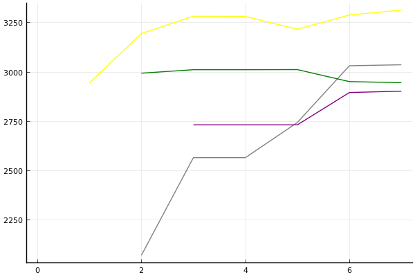
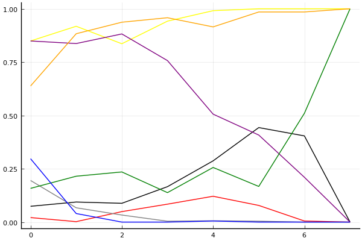

[2020 시즌 2 포스트시즌 방식의 근원지](../season-design-2)! 카트리그 전적/랭킹 블로그 (ver. 1.0). 
__최종 업데이트: 2020-9-9__

## 주요 랭킹
- [팀전 - 최신 팀 파워랭킹](../power-ranking-2000905)
- [팀전 - 전체 트랙](../team-full)
- [팀전 - 스피드](../team-speed)
- [팀전 - 아이템](../team-item)
- [팀전 - 에이스 결정전](../team-ace)
- [개인전 - 종합](../singles-full)

## 참고 자료
- 2020-7-13: [개인전 점수-진출확률 변환표](../conversion)

## 사설 
- 2020-7-4: [사설 - 타이브레이커](../tiebreakers)
- 2020-6-26: [사설 - 밴픽](../ban-pick)
- 2020-5-26: [사설 - 개인전 50점/80점 선취제에 필요한 최대 트랙의 수는?](../track-optim)
- 2020-5-24: [2020 시즌 1 마무리 - 그동안 있었던 일](../season-wrapup-2020-1)
- 2020-5-19: [사설 - 내 맘대로 짜보는 리그 3 - 개인전](../season-design-3)
- 2020-5-17: [사설 - 내 맘대로 짜보는 리그 2 - 팀전](../season-design-2)
- 2020-5-13: [사설 - 내 맘대로 짜보는 리그 1](../season-design-1)
- 2020-3-1: [사설 - 2월 22일자 개인전 TMI 승부 예측](../editorial-tmi-0222)
- 2020-1-25: [사설 - 잡다한 생각들](../thoughts)
- 2020-1-17: [사설 - TMI 승부 예측](../editorial-tmi)

## 시즌
- [2020 시즌 2](../2020-2)
- [2020 시즌 1](../2020-1)

## 이번 시즌 업데이트 내역

__경기 리뷰는 경기 후 2일 이내에 업로드됩니다.__
- 2020-9-9: [팀전 풀리그 13-16경기 프리뷰](../t2020-2-1-4-p)
- 2020-9-9: [팀전 풀리그 11-12경기 리뷰](../t2020-2-1-5)
- 2020-9-5: [개인전 32강 C조 리뷰](../s2020-2-1-3)
- 2020-9-5: [팀전 풀리그 9-10경기 리뷰](../t2020-2-1-4)
- 2020-9-4: [팀전 풀리그 9-12경기 프리뷰](../t2020-2-1-3-p)
- 2020-9-4: [팀전 풀리그 7-8경기 리뷰](../t2020-2-1-3)
- 2020-8-29: [개인전 32강 B조 리뷰](../s2020-2-1-2)
- 2020-8-29: [팀전 풀리그 5-6경기 리뷰](../t2020-2-1-2)
- 2020-8-27: [팀전 풀리그 2라운드 프리뷰](../t2020-2-1-2-p)
- 2020-8-26: [팀전 풀리그 1라운드 리뷰](../t2020-2-1-1)
- 2020-8-23: [개인전 32강 B조 프리뷰](../s2020-2-1-2-p)
- 2020-8-22: [개인전 32강 A조 리뷰](../s2020-2-1-1)
- 2020-8-18: [팀전 풀리그 1라운드 프리뷰](../t2020-2-1-1-p)
- 2020-8-18: [개인전 32강 A조 프리뷰](../s2020-2-1-1-p)
 

## 분석 방법

[TrueSkill](https://trueskill.org/). 이 방법은 Microsoft Research에서 개발한 방법으로 각 선수의 기량을 두 개의 숫자, 평균 mu(추정된 기량의 위치), 표준편차 sigma(추정된 기량의 불확실성)로 나타내고 베이지안 추론을 통해 추정된 mu와 sigma에 기반하여 순위를 매긴다. 
선수들이 경기를 많이 할수록 일반적으로 선수의 기량을 좀 더 정확히 추정할 수 있을테니 mu는 점점 제자리를 찾아가고, sigma는 점점 줄어들게 된다. 
이 블로그의 모든 분석에서 각 선수는 mu=3000, sigma=1000로 시작. 팀전 랭킹의 mu는 네 명의 mu 합산을 기준으로, sigma는 네 명의 sigma 제곱의 합의 제곱근을 기준으로 계산. 종합 랭킹의 경우 스피드전 또는 아이템전만 참가하는 선수는 1/2명으로 계산하여 이에 맞게 계산식을 적절히 변형함.  

분석의 단위:

- 개인전: 각 트랙의 순위.
- 팀전: 각 트랙의 승패. 이에 따라 기존에 문호준 선수보다 더 성적이 좋은 팀에 있었던 최영훈 선수가 더 높은 순위를 가짐.

[조금 더 자세한 설명 보러가기](../about)

### 순위표
선수들의 순위를 나타낼 때는 mu를 그대로 쓰는 대신 실력을 *보수적으로* 추정하는 값인 mu - k sigma 를 사용한다. k가 클수록 각 선수의 실력이 mu - k sigma 보다 클 확률이 매우 높아진다는 의미에서. 주로 쓰이는 k값은 3이고, 정규분포의 특성에 의해 선수의 실력이 그 값보다 높을 확률은 99% 이상이 된다. 여기에서도 k=3을 사용.

예를 들어, 2020년 1월 1일 시점 박도현의 추정된 mu는 이재혁의 그것보다 높지만 박도현이 지금까지 치른 경기 수가 적어 불확실성 sigma 크기 때문에 그만큼 점수를 깎으므로 박도현이 이재혁보다 밑에 있게 된다.

### 데이터
분석에 사용된 데이터는 [여기](https://github.com/KartRanking/KartRanking/tree/master/dat)에 공개되어 있음.

2015년 카트라이더 리그 에볼루션 이후 모든 팀전, 개인전 TV 방송 경기. 8인전, 7인전, 4인전, 2인전 모두 포함 (2017 케스파 컵과 듀얼레이스 X 포함, 티밍이 있었던 글로벌 슈퍼매치 제외)

## [팀전](../team-power-ranking)

### 순위표

| 순위 | 팀 | 경기 수 | 승 | 패 | 세트 득실 | 트랙 득실 | 승점 |
|---:|---:|---:|---:|---:|---:|---:|---:|
| 1 | ROX | 3 | 3 | 0 | 6 | 13 | 9 |
| 2 | SB | 2 | 2 | 0 | 4 | 11 | 6 |
| 3 | HLE | 4 | 3 | 1 | 2 | 4 | 7 |
| 4 | EST | 3 | 2 | 1 | 2 | 5 | 6 |
| 5 | SGA | 3 | 1 | 2 | -1 | -4 | 4 |
| 6 | STL | 4 | 1 | 3 | -4 | -8 | 3 |
| 7 | AF | 2 | 0 | 2 | -3 | -5 | 1 |
| 8 | MT | 3 | 0 | 3 | -6 | -16 | 0 |

* 순위 산정 기준: 승수-세트 득실-트랙 득실-승자승 순.
* 경기수가 다른 팀들의 경우 승패차-승률-세트 득실-트랙 득실-승자승 순으로 순위 결정([9월 5일 방송 도입부](https://youtu.be/1rHcBg_H5Jk?t=155)). [3팀 이상 동률의 처리 규정에 대해서는 알려지지 않음](../tiebreakers).
* 승점: 공식 기록 아님, 2-0 승 3점, 2-1 승 2점, 1-2 패 1점, 0-2 패 0점. 

### 프리뷰: [13-16경기](../t2020-2-1-4-p)

| __SB__ | 3-0 | 3-1 | 3-2 | __v.__ | 2-3 | 1-3 | 0-3 | __MT__ |
|---:|---:|---:|---:|:---:|---:|---:|---:|---:|
| __0.9968__ | 0.9760 | 0.0171 | 0.0037 | 스피드 | 0.0016 | 0.0012 | 0.0004 | __0.0032__ |
| __0.9972__ | 0.9767 | 0.0174 | 0.0031 | 아이템 | 0.0012 | 0.0012 | 0.0004 | __0.0028__ |
| __2-0 승__ | | | | __에결__ | | | | __0-2 승__ |
| 0.9940 | | | | 0.0060 | | | | 0.0000 |

| __AF__ | 3-0 | 3-1 | 3-2 | __v.__ | 2-3 | 1-3 | 0-3 | __SGA__ |
|---:|---:|---:|---:|:---:|---:|---:|---:|---:|
| __0.2401__ | 0.0614 | 0.0875 | 0.0912 | 스피드 | 0.1251 | 0.2355 | 0.3993 | __0.7599__ |
| __0.4509__ | 0.1714 | 0.1541 | 0.1254 | 아이템 | 0.1316 | 0.1806 | 0.2369 | __0.5491__ |
| __2-0 승__ | | | | __에결__ | | | | __0-2 승__ |
| 0.1083 | | | | 0.4745 | | | | 0.4173 |

| __SB__ | 3-0 | 3-1 | 3-2 | __v.__ | 2-3 | 1-3 | 0-3 | __ROX__ |
|---:|---:|---:|---:|:---:|---:|---:|---:|---:|
| __0.5335__ | 0.1815 | 0.1936 | 0.1584 | 스피드 | 0.1483 | 0.1697 | 0.1485 | __0.4665__ |
| __0.4056__ | 0.1143 | 0.1514 | 0.1399 | 아이템 | 0.1695 | 0.2103 | 0.2146 | __0.5944__ |
| __2-0 승__ | | | | __에결__ | | | | __0-2 승__ |
| 0.2164 | | | | 0.5063 | | | | 0.2773 |

| __EST__ | 3-0 | 3-1 | 3-2 | __v.__ | 2-3 | 1-3 | 0-3 | __AF__ |
|---:|---:|---:|---:|:---:|---:|---:|---:|---:|
| __0.7233__ | 0.3837 | 0.2209 | 0.1187 | 스피드 | 0.0921 | 0.0998 | 0.0848 | __0.2767__ |
| __0.9012__ | 0.5669 | 0.2397 | 0.0946 | 아이템 | 0.0416 | 0.0345 | 0.0227 | __0.0988__ |
| __2-0 승__ | | | | __에결__ | | | | __0-2 승__ |
| 0.6518 | | | | 0.3208 | | | | 0.0273 |

### 리뷰: [풀리그 11-12경기](../t2020-2-1-5)

#### 전체

| 순위 | 팀 | 점수 | 변동 | mu | 변동 | sigma | 변동 |
|---:|---:|---:|---:|---:|---:|---:|---:|
| 1 | ROX | 12610 | +120 | 13489 | +114 | 293 | -2 |
| 2 | SB | 12314 | +0 | 13218 | +0 | 302 | +0 |
| 3 | HLE | 12219 | -12 | 13045 | -19 | 275 | -2 |
| 4 | EST | 11495 | -85 | 12842 | -257 | 449 | -57 |
| 5 | AF | 10859 | +0 | 11962 | +0 | 368 | +0 |
| 6 | SGA | 10732 | +143 | 11959 | +77 | 409 | -22 |
| 7 | STL | 9076 | +0 | 11357 | +0 | 760 | +0 |
| 8 | MT | 5005 | +0 | 8358 | +0 | 1118 | +0 |

#### 스피드전

| 순위 | 팀 | 점수 | 변동 | mu | 변동 | sigma | 변동 |
|---:|---:|---:|---:|---:|---:|---:|---:|
| 1 | SB | 12560 | +0 | 13771 | +0 | 403 | +0 |
| 2 | ROX | 12362 | +124 | 13695 | +93 | 444 | -10 |
| 3 | HLE | 12022 | -133 | 13117 | -152 | 365 | -6 |
| 4 | SGA | 11078 | +565 | 12880 | +444 | 601 | -40 |
| 5 | EST | 10573 | +84 | 12821 | -284 | 750 | -123 |
| 6 | AF | 10369 | +0 | 12057 | +0 | 563 | +0 |
| 7 | STL | 8562 | +0 | 11888 | +0 | 1108 | +0 |
| 8 | MT | 4415 | +0 | 8822 | +0 | 1469 | +0 |

#### 아이템전

| 순위 | 팀 | 점수 | 변동 | mu | 변동 | sigma | 변동 |
|---:|---:|---:|---:|---:|---:|---:|---:|
| 1 | ROX | 12421 | +122 | 13665 | +100 | 415 | -7 |
| 2 | HLE | 12274 | +105 | 13433 | +98 | 386 | -2 |
| 3 | SB | 12215 | +0 | 13438 | +0 | 407 | +0 |
| 4 | EST | 11353 | -108 | 12997 | -177 | 548 | -23 |
| 5 | AF | 9929 | +0 | 11583 | +0 | 551 | +0 |
| 6 | SGA | 9447 | -300 | 11755 | -412 | 769 | -37 |
| 7 | STL | 8332 | +0 | 11300 | +0 | 989 | +0 |
| 8 | MT | 4325 | +0 | 8484 | +0 | 1386 | +0 |

* Note: 전체 트랙 모형은 스피드전과 아이템전의 단순 합산이 아니라 별도의 모형임.

__[경기 결과, 개인 별 랭킹 변화 보기](../t2020-2-1-5)__

## 개인전  

### 프리뷰: [개인전 32강 D조](../s2020-2-1-4-p)

#### 승부예측

| 순위 | 이재혁 | 권승주 | 정승민B | 배성빈 | 박현수 | 김승래 | 이정우 | 정유민 |
|:---:|---:|---:|---:|---:|---:|---:|---:|---:|
| 1위 | 0.633 | 0.073 | 0.070 | 0.080 | 0.024 | 0.032 | 0.073 | 0.038 |
| 진출 | 0.928 | 0.294 | 0.290 | 0.470 | 0.234 | 0.286 | 0.295 | 0.302 |
| 패부 | 0.058 | 0.215 | 0.226 | 0.321 | 0.317 | 0.325 | 0.229 | 0.323 |
| 탈락 | 0.015 | 0.490 | 0.484 | 0.209 | 0.449 | 0.389 | 0.477 | 0.376 |

#### 랭킹 히스토리

x축: 시즌, y축: 점수
1번: 옐로우, 2번: 블랙, 3번: 레드, 4번: 화이트(회색), 5번: 퍼플, 6번: 그린, 7번: 블루, 8번: 오렌지

__[더 보기...](../s2020-2-1-4-p)__

### 리뷰: [개인전 32강 C조](../s2020-2-1-3)

#### 경기 결과

| 트랙 | 유영혁 | 김지민 | 김현민 | 김주영 | 박도현 | 최민석 | 최태원 | 정승하 |
|:---|---:|---:|---:|---:|---:|---:|---:|---:|
| [카멜롯 펜드래건 캐슬](../pendragon) | 7 | 3 | -1 | 0 | 4 | 5 | 1 | 10 |
| [공동묘지 해골성 대탐험](../skullcastle) | 0 | 3 | 10 | 1 | 5 | 4 | -1 | 7 |
| [[리버스] 해적 로비 절벽의 전투](../rlobby) | 10 | 7 | 4 | 0 | 3 | 1 | -1 | 5 |
| [광산 위험한 제련소](../jeryeonso) | 10 | 4 | 3 | 1 | -1 | 5 | 7 | 0 |
| [아이스 부서진 빙산](../boobing) | 10 | 4 | 0 | 5 | 3 | 1 | -1 | 7 |
| [동화 이상한 나라의 문](../gate) | 7 | 4 | 0 | 1 | 5 | 10 | -1 | 3 |
| [어비스 숨겨진 바닷길](../hiddenoceanroad) | 10 | 3 | -1 | 1 | 5 | 7 | 0 | 4 |
| __total__ |__54__ |__28__ |__15__ |__9__ |__24__ |__33__ |__4__ |__36__ |

#### 트랙 별 16강 진출 확률 추이

#### [종합 랭킹 변동](../singles-full)

| 순위 | 변동 | 이름 | 점수 | 변동 | mu | 변동 | sigma | 변동 |
|---:|---:|:---:|---:|---:|---:|---:|---:|---:|
| 5 / 90 | +1 | [유영혁](../yuyeonghyeok) | 3232 | +35 | 3462 | +37 | 76 | +1 |
| 7 / 90 | +0 | [박도현](../bakdohyeon) | 3136 | -45 | 3371 | -47 | 78 | -1 |
| 10 / 90 | +0 | [정승하](../jeongseungha) | 3072 | +5 | 3303 | +4 | 77 | -0 |
| 29 / 90 | +5 | [최민석](../choiminseok) | 2821 | +67 | 3098 | +52 | 92 | -5 |
| 36 / 90 | +1 | [김지민](../gimjimin) | 2719 | +71 | 3019 | +44 | 100 | -9 |
| 49 / 90 | +3 | [김주영](../gimjuyeong) | 2452 | +14 | 2912 | -156 | 153 | -57 |
| 63 / 90 | +8 | [김현민](../gimhyunmin) | 2269 | +147 | 2749 | -29 | 160 | -59 |
| 88 / 90 | NaN | [최태원](../choitaiwon) | 1672 | +1672 | 2403 | -597 | 243 | -757 |

__[더 보기...](../s2020-2-1-3)__

## 둘러보기
- __[Main Post](../main)__
- [2020 시즌 1](../2020-1)



