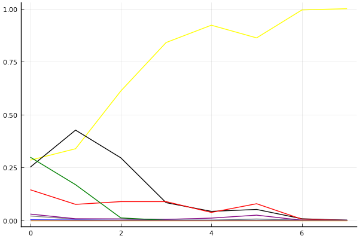
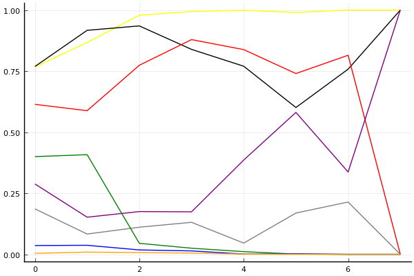
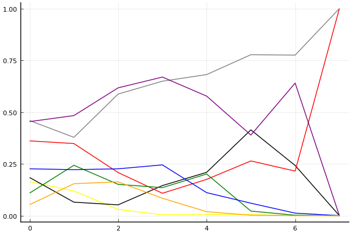

2020 시즌 1 개인전 32강 A조

## 경기 결과

| 트랙 | 이재혁 | 유창현 | 유영혁 | 김응태 | 신종민 | 김현민 | 김지민 | 정승민 |
|:---|---:|---:|---:|---:|---:|---:|---:|---:|
| [어비스 숨겨진 바닷길](../hiddenoceanroad) | 7 | 10 | 3 | -1 | 0 | 4 | 1 | 5 |
| [WKC 싱가폴 마리나 서킷](../singapore) | 10 | 3 | 7 | 5 | 4 | -1 | 1 | 0 |
| [아이스 아찔한 헬기점프](../heli) | 10 | 0 | 7 | 5 | 4 | 1 | 3 | -1 |
| [쥐라기 공룡섬 대모험](../dinoisland) | 7 | 5 | 4 | 1 | 10 | 3 | 0 | -1 |
| [어비스 스카이라인](../skyline) | 1 | 3 | 4 | 10 | 7 | 0 | 5 | -1 |
| [포레스트 지그재그](../zigzag) | 10 | 7 | 4 | 5 | 1 | 0 | 3 | -1 |
| [공동묘지 마왕의 초대](../mawang) | 10 | 7 | 0 | 3 | 5 | 1 | 4 | -1 |
| __total__ |__55__ |__35__ |__29__ |__28__ |__31__ |__8__ |__17__ |__0__ |

## 시뮬레이션

### 1st 확률

x축: 트랙, y축: 확률
1번: 옐로우, 2번: 블랙, 3번: 레드, 4번: 화이트(회색), 5번: 퍼플, 6번: 그린, 7번: 블루, 8번: 오렌지

| 트랙 | 이재혁 | 유창현 | 유영혁 | 김응태 | 신종민 | 김현민 | 김지민 | 정승민 |
|:---|---:|---:|---:|---:|---:|---:|---:|---:|
| 초기 | 0.284 | 0.251 | 0.144 | 0.020 | 0.029 | 0.298 | 0.002 | 0.000 |
| 어비스 숨겨진 바닷길 | 0.338 | 0.426 | 0.075 | 0.005 | 0.007 | 0.168 | 0.001 | 0.000 |
| WKC 싱가폴 마리나 서킷 | 0.611 | 0.295 | 0.088 | 0.006 | 0.006 | 0.011 | 0.000 | 0.000 |
| 아이스 아찔한 헬기점프 | 0.840 | 0.083 | 0.088 | 0.001 | 0.004 | 0.000 | 0.000 | 0.000 |
| 쥐라기 공룡섬 대모험 | 0.922 | 0.042 | 0.037 | 0.000 | 0.010 | 0.000 | 0.000 | 0.000 |
| 어비스 스카이라인 | 0.862 | 0.051 | 0.078 | 0.006 | 0.024 | 0.000 | 0.000 | 0.000 |
| 포레스트 지그재그 | 0.994 | 0.007 | 0.005 | 0.000 | 0.000 | 0.000 | 0.000 | 0.000 |
| 공동묘지 마왕의 초대 | 1.000 | 0.000 | 0.000 | 0.000 | 0.000 | 0.000 | 0.000 | 0.000 |

### Advance 확률

x축: 트랙, y축: 확률
1번: 옐로우, 2번: 블랙, 3번: 레드, 4번: 화이트(회색), 5번: 퍼플, 6번: 그린, 7번: 블루, 8번: 오렌지

| 트랙 | 이재혁 | 유창현 | 유영혁 | 김응태 | 신종민 | 김현민 | 김지민 | 정승민 |
|:---|---:|---:|---:|---:|---:|---:|---:|---:|
| 초기 | 0.767 | 0.769 | 0.614 | 0.186 | 0.288 | 0.400 | 0.036 | 0.004 |
| 어비스 숨겨진 바닷길 | 0.867 | 0.917 | 0.588 | 0.083 | 0.152 | 0.408 | 0.037 | 0.009 |
| WKC 싱가폴 마리나 서킷 | 0.979 | 0.935 | 0.774 | 0.111 | 0.175 | 0.045 | 0.018 | 0.007 |
| 아이스 아찔한 헬기점프 | 0.994 | 0.839 | 0.879 | 0.131 | 0.174 | 0.025 | 0.014 | 0.005 |
| 쥐라기 공룡섬 대모험 | 0.999 | 0.770 | 0.838 | 0.046 | 0.386 | 0.011 | 0.001 | 0.001 |
| 어비스 스카이라인 | 0.990 | 0.601 | 0.740 | 0.169 | 0.581 | 0.001 | 0.002 | 0.000 |
| 포레스트 지그재그 | 1.000 | 0.758 | 0.815 | 0.214 | 0.337 | 0.000 | 0.000 | 0.000 |
| 공동묘지 마왕의 초대 | 1.000 | 1.000 | 0.000 | 0.000 | 1.000 | 0.000 | 0.000 | 0.000 |

### Repechage 확률

x축: 트랙, y축: 확률
1번: 옐로우, 2번: 블랙, 3번: 레드, 4번: 화이트(회색), 5번: 퍼플, 6번: 그린, 7번: 블루, 8번: 오렌지

| 트랙 | 이재혁 | 유창현 | 유영혁 | 김응태 | 신종민 | 김현민 | 김지민 | 정승민 |
|:---|---:|---:|---:|---:|---:|---:|---:|---:|
| 초기 | 0.204 | 0.208 | 0.293 | 0.435 | 0.480 | 0.107 | 0.229 | 0.057 |
| 어비스 숨겨진 바닷길 | 0.124 | 0.078 | 0.344 | 0.355 | 0.505 | 0.243 | 0.211 | 0.155 |
| WKC 싱가폴 마리나 서킷 | 0.021 | 0.064 | 0.213 | 0.594 | 0.607 | 0.143 | 0.231 | 0.154 |
| 아이스 아찔한 헬기점프 | 0.006 | 0.152 | 0.119 | 0.666 | 0.659 | 0.120 | 0.198 | 0.077 |
| 쥐라기 공룡섬 대모험 | 0.001 | 0.228 | 0.162 | 0.709 | 0.592 | 0.177 | 0.116 | 0.020 |
| 어비스 스카이라인 | 0.010 | 0.393 | 0.257 | 0.785 | 0.412 | 0.021 | 0.057 | 0.000 |
| 포레스트 지그재그 | 0.000 | 0.242 | 0.184 | 0.778 | 0.663 | 0.000 | 0.015 | 0.000 |
| 공동묘지 마왕의 초대 | 0.000 | 0.000 | 1.000 | 1.000 | 0.000 | 0.000 | 0.000 | 0.000 |

## 랭킹 변동

### [전체 랭킹](../singles-full)

| 순위 | 변동 | 이름 | 점수 | 변동 | mu | 변동 | sigma | 변동 |
|---:|---:|:---:|---:|---:|---:|---:|---:|---:|
| 2 / 83 | +0 | [이재혁](../ijaehyeok) | 3334 | +46 | 3570 | +47 | 79 | +0 |
| 4 / 83 | -1 | [유창현](../yuchanghyeon) | 3266 | -13 | 3496 | -13 | 77 | -0 |
| 7 / 83 | +0 | [유영혁](../yuyeonghyeok) | 3150 | -16 | 3378 | -16 | 76 | -0 |
| 14 / 83 | +1 | [신종민](../shinjongmin) | 3012 | +17 | 3250 | +14 | 79 | -1 |
| 19 / 83 | +3 | [김응태](../gimeungtae) | 2928 | +20 | 3174 | +15 | 82 | -2 |
| 34 / 83 | +3 | [김지민](../gimjimin) | 2648 | +66 | 2976 | +25 | 109 | -14 |
| 55 / 83 | -2 | [정승민](../jeongseungmin) | 2336 | -61 | 2655 | -84 | 106 | -7 |
| 64 / 83 | NaN | [김현민](../gimhyunmin) | 2122 | +2122 | 2777 | -223 | 219 | -781 |

### 시즌 랭킹

| 순위 | 변동 | 이름 | 점수 | 변동 | mu | 변동 | sigma | 변동 |
|---:|---:|:---:|---:|---:|---:|---:|---:|---:|
| 1 / 8 | NaN | [이재혁](../ijaehyeok) | 3043 | +3043 | 3864 | +864 | 274 | -726 |
| 2 / 8 | NaN | [유창현](../yuchanghyeon) | 2570 | +2570 | 3279 | +279 | 236 | -764 |
| 3 / 8 | NaN | [신종민](../shinjongmin) | 2517 | +2517 | 3222 | +222 | 235 | -765 |
| 4 / 8 | NaN | [김응태](../gimeungtae) | 2429 | +2429 | 3142 | +142 | 238 | -762 |
| 5 / 8 | NaN | [유영혁](../yuyeonghyeok) | 2390 | +2390 | 3095 | +95 | 235 | -765 |
| 6 / 8 | NaN | [김지민](../gimjimin) | 2171 | +2171 | 2857 | -143 | 229 | -771 |
| 7 / 8 | NaN | [김현민](../gimhyunmin) | 1807 | +1807 | 2525 | -475 | 239 | -761 |
| 8 / 8 | NaN | [정승민](../jeongseungmin) | 1071 | +1071 | 1910 | -1090 | 280 | -720 |

### 트랙 별 랭킹

#### [WKC 싱가폴 마리나 서킷](../singapore)

| 순위 | 변동 | 이름 | 점수 | 변동 | mu | 변동 | sigma | 변동 |
|:---:|:---:|:---:|---:|---:|---:|---:|---:|---:|
| 1 / 8 | NaN | [이재혁](../ijaehyeok) | 2161 | +2161 | 4274 | +1274 | 704 | -296 |
| 2 / 8 | NaN | [유영혁](../yuyeonghyeok) | 1887 | +1887 | 3763 | +763 | 625 | -375 |
| 3 / 8 | NaN | [김응태](../gimeungtae) | 1622 | +1622 | 3423 | +423 | 600 | -400 |
| 4 / 8 | NaN | [신종민](../shinjongmin) | 1363 | +1363 | 3137 | +137 | 591 | -409 |
| 5 / 8 | NaN | [유창현](../yuchanghyeon) | 1090 | +1090 | 2863 | -137 | 591 | -409 |
| 6 / 8 | NaN | [김지민](../gimjimin) | 776 | +776 | 2577 | -423 | 600 | -400 |
| 7 / 8 | NaN | [정승민](../jeongseungmin) | 361 | +361 | 2237 | -763 | 625 | -375 |
| 8 / 8 | NaN | [김현민](../gimhyunmin) | -388 | -388 | 1726 | -1274 | 704 | -296 |

#### [공동묘지 마왕의 초대](../mawang)

| 순위 | 변동 | 이름 | 점수 | 변동 | mu | 변동 | sigma | 변동 |
|:---:|:---:|:---:|---:|---:|---:|---:|---:|---:|
| 3 / 37 | +1 | [유창현](../yuchanghyeon) | 2556 | +368 | 3584 | +231 | 343 | -46 |
| 4 / 37 | NaN | [이재혁](../ijaehyeok) | 2283 | +2283 | 4276 | +1276 | 664 | -336 |
| 5 / 37 | -2 | [유영혁](../yuyeonghyeok) | 2268 | -195 | 3247 | -325 | 326 | -43 |
| 14 / 37 | NaN | [신종민](../shinjongmin) | 1884 | +1884 | 3526 | +526 | 547 | -453 |
| 15 / 37 | NaN | [김지민](../gimjimin) | 1681 | +1681 | 3311 | +311 | 543 | -457 |
| 17 / 37 | NaN | [김응태](../gimeungtae) | 1489 | +1489 | 3112 | +112 | 541 | -459 |
| 22 / 37 | NaN | [김현민](../gimhyunmin) | 1297 | +1297 | 2919 | -81 | 541 | -459 |
| 26 / 37 | -7 | [정승민](../jeongseungmin) | 959 | -130 | 2411 | -452 | 484 | -107 |

#### [아이스 아찔한 헬기점프](../heli)

| 순위 | 변동 | 이름 | 점수 | 변동 | mu | 변동 | sigma | 변동 |
|:---:|:---:|:---:|---:|---:|---:|---:|---:|---:|
| 1 / 8 | NaN | [이재혁](../ijaehyeok) | 2161 | +2161 | 4274 | +1274 | 704 | -296 |
| 2 / 8 | NaN | [유영혁](../yuyeonghyeok) | 1887 | +1887 | 3763 | +763 | 625 | -375 |
| 3 / 8 | NaN | [김응태](../gimeungtae) | 1622 | +1622 | 3423 | +423 | 600 | -400 |
| 4 / 8 | NaN | [신종민](../shinjongmin) | 1363 | +1363 | 3137 | +137 | 591 | -409 |
| 5 / 8 | NaN | [김지민](../gimjimin) | 1090 | +1090 | 2863 | -137 | 591 | -409 |
| 6 / 8 | NaN | [김현민](../gimhyunmin) | 776 | +776 | 2577 | -423 | 600 | -400 |
| 7 / 8 | NaN | [유창현](../yuchanghyeon) | 361 | +361 | 2237 | -763 | 625 | -375 |
| 8 / 8 | NaN | [정승민](../jeongseungmin) | -388 | -388 | 1726 | -1274 | 704 | -296 |

#### [어비스 숨겨진 바닷길](../hiddenoceanroad)

| 순위 | 변동 | 이름 | 점수 | 변동 | mu | 변동 | sigma | 변동 |
|:---:|:---:|:---:|---:|---:|---:|---:|---:|---:|
| 1 / 8 | NaN | [유창현](../yuchanghyeon) | 2161 | +2161 | 4274 | +1274 | 704 | -296 |
| 2 / 8 | NaN | [이재혁](../ijaehyeok) | 1887 | +1887 | 3763 | +763 | 625 | -375 |
| 3 / 8 | NaN | [정승민](../jeongseungmin) | 1622 | +1622 | 3423 | +423 | 600 | -400 |
| 4 / 8 | NaN | [김현민](../gimhyunmin) | 1363 | +1363 | 3137 | +137 | 591 | -409 |
| 5 / 8 | NaN | [유영혁](../yuyeonghyeok) | 1090 | +1090 | 2863 | -137 | 591 | -409 |
| 6 / 8 | NaN | [김지민](../gimjimin) | 776 | +776 | 2577 | -423 | 600 | -400 |
| 7 / 8 | NaN | [신종민](../shinjongmin) | 361 | +361 | 2237 | -763 | 625 | -375 |
| 8 / 8 | NaN | [김응태](../gimeungtae) | -388 | -388 | 1726 | -1274 | 704 | -296 |

#### [어비스 스카이라인](../skyline)

| 순위 | 변동 | 이름 | 점수 | 변동 | mu | 변동 | sigma | 변동 |
|:---:|:---:|:---:|---:|---:|---:|---:|---:|---:|
| 1 / 8 | NaN | [김응태](../gimeungtae) | 2161 | +2161 | 4274 | +1274 | 704 | -296 |
| 2 / 8 | NaN | [신종민](../shinjongmin) | 1887 | +1887 | 3763 | +763 | 625 | -375 |
| 3 / 8 | NaN | [김지민](../gimjimin) | 1622 | +1622 | 3423 | +423 | 600 | -400 |
| 4 / 8 | NaN | [유영혁](../yuyeonghyeok) | 1363 | +1363 | 3137 | +137 | 591 | -409 |
| 5 / 8 | NaN | [유창현](../yuchanghyeon) | 1090 | +1090 | 2863 | -137 | 591 | -409 |
| 6 / 8 | NaN | [이재혁](../ijaehyeok) | 776 | +776 | 2577 | -423 | 600 | -400 |
| 7 / 8 | NaN | [김현민](../gimhyunmin) | 361 | +361 | 2237 | -763 | 625 | -375 |
| 8 / 8 | NaN | [정승민](../jeongseungmin) | -388 | -388 | 1726 | -1274 | 704 | -296 |

#### [쥐라기 공룡섬 대모험](../dinoisland)

| 순위 | 변동 | 이름 | 점수 | 변동 | mu | 변동 | sigma | 변동 |
|:---:|:---:|:---:|---:|---:|---:|---:|---:|---:|
| 1 / 8 | NaN | [신종민](../shinjongmin) | 2161 | +2161 | 4274 | +1274 | 704 | -296 |
| 2 / 8 | NaN | [이재혁](../ijaehyeok) | 1887 | +1887 | 3763 | +763 | 625 | -375 |
| 3 / 8 | NaN | [유창현](../yuchanghyeon) | 1622 | +1622 | 3423 | +423 | 600 | -400 |
| 4 / 8 | NaN | [유영혁](../yuyeonghyeok) | 1363 | +1363 | 3137 | +137 | 591 | -409 |
| 5 / 8 | NaN | [김현민](../gimhyunmin) | 1090 | +1090 | 2863 | -137 | 591 | -409 |
| 6 / 8 | NaN | [김응태](../gimeungtae) | 776 | +776 | 2577 | -423 | 600 | -400 |
| 7 / 8 | NaN | [김지민](../gimjimin) | 361 | +361 | 2237 | -763 | 625 | -375 |
| 8 / 8 | NaN | [정승민](../jeongseungmin) | -388 | -388 | 1726 | -1274 | 704 | -296 |

#### [포레스트 지그재그](../zigzag)

| 순위 | 변동 | 이름 | 점수 | 변동 | mu | 변동 | sigma | 변동 |
|:---:|:---:|:---:|---:|---:|---:|---:|---:|---:|
| 2 / 46 | -1 | [유영혁](../yuyeonghyeok) | 3553 | -79 | 4172 | -117 | 206 | -12 |
| 3 / 46 | +0 | [이재혁](../ijaehyeok) | 3529 | +94 | 4154 | +69 | 208 | -8 |
| 5 / 46 | +0 | [유창현](../yuchanghyeon) | 3077 | +120 | 3767 | +70 | 230 | -17 |
| 16 / 46 | +5 | [김응태](../gimeungtae) | 2302 | +388 | 3191 | +259 | 296 | -43 |
| 25 / 46 | -2 | [정승민](../jeongseungmin) | 1624 | -247 | 2743 | -391 | 373 | -48 |
| 27 / 46 | NaN | [김지민](../gimjimin) | 1587 | +1587 | 3185 | +185 | 533 | -467 |
| 33 / 46 | NaN | [신종민](../shinjongmin) | 1283 | +1283 | 2926 | -74 | 548 | -452 |
| 36 / 46 | NaN | [김현민](../gimhyunmin) | 975 | +975 | 2657 | -343 | 561 | -439 |
