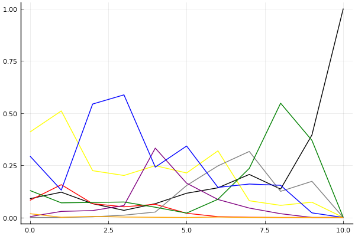
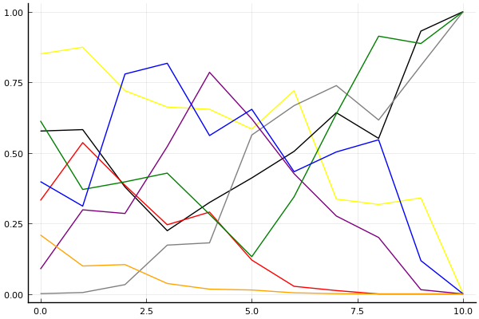
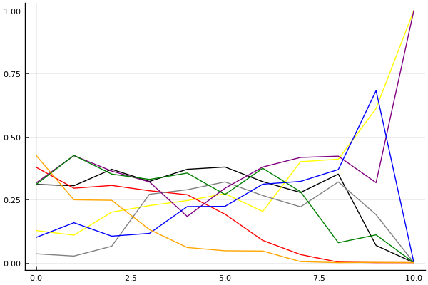

2020 시즌 1 개인전 32강 B조

## 경기 결과

| 트랙 | 박도현 | 전대웅 | 윤정현 | 최민석 | 양민규 | 황인호 | 정유민 | 임재원 |
|:---|---:|---:|---:|---:|---:|---:|---:|---:|
| [어비스 숨겨진 바닷길](../hiddenoceanroad) | 5 | 4 | 7 | 1 | 10 | 0 | 3 | -1 |
| [도검 구름의 협곡](../hyupgog) | -1 | 0 | 1 | 7 | 3 | 4 | 10 | 5 |
| [어비스 스카이라인](../skyline) | 3 | 0 | 1 | 10 | 7 | 4 | 5 | -1 |
| [쥐라기 공룡섬 대모험](../dinoisland) | 5 | 7 | 4 | 3 | 10 | 1 | 0 | -1 |
| [공동묘지 마왕의 초대](../mawang) | 3 | 7 | 0 | 10 | -1 | 1 | 5 | 4 |
| [WKC 싱가폴 마리나 서킷](../singapore) | 7 | 5 | -1 | 4 | 0 | 10 | 1 | 3 |
| [아이스 아찔한 헬기점프](../heli) | 0 | 7 | 3 | 4 | 1 | 10 | 5 | -1 |
| [해적 숨겨진 보물](../haesumbo) | 7 | 4 | -1 | 0 | 3 | 10 | 5 | 1 |
| [포레스트 지그재그](../zigzag) | 7 | 10 | 1 | 5 | -1 | 3 | 0 | 4 |
| [동화 이상한 나라의 문](../gate) | 10 | 7 | -1 | 3 | 4 | 5 | 1 | 0 |
| __total__ |__46__ |__51__ |__14__ |__47__ |__36__ |__48__ |__35__ |__13__ |

## 시뮬레이션

### 1st 확률

x축: 트랙, y축: 확률
1번: 옐로우, 2번: 블랙, 3번: 레드, 4번: 화이트(회색), 5번: 퍼플, 6번: 그린, 7번: 블루, 8번: 오렌지

| 트랙 | 박도현 | 전대웅 | 윤정현 | 최민석 | 양민규 | 황인호 | 정유민 | 임재원 |
|:---|---:|---:|---:|---:|---:|---:|---:|---:|
| 초기 | 0.423 | 0.097 | 0.062 | 0.000 | 0.005 | 0.127 | 0.289 | 0.017 |
| 어비스 숨겨진 바닷길 | 0.537 | 0.129 | 0.129 | 0.000 | 0.033 | 0.073 | 0.123 | 0.004 |
| 도검 구름의 협곡 | 0.252 | 0.059 | 0.072 | 0.000 | 0.029 | 0.054 | 0.541 | 0.013 |
| 어비스 스카이라인 | 0.177 | 0.029 | 0.049 | 0.014 | 0.074 | 0.070 | 0.604 | 0.004 |
| 쥐라기 공룡섬 대모험 | 0.267 | 0.064 | 0.060 | 0.021 | 0.320 | 0.046 | 0.244 | 0.000 |
| 공동묘지 마왕의 초대 | 0.205 | 0.144 | 0.017 | 0.154 | 0.155 | 0.039 | 0.321 | 0.001 |
| WKC 싱가폴 마리나 서킷 | 0.305 | 0.140 | 0.001 | 0.254 | 0.096 | 0.083 | 0.161 | 0.001 |
| 아이스 아찔한 헬기점프 | 0.068 | 0.232 | 0.001 | 0.307 | 0.034 | 0.233 | 0.170 | 0.000 |
| 해적 숨겨진 보물 | 0.063 | 0.138 | 0.000 | 0.127 | 0.022 | 0.551 | 0.141 | 0.000 |
| 포레스트 지그재그 | 0.073 | 0.389 | 0.000 | 0.158 | 0.001 | 0.381 | 0.020 | 0.000 |
| 동화 이상한 나라의 문 | 0.000 | 1.000 | 0.000 | 0.000 | 0.000 | 0.000 | 0.000 | 0.000 |

### Advance 확률

x축: 트랙, y축: 확률
1번: 옐로우, 2번: 블랙, 3번: 레드, 4번: 화이트(회색), 5번: 퍼플, 6번: 그린, 7번: 블루, 8번: 오렌지

| 트랙 | 박도현 | 전대웅 | 윤정현 | 최민석 | 양민규 | 황인호 | 정유민 | 임재원 |
|:---|---:|---:|---:|---:|---:|---:|---:|---:|
| 초기 | 0.879 | 0.562 | 0.330 | 0.002 | 0.105 | 0.583 | 0.405 | 0.211 |
| 어비스 숨겨진 바닷길 | 0.893 | 0.571 | 0.501 | 0.003 | 0.302 | 0.421 | 0.285 | 0.104 |
| 도검 구름의 협곡 | 0.724 | 0.395 | 0.368 | 0.020 | 0.294 | 0.394 | 0.787 | 0.119 |
| 어비스 스카이라인 | 0.640 | 0.208 | 0.266 | 0.177 | 0.522 | 0.402 | 0.845 | 0.031 |
| 쥐라기 공룡섬 대모험 | 0.677 | 0.327 | 0.278 | 0.170 | 0.783 | 0.275 | 0.567 | 0.011 |
| 공동묘지 마왕의 초대 | 0.595 | 0.466 | 0.102 | 0.533 | 0.601 | 0.156 | 0.648 | 0.013 |
| WKC 싱가폴 마리나 서킷 | 0.692 | 0.484 | 0.020 | 0.686 | 0.433 | 0.355 | 0.471 | 0.004 |
| 아이스 아찔한 헬기점프 | 0.338 | 0.617 | 0.007 | 0.759 | 0.294 | 0.657 | 0.480 | 0.001 |
| 해적 숨겨진 보물 | 0.347 | 0.548 | 0.000 | 0.612 | 0.185 | 0.906 | 0.539 | 0.000 |
| 포레스트 지그재그 | 0.328 | 0.921 | 0.000 | 0.831 | 0.016 | 0.890 | 0.129 | 0.000 |
| 동화 이상한 나라의 문 | 0.000 | 1.000 | 0.000 | 1.000 | 0.000 | 1.000 | 0.000 | 0.000 |

### Repechage 확률

x축: 트랙, y축: 확률
1번: 옐로우, 2번: 블랙, 3번: 레드, 4번: 화이트(회색), 5번: 퍼플, 6번: 그린, 7번: 블루, 8번: 오렌지

| 트랙 | 박도현 | 전대웅 | 윤정현 | 최민석 | 양민규 | 황인호 | 정유민 | 임재원 |
|:---|---:|---:|---:|---:|---:|---:|---:|---:|
| 초기 | 0.104 | 0.344 | 0.344 | 0.041 | 0.311 | 0.321 | 0.094 | 0.423 |
| 어비스 숨겨진 바닷길 | 0.098 | 0.300 | 0.301 | 0.025 | 0.427 | 0.401 | 0.181 | 0.254 |
| 도검 구름의 협곡 | 0.198 | 0.320 | 0.308 | 0.079 | 0.367 | 0.376 | 0.115 | 0.237 |
| 어비스 스카이라인 | 0.262 | 0.314 | 0.272 | 0.313 | 0.321 | 0.333 | 0.097 | 0.117 |
| 쥐라기 공룡섬 대모험 | 0.236 | 0.344 | 0.306 | 0.316 | 0.188 | 0.345 | 0.228 | 0.056 |
| 공동묘지 마왕의 초대 | 0.266 | 0.324 | 0.228 | 0.354 | 0.296 | 0.249 | 0.222 | 0.053 |
| WKC 싱가폴 마리나 서킷 | 0.227 | 0.345 | 0.071 | 0.236 | 0.373 | 0.363 | 0.290 | 0.046 |
| 아이스 아찔한 헬기점프 | 0.371 | 0.312 | 0.038 | 0.211 | 0.390 | 0.271 | 0.340 | 0.002 |
| 해적 숨겨진 보물 | 0.411 | 0.361 | 0.003 | 0.336 | 0.423 | 0.084 | 0.346 | 0.002 |
| 포레스트 지그재그 | 0.642 | 0.078 | 0.000 | 0.168 | 0.308 | 0.108 | 0.654 | 0.000 |
| 동화 이상한 나라의 문 | 1.000 | 0.000 | 0.000 | 0.000 | 1.000 | 0.000 | 0.000 | 0.000 |

## 랭킹 변동

### [전체 랭킹](../singles-full)

| 순위 | 변동 | 이름 | 점수 | 변동 | mu | 변동 | sigma | 변동 |
|---:|---:|:---:|---:|---:|---:|---:|---:|---:|
| 5 / 84 | +0 | [박도현](../bakdohyeon) | 3224 | -26 | 3484 | -41 | 87 | -5 |
| 10 / 84 | +0 | [황인호](../hwanginho) | 3112 | +10 | 3341 | +10 | 76 | -0 |
| 11 / 84 | +0 | [전대웅](../jeondaewoong) | 3102 | +27 | 3332 | +26 | 77 | -0 |
| 30 / 84 | -6 | [임재원](../imjaewon) | 2806 | -57 | 3041 | -59 | 78 | -1 |
| 31 / 84 | +2 | [양민규](../yangmingyu) | 2736 | +68 | 3020 | +42 | 95 | -9 |
| 35 / 84 | NaN | [정유민](../jeongyumin) | 2634 | +2634 | 3174 | +174 | 180 | -820 |
| 38 / 84 | +39 | [최민석](../choiminseok) | 2603 | +758 | 3024 | +539 | 140 | -73 |
| 45 / 84 | -2 | [윤정현](../yunjeonghyeon) | 2517 | +5 | 2943 | -208 | 142 | -71 |

### 시즌 랭킹

| 순위 | 변동 | 이름 | 점수 | 변동 | mu | 변동 | sigma | 변동 |
|---:|---:|:---:|---:|---:|---:|---:|---:|---:|
| 2 / 16 | NaN | [전대웅](../jeondaewoong) | 2735 | +2735 | 3314 | +314 | 193 | -807 |
| 3 / 16 | NaN | [황인호](../hwanginho) | 2662 | +2662 | 3244 | +244 | 194 | -806 |
| 4 / 16 | NaN | [박도현](../bakdohyeon) | 2622 | +2622 | 3202 | +202 | 193 | -807 |
| 5 / 16 | NaN | [최민석](../choiminseok) | 2575 | +2575 | 3156 | +156 | 193 | -807 |
| 9 / 16 | NaN | [정유민](../jeongyumin) | 2413 | +2413 | 2986 | -14 | 191 | -809 |
| 11 / 16 | NaN | [양민규](../yangmingyu) | 2289 | +2289 | 2884 | -116 | 198 | -802 |
| 13 / 16 | NaN | [윤정현](../yunjeonghyeon) | 1967 | +1967 | 2555 | -445 | 196 | -804 |
| 14 / 16 | NaN | [임재원](../imjaewon) | 1964 | +1964 | 2568 | -432 | 202 | -798 |

### 트랙 별 랭킹

#### [WKC 싱가폴 마리나 서킷](../singapore)

| 순위 | 변동 | 이름 | 점수 | 변동 | mu | 변동 | sigma | 변동 |
|:---:|:---:|:---:|---:|---:|---:|---:|---:|---:|
| 1 / 16 | NaN | [황인호](../hwanginho) | 2161 | +2161 | 4274 | +1274 | 704 | -296 |
| 3 / 16 | NaN | [박도현](../bakdohyeon) | 1887 | +1887 | 3763 | +763 | 625 | -375 |
| 5 / 16 | NaN | [전대웅](../jeondaewoong) | 1622 | +1622 | 3423 | +423 | 600 | -400 |
| 8 / 16 | NaN | [최민석](../choiminseok) | 1363 | +1363 | 3137 | +137 | 591 | -409 |
| 9 / 16 | NaN | [임재원](../imjaewon) | 1090 | +1090 | 2863 | -137 | 591 | -409 |
| 11 / 16 | NaN | [정유민](../jeongyumin) | 776 | +776 | 2577 | -423 | 600 | -400 |
| 14 / 16 | NaN | [양민규](../yangmingyu) | 361 | +361 | 2237 | -763 | 625 | -375 |
| 16 / 16 | NaN | [윤정현](../yunjeonghyeon) | -388 | -388 | 1726 | -1274 | 704 | -296 |

#### [공동묘지 마왕의 초대](../mawang)

| 순위 | 변동 | 이름 | 점수 | 변동 | mu | 변동 | sigma | 변동 |
|:---:|:---:|:---:|---:|---:|---:|---:|---:|---:|
| 1 / 43 | +0 | [전대웅](../jeondaewoong) | 2992 | +273 | 4223 | +64 | 411 | -70 |
| 4 / 43 | NaN | [최민석](../choiminseok) | 2496 | +2496 | 4485 | +1485 | 663 | -337 |
| 7 / 43 | +5 | [임재원](../imjaewon) | 2180 | +293 | 3597 | -166 | 472 | -153 |
| 13 / 43 | NaN | [정유민](../jeongyumin) | 1956 | +1956 | 3675 | +675 | 573 | -427 |
| 24 / 43 | NaN | [박도현](../bakdohyeon) | 1316 | +1316 | 3064 | +64 | 583 | -417 |
| 30 / 43 | NaN | [황인호](../hwanginho) | 938 | +938 | 2737 | -263 | 600 | -400 |
| 34 / 43 | NaN | [윤정현](../yunjeonghyeon) | 475 | +475 | 2365 | -635 | 630 | -370 |
| 39 / 43 | NaN | [양민규](../yangmingyu) | -320 | -320 | 1823 | -1177 | 714 | -286 |

#### [도검 구름의 협곡](../hyupgog)

| 순위 | 변동 | 이름 | 점수 | 변동 | mu | 변동 | sigma | 변동 |
|:---:|:---:|:---:|---:|---:|---:|---:|---:|---:|
| 13 / 47 | +2 | [양민규](../yangmingyu) | 2281 | +23 | 3094 | -82 | 271 | -35 |
| 15 / 47 | +5 | [임재원](../imjaewon) | 2223 | +176 | 3032 | +81 | 269 | -32 |
| 18 / 47 | -6 | [박도현](../bakdohyeon) | 2129 | -190 | 2956 | -273 | 276 | -28 |
| 20 / 47 | NaN | [정유민](../jeongyumin) | 1978 | +1978 | 4020 | +1020 | 681 | -319 |
| 21 / 47 | -2 | [전대웅](../jeondaewoong) | 1978 | -83 | 2950 | -266 | 324 | -61 |
| 23 / 47 | +1 | [황인호](../hwanginho) | 1923 | +140 | 2551 | +97 | 209 | -15 |
| 26 / 47 | +12 | [최민석](../choiminseok) | 1772 | +1063 | 3047 | +639 | 425 | -141 |
| 31 / 47 | +3 | [윤정현](../yunjeonghyeon) | 1493 | +468 | 2739 | -66 | 415 | -178 |

#### [동화 이상한 나라의 문](../gate)

| 순위 | 변동 | 이름 | 점수 | 변동 | mu | 변동 | sigma | 변동 |
|:---:|:---:|:---:|---:|---:|---:|---:|---:|---:|
| 1 / 8 | NaN | [박도현](../bakdohyeon) | 2161 | +2161 | 4274 | +1274 | 704 | -296 |
| 2 / 8 | NaN | [전대웅](../jeondaewoong) | 1887 | +1887 | 3763 | +763 | 625 | -375 |
| 3 / 8 | NaN | [황인호](../hwanginho) | 1622 | +1622 | 3423 | +423 | 600 | -400 |
| 4 / 8 | NaN | [양민규](../yangmingyu) | 1363 | +1363 | 3137 | +137 | 591 | -409 |
| 5 / 8 | NaN | [최민석](../choiminseok) | 1090 | +1090 | 2863 | -137 | 591 | -409 |
| 6 / 8 | NaN | [정유민](../jeongyumin) | 776 | +776 | 2577 | -423 | 600 | -400 |
| 7 / 8 | NaN | [임재원](../imjaewon) | 361 | +361 | 2237 | -763 | 625 | -375 |
| 8 / 8 | NaN | [윤정현](../yunjeonghyeon) | -388 | -388 | 1726 | -1274 | 704 | -296 |

#### [아이스 아찔한 헬기점프](../heli)

| 순위 | 변동 | 이름 | 점수 | 변동 | mu | 변동 | sigma | 변동 |
|:---:|:---:|:---:|---:|---:|---:|---:|---:|---:|
| 1 / 16 | NaN | [황인호](../hwanginho) | 2161 | +2161 | 4274 | +1274 | 704 | -296 |
| 3 / 16 | NaN | [전대웅](../jeondaewoong) | 1887 | +1887 | 3763 | +763 | 625 | -375 |
| 6 / 16 | NaN | [정유민](../jeongyumin) | 1622 | +1622 | 3423 | +423 | 600 | -400 |
| 8 / 16 | NaN | [최민석](../choiminseok) | 1363 | +1363 | 3137 | +137 | 591 | -409 |
| 10 / 16 | NaN | [윤정현](../yunjeonghyeon) | 1090 | +1090 | 2863 | -137 | 591 | -409 |
| 12 / 16 | NaN | [양민규](../yangmingyu) | 776 | +776 | 2577 | -423 | 600 | -400 |
| 13 / 16 | NaN | [박도현](../bakdohyeon) | 361 | +361 | 2237 | -763 | 625 | -375 |
| 15 / 16 | NaN | [임재원](../imjaewon) | -388 | -388 | 1726 | -1274 | 704 | -296 |

#### [어비스 숨겨진 바닷길](../hiddenoceanroad)

| 순위 | 변동 | 이름 | 점수 | 변동 | mu | 변동 | sigma | 변동 |
|:---:|:---:|:---:|---:|---:|---:|---:|---:|---:|
| 2 / 16 | NaN | [양민규](../yangmingyu) | 2161 | +2161 | 4274 | +1274 | 704 | -296 |
| 4 / 16 | NaN | [윤정현](../yunjeonghyeon) | 1887 | +1887 | 3763 | +763 | 625 | -375 |
| 5 / 16 | NaN | [박도현](../bakdohyeon) | 1622 | +1622 | 3423 | +423 | 600 | -400 |
| 7 / 16 | NaN | [전대웅](../jeondaewoong) | 1363 | +1363 | 3137 | +137 | 591 | -409 |
| 10 / 16 | NaN | [정유민](../jeongyumin) | 1090 | +1090 | 2863 | -137 | 591 | -409 |
| 12 / 16 | NaN | [최민석](../choiminseok) | 776 | +776 | 2577 | -423 | 600 | -400 |
| 14 / 16 | NaN | [황인호](../hwanginho) | 361 | +361 | 2237 | -763 | 625 | -375 |
| 16 / 16 | NaN | [임재원](../imjaewon) | -388 | -388 | 1726 | -1274 | 704 | -296 |

#### [어비스 스카이라인](../skyline)

| 순위 | 변동 | 이름 | 점수 | 변동 | mu | 변동 | sigma | 변동 |
|:---:|:---:|:---:|---:|---:|---:|---:|---:|---:|
| 2 / 16 | NaN | [최민석](../choiminseok) | 2161 | +2161 | 4274 | +1274 | 704 | -296 |
| 4 / 16 | NaN | [양민규](../yangmingyu) | 1887 | +1887 | 3763 | +763 | 625 | -375 |
| 5 / 16 | NaN | [정유민](../jeongyumin) | 1622 | +1622 | 3423 | +423 | 600 | -400 |
| 7 / 16 | NaN | [황인호](../hwanginho) | 1363 | +1363 | 3137 | +137 | 591 | -409 |
| 9 / 16 | NaN | [박도현](../bakdohyeon) | 1090 | +1090 | 2863 | -137 | 591 | -409 |
| 12 / 16 | NaN | [윤정현](../yunjeonghyeon) | 776 | +776 | 2577 | -423 | 600 | -400 |
| 13 / 16 | NaN | [전대웅](../jeondaewoong) | 361 | +361 | 2237 | -763 | 625 | -375 |
| 15 / 16 | NaN | [임재원](../imjaewon) | -388 | -388 | 1726 | -1274 | 704 | -296 |

#### [쥐라기 공룡섬 대모험](../dinoisland)

| 순위 | 변동 | 이름 | 점수 | 변동 | mu | 변동 | sigma | 변동 |
|:---:|:---:|:---:|---:|---:|---:|---:|---:|---:|
| 2 / 16 | NaN | [양민규](../yangmingyu) | 2161 | +2161 | 4274 | +1274 | 704 | -296 |
| 3 / 16 | NaN | [전대웅](../jeondaewoong) | 1887 | +1887 | 3763 | +763 | 625 | -375 |
| 5 / 16 | NaN | [박도현](../bakdohyeon) | 1622 | +1622 | 3423 | +423 | 600 | -400 |
| 8 / 16 | NaN | [윤정현](../yunjeonghyeon) | 1363 | +1363 | 3137 | +137 | 591 | -409 |
| 10 / 16 | NaN | [최민석](../choiminseok) | 1090 | +1090 | 2863 | -137 | 591 | -409 |
| 12 / 16 | NaN | [황인호](../hwanginho) | 776 | +776 | 2577 | -423 | 600 | -400 |
| 13 / 16 | NaN | [정유민](../jeongyumin) | 361 | +361 | 2237 | -763 | 625 | -375 |
| 15 / 16 | NaN | [임재원](../imjaewon) | -388 | -388 | 1726 | -1274 | 704 | -296 |

#### [포레스트 지그재그](../zigzag)

| 순위 | 변동 | 이름 | 점수 | 변동 | mu | 변동 | sigma | 변동 |
|:---:|:---:|:---:|---:|---:|---:|---:|---:|---:|
| 4 / 51 | +0 | [전대웅](../jeondaewoong) | 3252 | +117 | 3901 | +93 | 216 | -8 |
| 11 / 51 | -3 | [황인호](../hwanginho) | 2846 | -70 | 3569 | -125 | 241 | -18 |
| 16 / 51 | +2 | [임재원](../imjaewon) | 2361 | +135 | 3137 | +63 | 259 | -24 |
| 20 / 51 | NaN | [박도현](../bakdohyeon) | 2114 | +2114 | 3753 | +753 | 546 | -454 |
| 23 / 51 | NaN | [최민석](../choiminseok) | 1895 | +1895 | 3492 | +492 | 532 | -468 |
| 38 / 51 | NaN | [윤정현](../yunjeonghyeon) | 1069 | +1069 | 2759 | -241 | 563 | -437 |
| 44 / 51 | NaN | [정유민](../jeongyumin) | 558 | +558 | 2386 | -614 | 609 | -391 |
| 47 / 51 | NaN | [양민규](../yangmingyu) | -273 | -273 | 1841 | -1159 | 705 | -295 |

#### [해적 숨겨진 보물](../haesumbo)

| 순위 | 변동 | 이름 | 점수 | 변동 | mu | 변동 | sigma | 변동 |
|:---:|:---:|:---:|---:|---:|---:|---:|---:|---:|
| 2 / 38 | +0 | [전대웅](../jeondaewoong) | 2799 | -51 | 4023 | -316 | 408 | -88 |
| 4 / 38 | NaN | [황인호](../hwanginho) | 2494 | +2494 | 4507 | +1507 | 671 | -329 |
| 5 / 38 | NaN | [박도현](../bakdohyeon) | 2276 | +2276 | 4059 | +1059 | 594 | -406 |
| 10 / 38 | NaN | [정유민](../jeongyumin) | 2074 | +2074 | 3780 | +780 | 569 | -431 |
| 14 / 38 | -3 | [임재원](../imjaewon) | 1740 | +118 | 3138 | -285 | 466 | -134 |
| 17 / 38 | NaN | [양민규](../yangmingyu) | 1546 | +1546 | 3246 | +246 | 567 | -433 |
| 29 / 38 | NaN | [최민석](../choiminseok) | 661 | +661 | 2533 | -467 | 624 | -376 |
| 34 / 38 | NaN | [윤정현](../yunjeonghyeon) | -218 | -218 | 1947 | -1053 | 722 | -278 |
