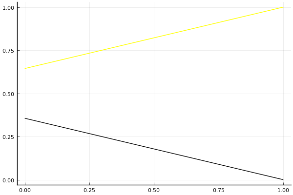

2020 시즌 1 개인전 32강 C조 tiebreaker

## 경기 결과

| 트랙 | 정승하 | 박현수 |
|:---|---:|---:|
| [어비스 숨겨진 바닷길](../hiddenoceanroad) | 1 | 0 |
| __total__ |__1__ |__0__ |

## 시뮬레이션

### 1st 확률

x축: 트랙, y축: 확률
1번: 옐로우, 2번: 블랙, 3번: 레드, 4번: 화이트(회색), 5번: 퍼플, 6번: 그린, 7번: 블루, 8번: 오렌지

| 트랙 | 정승하 | 박현수 |
|:---|---:|---:|
| 초기 | 0.618 | 0.382 |
| 어비스 숨겨진 바닷길 | 1.000 | 0.000 |

## 랭킹 변동

### [전체 랭킹](../singles-full)

| 순위 | 변동 | 이름 | 점수 | 변동 | mu | 변동 | sigma | 변동 |
|---:|---:|:---:|---:|---:|---:|---:|---:|---:|
| 8 / 84 | +0 | [정승하](../jeongseungha) | 3125 | +4 | 3360 | +5 | 78 | +0 |
| 23 / 84 | +0 | [박현수](../bakhyeonsu) | 2902 | -7 | 3142 | -6 | 80 | +0 |

### 시즌 랭킹

| 순위 | 변동 | 이름 | 점수 | 변동 | mu | 변동 | sigma | 변동 |
|---:|---:|:---:|---:|---:|---:|---:|---:|---:|
| 11 / 24 | +3 | [정승하](../jeongseungha) | 2396 | +54 | 2990 | +41 | 198 | -4 |
| 17 / 24 | -1 | [박현수](../bakhyeonsu) | 2277 | -28 | 2871 | -41 | 198 | -4 |

### 트랙 별 랭킹

#### [어비스 숨겨진 바닷길](../hiddenoceanroad)

| 순위 | 변동 | 이름 | 점수 | 변동 | mu | 변동 | sigma | 변동 |
|:---:|:---:|:---:|---:|---:|---:|---:|---:|---:|
| 4 / 24 | +0 | [정승하](../jeongseungha) | 2026 | +139 | 3824 | +61 | 599 | -26 |
| 19 / 24 | +2 | [박현수](../bakhyeonsu) | 378 | +17 | 2176 | -61 | 599 | -26 |
