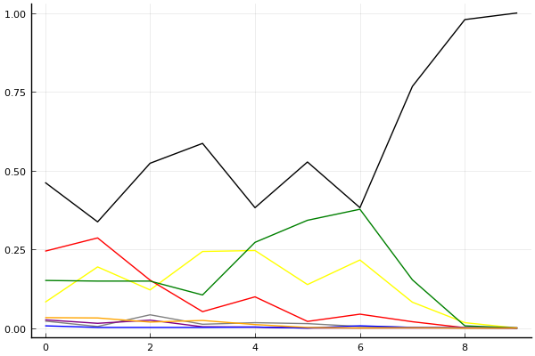
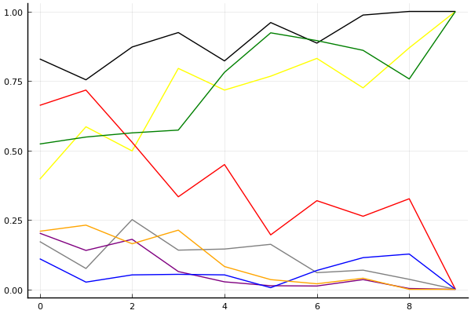
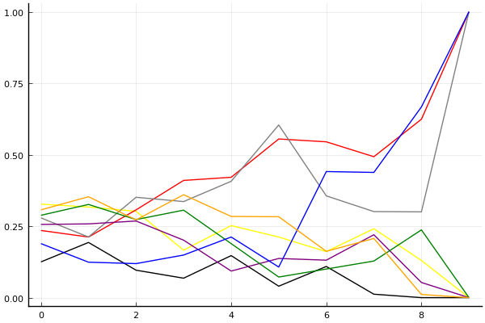

2020 시즌 1 개인전 32강 C조

## 경기 결과

| 트랙 | 배성빈 | 박인수 | 정승하 | 박현수 | 최윤서 | 김승태 | 이준용 | 김승래 |
|:---|---:|---:|---:|---:|---:|---:|---:|---:|
| [어비스 숨겨진 바닷길](../hiddenoceanroad) | 10 | 3 | 7 | 0 | 1 | 5 | -1 | 4 |
| [WKC 싱가폴 마리나 서킷](../singapore) | 0 | 7 | -1 | 10 | 5 | 3 | 4 | 1 |
| [동화 이상한 나라의 문](../gate) | 10 | 7 | 1 | 0 | -1 | 4 | 3 | 5 |
| [도검 구름의 협곡](../hyupgog) | 3 | 1 | 7 | 4 | -1 | 10 | 5 | 0 |
| [포레스트 지그재그](../zigzag) | 3 | 10 | 0 | 5 | 4 | 7 | -1 | 1 |
| [어비스 스카이라인](../skyline) | 5 | 0 | 7 | -1 | 4 | 3 | 10 | 1 |
| [쥐라기 공룡섬 대모험](../dinoisland) | -1 | 10 | 1 | 3 | 7 | 0 | 4 | 5 |
| [해적 숨겨진 보물](../haesumbo) | 5 | 10 | 7 | 3 | 0 | 1 | 4 | -1 |
| [공동묘지 마왕의 초대](../mawang) | 1 | 10 | 0 | 5 | 4 | -1 | 3 | 7 |
| __total__ |__36__ |__58__ |__29__ |__29__ |__23__ |__32__ |__31__ |__23__ |

## 시뮬레이션

### 1st 확률

x축: 트랙, y축: 확률
1번: 옐로우, 2번: 블랙, 3번: 레드, 4번: 화이트(회색), 5번: 퍼플, 6번: 그린, 7번: 블루, 8번: 오렌지

| 트랙 | 배성빈 | 박인수 | 정승하 | 박현수 | 최윤서 | 김승태 | 이준용 | 김승래 |
|:---|---:|---:|---:|---:|---:|---:|---:|---:|
| 초기 | 0.086 | 0.497 | 0.223 | 0.017 | 0.030 | 0.139 | 0.004 | 0.031 |
| 어비스 숨겨진 바닷길 | 0.175 | 0.361 | 0.288 | 0.010 | 0.014 | 0.150 | 0.001 | 0.034 |
| WKC 싱가폴 마리나 서킷 | 0.110 | 0.543 | 0.148 | 0.035 | 0.018 | 0.133 | 0.006 | 0.031 |
| 동화 이상한 나라의 문 | 0.273 | 0.551 | 0.064 | 0.012 | 0.005 | 0.094 | 0.001 | 0.021 |
| 도검 구름의 협곡 | 0.230 | 0.399 | 0.090 | 0.016 | 0.001 | 0.291 | 0.002 | 0.006 |
| 포레스트 지그재그 | 0.134 | 0.508 | 0.013 | 0.014 | 0.000 | 0.356 | 0.000 | 0.001 |
| 어비스 스카이라인 | 0.240 | 0.357 | 0.039 | 0.002 | 0.000 | 0.382 | 0.003 | 0.002 |
| 쥐라기 공룡섬 대모험 | 0.064 | 0.783 | 0.015 | 0.002 | 0.000 | 0.148 | 0.004 | 0.002 |
| 해적 숨겨진 보물 | 0.018 | 0.972 | 0.002 | 0.000 | 0.000 | 0.013 | 0.000 | 0.000 |
| 공동묘지 마왕의 초대 | 0.000 | 1.000 | 0.000 | 0.000 | 0.000 | 0.000 | 0.000 | 0.000 |

### Advance 확률

x축: 트랙, y축: 확률
1번: 옐로우, 2번: 블랙, 3번: 레드, 4번: 화이트(회색), 5번: 퍼플, 6번: 그린, 7번: 블루, 8번: 오렌지

| 트랙 | 배성빈 | 박인수 | 정승하 | 박현수 | 최윤서 | 김승태 | 이준용 | 김승래 |
|:---|---:|---:|---:|---:|---:|---:|---:|---:|
| 초기 | 0.358 | 0.847 | 0.621 | 0.182 | 0.214 | 0.533 | 0.079 | 0.238 |
| 어비스 숨겨진 바닷길 | 0.594 | 0.750 | 0.732 | 0.081 | 0.132 | 0.557 | 0.025 | 0.202 |
| WKC 싱가폴 마리나 서킷 | 0.493 | 0.865 | 0.542 | 0.255 | 0.179 | 0.547 | 0.039 | 0.167 |
| 동화 이상한 나라의 문 | 0.798 | 0.913 | 0.357 | 0.155 | 0.079 | 0.555 | 0.046 | 0.198 |
| 도검 구름의 협곡 | 0.744 | 0.814 | 0.435 | 0.140 | 0.021 | 0.797 | 0.041 | 0.095 |
| 포레스트 지그재그 | 0.783 | 0.950 | 0.197 | 0.175 | 0.010 | 0.911 | 0.009 | 0.035 |
| 어비스 스카이라인 | 0.830 | 0.883 | 0.297 | 0.046 | 0.013 | 0.924 | 0.047 | 0.020 |
| 쥐라기 공룡섬 대모험 | 0.696 | 0.988 | 0.257 | 0.076 | 0.050 | 0.873 | 0.117 | 0.042 |
| 해적 숨겨진 보물 | 0.880 | 1.000 | 0.355 | 0.034 | 0.001 | 0.749 | 0.126 | 0.000 |
| 공동묘지 마왕의 초대 | 1.000 | 1.000 | 0.000 | 0.000 | 0.000 | 1.000 | 0.000 | 0.000 |

### Repechage 확률

x축: 트랙, y축: 확률
1번: 옐로우, 2번: 블랙, 3번: 레드, 4번: 화이트(회색), 5번: 퍼플, 6번: 그린, 7번: 블루, 8번: 오렌지

| 트랙 | 배성빈 | 박인수 | 정승하 | 박현수 | 최윤서 | 김승태 | 이준용 | 김승래 |
|:---|---:|---:|---:|---:|---:|---:|---:|---:|
| 초기 | 0.359 | 0.111 | 0.233 | 0.274 | 0.284 | 0.295 | 0.186 | 0.284 |
| 어비스 숨겨진 바닷길 | 0.319 | 0.197 | 0.210 | 0.225 | 0.244 | 0.300 | 0.135 | 0.387 |
| WKC 싱가폴 마리나 서킷 | 0.319 | 0.104 | 0.300 | 0.313 | 0.286 | 0.295 | 0.132 | 0.272 |
| 동화 이상한 나라의 문 | 0.168 | 0.078 | 0.359 | 0.363 | 0.211 | 0.310 | 0.161 | 0.360 |
| 도검 구름의 협곡 | 0.219 | 0.163 | 0.406 | 0.415 | 0.089 | 0.180 | 0.206 | 0.307 |
| 포레스트 지그재그 | 0.204 | 0.050 | 0.560 | 0.603 | 0.117 | 0.085 | 0.110 | 0.281 |
| 어비스 스카이라인 | 0.157 | 0.114 | 0.578 | 0.394 | 0.125 | 0.073 | 0.434 | 0.178 |
| 쥐라기 공룡섬 대모험 | 0.265 | 0.012 | 0.477 | 0.325 | 0.246 | 0.114 | 0.425 | 0.164 |
| 해적 숨겨진 보물 | 0.118 | 0.000 | 0.582 | 0.289 | 0.049 | 0.248 | 0.673 | 0.007 |
| 공동묘지 마왕의 초대 | 0.000 | 0.000 | 1.000 | 1.000 | 0.000 | 0.000 | 1.000 | 0.000 |

## 랭킹 변동

### [전체 랭킹](../singles-full)

| 순위 | 변동 | 이름 | 점수 | 변동 | mu | 변동 | sigma | 변동 |
|---:|---:|:---:|---:|---:|---:|---:|---:|---:|
| 3 / 84 | +0 | [박인수](../bakinsu) | 3300 | +27 | 3531 | +27 | 77 | +0 |
| 8 / 84 | +0 | [정승하](../jeongseungha) | 3120 | -29 | 3355 | -32 | 78 | -1 |
| 11 / 84 | -2 | [김승태](../gimseungtae) | 3096 | -19 | 3326 | -20 | 77 | -0 |
| 13 / 84 | +0 | [배성빈](../baeseongbin) | 3038 | +8 | 3273 | +5 | 78 | -1 |
| 18 / 84 | -1 | [김승래](../gimseungrae) | 2945 | -5 | 3172 | -6 | 76 | -0 |
| 23 / 84 | +0 | [박현수](../bakhyeonsu) | 2908 | +14 | 3147 | +9 | 80 | -2 |
| 26 / 84 | +2 | [이준용](../ijunyong) | 2845 | +30 | 3083 | +26 | 79 | -1 |
| 27 / 84 | +0 | [최윤서](../choiyunseo) | 2836 | +17 | 3135 | -17 | 100 | -11 |

### 시즌 랭킹

| 순위 | 변동 | 이름 | 점수 | 변동 | mu | 변동 | sigma | 변동 |
|---:|---:|:---:|---:|---:|---:|---:|---:|---:|
| 2 / 24 | NaN | [박인수](../bakinsu) | 2849 | +2849 | 3495 | +495 | 215 | -785 |
| 12 / 24 | NaN | [배성빈](../baeseongbin) | 2386 | +2386 | 3000 | -0 | 205 | -795 |
| 13 / 24 | NaN | [이준용](../ijunyong) | 2351 | +2351 | 2959 | -41 | 203 | -797 |
| 14 / 24 | NaN | [정승하](../jeongseungha) | 2342 | +2342 | 2949 | -51 | 202 | -798 |
| 15 / 24 | NaN | [김승태](../gimseungtae) | 2335 | +2335 | 2942 | -58 | 203 | -797 |
| 16 / 24 | NaN | [박현수](../bakhyeonsu) | 2305 | +2305 | 2912 | -88 | 202 | -798 |
| 18 / 24 | NaN | [김승래](../gimseungrae) | 2263 | +2263 | 2865 | -135 | 201 | -799 |
| 19 / 24 | NaN | [최윤서](../choiyunseo) | 2208 | +2208 | 2821 | -179 | 204 | -796 |

### 트랙 별 랭킹

#### [WKC 싱가폴 마리나 서킷](../singapore)

| 순위 | 변동 | 이름 | 점수 | 변동 | mu | 변동 | sigma | 변동 |
|:---:|:---:|:---:|---:|---:|---:|---:|---:|---:|
| 3 / 24 | NaN | [박현수](../bakhyeonsu) | 2161 | +2161 | 4274 | +1274 | 704 | -296 |
| 6 / 24 | NaN | [박인수](../bakinsu) | 1887 | +1887 | 3763 | +763 | 625 | -375 |
| 9 / 24 | NaN | [최윤서](../choiyunseo) | 1622 | +1622 | 3423 | +423 | 600 | -400 |
| 12 / 24 | NaN | [이준용](../ijunyong) | 1363 | +1363 | 3137 | +137 | 591 | -409 |
| 13 / 24 | NaN | [김승태](../gimseungtae) | 1090 | +1090 | 2863 | -137 | 591 | -409 |
| 18 / 24 | NaN | [김승래](../gimseungrae) | 776 | +776 | 2577 | -423 | 600 | -400 |
| 20 / 24 | NaN | [배성빈](../baeseongbin) | 361 | +361 | 2237 | -763 | 625 | -375 |
| 22 / 24 | NaN | [정승하](../jeongseungha) | -388 | -388 | 1726 | -1274 | 704 | -296 |

#### [공동묘지 마왕의 초대](../mawang)

| 순위 | 변동 | 이름 | 점수 | 변동 | mu | 변동 | sigma | 변동 |
|:---:|:---:|:---:|---:|---:|---:|---:|---:|---:|
| 6 / 48 | -4 | [김승태](../gimseungtae) | 2236 | -401 | 3290 | -548 | 351 | -49 |
| 7 / 48 | +4 | [이준용](../ijunyong) | 2225 | +119 | 3338 | -117 | 371 | -79 |
| 12 / 48 | +20 | [박인수](../bakinsu) | 2142 | +1366 | 3555 | +979 | 471 | -129 |
| 13 / 48 | NaN | [김승래](../gimseungrae) | 2053 | +2053 | 3724 | +724 | 557 | -443 |
| 19 / 48 | NaN | [박현수](../bakhyeonsu) | 1879 | +1879 | 3512 | +512 | 544 | -456 |
| 20 / 48 | NaN | [최윤서](../choiyunseo) | 1717 | +1717 | 3326 | +326 | 536 | -464 |
| 28 / 48 | NaN | [배성빈](../baeseongbin) | 1347 | +1347 | 2959 | -41 | 537 | -463 |
| 31 / 48 | NaN | [정승하](../jeongseungha) | 1126 | +1126 | 2761 | -239 | 545 | -455 |

#### [도검 구름의 협곡](../hyupgog)

| 순위 | 변동 | 이름 | 점수 | 변동 | mu | 변동 | sigma | 변동 |
|:---:|:---:|:---:|---:|---:|---:|---:|---:|---:|
| 2 / 47 | +0 | [배성빈](../baeseongbin) | 2989 | -30 | 3656 | -88 | 222 | -19 |
| 3 / 47 | +0 | [박인수](../bakinsu) | 2948 | -29 | 3504 | -60 | 185 | -10 |
| 7 / 47 | +0 | [김승래](../gimseungrae) | 2739 | -32 | 3299 | -62 | 187 | -10 |
| 8 / 47 | +0 | [정승하](../jeongseungha) | 2734 | +160 | 3478 | +83 | 248 | -26 |
| 11 / 47 | +5 | [이준용](../ijunyong) | 2457 | +269 | 3365 | +105 | 303 | -55 |
| 13 / 47 | +11 | [김승태](../gimseungtae) | 2288 | +374 | 3061 | +299 | 258 | -25 |
| 16 / 47 | -5 | [최윤서](../choiyunseo) | 2227 | -173 | 3158 | -295 | 310 | -41 |
| 18 / 47 | +7 | [박현수](../bakhyeonsu) | 2183 | +311 | 3059 | +163 | 292 | -49 |

#### [동화 이상한 나라의 문](../gate)

| 순위 | 변동 | 이름 | 점수 | 변동 | mu | 변동 | sigma | 변동 |
|:---:|:---:|:---:|---:|---:|---:|---:|---:|---:|
| 2 / 16 | NaN | [배성빈](../baeseongbin) | 2161 | +2161 | 4274 | +1274 | 704 | -296 |
| 4 / 16 | NaN | [박인수](../bakinsu) | 1887 | +1887 | 3763 | +763 | 625 | -375 |
| 6 / 16 | NaN | [김승래](../gimseungrae) | 1622 | +1622 | 3423 | +423 | 600 | -400 |
| 7 / 16 | NaN | [김승태](../gimseungtae) | 1363 | +1363 | 3137 | +137 | 591 | -409 |
| 10 / 16 | NaN | [이준용](../ijunyong) | 1090 | +1090 | 2863 | -137 | 591 | -409 |
| 11 / 16 | NaN | [정승하](../jeongseungha) | 776 | +776 | 2577 | -423 | 600 | -400 |
| 14 / 16 | NaN | [박현수](../bakhyeonsu) | 361 | +361 | 2237 | -763 | 625 | -375 |
| 15 / 16 | NaN | [최윤서](../choiyunseo) | -388 | -388 | 1726 | -1274 | 704 | -296 |

#### [어비스 숨겨진 바닷길](../hiddenoceanroad)

| 순위 | 변동 | 이름 | 점수 | 변동 | mu | 변동 | sigma | 변동 |
|:---:|:---:|:---:|---:|---:|---:|---:|---:|---:|
| 2 / 24 | NaN | [배성빈](../baeseongbin) | 2161 | +2161 | 4274 | +1274 | 704 | -296 |
| 4 / 24 | NaN | [정승하](../jeongseungha) | 1887 | +1887 | 3763 | +763 | 625 | -375 |
| 7 / 24 | NaN | [김승태](../gimseungtae) | 1622 | +1622 | 3423 | +423 | 600 | -400 |
| 12 / 24 | NaN | [김승래](../gimseungrae) | 1363 | +1363 | 3137 | +137 | 591 | -409 |
| 14 / 24 | NaN | [박인수](../bakinsu) | 1090 | +1090 | 2863 | -137 | 591 | -409 |
| 16 / 24 | NaN | [최윤서](../choiyunseo) | 776 | +776 | 2577 | -423 | 600 | -400 |
| 21 / 24 | NaN | [박현수](../bakhyeonsu) | 361 | +361 | 2237 | -763 | 625 | -375 |
| 24 / 24 | NaN | [이준용](../ijunyong) | -388 | -388 | 1726 | -1274 | 704 | -296 |

#### [어비스 스카이라인](../skyline)

| 순위 | 변동 | 이름 | 점수 | 변동 | mu | 변동 | sigma | 변동 |
|:---:|:---:|:---:|---:|---:|---:|---:|---:|---:|
| 3 / 24 | NaN | [이준용](../ijunyong) | 2161 | +2161 | 4274 | +1274 | 704 | -296 |
| 5 / 24 | NaN | [정승하](../jeongseungha) | 1887 | +1887 | 3763 | +763 | 625 | -375 |
| 7 / 24 | NaN | [배성빈](../baeseongbin) | 1622 | +1622 | 3423 | +423 | 600 | -400 |
| 11 / 24 | NaN | [최윤서](../choiyunseo) | 1363 | +1363 | 3137 | +137 | 591 | -409 |
| 13 / 24 | NaN | [김승태](../gimseungtae) | 1090 | +1090 | 2863 | -137 | 591 | -409 |
| 17 / 24 | NaN | [김승래](../gimseungrae) | 776 | +776 | 2577 | -423 | 600 | -400 |
| 21 / 24 | NaN | [박인수](../bakinsu) | 361 | +361 | 2237 | -763 | 625 | -375 |
| 24 / 24 | NaN | [박현수](../bakhyeonsu) | -388 | -388 | 1726 | -1274 | 704 | -296 |

#### [쥐라기 공룡섬 대모험](../dinoisland)

| 순위 | 변동 | 이름 | 점수 | 변동 | mu | 변동 | sigma | 변동 |
|:---:|:---:|:---:|---:|---:|---:|---:|---:|---:|
| 3 / 24 | NaN | [박인수](../bakinsu) | 2161 | +2161 | 4274 | +1274 | 704 | -296 |
| 5 / 24 | NaN | [최윤서](../choiyunseo) | 1887 | +1887 | 3763 | +763 | 625 | -375 |
| 9 / 24 | NaN | [김승래](../gimseungrae) | 1622 | +1622 | 3423 | +423 | 600 | -400 |
| 11 / 24 | NaN | [이준용](../ijunyong) | 1363 | +1363 | 3137 | +137 | 591 | -409 |
| 14 / 24 | NaN | [박현수](../bakhyeonsu) | 1090 | +1090 | 2863 | -137 | 591 | -409 |
| 17 / 24 | NaN | [정승하](../jeongseungha) | 776 | +776 | 2577 | -423 | 600 | -400 |
| 19 / 24 | NaN | [김승태](../gimseungtae) | 361 | +361 | 2237 | -763 | 625 | -375 |
| 24 / 24 | NaN | [배성빈](../baeseongbin) | -388 | -388 | 1726 | -1274 | 704 | -296 |

#### [포레스트 지그재그](../zigzag)

| 순위 | 변동 | 이름 | 점수 | 변동 | mu | 변동 | sigma | 변동 |
|:---:|:---:|:---:|---:|---:|---:|---:|---:|---:|
| 6 / 52 | +3 | [김승태](../gimseungtae) | 2985 | +88 | 3790 | -2 | 268 | -30 |
| 10 / 52 | +2 | [박인수](../bakinsu) | 2785 | +148 | 3379 | +121 | 198 | -9 |
| 11 / 52 | -3 | [정승하](../jeongseungha) | 2775 | -124 | 3505 | -196 | 243 | -24 |
| 12 / 52 | -6 | [이준용](../ijunyong) | 2736 | -200 | 3483 | -266 | 249 | -22 |
| 20 / 52 | +5 | [박현수](../bakhyeonsu) | 2145 | +342 | 3014 | +214 | 290 | -43 |
| 21 / 52 | +0 | [김승래](../gimseungrae) | 2144 | +94 | 2830 | +34 | 229 | -20 |
| 26 / 52 | +6 | [배성빈](../baeseongbin) | 1824 | +505 | 2917 | +186 | 364 | -106 |
| 28 / 52 | NaN | [최윤서](../choiyunseo) | 1753 | +1753 | 3246 | +246 | 498 | -502 |

#### [해적 숨겨진 보물](../haesumbo)

| 순위 | 변동 | 이름 | 점수 | 변동 | mu | 변동 | sigma | 변동 |
|:---:|:---:|:---:|---:|---:|---:|---:|---:|---:|
| 2 / 43 | +7 | [박인수](../bakinsu) | 2897 | +736 | 4672 | +398 | 592 | -113 |
| 9 / 43 | -2 | [김승태](../gimseungtae) | 2148 | -115 | 3123 | -241 | 325 | -42 |
| 11 / 43 | NaN | [정승하](../jeongseungha) | 2008 | +2008 | 3848 | +848 | 613 | -387 |
| 16 / 43 | NaN | [배성빈](../baeseongbin) | 1735 | +1735 | 3457 | +457 | 574 | -426 |
| 19 / 43 | +6 | [이준용](../ijunyong) | 1598 | +646 | 2792 | +369 | 398 | -92 |
| 25 / 43 | NaN | [박현수](../bakhyeonsu) | 1315 | +1315 | 2942 | -58 | 542 | -458 |
| 33 / 43 | NaN | [최윤서](../choiyunseo) | 586 | +586 | 2373 | -627 | 596 | -404 |
| 39 / 43 | NaN | [김승래](../gimseungrae) | -258 | -258 | 1833 | -1167 | 697 | -303 |
