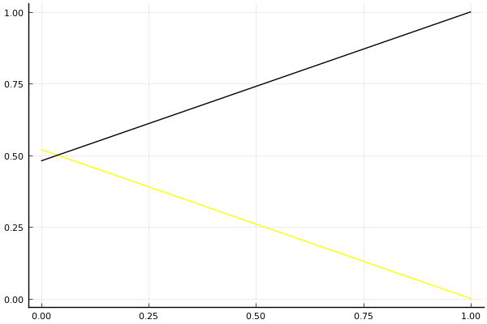

2020 시즌 1 개인전 32강 D조 tiebreaker

## 경기 결과

| 트랙 | 김주영 | 우성민 |
|:---|---:|---:|
| [어비스 숨겨진 바닷길](../hiddenoceanroad) | 0 | 1 |
| __total__ |__0__ |__1__ |

## 시뮬레이션

### 1st 확률

x축: 트랙, y축: 확률
1번: 옐로우, 2번: 블랙, 3번: 레드, 4번: 화이트(회색), 5번: 퍼플, 6번: 그린, 7번: 블루, 8번: 오렌지

| 트랙 | 김주영 | 우성민 |
|:---|---:|---:|
| 초기 | 0.520 | 0.480 |
| 어비스 숨겨진 바닷길 | 0.000 | 1.000 |

## 랭킹 변동

### [전체 랭킹](../singles-full)

| 순위 | 변동 | 이름 | 점수 | 변동 | mu | 변동 | sigma | 변동 |
|---:|---:|:---:|---:|---:|---:|---:|---:|---:|
| 34 / 85 | +4 | [우성민](../useongmin) | 2650 | +29 | 3091 | +25 | 147 | -2 |
| 51 / 85 | -4 | [김주영](../gimjuyeong) | 2438 | -35 | 3067 | -52 | 210 | -6 |

### 시즌 랭킹

| 순위 | 변동 | 이름 | 점수 | 변동 | mu | 변동 | sigma | 변동 |
|---:|---:|:---:|---:|---:|---:|---:|---:|---:|
| 19 / 32 | +3 | [우성민](../useongmin) | 2284 | +70 | 2953 | +52 | 223 | -6 |
| 26 / 32 | -1 | [김주영](../gimjuyeong) | 2134 | -34 | 2813 | -54 | 226 | -6 |

### 트랙 별 랭킹

#### [어비스 숨겨진 바닷길](../hiddenoceanroad)

| 순위 | 변동 | 이름 | 점수 | 변동 | mu | 변동 | sigma | 변동 |
|:---:|:---:|:---:|---:|---:|---:|---:|---:|---:|
| 20 / 32 | +8 | [우성민](../useongmin) | 1011 | +650 | 2654 | +417 | 547 | -78 |
| 21 / 32 | -1 | [김주영](../gimjuyeong) | 913 | -177 | 2491 | -373 | 526 | -65 |
