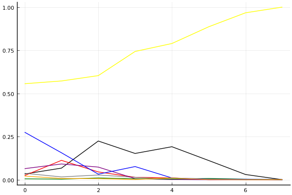
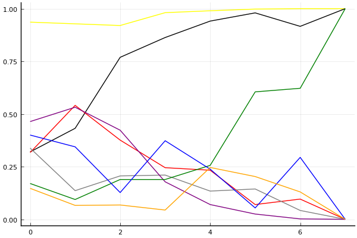
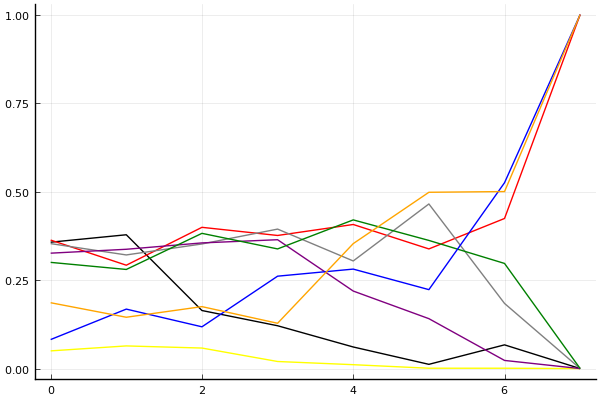

2020 시즌 1 개인전 32강 D조

## 경기 결과

| 트랙 | 문호준 | 김기수 | 최영훈 | 송용준 | 이재인 | 한승철 | 김주영 | 우성민 |
|:---|---:|---:|---:|---:|---:|---:|---:|---:|
| [어비스 숨겨진 바닷길](../hiddenoceanroad) | 4 | 7 | 10 | -1 | 5 | 1 | 3 | 0 |
| [도검 구름의 협곡](../hyupgog) | 4 | 10 | -1 | 5 | 1 | 7 | 0 | 3 |
| [WKC 싱가폴 마리나 서킷](../singapore) | 10 | 5 | 0 | 4 | -1 | 3 | 7 | 1 |
| [공동묘지 마왕의 초대](../mawang) | 7 | 5 | 3 | 0 | -1 | 4 | 1 | 10 |
| [포레스트 지그재그](../zigzag) | 10 | 4 | -1 | 5 | 1 | 7 | 0 | 3 |
| [동화 이상한 나라의 문](../gate) | 5 | -1 | 7 | 1 | 0 | 4 | 10 | 3 |
| [쥐라기 공룡섬 대모험](../dinoisland) | 10 | 4 | 5 | 3 | 7 | -1 | 0 | 1 |
| __total__ |__50__ |__34__ |__23__ |__17__ |__12__ |__25__ |__21__ |__21__ |

## 시뮬레이션

### 1st 확률

x축: 트랙, y축: 확률
1번: 옐로우, 2번: 블랙, 3번: 레드, 4번: 화이트(회색), 5번: 퍼플, 6번: 그린, 7번: 블루, 8번: 오렌지

| 트랙 | 문호준 | 김기수 | 최영훈 | 송용준 | 이재인 | 한승철 | 김주영 | 우성민 |
|:---|---:|---:|---:|---:|---:|---:|---:|---:|
| 초기 | 0.539 | 0.042 | 0.030 | 0.033 | 0.067 | 0.015 | 0.277 | 0.015 |
| 어비스 숨겨진 바닷길 | 0.588 | 0.064 | 0.113 | 0.007 | 0.079 | 0.007 | 0.149 | 0.010 |
| 도검 구름의 협곡 | 0.583 | 0.229 | 0.043 | 0.030 | 0.082 | 0.014 | 0.034 | 0.005 |
| WKC 싱가폴 마리나 서킷 | 0.743 | 0.167 | 0.013 | 0.008 | 0.005 | 0.008 | 0.070 | 0.002 |
| 공동묘지 마왕의 초대 | 0.747 | 0.215 | 0.008 | 0.003 | 0.002 | 0.005 | 0.024 | 0.008 |
| 포레스트 지그재그 | 0.884 | 0.116 | 0.000 | 0.000 | 0.000 | 0.004 | 0.003 | 0.001 |
| 동화 이상한 나라의 문 | 0.972 | 0.023 | 0.002 | 0.000 | 0.000 | 0.002 | 0.005 | 0.002 |
| 쥐라기 공룡섬 대모험 | 1.000 | 0.000 | 0.000 | 0.000 | 0.000 | 0.000 | 0.000 | 0.000 |

### Advance 확률

x축: 트랙, y축: 확률
1번: 옐로우, 2번: 블랙, 3번: 레드, 4번: 화이트(회색), 5번: 퍼플, 6번: 그린, 7번: 블루, 8번: 오렌지

| 트랙 | 문호준 | 김기수 | 최영훈 | 송용준 | 이재인 | 한승철 | 김주영 | 우성민 |
|:---|---:|---:|---:|---:|---:|---:|---:|---:|
| 초기 | 0.936 | 0.320 | 0.317 | 0.338 | 0.464 | 0.170 | 0.400 | 0.147 |
| 어비스 숨겨진 바닷길 | 0.928 | 0.432 | 0.541 | 0.136 | 0.532 | 0.094 | 0.344 | 0.066 |
| 도검 구름의 협곡 | 0.920 | 0.769 | 0.376 | 0.206 | 0.423 | 0.189 | 0.127 | 0.068 |
| WKC 싱가폴 마리나 서킷 | 0.981 | 0.863 | 0.245 | 0.210 | 0.178 | 0.189 | 0.373 | 0.044 |
| 공동묘지 마왕의 초대 | 0.990 | 0.941 | 0.233 | 0.134 | 0.070 | 0.256 | 0.238 | 0.246 |
| 포레스트 지그재그 | 0.998 | 0.980 | 0.070 | 0.144 | 0.025 | 0.605 | 0.054 | 0.203 |
| 동화 이상한 나라의 문 | 1.000 | 0.916 | 0.096 | 0.042 | 0.002 | 0.622 | 0.294 | 0.130 |
| 쥐라기 공룡섬 대모험 | 1.000 | 1.000 | 0.000 | 0.000 | 0.000 | 1.000 | 0.000 | 0.000 |

### Repechage 확률

x축: 트랙, y축: 확률
1번: 옐로우, 2번: 블랙, 3번: 레드, 4번: 화이트(회색), 5번: 퍼플, 6번: 그린, 7번: 블루, 8번: 오렌지

| 트랙 | 문호준 | 김기수 | 최영훈 | 송용준 | 이재인 | 한승철 | 김주영 | 우성민 |
|:---|---:|---:|---:|---:|---:|---:|---:|---:|
| 초기 | 0.051 | 0.335 | 0.341 | 0.337 | 0.333 | 0.299 | 0.065 | 0.238 |
| 어비스 숨겨진 바닷길 | 0.064 | 0.379 | 0.323 | 0.345 | 0.326 | 0.260 | 0.159 | 0.137 |
| 도검 구름의 협곡 | 0.070 | 0.189 | 0.391 | 0.358 | 0.352 | 0.352 | 0.118 | 0.175 |
| WKC 싱가폴 마리나 서킷 | 0.015 | 0.118 | 0.386 | 0.378 | 0.348 | 0.397 | 0.252 | 0.129 |
| 공동묘지 마왕의 초대 | 0.010 | 0.054 | 0.388 | 0.306 | 0.217 | 0.417 | 0.263 | 0.384 |
| 포레스트 지그재그 | 0.002 | 0.020 | 0.368 | 0.412 | 0.134 | 0.344 | 0.235 | 0.528 |
| 동화 이상한 나라의 문 | 0.000 | 0.079 | 0.428 | 0.196 | 0.013 | 0.340 | 0.499 | 0.477 |
| 쥐라기 공룡섬 대모험 | 0.000 | 0.000 | 1.000 | 0.000 | 0.000 | 0.000 | 1.000 | 1.000 |

## 랭킹 변동

### [전체 랭킹](../singles-full)

| 순위 | 변동 | 이름 | 점수 | 변동 | mu | 변동 | sigma | 변동 |
|---:|---:|:---:|---:|---:|---:|---:|---:|---:|
| 1 / 85 | +0 | [문호준](../munhojun) | 3382 | +17 | 3613 | +18 | 77 | +0 |
| 15 / 85 | +6 | [김기수](../gimgisu) | 2961 | +37 | 3214 | +30 | 84 | -2 |
| 16 / 85 | -1 | [이재인](../ijaein) | 2951 | -51 | 3210 | -60 | 86 | -3 |
| 18 / 85 | -2 | [송용준](../songyongjun) | 2936 | -19 | 3179 | -24 | 81 | -2 |
| 19 / 85 | -2 | [최영훈](../choiyeonghun) | 2935 | -10 | 3166 | -10 | 77 | +0 |
| 26 / 85 | +2 | [한승철](../hanseungcheol) | 2846 | +23 | 3090 | +18 | 81 | -2 |
| 38 / 85 | +16 | [우성민](../useongmin) | 2621 | +222 | 3067 | +66 | 149 | -52 |
| 47 / 85 | NaN | [김주영](../gimjuyeong) | 2473 | +2473 | 3119 | +119 | 215 | -785 |

### 시즌 랭킹

| 순위 | 변동 | 이름 | 점수 | 변동 | mu | 변동 | sigma | 변동 |
|---:|---:|:---:|---:|---:|---:|---:|---:|---:|
| 2 / 32 | NaN | [문호준](../munhojun) | 2896 | +2896 | 3637 | +637 | 247 | -753 |
| 14 / 32 | NaN | [김기수](../gimgisu) | 2387 | +2387 | 3104 | +104 | 239 | -761 |
| 19 / 32 | NaN | [한승철](../hanseungcheol) | 2284 | +2284 | 2981 | -19 | 232 | -768 |
| 22 / 32 | NaN | [우성민](../useongmin) | 2213 | +2213 | 2901 | -99 | 229 | -771 |
| 25 / 32 | NaN | [김주영](../gimjuyeong) | 2169 | +2169 | 2867 | -133 | 233 | -767 |
| 26 / 32 | NaN | [송용준](../songyongjun) | 2139 | +2139 | 2834 | -166 | 231 | -769 |
| 27 / 32 | NaN | [최영훈](../choiyeonghun) | 2094 | +2094 | 2816 | -184 | 241 | -759 |
| 30 / 32 | NaN | [이재인](../ijaein) | 1894 | +1894 | 2613 | -387 | 240 | -760 |

### 트랙 별 랭킹

#### [WKC 싱가폴 마리나 서킷](../singapore)

| 순위 | 변동 | 이름 | 점수 | 변동 | mu | 변동 | sigma | 변동 |
|:---:|:---:|:---:|---:|---:|---:|---:|---:|---:|
| 4 / 32 | NaN | [문호준](../munhojun) | 2161 | +2161 | 4274 | +1274 | 704 | -296 |
| 5 / 32 | NaN | [김주영](../gimjuyeong) | 1887 | +1887 | 3763 | +763 | 625 | -375 |
| 12 / 32 | NaN | [김기수](../gimgisu) | 1622 | +1622 | 3423 | +423 | 600 | -400 |
| 14 / 32 | NaN | [송용준](../songyongjun) | 1363 | +1363 | 3137 | +137 | 591 | -409 |
| 20 / 32 | NaN | [한승철](../hanseungcheol) | 1090 | +1090 | 2863 | -137 | 591 | -409 |
| 21 / 32 | NaN | [우성민](../useongmin) | 776 | +776 | 2577 | -423 | 600 | -400 |
| 28 / 32 | NaN | [최영훈](../choiyeonghun) | 361 | +361 | 2237 | -763 | 625 | -375 |
| 29 / 32 | NaN | [이재인](../ijaein) | -388 | -388 | 1726 | -1274 | 704 | -296 |

#### [공동묘지 마왕의 초대](../mawang)

| 순위 | 변동 | 이름 | 점수 | 변동 | mu | 변동 | sigma | 변동 |
|:---:|:---:|:---:|---:|---:|---:|---:|---:|---:|
| 4 / 52 | +10 | [문호준](../munhojun) | 2311 | +291 | 3357 | +141 | 349 | -50 |
| 7 / 52 | +20 | [우성민](../useongmin) | 2246 | +883 | 3685 | +549 | 480 | -111 |
| 24 / 52 | NaN | [김기수](../gimgisu) | 1533 | +1533 | 3189 | +189 | 552 | -448 |
| 31 / 52 | NaN | [한승철](../hanseungcheol) | 1278 | +1278 | 2930 | -70 | 551 | -449 |
| 32 / 52 | -8 | [이재인](../ijaein) | 1146 | -315 | 2315 | -491 | 390 | -58 |
| 39 / 52 | +8 | [최영훈](../choiyeonghun) | 841 | +1229 | 2296 | +570 | 485 | -219 |
| 40 / 52 | NaN | [김주영](../gimjuyeong) | 816 | +816 | 2471 | -529 | 552 | -448 |
| 43 / 52 | NaN | [송용준](../songyongjun) | 567 | +567 | 2246 | -754 | 560 | -440 |

#### [도검 구름의 협곡](../hyupgog)

| 순위 | 변동 | 이름 | 점수 | 변동 | mu | 변동 | sigma | 변동 |
|:---:|:---:|:---:|---:|---:|---:|---:|---:|---:|
| 1 / 50 | +0 | [문호준](../munhojun) | 3133 | -33 | 3693 | -62 | 187 | -10 |
| 8 / 50 | -3 | [최영훈](../choiyeonghun) | 2647 | -177 | 3330 | -217 | 227 | -13 |
| 9 / 50 | +0 | [한승철](../hanseungcheol) | 2640 | +176 | 3478 | +65 | 279 | -37 |
| 10 / 50 | +2 | [송용준](../songyongjun) | 2460 | +155 | 3218 | +74 | 253 | -27 |
| 22 / 50 | +7 | [김기수](../gimgisu) | 2041 | +432 | 2837 | +351 | 265 | -27 |
| 30 / 50 | NaN | [우성민](../useongmin) | 1536 | +1536 | 3060 | +60 | 508 | -492 |
| 34 / 50 | NaN | [이재인](../ijaein) | 1338 | +1338 | 2886 | -114 | 516 | -484 |
| 36 / 50 | NaN | [김주영](../gimjuyeong) | 1136 | +1136 | 2707 | -293 | 524 | -476 |

#### [동화 이상한 나라의 문](../gate)

| 순위 | 변동 | 이름 | 점수 | 변동 | mu | 변동 | sigma | 변동 |
|:---:|:---:|:---:|---:|---:|---:|---:|---:|---:|
| 1 / 24 | NaN | [김주영](../gimjuyeong) | 2161 | +2161 | 4274 | +1274 | 704 | -296 |
| 6 / 24 | NaN | [최영훈](../choiyeonghun) | 1887 | +1887 | 3763 | +763 | 625 | -375 |
| 8 / 24 | NaN | [문호준](../munhojun) | 1622 | +1622 | 3423 | +423 | 600 | -400 |
| 11 / 24 | NaN | [한승철](../hanseungcheol) | 1363 | +1363 | 3137 | +137 | 591 | -409 |
| 13 / 24 | NaN | [우성민](../useongmin) | 1090 | +1090 | 2863 | -137 | 591 | -409 |
| 17 / 24 | NaN | [송용준](../songyongjun) | 776 | +776 | 2577 | -423 | 600 | -400 |
| 19 / 24 | NaN | [이재인](../ijaein) | 361 | +361 | 2237 | -763 | 625 | -375 |
| 23 / 24 | NaN | [김기수](../gimgisu) | -388 | -388 | 1726 | -1274 | 704 | -296 |

#### [어비스 숨겨진 바닷길](../hiddenoceanroad)

| 순위 | 변동 | 이름 | 점수 | 변동 | mu | 변동 | sigma | 변동 |
|:---:|:---:|:---:|---:|---:|---:|---:|---:|---:|
| 4 / 32 | NaN | [최영훈](../choiyeonghun) | 2161 | +2161 | 4274 | +1274 | 704 | -296 |
| 7 / 32 | NaN | [김기수](../gimgisu) | 1887 | +1887 | 3763 | +763 | 625 | -375 |
| 9 / 32 | NaN | [이재인](../ijaein) | 1622 | +1622 | 3423 | +423 | 600 | -400 |
| 15 / 32 | NaN | [문호준](../munhojun) | 1363 | +1363 | 3137 | +137 | 591 | -409 |
| 17 / 32 | NaN | [김주영](../gimjuyeong) | 1090 | +1090 | 2863 | -137 | 591 | -409 |
| 22 / 32 | NaN | [한승철](../hanseungcheol) | 776 | +776 | 2577 | -423 | 600 | -400 |
| 28 / 32 | NaN | [우성민](../useongmin) | 361 | +361 | 2237 | -763 | 625 | -375 |
| 31 / 32 | NaN | [송용준](../songyongjun) | -388 | -388 | 1726 | -1274 | 704 | -296 |

#### [쥐라기 공룡섬 대모험](../dinoisland)

| 순위 | 변동 | 이름 | 점수 | 변동 | mu | 변동 | sigma | 변동 |
|:---:|:---:|:---:|---:|---:|---:|---:|---:|---:|
| 4 / 32 | NaN | [문호준](../munhojun) | 2161 | +2161 | 4274 | +1274 | 704 | -296 |
| 5 / 32 | NaN | [이재인](../ijaein) | 1887 | +1887 | 3763 | +763 | 625 | -375 |
| 11 / 32 | NaN | [최영훈](../choiyeonghun) | 1622 | +1622 | 3423 | +423 | 600 | -400 |
| 15 / 32 | NaN | [김기수](../gimgisu) | 1363 | +1363 | 3137 | +137 | 591 | -409 |
| 18 / 32 | NaN | [송용준](../songyongjun) | 1090 | +1090 | 2863 | -137 | 591 | -409 |
| 24 / 32 | NaN | [우성민](../useongmin) | 776 | +776 | 2577 | -423 | 600 | -400 |
| 25 / 32 | NaN | [김주영](../gimjuyeong) | 361 | +361 | 2237 | -763 | 625 | -375 |
| 31 / 32 | NaN | [한승철](../hanseungcheol) | -388 | -388 | 1726 | -1274 | 704 | -296 |

#### [포레스트 지그재그](../zigzag)

| 순위 | 변동 | 이름 | 점수 | 변동 | mu | 변동 | sigma | 변동 |
|:---:|:---:|:---:|---:|---:|---:|---:|---:|---:|
| 1 / 56 | +0 | [문호준](../munhojun) | 3627 | +67 | 4237 | +48 | 203 | -6 |
| 12 / 56 | +2 | [한승철](../hanseungcheol) | 2751 | +227 | 3606 | +138 | 285 | -30 |
| 14 / 56 | -1 | [송용준](../songyongjun) | 2677 | +133 | 3643 | -9 | 322 | -47 |
| 31 / 56 | NaN | [김기수](../gimgisu) | 1597 | +1597 | 3229 | +229 | 544 | -456 |
| 35 / 56 | NaN | [우성민](../useongmin) | 1309 | +1309 | 2971 | -29 | 554 | -446 |
| 39 / 56 | -2 | [최영훈](../choiyeonghun) | 1093 | -189 | 2251 | -326 | 386 | -46 |
| 42 / 56 | NaN | [이재인](../ijaein) | 1018 | +1018 | 2707 | -293 | 563 | -437 |
| 48 / 56 | NaN | [김주영](../gimjuyeong) | 691 | +691 | 2416 | -584 | 575 | -425 |
