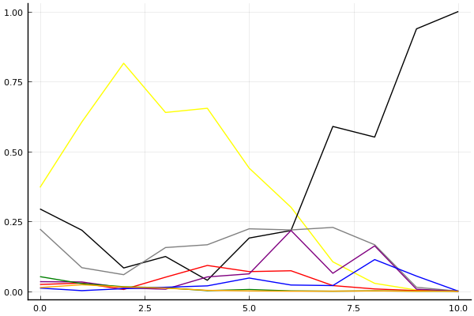
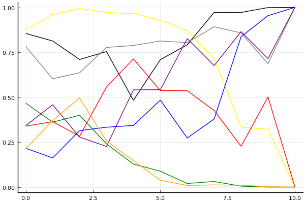

2020 시즌 1 개인전 16강 1경기

## 경기 결과

| 트랙 | 이재혁 | 박인수 | 신종민 | 유창현 | 배성빈 | 김승태 | 김응태 | 최영훈 |
|:---|---:|---:|---:|---:|---:|---:|---:|---:|
| [어비스 숨겨진 바닷길](../hiddenoceanroad) | 10 | 3 | 4 | -1 | 5 | 1 | 0 | 7 |
| [아이스 아찔한 헬기점프](../heli) | 10 | 1 | 0 | 5 | -1 | 3 | 7 | 4 |
| [동화 이상한 나라의 문](../gate) | 0 | 5 | 10 | 7 | 3 | 1 | 4 | -1 |
| [도검 구름의 협곡](../hyupgog) | 3 | -1 | 7 | 5 | 10 | 0 | 4 | 1 |
| [WKC 싱가폴 마리나 서킷](../singapore) | 0 | 10 | 1 | 5 | 4 | 3 | 7 | -1 |
| [어비스 스카이라인](../skyline) | 3 | 7 | 4 | 5 | 10 | -1 | 1 | 0 |
| [포레스트 지그재그](../zigzag) | 0 | 10 | 1 | 5 | -1 | 7 | 4 | 3 |
| [공동묘지 마왕의 초대](../mawang) | 0 | 4 | 1 | 3 | 7 | -1 | 10 | 5 |
| [쥐라기 공룡섬 대모험](../dinoisland) | 5 | 10 | 7 | 1 | 0 | -1 | 3 | 4 |
| [해적 숨겨진 보물](../haesumbo) | 3 | 4 | 0 | 7 | 10 | -1 | 5 | 1 |
| __total__ |__34__ |__53__ |__35__ |__42__ |__47__ |__11__ |__45__ |__23__ |

## 시뮬레이션

### 1st 확률

x축: 트랙, y축: 확률
1번: 옐로우, 2번: 블랙, 3번: 레드, 4번: 화이트(회색), 5번: 퍼플, 6번: 그린, 7번: 블루, 8번: 오렌지

| 트랙 | 이재혁 | 박인수 | 신종민 | 유창현 | 배성빈 | 김승태 | 김응태 | 최영훈 |
|:---|---:|---:|---:|---:|---:|---:|---:|---:|
| 초기 | 0.360 | 0.299 | 0.025 | 0.241 | 0.023 | 0.060 | 0.009 | 0.011 |
| 어비스 숨겨진 바닷길 | 0.617 | 0.212 | 0.020 | 0.089 | 0.036 | 0.019 | 0.003 | 0.031 |
| 아이스 아찔한 헬기점프 | 0.812 | 0.089 | 0.006 | 0.064 | 0.006 | 0.010 | 0.007 | 0.015 |
| 동화 이상한 나라의 문 | 0.669 | 0.140 | 0.040 | 0.138 | 0.012 | 0.008 | 0.012 | 0.005 |
| 도검 구름의 협곡 | 0.635 | 0.054 | 0.092 | 0.169 | 0.038 | 0.004 | 0.018 | 0.009 |
| WKC 싱가폴 마리나 서킷 | 0.457 | 0.169 | 0.070 | 0.219 | 0.056 | 0.006 | 0.053 | 0.002 |
| 어비스 스카이라인 | 0.307 | 0.205 | 0.066 | 0.234 | 0.208 | 0.001 | 0.019 | 0.000 |
| 포레스트 지그재그 | 0.108 | 0.581 | 0.028 | 0.232 | 0.074 | 0.002 | 0.014 | 0.000 |
| 공동묘지 마왕의 초대 | 0.030 | 0.544 | 0.011 | 0.182 | 0.155 | 0.000 | 0.120 | 0.000 |
| 쥐라기 공룡섬 대모험 | 0.001 | 0.958 | 0.002 | 0.012 | 0.008 | 0.000 | 0.033 | 0.000 |
| 해적 숨겨진 보물 | 0.000 | 1.000 | 0.000 | 0.000 | 0.000 | 0.000 | 0.000 | 0.000 |

### Advance 확률

x축: 트랙, y축: 확률
1번: 옐로우, 2번: 블랙, 3번: 레드, 4번: 화이트(회색), 5번: 퍼플, 6번: 그린, 7번: 블루, 8번: 오렌지

| 트랙 | 이재혁 | 박인수 | 신종민 | 유창현 | 배성빈 | 김승태 | 김응태 | 최영훈 |
|:---|---:|---:|---:|---:|---:|---:|---:|---:|
| 초기 | 0.886 | 0.836 | 0.326 | 0.778 | 0.373 | 0.454 | 0.229 | 0.215 |
| 어비스 숨겨진 바닷길 | 0.967 | 0.811 | 0.361 | 0.594 | 0.459 | 0.385 | 0.151 | 0.374 |
| 아이스 아찔한 헬기점프 | 0.998 | 0.699 | 0.278 | 0.653 | 0.295 | 0.366 | 0.327 | 0.502 |
| 동화 이상한 나라의 문 | 0.973 | 0.754 | 0.569 | 0.780 | 0.234 | 0.236 | 0.326 | 0.252 |
| 도검 구름의 협곡 | 0.965 | 0.488 | 0.735 | 0.804 | 0.520 | 0.106 | 0.341 | 0.145 |
| WKC 싱가폴 마리나 서킷 | 0.926 | 0.741 | 0.523 | 0.805 | 0.526 | 0.064 | 0.489 | 0.052 |
| 어비스 스카이라인 | 0.853 | 0.798 | 0.543 | 0.801 | 0.830 | 0.015 | 0.253 | 0.011 |
| 포레스트 지그재그 | 0.716 | 0.975 | 0.433 | 0.900 | 0.682 | 0.035 | 0.378 | 0.011 |
| 공동묘지 마왕의 초대 | 0.352 | 0.981 | 0.212 | 0.873 | 0.868 | 0.002 | 0.841 | 0.006 |
| 쥐라기 공룡섬 대모험 | 0.332 | 1.000 | 0.485 | 0.682 | 0.702 | 0.000 | 0.949 | 0.004 |
| 해적 숨겨진 보물 | 0.000 | 1.000 | 0.000 | 1.000 | 1.000 | 0.000 | 1.000 | 0.000 |

## 랭킹 변동

### [전체 랭킹](../singles-full)

| 순위 | 변동 | 이름 | 점수 | 변동 | mu | 변동 | sigma | 변동 |
|---:|---:|:---:|---:|---:|---:|---:|---:|---:|
| 2 / 85 | +1 | [박인수](../bakinsu) | 3312 | +13 | 3544 | +12 | 77 | -0 |
| 3 / 85 | -1 | [이재혁](../ijaehyeok) | 3284 | -49 | 3518 | -52 | 78 | -1 |
| 4 / 85 | +0 | [유창현](../yuchanghyeon) | 3263 | -4 | 3491 | -5 | 76 | -0 |
| 10 / 85 | +3 | [배성빈](../baeseongbin) | 3076 | +38 | 3310 | +37 | 78 | -0 |
| 13 / 85 | +1 | [신종민](../shinjongmin) | 3040 | +27 | 3274 | +24 | 78 | -1 |
| 14 / 85 | -4 | [김승태](../gimseungtae) | 3023 | -73 | 3253 | -73 | 77 | -0 |
| 15 / 85 | +3 | [김응태](../gimeungtae) | 3019 | +70 | 3256 | +65 | 79 | -2 |
| 17 / 85 | -1 | [최영훈](../choiyeonghun) | 2955 | -2 | 3184 | -3 | 76 | -0 |

### 시즌 랭킹

| 순위 | 변동 | 이름 | 점수 | 변동 | mu | 변동 | sigma | 변동 |
|---:|---:|:---:|---:|---:|---:|---:|---:|---:|
| 1 / 32 | +2 | [박인수](../bakinsu) | 3037 | +188 | 3468 | -27 | 144 | -72 |
| 3 / 32 | +8 | [유창현](../yuchanghyeon) | 2879 | +309 | 3316 | +37 | 146 | -91 |
| 4 / 32 | -3 | [이재혁](../ijaehyeok) | 2861 | -182 | 3332 | -532 | 157 | -117 |
| 5 / 32 | +3 | [김응태](../gimeungtae) | 2858 | +225 | 3213 | +132 | 118 | -31 |
| 6 / 32 | +7 | [신종민](../shinjongmin) | 2785 | +268 | 3223 | +1 | 146 | -89 |
| 8 / 32 | +11 | [배성빈](../baeseongbin) | 2779 | +393 | 3203 | +203 | 141 | -63 |
| 12 / 32 | +0 | [최영훈](../choiyeonghun) | 2658 | +106 | 3011 | +18 | 118 | -29 |
| 18 / 32 | +2 | [김승태](../gimseungtae) | 2409 | +75 | 2833 | -110 | 141 | -61 |

### 트랙 별 랭킹

#### [WKC 싱가폴 마리나 서킷](../singapore)

| 순위 | 변동 | 이름 | 점수 | 변동 | mu | 변동 | sigma | 변동 |
|:---:|:---:|:---:|---:|---:|---:|---:|---:|---:|
| 1 / 32 | +6 | [박인수](../bakinsu) | 2543 | +656 | 4102 | +339 | 520 | -106 |
| 7 / 32 | +12 | [김응태](../gimeungtae) | 1896 | +736 | 3040 | +482 | 381 | -85 |
| 9 / 32 | +14 | [유창현](../yuchanghyeon) | 1840 | +750 | 3126 | +263 | 429 | -163 |
| 10 / 32 | -8 | [이재혁](../ijaehyeok) | 1703 | -458 | 3108 | -1166 | 468 | -236 |
| 14 / 32 | +1 | [신종민](../shinjongmin) | 1617 | +254 | 2896 | -240 | 426 | -165 |
| 16 / 32 | +5 | [김승태](../gimseungtae) | 1612 | +523 | 2886 | +23 | 425 | -167 |
| 18 / 32 | -9 | [최영훈](../choiyeonghun) | 1498 | -260 | 2687 | -489 | 397 | -76 |
| 19 / 32 | +10 | [배성빈](../baeseongbin) | 1442 | +1081 | 2752 | +515 | 437 | -189 |

#### [공동묘지 마왕의 초대](../mawang)

| 순위 | 변동 | 이름 | 점수 | 변동 | mu | 변동 | sigma | 변동 |
|:---:|:---:|:---:|---:|---:|---:|---:|---:|---:|
| 2 / 52 | +0 | [유창현](../yuchanghyeon) | 2576 | +20 | 3465 | -120 | 296 | -47 |
| 3 / 52 | +13 | [김응태](../gimeungtae) | 2557 | +502 | 3616 | +342 | 353 | -53 |
| 6 / 52 | +8 | [박인수](../bakinsu) | 2363 | +221 | 3463 | -92 | 367 | -104 |
| 11 / 52 | +19 | [배성빈](../baeseongbin) | 2170 | +823 | 3382 | +423 | 404 | -133 |
| 16 / 52 | -8 | [김승태](../gimseungtae) | 2072 | -164 | 3016 | -274 | 314 | -37 |
| 18 / 52 | +3 | [신종민](../shinjongmin) | 2053 | +169 | 3258 | -268 | 402 | -146 |
| 19 / 52 | -12 | [이재혁](../ijaehyeok) | 2006 | -277 | 3349 | -926 | 448 | -216 |
| 26 / 52 | +11 | [최영훈](../choiyeonghun) | 1715 | +739 | 2724 | +521 | 336 | -73 |

#### [도검 구름의 협곡](../hyupgog)

| 순위 | 변동 | 이름 | 점수 | 변동 | mu | 변동 | sigma | 변동 |
|:---:|:---:|:---:|---:|---:|---:|---:|---:|---:|
| 2 / 50 | +0 | [배성빈](../baeseongbin) | 3124 | +134 | 3758 | +102 | 212 | -11 |
| 3 / 50 | +1 | [유창현](../yuchanghyeon) | 2937 | +74 | 3673 | -1 | 245 | -25 |
| 4 / 50 | +2 | [신종민](../shinjongmin) | 2897 | +117 | 3524 | +76 | 209 | -14 |
| 5 / 50 | -2 | [박인수](../bakinsu) | 2857 | -90 | 3393 | -112 | 178 | -7 |
| 6 / 50 | -1 | [최영훈](../choiyeonghun) | 2781 | -20 | 3388 | -60 | 202 | -14 |
| 10 / 50 | +1 | [김응태](../gimeungtae) | 2592 | +105 | 3293 | +39 | 234 | -22 |
| 15 / 50 | +0 | [김승태](../gimseungtae) | 2307 | +19 | 3016 | -45 | 236 | -21 |
| 16 / 50 | +4 | [이재혁](../ijaehyeok) | 2298 | +123 | 2978 | +63 | 227 | -20 |

#### [동화 이상한 나라의 문](../gate)

| 순위 | 변동 | 이름 | 점수 | 변동 | mu | 변동 | sigma | 변동 |
|:---:|:---:|:---:|---:|---:|---:|---:|---:|---:|
| 1 / 29 | NaN | [신종민](../shinjongmin) | 2658 | +2658 | 4614 | +1614 | 652 | -348 |
| 2 / 29 | +2 | [김응태](../gimeungtae) | 2638 | +387 | 3953 | -65 | 438 | -151 |
| 3 / 29 | +5 | [박인수](../bakinsu) | 2636 | +749 | 4009 | +246 | 458 | -168 |
| 4 / 29 | NaN | [유창현](../yuchanghyeon) | 2469 | +2469 | 4191 | +1191 | 574 | -426 |
| 6 / 29 | -1 | [배성빈](../baeseongbin) | 2417 | +256 | 3849 | -425 | 477 | -227 |
| 9 / 29 | -7 | [최영훈](../choiyeonghun) | 2085 | -371 | 3285 | -572 | 400 | -67 |
| 10 / 29 | +5 | [김승태](../gimseungtae) | 1898 | +535 | 3226 | +90 | 443 | -149 |
| 19 / 29 | NaN | [이재혁](../ijaehyeok) | 1300 | +1300 | 2972 | -28 | 557 | -443 |

#### [아이스 아찔한 헬기점프](../heli)

| 순위 | 변동 | 이름 | 점수 | 변동 | mu | 변동 | sigma | 변동 |
|:---:|:---:|:---:|---:|---:|---:|---:|---:|---:|
| 1 / 23 | +2 | [이재혁](../ijaehyeok) | 2659 | +498 | 4493 | +219 | 611 | -93 |
| 5 / 23 | +4 | [김응태](../gimeungtae) | 1977 | +547 | 3142 | +337 | 388 | -70 |
| 9 / 23 | +6 | [최영훈](../choiyeonghun) | 1553 | +480 | 2823 | +86 | 423 | -131 |
| 11 / 23 | +7 | [유창현](../yuchanghyeon) | 1434 | +1073 | 2794 | +557 | 453 | -172 |
| 14 / 23 | -4 | [신종민](../shinjongmin) | 1159 | -203 | 2527 | -609 | 456 | -135 |
| 15 / 23 | NaN | [김승태](../gimseungtae) | 1096 | +1096 | 2721 | -279 | 542 | -458 |
| 18 / 23 | NaN | [박인수](../bakinsu) | 863 | +863 | 2512 | -488 | 550 | -450 |
| 21 / 23 | NaN | [배성빈](../baeseongbin) | -259 | -259 | 1760 | -1240 | 673 | -327 |

#### [어비스 숨겨진 바닷길](../hiddenoceanroad)

| 순위 | 변동 | 이름 | 점수 | 변동 | mu | 변동 | sigma | 변동 |
|:---:|:---:|:---:|---:|---:|---:|---:|---:|---:|
| 1 / 32 | +8 | [이재혁](../ijaehyeok) | 2766 | +879 | 4276 | +513 | 503 | -122 |
| 2 / 32 | +4 | [최영훈](../choiyeonghun) | 2490 | +588 | 3661 | +338 | 390 | -83 |
| 3 / 32 | +1 | [배성빈](../baeseongbin) | 2484 | +323 | 3915 | -359 | 477 | -227 |
| 9 / 32 | +2 | [김승태](../gimseungtae) | 1823 | +201 | 3125 | -298 | 434 | -166 |
| 10 / 32 | +10 | [박인수](../bakinsu) | 1731 | +641 | 3019 | +156 | 430 | -162 |
| 11 / 32 | -1 | [김응태](../gimeungtae) | 1710 | +81 | 2876 | -199 | 389 | -93 |
| 14 / 32 | +15 | [신종민](../shinjongmin) | 1592 | +1231 | 2924 | +687 | 444 | -182 |
| 15 / 32 | -12 | [유창현](../yuchanghyeon) | 1467 | -693 | 2975 | -1299 | 503 | -202 |

#### [어비스 스카이라인](../skyline)

| 순위 | 변동 | 이름 | 점수 | 변동 | mu | 변동 | sigma | 변동 |
|:---:|:---:|:---:|---:|---:|---:|---:|---:|---:|
| 3 / 26 | +5 | [배성빈](../baeseongbin) | 2449 | +827 | 3906 | +483 | 486 | -115 |
| 7 / 26 | -2 | [김응태](../gimeungtae) | 2129 | -140 | 3270 | -432 | 380 | -97 |
| 8 / 26 | -1 | [신종민](../shinjongmin) | 2125 | +238 | 3442 | -321 | 439 | -186 |
| 9 / 26 | +7 | [유창현](../yuchanghyeon) | 1910 | +820 | 3199 | +335 | 430 | -162 |
| 10 / 26 | +13 | [박인수](../bakinsu) | 1771 | +1410 | 3123 | +886 | 451 | -175 |
| 13 / 26 | +5 | [이재혁](../ijaehyeok) | 1538 | +762 | 2828 | +251 | 430 | -170 |
| 14 / 26 | -2 | [최영훈](../choiyeonghun) | 1449 | +69 | 2729 | -323 | 427 | -131 |
| 19 / 26 | -4 | [김승태](../gimseungtae) | 904 | -185 | 2336 | -527 | 477 | -114 |

#### [쥐라기 공룡섬 대모험](../dinoisland)

| 순위 | 변동 | 이름 | 점수 | 변동 | mu | 변동 | sigma | 변동 |
|:---:|:---:|:---:|---:|---:|---:|---:|---:|---:|
| 1 / 32 | +1 | [박인수](../bakinsu) | 3150 | +989 | 4847 | +573 | 566 | -139 |
| 2 / 32 | -1 | [신종민](../shinjongmin) | 2872 | +712 | 4422 | +148 | 517 | -188 |
| 3 / 32 | +7 | [이재혁](../ijaehyeok) | 2503 | +616 | 3898 | +135 | 465 | -160 |
| 4 / 32 | +2 | [최영훈](../choiyeonghun) | 2335 | +303 | 3423 | +101 | 363 | -67 |
| 5 / 32 | +0 | [김응태](../gimeungtae) | 2197 | +131 | 3343 | -111 | 382 | -81 |
| 14 / 32 | +1 | [유창현](../yuchanghyeon) | 1671 | +49 | 3048 | -375 | 459 | -141 |
| 28 / 32 | +4 | [배성빈](../baeseongbin) | 350 | +737 | 1947 | +221 | 532 | -172 |
| 29 / 32 | -4 | [김승태](../gimseungtae) | 177 | -184 | 1756 | -481 | 526 | -99 |

#### [포레스트 지그재그](../zigzag)

| 순위 | 변동 | 이름 | 점수 | 변동 | mu | 변동 | sigma | 변동 |
|:---:|:---:|:---:|---:|---:|---:|---:|---:|---:|
| 3 / 56 | -1 | [이재혁](../ijaehyeok) | 3375 | -154 | 3966 | -188 | 197 | -11 |
| 5 / 56 | +0 | [유창현](../yuchanghyeon) | 3111 | +34 | 3754 | -13 | 214 | -16 |
| 6 / 56 | +0 | [김승태](../gimseungtae) | 3088 | +103 | 3824 | +34 | 245 | -23 |
| 8 / 56 | +3 | [박인수](../bakinsu) | 2925 | +140 | 3495 | +115 | 190 | -8 |
| 15 / 56 | +1 | [김응태](../gimeungtae) | 2566 | +112 | 3286 | +42 | 240 | -23 |
| 23 / 56 | +8 | [최영훈](../choiyeonghun) | 1950 | +293 | 2790 | +174 | 280 | -40 |
| 29 / 56 | +11 | [신종민](../shinjongmin) | 1800 | +516 | 2993 | +67 | 398 | -150 |
| 32 / 56 | -5 | [배성빈](../baeseongbin) | 1750 | -73 | 2734 | -183 | 328 | -37 |

#### [해적 숨겨진 보물](../haesumbo)

| 순위 | 변동 | 이름 | 점수 | 변동 | mu | 변동 | sigma | 변동 |
|:---:|:---:|:---:|---:|---:|---:|---:|---:|---:|
| 4 / 46 | -2 | [박인수](../bakinsu) | 2641 | -256 | 3933 | -739 | 431 | -161 |
| 5 / 46 | +3 | [유창현](../yuchanghyeon) | 2595 | +328 | 3591 | +177 | 332 | -50 |
| 6 / 46 | +12 | [배성빈](../baeseongbin) | 2590 | +855 | 3982 | +525 | 464 | -110 |
| 12 / 46 | -2 | [김승태](../gimseungtae) | 1955 | -193 | 2850 | -273 | 298 | -27 |
| 19 / 46 | +3 | [최영훈](../choiyeonghun) | 1734 | +229 | 2836 | -6 | 367 | -78 |
| 20 / 46 | +18 | [김응태](../gimeungtae) | 1651 | +1723 | 3041 | +1046 | 463 | -226 |
| 24 / 46 | NaN | [이재혁](../ijaehyeok) | 1505 | +1505 | 3091 | +91 | 529 | -471 |
| 32 / 46 | NaN | [신종민](../shinjongmin) | 1005 | +1005 | 2628 | -372 | 541 | -459 |
