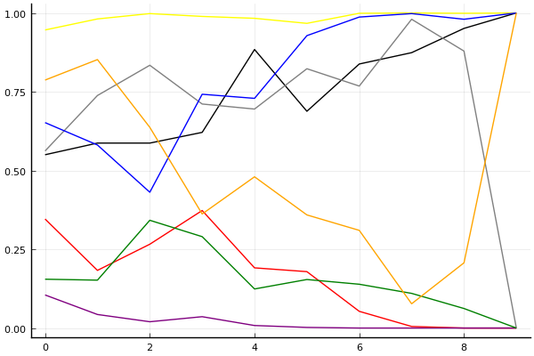

2020 시즌 1 개인전 16강 2경기

## 경기 결과

| 트랙 | 문호준 | 전대웅 | 김기수 | 황인호 | 최민석 | 한승철 | 유영혁 | 박도현 |
|:---|---:|---:|---:|---:|---:|---:|---:|---:|
| [어비스 숨겨진 바닷길](../hiddenoceanroad) | 10 | 4 | 0 | 7 | -1 | 3 | 1 | 5 |
| [WKC 싱가폴 마리나 서킷](../singapore) | 10 | 3 | 4 | 5 | 0 | 7 | 1 | -1 |
| [도검 구름의 협곡](../hyupgog) | 0 | 5 | 7 | 1 | 4 | 3 | 10 | -1 |
| [해적 숨겨진 보물](../haesumbo) | 3 | 10 | 0 | 4 | 1 | -1 | 5 | 7 |
| [포레스트 지그재그](../zigzag) | 1 | 0 | 4 | 7 | -1 | 5 | 10 | 3 |
| [어비스 스카이라인](../skyline) | 10 | 5 | -1 | 1 | 0 | 3 | 7 | 4 |
| [쥐라기 공룡섬 대모험](../dinoisland) | 7 | 3 | 0 | 10 | -1 | 4 | 5 | 1 |
| [아이스 아찔한 헬기점프](../heli) | 5 | 7 | 1 | 0 | 4 | 3 | -1 | 10 |
| [동화 이상한 나라의 문](../gate) | 10 | 4 | 0 | -1 | 1 | 3 | 5 | 7 |
| __total__ |__56__ |__41__ |__15__ |__34__ |__7__ |__30__ |__43__ |__35__ |

## 시뮬레이션

### 1st 확률

x축: 트랙, y축: 확률
1번: 옐로우, 2번: 블랙, 3번: 레드, 4번: 화이트(회색), 5번: 퍼플, 6번: 그린, 7번: 블루, 8번: 오렌지

| 트랙 | 문호준 | 전대웅 | 김기수 | 황인호 | 최민석 | 한승철 | 유영혁 | 박도현 |
|:---|---:|---:|---:|---:|---:|---:|---:|---:|
| 초기 | 0.527 | 0.083 | 0.019 | 0.078 | 0.009 | 0.004 | 0.102 | 0.204 |
| 어비스 숨겨진 바닷길 | 0.703 | 0.038 | 0.010 | 0.099 | 0.001 | 0.004 | 0.032 | 0.147 |
| WKC 싱가폴 마리나 서킷 | 0.862 | 0.019 | 0.002 | 0.078 | 0.000 | 0.007 | 0.013 | 0.032 |
| 도검 구름의 협곡 | 0.775 | 0.058 | 0.014 | 0.067 | 0.000 | 0.011 | 0.073 | 0.017 |
| 해적 숨겨진 보물 | 0.657 | 0.152 | 0.006 | 0.066 | 0.000 | 0.003 | 0.105 | 0.042 |
| 포레스트 지그재그 | 0.485 | 0.080 | 0.005 | 0.137 | 0.000 | 0.002 | 0.298 | 0.031 |
| 어비스 스카이라인 | 0.633 | 0.064 | 0.000 | 0.033 | 0.000 | 0.001 | 0.298 | 0.005 |
| 쥐라기 공룡섬 대모험 | 0.697 | 0.019 | 0.000 | 0.070 | 0.000 | 0.000 | 0.249 | 0.000 |
| 아이스 아찔한 헬기점프 | 0.917 | 0.027 | 0.000 | 0.015 | 0.000 | 0.000 | 0.051 | 0.001 |
| 동화 이상한 나라의 문 | 1.000 | 0.000 | 0.000 | 0.000 | 0.000 | 0.000 | 0.000 | 0.000 |

### Advance 확률

x축: 트랙, y축: 확률
1번: 옐로우, 2번: 블랙, 3번: 레드, 4번: 화이트(회색), 5번: 퍼플, 6번: 그린, 7번: 블루, 8번: 오렌지

| 트랙 | 문호준 | 전대웅 | 김기수 | 황인호 | 최민석 | 한승철 | 유영혁 | 박도현 |
|:---|---:|---:|---:|---:|---:|---:|---:|---:|
| 초기 | 0.932 | 0.551 | 0.313 | 0.584 | 0.099 | 0.157 | 0.681 | 0.777 |
| 어비스 숨겨진 바닷길 | 0.979 | 0.585 | 0.209 | 0.751 | 0.048 | 0.148 | 0.533 | 0.834 |
| WKC 싱가폴 마리나 서킷 | 0.996 | 0.559 | 0.255 | 0.821 | 0.024 | 0.336 | 0.444 | 0.664 |
| 도검 구름의 협곡 | 0.992 | 0.625 | 0.386 | 0.694 | 0.027 | 0.315 | 0.704 | 0.369 |
| 해적 숨겨진 보물 | 0.980 | 0.865 | 0.180 | 0.677 | 0.014 | 0.130 | 0.781 | 0.452 |
| 포레스트 지그재그 | 0.967 | 0.713 | 0.195 | 0.797 | 0.000 | 0.141 | 0.933 | 0.350 |
| 어비스 스카이라인 | 0.994 | 0.842 | 0.046 | 0.791 | 0.000 | 0.151 | 0.992 | 0.273 |
| 쥐라기 공룡섬 대모험 | 0.998 | 0.873 | 0.006 | 0.981 | 0.000 | 0.115 | 0.998 | 0.070 |
| 아이스 아찔한 헬기점프 | 1.000 | 0.955 | 0.000 | 0.887 | 0.000 | 0.063 | 0.981 | 0.188 |
| 동화 이상한 나라의 문 | 1.000 | 1.000 | 0.000 | 0.000 | 0.000 | 0.000 | 1.000 | 1.000 |

## 랭킹 변동

### [전체 랭킹](../singles-full)

| 순위 | 변동 | 이름 | 점수 | 변동 | mu | 변동 | sigma | 변동 |
|---:|---:|:---:|---:|---:|---:|---:|---:|---:|
| 1 / 85 | +0 | [문호준](../munhojun) | 3397 | +15 | 3629 | +15 | 77 | +0 |
| 6 / 85 | -1 | [박도현](../bakdohyeon) | 3198 | -15 | 3443 | -21 | 82 | -2 |
| 7 / 85 | +0 | [유영혁](../yuyeonghyeok) | 3181 | +16 | 3409 | +16 | 76 | +0 |
| 8 / 85 | +1 | [전대웅](../jeondaewoong) | 3125 | +23 | 3353 | +22 | 76 | -0 |
| 9 / 85 | -1 | [황인호](../hwanginho) | 3110 | -2 | 3339 | -2 | 76 | -0 |
| 20 / 85 | -4 | [김기수](../gimgisu) | 2925 | -36 | 3170 | -43 | 82 | -2 |
| 25 / 85 | +2 | [한승철](../hanseungcheol) | 2882 | +36 | 3120 | +30 | 80 | -2 |
| 39 / 85 | +0 | [최민석](../choiminseok) | 2601 | -2 | 2953 | -71 | 117 | -23 |

### 시즌 랭킹

| 순위 | 변동 | 이름 | 점수 | 변동 | mu | 변동 | sigma | 변동 |
|---:|---:|:---:|---:|---:|---:|---:|---:|---:|
| 1 / 32 | +1 | [문호준](../munhojun) | 3162 | +266 | 3641 | +4 | 160 | -87 |
| 3 / 32 | +7 | [전대웅](../jeondaewoong) | 2935 | +200 | 3349 | +35 | 138 | -55 |
| 4 / 32 | +5 | [유영혁](../yuyeonghyeok) | 2929 | +170 | 3291 | +89 | 121 | -27 |
| 6 / 32 | +1 | [박도현](../bakdohyeon) | 2876 | +97 | 3223 | +31 | 115 | -22 |
| 9 / 32 | +2 | [황인호](../hwanginho) | 2834 | +172 | 3252 | +8 | 139 | -54 |
| 12 / 32 | +9 | [한승철](../hanseungcheol) | 2664 | +380 | 3112 | +131 | 149 | -83 |
| 15 / 32 | +5 | [김기수](../gimgisu) | 2524 | +137 | 2981 | -123 | 152 | -87 |
| 16 / 32 | -2 | [최민석](../choiminseok) | 2516 | -59 | 2938 | -217 | 141 | -53 |

### 트랙 별 랭킹

#### [WKC 싱가폴 마리나 서킷](../singapore)

| 순위 | 변동 | 이름 | 점수 | 변동 | mu | 변동 | sigma | 변동 |
|:---:|:---:|:---:|---:|---:|---:|---:|---:|---:|
| 1 / 32 | +3 | [문호준](../munhojun) | 3028 | +867 | 4727 | +453 | 567 | -138 |
| 2 / 32 | +0 | [황인호](../hwanginho) | 2625 | +465 | 4058 | -216 | 477 | -227 |
| 4 / 32 | +21 | [한승철](../hanseungcheol) | 2315 | +1226 | 3660 | +796 | 448 | -143 |
| 5 / 32 | +6 | [김기수](../gimgisu) | 2243 | +621 | 3552 | +129 | 436 | -164 |
| 7 / 32 | +5 | [전대웅](../jeondaewoong) | 2087 | +465 | 3389 | -34 | 434 | -166 |
| 8 / 32 | -2 | [유영혁](../yuyeonghyeok) | 2071 | +174 | 3157 | -56 | 362 | -77 |
| 12 / 32 | -7 | [박도현](../bakdohyeon) | 1781 | -229 | 2917 | -408 | 379 | -60 |
| 18 / 32 | +3 | [최민석](../choiminseok) | 1609 | +247 | 2925 | -211 | 439 | -153 |

#### [도검 구름의 협곡](../hyupgog)

| 순위 | 변동 | 이름 | 점수 | 변동 | mu | 변동 | sigma | 변동 |
|:---:|:---:|:---:|---:|---:|---:|---:|---:|---:|
| 2 / 50 | -1 | [문호준](../munhojun) | 3035 | -98 | 3569 | -124 | 178 | -9 |
| 9 / 50 | -1 | [한승철](../hanseungcheol) | 2619 | -21 | 3371 | -107 | 251 | -29 |
| 10 / 50 | +2 | [유영혁](../yuyeonghyeok) | 2607 | +144 | 3214 | +114 | 202 | -10 |
| 17 / 50 | +5 | [김기수](../gimgisu) | 2263 | +222 | 2989 | +152 | 242 | -24 |
| 20 / 50 | +4 | [전대웅](../jeondaewoong) | 2218 | +241 | 3064 | +114 | 282 | -42 |
| 22 / 50 | -5 | [박도현](../bakdohyeon) | 2151 | -85 | 2850 | -131 | 233 | -15 |
| 24 / 50 | +3 | [최민석](../choiminseok) | 2083 | +311 | 3102 | +55 | 340 | -85 |
| 25 / 50 | +1 | [황인호](../hwanginho) | 2004 | +81 | 2595 | +43 | 197 | -13 |

#### [동화 이상한 나라의 문](../gate)

| 순위 | 변동 | 이름 | 점수 | 변동 | mu | 변동 | sigma | 변동 |
|:---:|:---:|:---:|---:|---:|---:|---:|---:|---:|
| 1 / 29 | +6 | [박도현](../bakdohyeon) | 2834 | +474 | 4031 | +206 | 399 | -89 |
| 2 / 29 | +12 | [문호준](../munhojun) | 2730 | +1107 | 4154 | +731 | 475 | -126 |
| 3 / 29 | +2 | [유영혁](../yuyeonghyeok) | 2722 | +258 | 4135 | -338 | 471 | -199 |
| 9 / 29 | +2 | [전대웅](../jeondaewoong) | 2279 | +392 | 3647 | -116 | 456 | -169 |
| 13 / 29 | +5 | [한승철](../hanseungcheol) | 1815 | +452 | 3150 | +13 | 445 | -146 |
| 17 / 29 | +3 | [최민석](../choiminseok) | 1447 | +357 | 2795 | -68 | 449 | -142 |
| 20 / 29 | -7 | [황인호](../hwanginho) | 1102 | -520 | 2543 | -881 | 480 | -120 |
| 24 / 29 | +3 | [김기수](../gimgisu) | 593 | +980 | 2102 | +377 | 503 | -201 |

#### [아이스 아찔한 헬기점프](../heli)

| 순위 | 변동 | 이름 | 점수 | 변동 | mu | 변동 | sigma | 변동 |
|:---:|:---:|:---:|---:|---:|---:|---:|---:|---:|
| 2 / 26 | +4 | [전대웅](../jeondaewoong) | 2554 | +667 | 3923 | +160 | 456 | -169 |
| 3 / 26 | +4 | [박도현](../bakdohyeon) | 2536 | +774 | 3727 | +560 | 397 | -72 |
| 5 / 26 | +7 | [최민석](../choiminseok) | 2031 | +668 | 3337 | +200 | 435 | -156 |
| 7 / 26 | NaN | [문호준](../munhojun) | 1975 | +1975 | 3586 | +586 | 537 | -463 |
| 8 / 26 | -6 | [유영혁](../yuyeonghyeok) | 1912 | -310 | 3088 | -516 | 392 | -69 |
| 9 / 26 | -6 | [황인호](../hwanginho) | 1876 | -285 | 3315 | -959 | 480 | -225 |
| 11 / 26 | NaN | [한승철](../hanseungcheol) | 1607 | +1607 | 3207 | +207 | 533 | -467 |
| 15 / 26 | NaN | [김기수](../gimgisu) | 1428 | +1428 | 3036 | +36 | 536 | -464 |

#### [어비스 숨겨진 바닷길](../hiddenoceanroad)

| 순위 | 변동 | 이름 | 점수 | 변동 | mu | 변동 | sigma | 변동 |
|:---:|:---:|:---:|---:|---:|---:|---:|---:|---:|
| 2 / 32 | +2 | [박도현](../bakdohyeon) | 2537 | +61 | 3697 | -237 | 387 | -99 |
| 6 / 32 | +12 | [문호준](../munhojun) | 2311 | +949 | 3727 | +590 | 472 | -119 |
| 9 / 32 | +7 | [전대웅](../jeondaewoong) | 1862 | +499 | 3150 | +13 | 429 | -162 |
| 11 / 32 | +19 | [황인호](../hwanginho) | 1765 | +1404 | 3117 | +880 | 451 | -175 |
| 17 / 32 | -10 | [김기수](../gimgisu) | 1554 | -333 | 2910 | -853 | 452 | -173 |
| 18 / 32 | +3 | [유영혁](../yuyeonghyeok) | 1522 | +245 | 2624 | -1 | 368 | -82 |
| 20 / 32 | +6 | [한승철](../hanseungcheol) | 1457 | +681 | 2754 | +177 | 432 | -168 |
| 29 / 32 | -1 | [최민석](../choiminseok) | 650 | -125 | 2115 | -461 | 488 | -112 |

#### [어비스 스카이라인](../skyline)

| 순위 | 변동 | 이름 | 점수 | 변동 | mu | 변동 | sigma | 변동 |
|:---:|:---:|:---:|---:|---:|---:|---:|---:|---:|
| 1 / 29 | +4 | [유영혁](../yuyeonghyeok) | 2713 | +336 | 3836 | +141 | 374 | -65 |
| 2 / 29 | +2 | [박도현](../bakdohyeon) | 2490 | +88 | 3611 | -167 | 374 | -85 |
| 6 / 29 | NaN | [문호준](../munhojun) | 2326 | +2326 | 4309 | +1309 | 661 | -339 |
| 11 / 29 | +11 | [전대웅](../jeondaewoong) | 1744 | +1383 | 3087 | +850 | 448 | -178 |
| 12 / 29 | -6 | [최민석](../choiminseok) | 1690 | -470 | 3171 | -1103 | 494 | -211 |
| 13 / 29 | +3 | [황인호](../hwanginho) | 1678 | +316 | 3000 | -137 | 440 | -151 |
| 17 / 29 | NaN | [한승철](../hanseungcheol) | 1523 | +1523 | 3124 | +124 | 533 | -467 |
| 26 / 29 | NaN | [김기수](../gimgisu) | -46 | -46 | 2068 | -932 | 705 | -295 |

#### [쥐라기 공룡섬 대모험](../dinoisland)

| 순위 | 변동 | 이름 | 점수 | 변동 | mu | 변동 | sigma | 변동 |
|:---:|:---:|:---:|---:|---:|---:|---:|---:|---:|
| 3 / 32 | +3 | [문호준](../munhojun) | 2589 | +428 | 4048 | -226 | 486 | -218 |
| 5 / 32 | +2 | [유영혁](../yuyeonghyeok) | 2428 | +269 | 3515 | +47 | 362 | -74 |
| 8 / 32 | +15 | [황인호](../hwanginho) | 2168 | +1393 | 3570 | +993 | 467 | -133 |
| 9 / 32 | +0 | [전대웅](../jeondaewoong) | 2011 | +124 | 3332 | -431 | 440 | -185 |
| 10 / 32 | -2 | [박도현](../bakdohyeon) | 1962 | +52 | 3034 | -169 | 357 | -74 |
| 18 / 32 | -1 | [김기수](../gimgisu) | 1428 | +65 | 2755 | -382 | 442 | -149 |
| 20 / 32 | +12 | [한승철](../hanseungcheol) | 1347 | +1735 | 2744 | +1018 | 466 | -239 |
| 24 / 32 | -2 | [최민석](../choiminseok) | 905 | -184 | 2341 | -522 | 479 | -113 |

#### [포레스트 지그재그](../zigzag)

| 순위 | 변동 | 이름 | 점수 | 변동 | mu | 변동 | sigma | 변동 |
|:---:|:---:|:---:|---:|---:|---:|---:|---:|---:|
| 1 / 56 | +0 | [문호준](../munhojun) | 3545 | -82 | 4121 | -116 | 192 | -11 |
| 2 / 56 | +0 | [유영혁](../yuyeonghyeok) | 3523 | +90 | 4086 | +70 | 188 | -7 |
| 4 / 56 | +0 | [전대웅](../jeondaewoong) | 3178 | -74 | 3790 | -111 | 204 | -12 |
| 7 / 56 | +3 | [황인호](../hwanginho) | 3006 | +161 | 3678 | +109 | 224 | -17 |
| 10 / 56 | +2 | [한승철](../hanseungcheol) | 2914 | +163 | 3682 | +76 | 256 | -29 |
| 18 / 56 | +17 | [김기수](../gimgisu) | 2316 | +719 | 3498 | +269 | 394 | -150 |
| 19 / 56 | +9 | [박도현](../bakdohyeon) | 2260 | +455 | 3286 | +201 | 342 | -85 |
| 30 / 56 | -5 | [최민석](../choiminseok) | 1767 | -128 | 3071 | -421 | 435 | -98 |

#### [해적 숨겨진 보물](../haesumbo)

| 순위 | 변동 | 이름 | 점수 | 변동 | mu | 변동 | sigma | 변동 |
|:---:|:---:|:---:|---:|---:|---:|---:|---:|---:|
| 1 / 48 | +0 | [유영혁](../yuyeonghyeok) | 3308 | -34 | 4295 | -193 | 329 | -53 |
| 2 / 48 | +0 | [전대웅](../jeondaewoong) | 3197 | +398 | 4282 | +259 | 362 | -46 |
| 7 / 48 | +0 | [황인호](../hwanginho) | 2556 | +62 | 3953 | -554 | 466 | -205 |
| 8 / 48 | +9 | [박도현](../bakdohyeon) | 2503 | +700 | 3604 | +468 | 367 | -78 |
| 13 / 48 | +2 | [문호준](../munhojun) | 2063 | +191 | 3106 | +32 | 348 | -53 |
| 30 / 48 | +6 | [최민석](../choiminseok) | 1201 | +540 | 2623 | +90 | 474 | -150 |
| 38 / 48 | NaN | [김기수](../gimgisu) | 537 | +537 | 2374 | -626 | 612 | -388 |
| 44 / 48 | NaN | [한승철](../hanseungcheol) | -285 | -285 | 1831 | -1169 | 706 | -294 |
