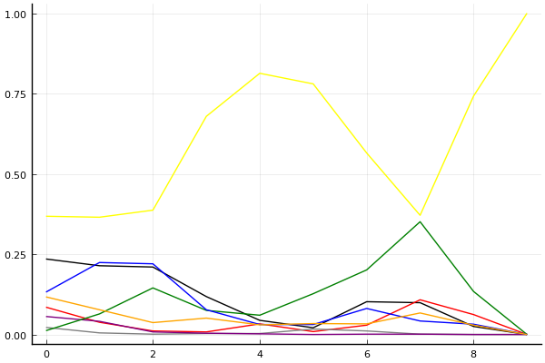
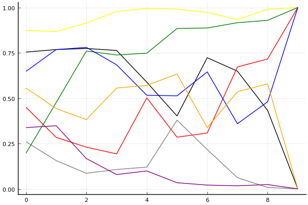

2020 시즌 1 개인전 16강 승자전

## 경기 결과

| 트랙 | 문호준 | 박인수 | 유영혁 | 배성빈 | 전대웅 | 김응태 | 유창현 | 박도현 |
|:---|---:|---:|---:|---:|---:|---:|---:|---:|
| [어비스 스카이라인](../skyline) | 4 | 5 | 0 | -1 | 3 | 10 | 7 | 1 |
| [어비스 숨겨진 바닷길](../hiddenoceanroad) | 7 | 4 | 1 | 0 | -1 | 10 | 5 | 3 |
| [동화 이상한 나라의 문](../gate) | 10 | 4 | 3 | 5 | -1 | 1 | 0 | 7 |
| [공동묘지 마왕의 초대](../mawang) | 7 | -1 | 10 | 4 | 5 | 1 | 0 | 3 |
| [쥐라기 공룡섬 대모험](../dinoisland) | 3 | 1 | 0 | 10 | -1 | 7 | 4 | 5 |
| [포레스트 지그재그](../zigzag) | -1 | 10 | 5 | 1 | 3 | 4 | 7 | 0 |
| [아이스 아찔한 헬기점프](../heli) | 1 | 3 | 10 | -1 | 4 | 5 | 0 | 7 |
| [광산 꼬불꼬불 다운힐](../gwangkko) | 10 | 1 | 3 | -1 | 7 | 0 | 5 | 4 |
| [[리버스] 사막 빙글빙글 공사장](../rsabing) | 10 | -1 | 0 | 3 | 7 | 4 | 5 | 1 |
| __total__ |__51__ |__26__ |__32__ |__20__ |__26__ |__42__ |__33__ |__31__ |

## 시뮬레이션

### 1st 확률

x축: 트랙, y축: 확률
1번: 옐로우, 2번: 블랙, 3번: 레드, 4번: 화이트(회색), 5번: 퍼플, 6번: 그린, 7번: 블루, 8번: 오렌지

| 트랙 | 문호준 | 박인수 | 유영혁 | 배성빈 | 전대웅 | 김응태 | 유창현 | 박도현 |
|:---|---:|---:|---:|---:|---:|---:|---:|---:|
| 초기 | 0.368 | 0.235 | 0.085 | 0.022 | 0.056 | 0.012 | 0.132 | 0.117 |
| 어비스 스카이라인 | 0.365 | 0.214 | 0.038 | 0.005 | 0.041 | 0.064 | 0.224 | 0.077 |
| 어비스 숨겨진 바닷길 | 0.387 | 0.210 | 0.011 | 0.001 | 0.008 | 0.145 | 0.220 | 0.037 |
| 동화 이상한 나라의 문 | 0.679 | 0.118 | 0.008 | 0.003 | 0.004 | 0.075 | 0.077 | 0.051 |
| 공동묘지 마왕의 초대 | 0.813 | 0.044 | 0.033 | 0.003 | 0.002 | 0.060 | 0.031 | 0.030 |
| 쥐라기 공룡섬 대모험 | 0.780 | 0.021 | 0.009 | 0.017 | 0.000 | 0.127 | 0.031 | 0.034 |
| 포레스트 지그재그 | 0.565 | 0.102 | 0.029 | 0.011 | 0.001 | 0.201 | 0.081 | 0.033 |
| 아이스 아찔한 헬기점프 | 0.371 | 0.099 | 0.108 | 0.001 | 0.001 | 0.351 | 0.042 | 0.067 |
| 광산 꼬불꼬불 다운힐 | 0.742 | 0.025 | 0.062 | 0.000 | 0.000 | 0.134 | 0.032 | 0.029 |
| [리버스] 사막 빙글빙글 공사장 | 1.000 | 0.000 | 0.000 | 0.000 | 0.000 | 0.000 | 0.000 | 0.000 |

### Advance 확률

x축: 트랙, y축: 확률
1번: 옐로우, 2번: 블랙, 3번: 레드, 4번: 화이트(회색), 5번: 퍼플, 6번: 그린, 7번: 블루, 8번: 오렌지

| 트랙 | 문호준 | 박인수 | 유영혁 | 배성빈 | 전대웅 | 김응태 | 유창현 | 박도현 |
|:---|---:|---:|---:|---:|---:|---:|---:|---:|
| 초기 | 0.834 | 0.735 | 0.481 | 0.270 | 0.350 | 0.212 | 0.634 | 0.569 |
| 어비스 스카이라인 | 0.865 | 0.765 | 0.305 | 0.145 | 0.338 | 0.461 | 0.769 | 0.453 |
| 어비스 숨겨진 바닷길 | 0.901 | 0.767 | 0.199 | 0.068 | 0.160 | 0.792 | 0.816 | 0.384 |
| 동화 이상한 나라의 문 | 0.973 | 0.788 | 0.181 | 0.104 | 0.059 | 0.752 | 0.691 | 0.539 |
| 공동묘지 마왕의 초대 | 0.994 | 0.606 | 0.518 | 0.088 | 0.098 | 0.743 | 0.538 | 0.530 |
| 쥐라기 공룡섬 대모험 | 0.992 | 0.438 | 0.283 | 0.367 | 0.025 | 0.896 | 0.503 | 0.630 |
| 포레스트 지그재그 | 0.964 | 0.716 | 0.318 | 0.190 | 0.013 | 0.885 | 0.706 | 0.326 |
| 아이스 아찔한 헬기점프 | 0.921 | 0.633 | 0.678 | 0.065 | 0.018 | 0.930 | 0.371 | 0.509 |
| 광산 꼬불꼬불 다운힐 | 0.993 | 0.416 | 0.695 | 0.009 | 0.028 | 0.919 | 0.492 | 0.578 |
| [리버스] 사막 빙글빙글 공사장 | 1.000 | 0.000 | 1.000 | 0.000 | 0.000 | 1.000 | 1.000 | 0.000 |

## 랭킹 변동

### [전체 랭킹](../singles-full)

| 순위 | 변동 | 이름 | 점수 | 변동 | mu | 변동 | sigma | 변동 |
|---:|---:|:---:|---:|---:|---:|---:|---:|---:|
| 1 / 85 | +0 | [문호준](../munhojun) | 3411 | +14 | 3642 | +14 | 77 | -0 |
| 3 / 85 | -1 | [박인수](../bakinsu) | 3274 | -38 | 3504 | -39 | 77 | -0 |
| 4 / 85 | +0 | [유창현](../yuchanghyeon) | 3261 | -2 | 3489 | -2 | 76 | -0 |
| 6 / 85 | +0 | [박도현](../bakdohyeon) | 3204 | +6 | 3443 | -0 | 80 | -2 |
| 7 / 85 | +0 | [유영혁](../yuyeonghyeok) | 3185 | +3 | 3413 | +3 | 76 | -0 |
| 8 / 85 | +0 | [전대웅](../jeondaewoong) | 3116 | -8 | 3345 | -8 | 76 | -0 |
| 10 / 85 | +5 | [김응태](../gimeungtae) | 3081 | +61 | 3314 | +59 | 78 | -1 |
| 13 / 85 | -3 | [배성빈](../baeseongbin) | 3054 | -22 | 3287 | -23 | 78 | -0 |

### 시즌 랭킹

| 순위 | 변동 | 이름 | 점수 | 변동 | mu | 변동 | sigma | 변동 |
|---:|---:|:---:|---:|---:|---:|---:|---:|---:|
| 1 / 32 | +0 | [문호준](../munhojun) | 3249 | +88 | 3631 | -10 | 127 | -32 |
| 2 / 32 | +0 | [박인수](../bakinsu) | 3011 | -27 | 3365 | -104 | 118 | -26 |
| 3 / 32 | +5 | [김응태](../gimeungtae) | 2990 | +132 | 3302 | +89 | 104 | -14 |
| 4 / 32 | +1 | [유창현](../yuchanghyeon) | 2990 | +112 | 3345 | +29 | 118 | -28 |
| 5 / 32 | -1 | [유영혁](../yuyeonghyeok) | 2986 | +57 | 3303 | +12 | 106 | -15 |
| 6 / 32 | +0 | [박도현](../bakdohyeon) | 2957 | +80 | 3262 | +39 | 102 | -14 |
| 7 / 32 | -4 | [전대웅](../jeondaewoong) | 2946 | +11 | 3292 | -57 | 116 | -23 |
| 10 / 32 | +1 | [배성빈](../baeseongbin) | 2799 | +19 | 3152 | -51 | 118 | -23 |

### 트랙 별 랭킹

#### [[리버스] 사막 빙글빙글 공사장](../rsabing)

| 순위 | 변동 | 이름 | 점수 | 변동 | mu | 변동 | sigma | 변동 |
|:---:|:---:|:---:|---:|---:|---:|---:|---:|---:|
| 1 / 8 | NaN | [문호준](../munhojun) | 2161 | +2161 | 4274 | +1274 | 704 | -296 |
| 2 / 8 | NaN | [전대웅](../jeondaewoong) | 1887 | +1887 | 3763 | +763 | 625 | -375 |
| 3 / 8 | NaN | [유창현](../yuchanghyeon) | 1622 | +1622 | 3423 | +423 | 600 | -400 |
| 4 / 8 | NaN | [김응태](../gimeungtae) | 1363 | +1363 | 3137 | +137 | 591 | -409 |
| 5 / 8 | NaN | [배성빈](../baeseongbin) | 1090 | +1090 | 2863 | -137 | 591 | -409 |
| 6 / 8 | NaN | [박도현](../bakdohyeon) | 776 | +776 | 2577 | -423 | 600 | -400 |
| 7 / 8 | NaN | [유영혁](../yuyeonghyeok) | 361 | +361 | 2237 | -763 | 625 | -375 |
| 8 / 8 | NaN | [박인수](../bakinsu) | -388 | -388 | 1726 | -1274 | 704 | -296 |

#### [공동묘지 마왕의 초대](../mawang)

| 순위 | 변동 | 이름 | 점수 | 변동 | mu | 변동 | sigma | 변동 |
|:---:|:---:|:---:|---:|---:|---:|---:|---:|---:|
| 1 / 52 | +0 | [전대웅](../jeondaewoong) | 3077 | +85 | 4087 | -137 | 337 | -74 |
| 2 / 52 | +2 | [유영혁](../yuyeonghyeok) | 2828 | +325 | 3629 | +250 | 267 | -25 |
| 3 / 52 | +4 | [문호준](../munhojun) | 2686 | +375 | 3591 | +234 | 301 | -47 |
| 4 / 52 | -1 | [김응태](../gimeungtae) | 2594 | +37 | 3503 | -113 | 303 | -50 |
| 5 / 52 | -3 | [유창현](../yuchanghyeon) | 2550 | -25 | 3351 | -113 | 267 | -29 |
| 6 / 52 | +2 | [박도현](../bakdohyeon) | 2505 | +207 | 3589 | -91 | 361 | -100 |
| 7 / 52 | +4 | [배성빈](../baeseongbin) | 2500 | +329 | 3496 | +114 | 332 | -72 |
| 9 / 52 | -3 | [박인수](../bakinsu) | 2205 | -159 | 3179 | -284 | 325 | -42 |

#### [광산 꼬불꼬불 다운힐](../gwangkko)

| 순위 | 변동 | 이름 | 점수 | 변동 | mu | 변동 | sigma | 변동 |
|:---:|:---:|:---:|---:|---:|---:|---:|---:|---:|
| 1 / 8 | NaN | [문호준](../munhojun) | 2161 | +2161 | 4274 | +1274 | 704 | -296 |
| 2 / 8 | NaN | [전대웅](../jeondaewoong) | 1887 | +1887 | 3763 | +763 | 625 | -375 |
| 3 / 8 | NaN | [유창현](../yuchanghyeon) | 1622 | +1622 | 3423 | +423 | 600 | -400 |
| 4 / 8 | NaN | [박도현](../bakdohyeon) | 1363 | +1363 | 3137 | +137 | 591 | -409 |
| 5 / 8 | NaN | [유영혁](../yuyeonghyeok) | 1090 | +1090 | 2863 | -137 | 591 | -409 |
| 6 / 8 | NaN | [박인수](../bakinsu) | 776 | +776 | 2577 | -423 | 600 | -400 |
| 7 / 8 | NaN | [김응태](../gimeungtae) | 361 | +361 | 2237 | -763 | 625 | -375 |
| 8 / 8 | NaN | [배성빈](../baeseongbin) | -388 | -388 | 1726 | -1274 | 704 | -296 |

#### [동화 이상한 나라의 문](../gate)

| 순위 | 변동 | 이름 | 점수 | 변동 | mu | 변동 | sigma | 변동 |
|:---:|:---:|:---:|---:|---:|---:|---:|---:|---:|
| 1 / 29 | +1 | [문호준](../munhojun) | 3360 | +630 | 4561 | +407 | 400 | -74 |
| 2 / 29 | -1 | [박도현](../bakdohyeon) | 3230 | +396 | 4244 | +213 | 338 | -61 |
| 3 / 29 | +3 | [박인수](../bakinsu) | 2955 | +318 | 4046 | +37 | 364 | -94 |
| 4 / 29 | +4 | [배성빈](../baeseongbin) | 2942 | +525 | 4067 | +218 | 375 | -102 |
| 5 / 29 | -2 | [유영혁](../yuyeonghyeok) | 2904 | +182 | 4016 | -119 | 371 | -100 |
| 6 / 29 | -1 | [김응태](../gimeungtae) | 2751 | +113 | 3821 | -132 | 357 | -82 |
| 8 / 29 | -1 | [유창현](../yuchanghyeon) | 2443 | -26 | 3723 | -468 | 426 | -147 |
| 10 / 29 | -1 | [전대웅](../jeondaewoong) | 2130 | -149 | 3308 | -339 | 393 | -63 |

#### [아이스 아찔한 헬기점프](../heli)

| 순위 | 변동 | 이름 | 점수 | 변동 | mu | 변동 | sigma | 변동 |
|:---:|:---:|:---:|---:|---:|---:|---:|---:|---:|
| 1 / 26 | +2 | [박도현](../bakdohyeon) | 2754 | +217 | 3764 | +37 | 337 | -60 |
| 3 / 26 | -1 | [전대웅](../jeondaewoong) | 2542 | -12 | 3641 | -282 | 366 | -90 |
| 4 / 26 | +4 | [유영혁](../yuyeonghyeok) | 2465 | +553 | 3491 | +403 | 342 | -50 |
| 5 / 26 | +1 | [김응태](../gimeungtae) | 2302 | +326 | 3288 | +147 | 329 | -60 |
| 8 / 26 | -1 | [문호준](../munhojun) | 1886 | -89 | 3121 | -465 | 412 | -125 |
| 13 / 26 | +8 | [박인수](../bakinsu) | 1531 | +669 | 2769 | +256 | 413 | -137 |
| 16 / 26 | -2 | [유창현](../yuchanghyeon) | 1410 | -25 | 2562 | -232 | 384 | -69 |
| 24 / 26 | +0 | [배성빈](../baeseongbin) | -227 | +32 | 1499 | -261 | 575 | -98 |

#### [어비스 숨겨진 바닷길](../hiddenoceanroad)

| 순위 | 변동 | 이름 | 점수 | 변동 | mu | 변동 | sigma | 변동 |
|:---:|:---:|:---:|---:|---:|---:|---:|---:|---:|
| 2 / 32 | +4 | [문호준](../munhojun) | 2637 | +325 | 3763 | +37 | 376 | -96 |
| 3 / 32 | -1 | [박도현](../bakdohyeon) | 2522 | -14 | 3493 | -204 | 324 | -63 |
| 6 / 32 | +7 | [김응태](../gimeungtae) | 2323 | +613 | 3335 | +459 | 338 | -51 |
| 7 / 32 | -3 | [배성빈](../baeseongbin) | 2214 | -269 | 3343 | -571 | 376 | -101 |
| 8 / 32 | +4 | [박인수](../bakinsu) | 2111 | +380 | 3152 | +133 | 347 | -82 |
| 9 / 32 | +10 | [유창현](../yuchanghyeon) | 2106 | +638 | 3259 | +283 | 384 | -118 |
| 13 / 32 | +5 | [유영혁](../yuyeonghyeok) | 1788 | +266 | 2728 | +104 | 314 | -54 |
| 15 / 32 | -6 | [전대웅](../jeondaewoong) | 1686 | -175 | 2793 | -357 | 369 | -61 |

#### [어비스 스카이라인](../skyline)

| 순위 | 변동 | 이름 | 점수 | 변동 | mu | 변동 | sigma | 변동 |
|:---:|:---:|:---:|---:|---:|---:|---:|---:|---:|
| 1 / 29 | +6 | [김응태](../gimeungtae) | 2649 | +520 | 3645 | +375 | 332 | -48 |
| 2 / 29 | -1 | [유영혁](../yuyeonghyeok) | 2595 | -118 | 3551 | -285 | 319 | -55 |
| 3 / 29 | +3 | [문호준](../munhojun) | 2547 | +222 | 3858 | -450 | 437 | -224 |
| 4 / 29 | -2 | [박도현](../bakdohyeon) | 2531 | +41 | 3479 | -132 | 316 | -58 |
| 6 / 29 | +3 | [유창현](../yuchanghyeon) | 2473 | +563 | 3526 | +327 | 351 | -79 |
| 8 / 29 | +2 | [박인수](../bakinsu) | 2334 | +563 | 3409 | +286 | 358 | -92 |
| 9 / 29 | +2 | [전대웅](../jeondaewoong) | 2164 | +420 | 3231 | +144 | 356 | -92 |
| 10 / 29 | -5 | [배성빈](../baeseongbin) | 2134 | -315 | 3321 | -585 | 396 | -90 |

#### [쥐라기 공룡섬 대모험](../dinoisland)

| 순위 | 변동 | 이름 | 점수 | 변동 | mu | 변동 | sigma | 변동 |
|:---:|:---:|:---:|---:|---:|---:|---:|---:|---:|
| 2 / 32 | -1 | [박인수](../bakinsu) | 2707 | -443 | 3926 | -921 | 406 | -159 |
| 3 / 32 | +0 | [문호준](../munhojun) | 2595 | +6 | 3713 | -335 | 373 | -114 |
| 4 / 32 | +3 | [김응태](../gimeungtae) | 2547 | +350 | 3513 | +170 | 322 | -60 |
| 6 / 32 | -1 | [유영혁](../yuyeonghyeok) | 2382 | -46 | 3320 | -195 | 313 | -50 |
| 8 / 32 | +2 | [박도현](../bakdohyeon) | 2319 | +356 | 3233 | +200 | 305 | -52 |
| 10 / 32 | +5 | [유창현](../yuchanghyeon) | 2168 | +497 | 3247 | +199 | 360 | -99 |
| 13 / 32 | -4 | [전대웅](../jeondaewoong) | 1848 | -162 | 2979 | -353 | 377 | -64 |
| 14 / 32 | +15 | [배성빈](../baeseongbin) | 1836 | +1486 | 3059 | +1112 | 408 | -125 |

#### [포레스트 지그재그](../zigzag)

| 순위 | 변동 | 이름 | 점수 | 변동 | mu | 변동 | sigma | 변동 |
|:---:|:---:|:---:|---:|---:|---:|---:|---:|---:|
| 1 / 56 | +1 | [유영혁](../yuyeonghyeok) | 3525 | +2 | 4062 | -25 | 179 | -9 |
| 2 / 56 | -1 | [문호준](../munhojun) | 3407 | -138 | 3958 | -163 | 184 | -8 |
| 4 / 56 | +1 | [유창현](../yuchanghyeon) | 3202 | +91 | 3807 | +53 | 202 | -13 |
| 5 / 56 | -1 | [전대웅](../jeondaewoong) | 3167 | -11 | 3744 | -46 | 192 | -12 |
| 7 / 56 | +2 | [박인수](../bakinsu) | 3058 | +133 | 3606 | +111 | 182 | -8 |
| 14 / 56 | +1 | [김응태](../gimeungtae) | 2691 | +125 | 3356 | +69 | 222 | -19 |
| 18 / 56 | +1 | [박도현](../bakdohyeon) | 2327 | +68 | 3214 | -72 | 296 | -47 |
| 25 / 56 | +8 | [배성빈](../baeseongbin) | 2031 | +280 | 2886 | +152 | 285 | -43 |
