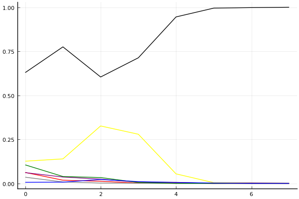
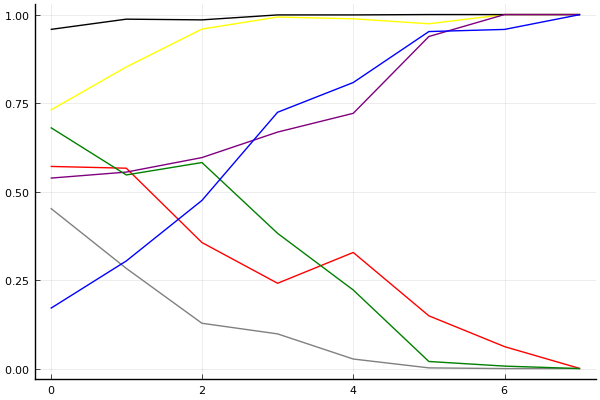

2020 시즌 1 개인전 16강 패자전

## 경기 결과

| 트랙 | 신종민 | 이재혁 | 최영훈 | 한승철 | 김기수 | 김승태 | 최민석 |
|:---|---:|---:|---:|---:|---:|---:|---:|
| [어비스 스카이라인](../skyline) | 7 | 10 | 3 | 0 | 4 | 1 | 5 |
| [아이스 아찔한 헬기점프](../heli) | 10 | 3 | 1 | 0 | 4 | 5 | 7 |
| [어비스 숨겨진 바닷길](../hiddenoceanroad) | 7 | 10 | 1 | 3 | 4 | 0 | 5 |
| [[리버스] 사막 빙글빙글 공사장](../rsabing) | 0 | 10 | 7 | 1 | 5 | 3 | 4 |
| [공동묘지 해골성 대탐험](../skullcastle) | 1 | 10 | 4 | 3 | 7 | 0 | 5 |
| [포레스트 지그재그](../zigzag) | 7 | 5 | 1 | 3 | 10 | 4 | 0 |
| [동화 이상한 나라의 문](../gate) | 7 | 5 | 3 | 0 | 4 | 1 | 10 |
| __total__ |__39__ |__53__ |__20__ |__10__ |__38__ |__14__ |__36__ |

## 시뮬레이션

### 1st 확률

x축: 트랙, y축: 확률
1번: 옐로우, 2번: 블랙, 3번: 레드, 4번: 화이트(회색), 5번: 퍼플, 6번: 그린, 7번: 블루, 8번: 오렌지

| 트랙 | 신종민 | 이재혁 | 최영훈 | 한승철 | 김기수 | 김승태 | 최민석 |
|:---|---:|---:|---:|---:|---:|---:|---:|
| 초기 | 0.126 | 0.629 | 0.062 | 0.035 | 0.061 | 0.105 | 0.006 |
| 어비스 스카이라인 | 0.139 | 0.775 | 0.018 | 0.008 | 0.036 | 0.039 | 0.007 |
| 아이스 아찔한 헬기점프 | 0.326 | 0.604 | 0.012 | 0.002 | 0.024 | 0.033 | 0.022 |
| 어비스 숨겨진 바닷길 | 0.279 | 0.713 | 0.002 | 0.001 | 0.007 | 0.005 | 0.010 |
| [리버스] 사막 빙글빙글 공사장 | 0.054 | 0.945 | 0.002 | 0.000 | 0.006 | 0.000 | 0.005 |
| 공동묘지 해골성 대탐험 | 0.004 | 0.995 | 0.000 | 0.000 | 0.000 | 0.000 | 0.002 |
| 포레스트 지그재그 | 0.003 | 0.998 | 0.000 | 0.000 | 0.002 | 0.000 | 0.000 |
| 동화 이상한 나라의 문 | 0.000 | 1.000 | 0.000 | 0.000 | 0.000 | 0.000 | 0.000 |

### Advance 확률

x축: 트랙, y축: 확률
1번: 옐로우, 2번: 블랙, 3번: 레드, 4번: 화이트(회색), 5번: 퍼플, 6번: 그린, 7번: 블루, 8번: 오렌지

| 트랙 | 신종민 | 이재혁 | 최영훈 | 한승철 | 김기수 | 김승태 | 최민석 |
|:---|---:|---:|---:|---:|---:|---:|---:|
| 초기 | 0.726 | 0.963 | 0.579 | 0.430 | 0.532 | 0.700 | 0.165 |
| 어비스 스카이라인 | 0.858 | 0.995 | 0.522 | 0.294 | 0.587 | 0.556 | 0.286 |
| 아이스 아찔한 헬기점프 | 0.962 | 0.988 | 0.359 | 0.132 | 0.563 | 0.629 | 0.471 |
| 어비스 숨겨진 바닷길 | 0.995 | 0.998 | 0.230 | 0.111 | 0.661 | 0.388 | 0.706 |
| [리버스] 사막 빙글빙글 공사장 | 0.980 | 1.000 | 0.334 | 0.025 | 0.739 | 0.218 | 0.816 |
| 공동묘지 해골성 대탐험 | 0.978 | 1.000 | 0.153 | 0.010 | 0.936 | 0.015 | 0.961 |
| 포레스트 지그재그 | 1.000 | 1.000 | 0.057 | 0.000 | 1.000 | 0.004 | 0.955 |
| 동화 이상한 나라의 문 | 1.000 | 1.000 | 0.000 | 0.000 | 1.000 | 0.000 | 1.000 |

## 랭킹 변동

### [전체 랭킹](../singles-full)

| 순위 | 변동 | 이름 | 점수 | 변동 | mu | 변동 | sigma | 변동 |
|---:|---:|:---:|---:|---:|---:|---:|---:|---:|
| 2 / 85 | +0 | [이재혁](../ijaehyeok) | 3313 | +29 | 3547 | +29 | 78 | +0 |
| 12 / 85 | +2 | [신종민](../shinjongmin) | 3059 | +19 | 3292 | +18 | 78 | -0 |
| 15 / 85 | +0 | [김승태](../gimseungtae) | 2969 | -54 | 3199 | -54 | 77 | -0 |
| 16 / 85 | +4 | [김기수](../gimgisu) | 2967 | +43 | 3209 | +39 | 81 | -1 |
| 20 / 85 | -4 | [최영훈](../choiyeonghun) | 2934 | -21 | 3163 | -21 | 76 | -0 |
| 28 / 85 | -3 | [한승철](../hanseungcheol) | 2825 | -57 | 3062 | -58 | 79 | -0 |
| 32 / 85 | +7 | [최민석](../choiminseok) | 2739 | +139 | 3059 | +106 | 106 | -11 |

### 시즌 랭킹

| 순위 | 변동 | 이름 | 점수 | 변동 | mu | 변동 | sigma | 변동 |
|---:|---:|:---:|---:|---:|---:|---:|---:|---:|
| 2 / 32 | +6 | [이재혁](../ijaehyeok) | 3036 | +175 | 3435 | +104 | 133 | -24 |
| 9 / 32 | +2 | [신종민](../shinjongmin) | 2864 | +79 | 3240 | +17 | 125 | -21 |
| 12 / 32 | +3 | [김기수](../gimgisu) | 2711 | +187 | 3093 | +112 | 127 | -25 |
| 13 / 32 | +3 | [최민석](../choiminseok) | 2668 | +152 | 3032 | +94 | 121 | -19 |
| 14 / 32 | -1 | [최영훈](../choiyeonghun) | 2652 | -6 | 2971 | -40 | 107 | -11 |
| 16 / 32 | -4 | [한승철](../hanseungcheol) | 2522 | -142 | 2903 | -209 | 127 | -22 |
| 19 / 32 | +1 | [김승태](../gimseungtae) | 2414 | +5 | 2780 | -53 | 122 | -19 |

### 트랙 별 랭킹

#### [[리버스] 사막 빙글빙글 공사장](../rsabing)

| 순위 | 변동 | 이름 | 점수 | 변동 | mu | 변동 | sigma | 변동 |
|:---:|:---:|:---:|---:|---:|---:|---:|---:|---:|
| 2 / 15 | NaN | [이재혁](../ijaehyeok) | 2065 | +2065 | 4210 | +1210 | 715 | -285 |
| 4 / 15 | NaN | [최영훈](../choiyeonghun) | 1769 | +1769 | 3678 | +678 | 636 | -364 |
| 6 / 15 | NaN | [김기수](../gimgisu) | 1477 | +1477 | 3316 | +316 | 613 | -387 |
| 8 / 15 | NaN | [최민석](../choiminseok) | 1179 | +1179 | 3000 | +0 | 607 | -393 |
| 10 / 15 | NaN | [김승태](../gimseungtae) | 845 | +845 | 2684 | -316 | 613 | -387 |
| 12 / 15 | NaN | [한승철](../hanseungcheol) | 413 | +413 | 2322 | -678 | 636 | -364 |
| 14 / 15 | NaN | [신종민](../shinjongmin) | -356 | -356 | 1790 | -1210 | 715 | -285 |

#### [공동묘지 해골성 대탐험](../skullcastle)

| 순위 | 변동 | 이름 | 점수 | 변동 | mu | 변동 | sigma | 변동 |
|:---:|:---:|:---:|---:|---:|---:|---:|---:|---:|
| 1 / 7 | NaN | [이재혁](../ijaehyeok) | 2065 | +2065 | 4210 | +1210 | 715 | -285 |
| 2 / 7 | NaN | [김기수](../gimgisu) | 1769 | +1769 | 3678 | +678 | 636 | -364 |
| 3 / 7 | NaN | [최민석](../choiminseok) | 1477 | +1477 | 3316 | +316 | 613 | -387 |
| 4 / 7 | NaN | [최영훈](../choiyeonghun) | 1179 | +1179 | 3000 | +0 | 607 | -393 |
| 5 / 7 | NaN | [한승철](../hanseungcheol) | 845 | +845 | 2684 | -316 | 613 | -387 |
| 6 / 7 | NaN | [신종민](../shinjongmin) | 413 | +413 | 2322 | -678 | 636 | -364 |
| 7 / 7 | NaN | [김승태](../gimseungtae) | -356 | -356 | 1790 | -1210 | 715 | -285 |

#### [동화 이상한 나라의 문](../gate)

| 순위 | 변동 | 이름 | 점수 | 변동 | mu | 변동 | sigma | 변동 |
|:---:|:---:|:---:|---:|---:|---:|---:|---:|---:|
| 7 / 29 | +0 | [신종민](../shinjongmin) | 2708 | +50 | 4114 | -500 | 469 | -183 |
| 9 / 29 | +8 | [최민석](../choiminseok) | 2234 | +787 | 3389 | +593 | 385 | -64 |
| 12 / 29 | -1 | [최영훈](../choiyeonghun) | 2113 | +28 | 3123 | -162 | 337 | -64 |
| 13 / 29 | +6 | [이재혁](../ijaehyeok) | 1946 | +646 | 3207 | +235 | 420 | -137 |
| 14 / 29 | -2 | [김승태](../gimseungtae) | 1867 | -31 | 2958 | -268 | 364 | -79 |
| 17 / 29 | -4 | [한승철](../hanseungcheol) | 1600 | -215 | 2740 | -409 | 380 | -65 |
| 19 / 29 | +5 | [김기수](../gimgisu) | 1420 | +827 | 2591 | +489 | 391 | -113 |

#### [아이스 아찔한 헬기점프](../heli)

| 순위 | 변동 | 이름 | 점수 | 변동 | mu | 변동 | sigma | 변동 |
|:---:|:---:|:---:|---:|---:|---:|---:|---:|---:|
| 4 / 26 | +3 | [최민석](../choiminseok) | 2368 | +337 | 3444 | +107 | 359 | -76 |
| 6 / 26 | -4 | [이재혁](../ijaehyeok) | 2269 | -389 | 3569 | -924 | 433 | -178 |
| 8 / 26 | +10 | [신종민](../shinjongmin) | 2002 | +843 | 3143 | +616 | 380 | -76 |
| 10 / 26 | +5 | [김기수](../gimgisu) | 1884 | +456 | 3093 | +56 | 403 | -133 |
| 12 / 26 | +7 | [김승태](../gimseungtae) | 1837 | +741 | 3054 | +333 | 406 | -136 |
| 13 / 26 | -1 | [최영훈](../choiyeonghun) | 1668 | +115 | 2736 | -87 | 356 | -67 |
| 18 / 26 | -7 | [한승철](../hanseungcheol) | 1358 | -249 | 2666 | -541 | 436 | -97 |

#### [어비스 숨겨진 바닷길](../hiddenoceanroad)

| 순위 | 변동 | 이름 | 점수 | 변동 | mu | 변동 | sigma | 변동 |
|:---:|:---:|:---:|---:|---:|---:|---:|---:|---:|
| 1 / 32 | +0 | [이재혁](../ijaehyeok) | 3027 | +260 | 4402 | +125 | 458 | -45 |
| 6 / 32 | -2 | [최영훈](../choiyeonghun) | 2274 | -217 | 3265 | -396 | 331 | -60 |
| 9 / 32 | +9 | [신종민](../shinjongmin) | 2107 | +514 | 3225 | +301 | 373 | -71 |
| 13 / 32 | +6 | [김기수](../gimgisu) | 1868 | +314 | 2956 | +46 | 363 | -89 |
| 16 / 32 | +4 | [한승철](../hanseungcheol) | 1722 | +265 | 2779 | +25 | 352 | -80 |
| 18 / 32 | -6 | [김승태](../gimseungtae) | 1625 | -198 | 2738 | -387 | 371 | -63 |
| 21 / 32 | +8 | [최민석](../choiminseok) | 1507 | +856 | 2656 | +541 | 383 | -105 |

#### [어비스 스카이라인](../skyline)

| 순위 | 변동 | 이름 | 점수 | 변동 | mu | 변동 | sigma | 변동 |
|:---:|:---:|:---:|---:|---:|---:|---:|---:|---:|
| 8 / 29 | +3 | [신종민](../shinjongmin) | 2353 | +228 | 3453 | +10 | 366 | -73 |
| 11 / 29 | +5 | [이재혁](../ijaehyeok) | 2138 | +600 | 3253 | +426 | 372 | -58 |
| 13 / 29 | -1 | [최민석](../choiminseok) | 1973 | +283 | 3148 | -23 | 391 | -102 |
| 17 / 29 | +1 | [최영훈](../choiyeonghun) | 1570 | +121 | 2635 | -94 | 355 | -72 |
| 20 / 29 | -3 | [한승철](../hanseungcheol) | 1147 | -377 | 2440 | -684 | 431 | -102 |
| 21 / 29 | +5 | [김기수](../gimgisu) | 1134 | +1180 | 2539 | +471 | 469 | -236 |
| 22 / 29 | +0 | [김승태](../gimseungtae) | 1109 | +205 | 2270 | -67 | 387 | -90 |

#### [포레스트 지그재그](../zigzag)

| 순위 | 변동 | 이름 | 점수 | 변동 | mu | 변동 | sigma | 변동 |
|:---:|:---:|:---:|---:|---:|---:|---:|---:|---:|
| 3 / 56 | +0 | [이재혁](../ijaehyeok) | 3377 | +2 | 3939 | -27 | 187 | -10 |
| 6 / 56 | +0 | [김승태](../gimseungtae) | 3087 | -1 | 3769 | -55 | 227 | -18 |
| 11 / 56 | -1 | [한승철](../hanseungcheol) | 2885 | -29 | 3594 | -88 | 236 | -20 |
| 13 / 56 | +6 | [김기수](../gimgisu) | 2793 | +477 | 3824 | +325 | 343 | -51 |
| 18 / 56 | +12 | [신종민](../shinjongmin) | 2373 | +573 | 3370 | +377 | 333 | -65 |
| 27 / 56 | -1 | [최영훈](../choiyeonghun) | 2022 | +73 | 2798 | +8 | 258 | -22 |
| 33 / 56 | -2 | [최민석](../choiminseok) | 1628 | -139 | 2764 | -307 | 379 | -56 |
