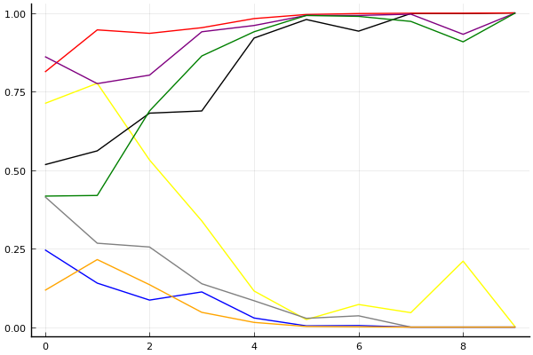

2020 시즌 1 개인전 16강 최종전

## 경기 결과

| 트랙 | 박도현 | 전대웅 | 박인수 | 배성빈 | 이재혁 | 신종민 | 김기수 | 최민석 |
|:---|---:|---:|---:|---:|---:|---:|---:|---:|
| [어비스 스카이라인](../skyline) | 5 | 4 | 10 | 0 | 1 | 3 | -1 | 7 |
| [[리버스] 사막 빙글빙글 공사장](../rsabing) | -1 | 7 | 4 | 3 | 5 | 10 | 1 | 0 |
| [아이스 아찔한 헬기점프](../heli) | 0 | 3 | 4 | 1 | 10 | 7 | 5 | -1 |
| [공동묘지 해골성 대탐험](../skullcastle) | 1 | 10 | 7 | 3 | 4 | 5 | -1 | 0 |
| [포레스트 지그재그](../zigzag) | 1 | 4 | 5 | 3 | 10 | 7 | 0 | -1 |
| [어비스 숨겨진 바닷길](../hiddenoceanroad) | 7 | -1 | 10 | 3 | 1 | 0 | 4 | 5 |
| [동화 이상한 나라의 문](../gate) | 7 | 10 | 5 | -1 | 3 | 1 | 0 | 4 |
| [공동묘지 마왕의 초대](../mawang) | 10 | 7 | 1 | 5 | 3 | 4 | 0 | -1 |
| [쥐라기 공룡섬 대모험](../dinoisland) | 0 | -1 | 5 | 4 | 7 | 1 | 10 | 3 |
| __total__ |__30__ |__43__ |__51__ |__21__ |__44__ |__38__ |__18__ |__16__ |

## 시뮬레이션

### 1st 확률

x축: 트랙, y축: 확률
1번: 옐로우, 2번: 블랙, 3번: 레드, 4번: 화이트(회색), 5번: 퍼플, 6번: 그린, 7번: 블루, 8번: 오렌지

| 트랙 | 박도현 | 전대웅 | 박인수 | 배성빈 | 이재혁 | 신종민 | 김기수 | 최민석 |
|:---|---:|---:|---:|---:|---:|---:|---:|---:|
| 초기 | 0.196 | 0.075 | 0.250 | 0.033 | 0.383 | 0.052 | 0.026 | 0.000 |
| 어비스 스카이라인 | 0.182 | 0.066 | 0.470 | 0.028 | 0.226 | 0.041 | 0.003 | 0.011 |
| [리버스] 사막 빙글빙글 공사장 | 0.076 | 0.134 | 0.465 | 0.012 | 0.239 | 0.087 | 0.002 | 0.008 |
| 아이스 아찔한 헬기점프 | 0.019 | 0.071 | 0.377 | 0.005 | 0.392 | 0.156 | 0.001 | 0.001 |
| 공동묘지 해골성 대탐험 | 0.008 | 0.186 | 0.437 | 0.001 | 0.249 | 0.148 | 0.000 | 0.000 |
| 포레스트 지그재그 | 0.001 | 0.102 | 0.329 | 0.002 | 0.392 | 0.218 | 0.000 | 0.000 |
| 어비스 숨겨진 바닷길 | 0.000 | 0.025 | 0.757 | 0.000 | 0.171 | 0.071 | 0.000 | 0.000 |
| 동화 이상한 나라의 문 | 0.000 | 0.075 | 0.865 | 0.000 | 0.063 | 0.023 | 0.000 | 0.000 |
| 공동묘지 마왕의 초대 | 0.006 | 0.304 | 0.675 | 0.000 | 0.047 | 0.020 | 0.000 | 0.000 |
| 쥐라기 공룡섬 대모험 | 0.000 | 0.000 | 1.000 | 0.000 | 0.000 | 0.000 | 0.000 | 0.000 |

### Advance 확률

x축: 트랙, y축: 확률
1번: 옐로우, 2번: 블랙, 3번: 레드, 4번: 화이트(회색), 5번: 퍼플, 6번: 그린, 7번: 블루, 8번: 오렌지

| 트랙 | 박도현 | 전대웅 | 박인수 | 배성빈 | 이재혁 | 신종민 | 김기수 | 최민석 |
|:---|---:|---:|---:|---:|---:|---:|---:|---:|
| 초기 | 0.727 | 0.515 | 0.815 | 0.371 | 0.876 | 0.423 | 0.276 | 0.105 |
| 어비스 스카이라인 | 0.768 | 0.566 | 0.923 | 0.283 | 0.796 | 0.395 | 0.149 | 0.219 |
| [리버스] 사막 빙글빙글 공사장 | 0.533 | 0.719 | 0.936 | 0.209 | 0.818 | 0.667 | 0.099 | 0.120 |
| 아이스 아찔한 헬기점프 | 0.322 | 0.700 | 0.949 | 0.156 | 0.947 | 0.856 | 0.113 | 0.051 |
| 공동묘지 해골성 대탐험 | 0.143 | 0.927 | 0.974 | 0.089 | 0.954 | 0.931 | 0.018 | 0.007 |
| 포레스트 지그재그 | 0.022 | 0.975 | 0.998 | 0.034 | 0.997 | 0.988 | 0.001 | 0.000 |
| 어비스 숨겨진 바닷길 | 0.068 | 0.938 | 1.000 | 0.036 | 0.993 | 0.990 | 0.004 | 0.002 |
| 동화 이상한 나라의 문 | 0.053 | 0.997 | 1.000 | 0.002 | 0.992 | 0.976 | 0.000 | 0.000 |
| 공동묘지 마왕의 초대 | 0.210 | 0.997 | 1.000 | 0.000 | 0.944 | 0.909 | 0.000 | 0.000 |
| 쥐라기 공룡섬 대모험 | 0.000 | 1.000 | 1.000 | 0.000 | 1.000 | 1.000 | 0.000 | 0.000 |

## 랭킹 변동

### [전체 랭킹](../singles-full)

| 순위 | 변동 | 이름 | 점수 | 변동 | mu | 변동 | sigma | 변동 |
|---:|---:|:---:|---:|---:|---:|---:|---:|---:|
| 2 / 85 | +0 | [이재혁](../ijaehyeok) | 3313 | +0 | 3546 | -2 | 77 | -1 |
| 3 / 85 | +0 | [박인수](../bakinsu) | 3300 | +26 | 3530 | +25 | 77 | -0 |
| 7 / 85 | -1 | [박도현](../bakdohyeon) | 3182 | -22 | 3418 | -25 | 79 | -1 |
| 8 / 85 | +0 | [전대웅](../jeondaewoong) | 3136 | +20 | 3365 | +20 | 76 | +0 |
| 10 / 85 | +2 | [신종민](../shinjongmin) | 3090 | +31 | 3321 | +29 | 77 | -1 |
| 14 / 85 | +0 | [배성빈](../baeseongbin) | 3035 | -19 | 3266 | -21 | 77 | -1 |
| 17 / 85 | -1 | [김기수](../gimgisu) | 2947 | -20 | 3186 | -23 | 80 | -1 |
| 32 / 85 | +0 | [최민석](../choiminseok) | 2754 | +15 | 3046 | -12 | 97 | -9 |

### 시즌 랭킹

| 순위 | 변동 | 이름 | 점수 | 변동 | mu | 변동 | sigma | 변동 |
|---:|---:|:---:|---:|---:|---:|---:|---:|---:|
| 2 / 32 | +1 | [박인수](../bakinsu) | 3114 | +103 | 3426 | +61 | 104 | -14 |
| 3 / 32 | -1 | [이재혁](../ijaehyeok) | 3101 | +65 | 3438 | +3 | 112 | -21 |
| 4 / 32 | +4 | [전대웅](../jeondaewoong) | 3007 | +62 | 3317 | +24 | 103 | -12 |
| 8 / 32 | -1 | [박도현](../bakdohyeon) | 2964 | +7 | 3246 | -16 | 94 | -8 |
| 9 / 32 | +0 | [신종민](../shinjongmin) | 2959 | +95 | 3282 | +43 | 108 | -17 |
| 11 / 32 | +0 | [배성빈](../baeseongbin) | 2813 | +14 | 3123 | -29 | 103 | -14 |
| 12 / 32 | +0 | [김기수](../gimgisu) | 2721 | +9 | 3051 | -43 | 110 | -17 |
| 13 / 32 | +0 | [최민석](../choiminseok) | 2671 | +3 | 2991 | -41 | 107 | -15 |

### 트랙 별 랭킹

#### [[리버스] 사막 빙글빙글 공사장](../rsabing)

| 순위 | 변동 | 이름 | 점수 | 변동 | mu | 변동 | sigma | 변동 |
|:---:|:---:|:---:|---:|---:|---:|---:|---:|---:|
| 1 / 15 | +2 | [전대웅](../jeondaewoong) | 2368 | +481 | 3759 | -4 | 464 | -162 |
| 2 / 15 | +0 | [이재혁](../ijaehyeok) | 2248 | +183 | 3707 | -504 | 486 | -229 |
| 4 / 15 | +10 | [신종민](../shinjongmin) | 1774 | +2130 | 3317 | +1527 | 514 | -201 |
| 7 / 15 | -1 | [김기수](../gimgisu) | 1548 | +71 | 2882 | -434 | 445 | -168 |
| 8 / 15 | +1 | [배성빈](../baeseongbin) | 1542 | +453 | 2846 | -18 | 434 | -157 |
| 10 / 15 | -2 | [최민석](../choiminseok) | 1203 | +23 | 2562 | -438 | 453 | -154 |
| 11 / 15 | +4 | [박인수](../bakinsu) | 1198 | +1585 | 2620 | +894 | 474 | -230 |
| 13 / 15 | -2 | [박도현](../bakdohyeon) | 608 | -168 | 2073 | -503 | 488 | -112 |

#### [공동묘지 마왕의 초대](../mawang)

| 순위 | 변동 | 이름 | 점수 | 변동 | mu | 변동 | sigma | 변동 |
|:---:|:---:|:---:|---:|---:|---:|---:|---:|---:|
| 1 / 52 | +0 | [전대웅](../jeondaewoong) | 3203 | +126 | 4096 | +9 | 297 | -39 |
| 2 / 52 | +4 | [박도현](../bakdohyeon) | 2926 | +420 | 3891 | +302 | 322 | -39 |
| 4 / 52 | +3 | [배성빈](../baeseongbin) | 2712 | +212 | 3586 | +90 | 291 | -41 |
| 8 / 52 | +10 | [신종민](../shinjongmin) | 2366 | +313 | 3365 | +108 | 333 | -68 |
| 9 / 52 | +0 | [박인수](../bakinsu) | 2289 | +84 | 3150 | -30 | 287 | -38 |
| 10 / 52 | +9 | [이재혁](../ijaehyeok) | 2257 | +251 | 3331 | -18 | 358 | -90 |
| 23 / 52 | -15 | [최민석](../choiminseok) | 1793 | -704 | 3228 | -1257 | 478 | -184 |
| 25 / 52 | +4 | [김기수](../gimgisu) | 1746 | +212 | 2991 | -199 | 415 | -137 |

#### [공동묘지 해골성 대탐험](../skullcastle)

| 순위 | 변동 | 이름 | 점수 | 변동 | mu | 변동 | sigma | 변동 |
|:---:|:---:|:---:|---:|---:|---:|---:|---:|---:|
| 1 / 11 | NaN | [전대웅](../jeondaewoong) | 2298 | +2298 | 4338 | +1338 | 680 | -320 |
| 2 / 11 | -1 | [이재혁](../ijaehyeok) | 2235 | +170 | 3697 | -514 | 487 | -228 |
| 3 / 11 | NaN | [박인수](../bakinsu) | 2079 | +2079 | 3848 | +848 | 590 | -410 |
| 4 / 11 | +2 | [신종민](../shinjongmin) | 1756 | +1343 | 3153 | +831 | 466 | -171 |
| 5 / 11 | -2 | [최민석](../choiminseok) | 1524 | +48 | 2904 | -411 | 460 | -153 |
| 6 / 11 | NaN | [배성빈](../baeseongbin) | 1492 | +1492 | 3136 | +136 | 548 | -452 |
| 7 / 11 | -5 | [김기수](../gimgisu) | 1309 | -460 | 2788 | -890 | 493 | -143 |
| 8 / 11 | NaN | [박도현](../bakdohyeon) | 1271 | +1271 | 2923 | -77 | 551 | -449 |

#### [동화 이상한 나라의 문](../gate)

| 순위 | 변동 | 이름 | 점수 | 변동 | mu | 변동 | sigma | 변동 |
|:---:|:---:|:---:|---:|---:|---:|---:|---:|---:|
| 2 / 29 | +0 | [박도현](../bakdohyeon) | 3355 | +125 | 4247 | +4 | 297 | -41 |
| 3 / 29 | +0 | [박인수](../bakinsu) | 3089 | +135 | 4025 | -21 | 312 | -52 |
| 5 / 29 | +6 | [전대웅](../jeondaewoong) | 2761 | +631 | 3779 | +471 | 339 | -53 |
| 7 / 29 | +0 | [신종민](../shinjongmin) | 2613 | -95 | 3720 | -394 | 369 | -99 |
| 8 / 29 | -4 | [배성빈](../baeseongbin) | 2594 | -348 | 3577 | -490 | 327 | -47 |
| 9 / 29 | +0 | [최민석](../choiminseok) | 2537 | +304 | 3508 | +119 | 324 | -62 |
| 11 / 29 | +2 | [이재혁](../ijaehyeok) | 2289 | +343 | 3319 | +112 | 343 | -77 |
| 15 / 29 | +4 | [김기수](../gimgisu) | 1737 | +317 | 2732 | +141 | 332 | -59 |

#### [아이스 아찔한 헬기점프](../heli)

| 순위 | 변동 | 이름 | 점수 | 변동 | mu | 변동 | sigma | 변동 |
|:---:|:---:|:---:|---:|---:|---:|---:|---:|---:|
| 1 / 26 | +5 | [이재혁](../ijaehyeok) | 2720 | +451 | 3852 | +283 | 377 | -56 |
| 2 / 26 | -1 | [박도현](../bakdohyeon) | 2539 | -215 | 3422 | -342 | 294 | -42 |
| 3 / 26 | -1 | [전대웅](../jeondaewoong) | 2507 | -35 | 3440 | -201 | 311 | -55 |
| 5 / 26 | +3 | [신종민](../shinjongmin) | 2387 | +384 | 3363 | +220 | 325 | -55 |
| 7 / 26 | +3 | [김기수](../gimgisu) | 2237 | +353 | 3240 | +147 | 334 | -69 |
| 8 / 26 | -4 | [최민석](../choiminseok) | 2130 | -237 | 3078 | -366 | 316 | -43 |
| 10 / 26 | +5 | [박인수](../bakinsu) | 1948 | +417 | 2962 | +193 | 338 | -75 |
| 22 / 26 | +2 | [배성빈](../baeseongbin) | 1021 | +1248 | 2256 | +758 | 412 | -163 |

#### [어비스 숨겨진 바닷길](../hiddenoceanroad)

| 순위 | 변동 | 이름 | 점수 | 변동 | mu | 변동 | sigma | 변동 |
|:---:|:---:|:---:|---:|---:|---:|---:|---:|---:|
| 1 / 32 | +2 | [박도현](../bakdohyeon) | 2710 | +188 | 3568 | +75 | 286 | -38 |
| 2 / 32 | -1 | [이재혁](../ijaehyeok) | 2683 | -344 | 3765 | -636 | 361 | -97 |
| 4 / 32 | +4 | [박인수](../bakinsu) | 2526 | +415 | 3454 | +301 | 309 | -38 |
| 6 / 32 | +1 | [배성빈](../baeseongbin) | 2333 | +118 | 3280 | -64 | 316 | -61 |
| 9 / 32 | +4 | [김기수](../gimgisu) | 2158 | +290 | 3080 | +124 | 307 | -55 |
| 11 / 32 | -2 | [신종민](../shinjongmin) | 2083 | -24 | 3043 | -182 | 320 | -53 |
| 13 / 32 | +8 | [최민석](../choiminseok) | 2002 | +496 | 2963 | +307 | 320 | -63 |
| 21 / 32 | -4 | [전대웅](../jeondaewoong) | 1598 | -89 | 2594 | -199 | 332 | -37 |

#### [어비스 스카이라인](../skyline)

| 순위 | 변동 | 이름 | 점수 | 변동 | mu | 변동 | sigma | 변동 |
|:---:|:---:|:---:|---:|---:|---:|---:|---:|---:|
| 1 / 29 | +8 | [박인수](../bakinsu) | 2717 | +384 | 3676 | +267 | 320 | -39 |
| 2 / 29 | +2 | [박도현](../bakdohyeon) | 2671 | +140 | 3508 | +29 | 279 | -37 |
| 9 / 29 | -1 | [신종민](../shinjongmin) | 2418 | +64 | 3352 | -101 | 311 | -55 |
| 10 / 29 | +3 | [최민석](../choiminseok) | 2412 | +439 | 3401 | +253 | 330 | -62 |
| 11 / 29 | -1 | [전대웅](../jeondaewoong) | 2363 | +199 | 3276 | +45 | 304 | -51 |
| 12 / 29 | -1 | [이재혁](../ijaehyeok) | 2188 | +50 | 3137 | -116 | 316 | -55 |
| 13 / 29 | -1 | [배성빈](../baeseongbin) | 2046 | -88 | 3055 | -266 | 336 | -59 |
| 22 / 29 | -1 | [김기수](../gimgisu) | 1073 | -60 | 2301 | -238 | 409 | -59 |

#### [쥐라기 공룡섬 대모험](../dinoisland)

| 순위 | 변동 | 이름 | 점수 | 변동 | mu | 변동 | sigma | 변동 |
|:---:|:---:|:---:|---:|---:|---:|---:|---:|---:|
| 1 / 32 | +1 | [박인수](../bakinsu) | 2827 | +120 | 3842 | -85 | 338 | -68 |
| 2 / 32 | +3 | [이재혁](../ijaehyeok) | 2809 | +307 | 3929 | +30 | 373 | -92 |
| 5 / 32 | -4 | [신종민](../shinjongmin) | 2542 | -331 | 3713 | -710 | 390 | -126 |
| 8 / 32 | +11 | [김기수](../gimgisu) | 2295 | +867 | 3404 | +650 | 370 | -72 |
| 9 / 32 | -1 | [박도현](../bakdohyeon) | 2285 | -34 | 3108 | -125 | 274 | -30 |
| 10 / 32 | +4 | [배성빈](../baeseongbin) | 2199 | +363 | 3210 | +151 | 337 | -71 |
| 16 / 32 | -3 | [전대웅](../jeondaewoong) | 1733 | -115 | 2742 | -237 | 336 | -41 |
| 19 / 32 | +6 | [최민석](../choiminseok) | 1640 | +734 | 2757 | +416 | 373 | -106 |

#### [포레스트 지그재그](../zigzag)

| 순위 | 변동 | 이름 | 점수 | 변동 | mu | 변동 | sigma | 변동 |
|:---:|:---:|:---:|---:|---:|---:|---:|---:|---:|
| 2 / 56 | +1 | [이재혁](../ijaehyeok) | 3453 | +76 | 3998 | +59 | 182 | -6 |
| 5 / 56 | +0 | [전대웅](../jeondaewoong) | 3167 | +0 | 3716 | -28 | 183 | -9 |
| 6 / 56 | +1 | [박인수](../bakinsu) | 3099 | +40 | 3622 | +16 | 175 | -8 |
| 15 / 56 | +3 | [신종민](../shinjongmin) | 2687 | +314 | 3561 | +191 | 292 | -41 |
| 17 / 56 | -4 | [김기수](../gimgisu) | 2610 | -183 | 3508 | -315 | 299 | -44 |
| 19 / 56 | +1 | [박도현](../bakdohyeon) | 2383 | +56 | 3176 | -38 | 264 | -31 |
| 22 / 56 | +4 | [배성빈](../baeseongbin) | 2212 | +181 | 2981 | +95 | 256 | -29 |
| 36 / 56 | -3 | [최민석](../choiminseok) | 1568 | -60 | 2593 | -171 | 342 | -37 |
