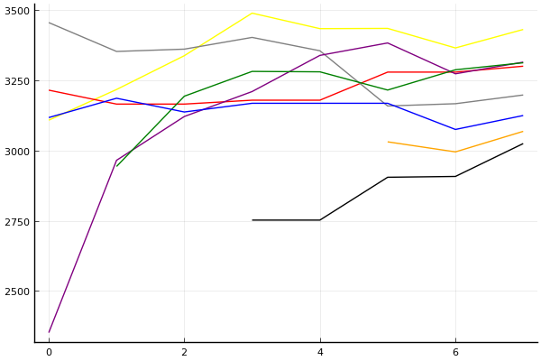

32강

### 선수

문호준
김응태
유창현
유영혁
박인수
이재혁
전대웅
신종민

### 경기 시뮬레이션

| 순위 | 문호준 | 김응태 | 유창현 | 유영혁 | 박인수 | 이재혁 | 전대웅 | 신종민 |
|:---:|---:|---:|---:|---:|---:|---:|---:|---:|
| 1위 | 0.408 | 0.010 | 0.161 | 0.060 | 0.173 | 0.172 | 0.027 | 0.016 |
| 2위 | 0.225 | 0.027 | 0.192 | 0.109 | 0.190 | 0.192 | 0.064 | 0.043 |
| 3위 | 0.147 | 0.048 | 0.175 | 0.131 | 0.177 | 0.180 | 0.093 | 0.070 |
| 4위 | 0.095 | 0.077 | 0.153 | 0.151 | 0.153 | 0.153 | 0.123 | 0.097 |
| 5위 | 0.063 | 0.118 | 0.130 | 0.155 | 0.122 | 0.118 | 0.162 | 0.138 |
| 6위 | 0.034 | 0.168 | 0.091 | 0.159 | 0.092 | 0.092 | 0.176 | 0.173 |
| 7위 | 0.020 | 0.232 | 0.061 | 0.134 | 0.060 | 0.059 | 0.189 | 0.214 |
| 8위 | 0.009 | 0.320 | 0.036 | 0.100 | 0.033 | 0.034 | 0.165 | 0.249 |
| 진출 | 0.779 | 0.085 | 0.528 | 0.301 | 0.540 | 0.544 | 0.184 | 0.129 |
| 패부 | 0.158 | 0.195 | 0.283 | 0.306 | 0.275 | 0.271 | 0.285 | 0.235 |
| 탈락 | 0.063 | 0.719 | 0.189 | 0.393 | 0.185 | 0.185 | 0.531 | 0.636 |

### 전체 랭킹

| 순위 | 이름 | 점수 | mu | sigma | 주행 | 8인전 1-2-Mid-Lo | 8인전 평균득점 | 8인전 표준편차 | 2인전 전적 |
|---:|:---:|---:|---:|---:|---:|:---:|---:|---:|:---:|
| 1 / 85 | [문호준](../munhojun) | 3431 | 3666 | 78 | 283 | 29-19-30-22 | 5.53 | 3.66 | 0-0 |
| 2 / 85 | [박인수](../bakinsu) | 3314 | 3544 | 77 | 280 | 27-12-31-31 | 4.76 | 3.91 | 0-0 |
| 3 / 85 | [이재혁](../ijaehyeok) | 3312 | 3541 | 76 | 240 | 26-10-37-27 | 4.82 | 3.75 | 0-0 |
| 4 / 85 | [유창현](../yuchanghyeon) | 3300 | 3532 | 77 | 231 | 18-18-38-26 | 4.60 | 3.50 | 0-0 |
| 6 / 85 | [유영혁](../yuyeonghyeok) | 3197 | 3425 | 76 | 300 | 16-16-41-27 | 4.46 | 3.36 | 0-0 |
| 8 / 85 | [전대웅](../jeondaewoong) | 3124 | 3354 | 76 | 213 | 13-17-41-29 | 4.11 | 3.45 | 0-0 |
| 10 / 85 | [신종민](../shinjongmin) | 3068 | 3299 | 77 | 134 | 13-13-31-42 | 3.58 | 3.59 | 0-0 |
| 14 / 85 | [김응태](../gimeungtae) | 3025 | 3256 | 77 | 122 | 9-11-37-43 | 3.18 | 3.34 | 0-0 |

### 시즌 랭킹

#### [2020 시즌 1](../singles=s2020_1)

| 순위 | 이름 | 점수 | mu | sigma | 주행 | 8인전 1-2-Mid-Lo | 8인전 평균득점 | 8인전 표준편차 | 2인전 전적 |
|---:|:---:|---:|---:|---:|---:|:---:|---:|---:|:---:|
| 1 / 32 | [문호준](../munhojun) | 3340 | 3638 | 99 | 47 | 33-19-26-21 | 5.86 | 3.66 | 0-0 |
| 2 / 32 | [박인수](../bakinsu) | 3188 | 3460 | 91 | 54 | 28-11-35-26 | 4.96 | 3.85 | 0-0 |
| 3 / 32 | [유창현](../yuchanghyeon) | 3170 | 3456 | 95 | 48 | 5-23-58-14 | 4.47 | 2.54 | 0-0 |
| 4 / 32 | [이재혁](../ijaehyeok) | 3169 | 3448 | 93 | 50 | 21-12-42-26 | 4.65 | 3.50 | 0-0 |
| 5 / 32 | [유영혁](../yuyeonghyeok) | 3066 | 3337 | 91 | 52 | 15-13-38-33 | 4.15 | 3.46 | 0-0 |
| 6 / 32 | [전대웅](../jeondaewoong) | 3021 | 3291 | 90 | 54 | 11-19-39-31 | 3.87 | 3.52 | 0-0 |
| 8 / 32 | [신종민](../shinjongmin) | 2959 | 3235 | 92 | 50 | 9-19-23-49 | 3.33 | 3.46 | 0-0 |
| 9 / 32 | [김응태](../gimeungtae) | 2924 | 3196 | 90 | 53 | 11-11-38-40 | 3.45 | 3.47 | 0-0 |

#### [2019 시즌 2](../singles=s2019_2)

| 순위 | 이름 | 점수 | mu | sigma | 주행 | 8인전 1-2-Mid-Lo | 8인전 평균득점 | 8인전 표준편차 | 2인전 전적 |
|---:|:---:|---:|---:|---:|---:|:---:|---:|---:|:---:|
| 1 / 32 | [이재혁](../ijaehyeok) | 3288 | 3573 | 95 | 53 | 33-8-35-24 | 5.20 | 4.05 | 0-0 |
| 2 / 32 | [문호준](../munhojun) | 3255 | 3550 | 98 | 42 | 19-19-40-21 | 5.02 | 3.32 | 0-0 |
| 5 / 32 | [박인수](../bakinsu) | 3050 | 3348 | 99 | 42 | 24-12-31-33 | 4.33 | 4.01 | 0-0 |
| 6 / 32 | [유영혁](../yuyeonghyeok) | 3041 | 3330 | 96 | 42 | 12-10-45-33 | 3.76 | 3.11 | 0-0 |
| 11 / 32 | [전대웅](../jeondaewoong) | 2874 | 3207 | 111 | 33 | 18-15-24-42 | 3.73 | 4.07 | 0-0 |
| 12 / 32 | [신종민](../shinjongmin) | 2859 | 3151 | 97 | 42 | 12-7-50-31 | 3.67 | 3.26 | 0-0 |
| 22 / 32 | [김응태](../gimeungtae) | 2251 | 2861 | 203 | 9 | 0-11-33-56 | 2.33 | 2.60 | 0-0 |
| NaN / 32 | [유창현](../yuchanghyeon) | 0 | 3000 | 1000 | 0 | 0-0-0-0 | 0.00 | 0.00 | 0-0 |

#### [2019 시즌 1](../singles=s2019_1)

| 순위 | 이름 | 점수 | mu | sigma | 주행 | 8인전 1-2-Mid-Lo | 8인전 평균득점 | 8인전 표준편차 | 2인전 전적 |
|---:|:---:|---:|---:|---:|---:|:---:|---:|---:|:---:|
| 1 / 32 | [문호준](../munhojun) | 3354 | 3656 | 101 | 45 | 27-32-20-22 | 5.59 | 3.80 | 0-0 |
| 2 / 32 | [박인수](../bakinsu) | 3337 | 3642 | 102 | 47 | 34-15-29-22 | 5.85 | 3.68 | 0-0 |
| 3 / 32 | [유창현](../yuchanghyeon) | 3267 | 3546 | 93 | 52 | 33-17-23-27 | 5.40 | 4.01 | 0-0 |
| 6 / 32 | [신종민](../shinjongmin) | 2964 | 3261 | 99 | 42 | 19-14-21-45 | 3.76 | 4.07 | 0-0 |
| 10 / 32 | [김응태](../gimeungtae) | 2863 | 3181 | 106 | 35 | 11-11-34-43 | 3.31 | 3.59 | 0-0 |
| 19 / 32 | [유영혁](../yuyeonghyeok) | 2401 | 2802 | 134 | 21 | 5-14-29-52 | 2.52 | 3.33 | 0-0 |
| 26 / 32 | [이재혁](../ijaehyeok) | 2139 | 2772 | 211 | 11 | 22-11-22-44 | 3.44 | 4.61 | 0-0 |
| NaN / 32 | [전대웅](../jeondaewoong) | 0 | 3000 | 1000 | 0 | 0-0-0-0 | 0.00 | 0.00 | 0-0 |

#### [2018 듀얼 레이스 X](../singles=s2018_2)

| 순위 | 이름 | 점수 | mu | sigma | 주행 | 8인전 1-2-Mid-Lo | 8인전 평균득점 | 8인전 표준편차 | 2인전 전적 |
|---:|:---:|---:|---:|---:|---:|:---:|---:|---:|:---:|
| 1 / 8 | [박인수](../bakinsu) | 3198 | 3733 | 178 | 16 | 38-12-38-12 | 6.50 | 3.34 | 0-0 |
| 2 / 8 | [이재혁](../ijaehyeok) | 2733 | 3241 | 170 | 16 | 12-25-38-25 | 4.50 | 3.38 | 0-0 |
| 3 / 8 | [문호준](../munhojun) | 2611 | 3142 | 177 | 14 | 12-38-38-12 | 5.38 | 3.29 | 0-0 |
| 4 / 8 | [유영혁](../yuyeonghyeok) | 2583 | 3102 | 173 | 14 | 12-12-50-25 | 4.00 | 3.21 | 0-0 |
| NaN / 8 | [김응태](../gimeungtae) | 0 | 3000 | 1000 | 0 | 0-0-0-0 | 0.00 | 0.00 | 0-0 |
| NaN / 8 | [유창현](../yuchanghyeon) | 0 | 3000 | 1000 | 0 | 0-0-0-0 | 0.00 | 0.00 | 0-0 |
| NaN / 8 | [전대웅](../jeondaewoong) | 0 | 3000 | 1000 | 0 | 0-0-0-0 | 0.00 | 0.00 | 0-0 |
| NaN / 8 | [신종민](../shinjongmin) | 0 | 3000 | 1000 | 0 | 0-0-0-0 | 0.00 | 0.00 | 0-0 |

#### [2018 듀얼 레이스 3](../singles=s2018_1)

| 순위 | 이름 | 점수 | mu | sigma | 주행 | 8인전 1-2-Mid-Lo | 8인전 평균득점 | 8인전 표준편차 | 2인전 전적 |
|---:|:---:|---:|---:|---:|---:|:---:|---:|---:|:---:|
| 1 / 32 | [문호준](../munhojun) | 3546 | 3877 | 110 | 41 | 52-13-19-16 | 6.87 | 3.81 | 0-0 |
| 2 / 32 | [유영혁](../yuyeonghyeok) | 3338 | 3643 | 101 | 44 | 24-24-29-24 | 5.41 | 3.45 | 0-0 |
| 3 / 32 | [이재혁](../ijaehyeok) | 3218 | 3505 | 96 | 49 | 24-14-38-24 | 4.90 | 3.63 | 0-0 |
| 4 / 32 | [박인수](../bakinsu) | 3129 | 3436 | 102 | 40 | 28-12-30-30 | 4.92 | 4.02 | 0-0 |
| 6 / 32 | [유창현](../yuchanghyeon) | 3099 | 3372 | 91 | 52 | 15-12-42-31 | 4.17 | 3.44 | 0-0 |
| 8 / 32 | [전대웅](../jeondaewoong) | 3045 | 3361 | 105 | 35 | 11-14-49-26 | 4.09 | 3.25 | 0-0 |
| 15 / 32 | [김응태](../gimeungtae) | 2612 | 2977 | 122 | 25 | 4-12-40-44 | 2.72 | 2.98 | 0-0 |
| NaN / 32 | [신종민](../shinjongmin) | 0 | 3000 | 1000 | 0 | 0-0-0-0 | 0.00 | 0.00 | 0-0 |

#### [2017 Kespa Cup](../singles=s2017_2)

| 순위 | 이름 | 점수 | mu | sigma | 주행 | 8인전 1-2-Mid-Lo | 8인전 평균득점 | 8인전 표준편차 | 2인전 전적 |
|---:|:---:|---:|---:|---:|---:|:---:|---:|---:|:---:|
| 1 / 32 | [문호준](../munhojun) | 3437 | 3756 | 106 | 40 | 21-21-43-14 | 5.68 | 2.96 | 0-0 |
| 2 / 32 | [유영혁](../yuyeonghyeok) | 3387 | 3706 | 106 | 40 | 21-32-32-14 | 5.71 | 3.25 | 0-0 |
| 3 / 32 | [이재혁](../ijaehyeok) | 3317 | 3655 | 113 | 36 | 41-4-33-22 | 5.67 | 3.98 | 0-0 |
| 4 / 32 | [박인수](../bakinsu) | 3209 | 3504 | 98 | 46 | 27-11-30-32 | 4.62 | 3.95 | 0-0 |
| 9 / 32 | [전대웅](../jeondaewoong) | 2965 | 3322 | 119 | 26 | 12-15-50-23 | 4.38 | 2.98 | 0-0 |
| NaN / 32 | [김응태](../gimeungtae) | 0 | 3000 | 1000 | 0 | 0-0-0-0 | 0.00 | 0.00 | 0-0 |
| NaN / 32 | [유창현](../yuchanghyeon) | 0 | 3000 | 1000 | 0 | 0-0-0-0 | 0.00 | 0.00 | 0-0 |
| NaN / 32 | [신종민](../shinjongmin) | 0 | 3000 | 1000 | 0 | 0-0-0-0 | 0.00 | 0.00 | 0-0 |

#### [2017 듀얼 레이스 2](../singles=s2017_1)

| 순위 | 이름 | 점수 | mu | sigma | 주행 | 8인전 1-2-Mid-Lo | 8인전 평균득점 | 8인전 표준편차 | 2인전 전적 |
|---:|:---:|---:|---:|---:|---:|:---:|---:|---:|:---:|
| 2 / 16 | [유영혁](../yuyeonghyeok) | 2935 | 3217 | 94 | 55 | 9-12-59-19 | 4.28 | 2.99 | 0-0 |
| 4 / 16 | [문호준](../munhojun) | 2809 | 3194 | 129 | 23 | 26-9-26-39 | 4.17 | 4.15 | 0-0 |
| 5 / 16 | [유창현](../yuchanghyeon) | 2796 | 3084 | 96 | 49 | 10-23-19-48 | 3.29 | 3.68 | 0-0 |
| 7 / 16 | [전대웅](../jeondaewoong) | 2765 | 3064 | 100 | 41 | 9-19-47-25 | 4.06 | 3.23 | 0-0 |
| 9 / 16 | [이재혁](../ijaehyeok) | 2686 | 3035 | 117 | 27 | 11-6-44-39 | 3.50 | 3.13 | 0-0 |
| 10 / 16 | [박인수](../bakinsu) | 2606 | 2959 | 118 | 28 | 16-5-26-53 | 2.79 | 3.87 | 0-0 |
| NaN / 16 | [김응태](../gimeungtae) | 0 | 3000 | 1000 | 0 | 0-0-0-0 | 0.00 | 0.00 | 0-0 |
| NaN / 16 | [신종민](../shinjongmin) | 0 | 3000 | 1000 | 0 | 0-0-0-0 | 0.00 | 0.00 | 0-0 |

#### [2016 듀얼 레이스](../singles=s2016_1)

| 순위 | 이름 | 점수 | mu | sigma | 주행 | 8인전 1-2-Mid-Lo | 8인전 평균득점 | 8인전 표준편차 | 2인전 전적 |
|---:|:---:|---:|---:|---:|---:|:---:|---:|---:|:---:|
| 1 / 32 | [유영혁](../yuyeonghyeok) | 3455 | 3814 | 120 | 32 | 29-10-48-14 | 5.76 | 3.24 | 0-0 |
| 2 / 32 | [유창현](../yuchanghyeon) | 3215 | 3566 | 117 | 30 | 27-18-50-5 | 5.82 | 3.13 | 0-0 |
| 3 / 32 | [전대웅](../jeondaewoong) | 3117 | 3495 | 126 | 24 | 21-21-38-21 | 5.00 | 3.55 | 0-0 |
| 5 / 32 | [문호준](../munhojun) | 3108 | 3463 | 118 | 31 | 30-9-35-26 | 5.13 | 3.96 | 0-0 |
| 19 / 32 | [박인수](../bakinsu) | 2352 | 2956 | 202 | 9 | 11-11-22-56 | 3.11 | 3.62 | 0-0 |
| NaN / 32 | [김응태](../gimeungtae) | 0 | 3000 | 1000 | 0 | 0-0-0-0 | 0.00 | 0.00 | 0-0 |
| NaN / 32 | [이재혁](../ijaehyeok) | 0 | 3000 | 1000 | 0 | 0-0-0-0 | 0.00 | 0.00 | 0-0 |
| NaN / 32 | [신종민](../shinjongmin) | 0 | 3000 | 1000 | 0 | 0-0-0-0 | 0.00 | 0.00 | 0-0 |

### 트랙 랭킹

#### [어비스 스카이라인](../skyline)

| 순위 | 이름 | 점수 | mu | sigma | 주행 | 8인전 1-2-Mid-Lo | 8인전 평균득점 | 8인전 표준편차 | 2인전 전적 |
|---:|:---:|---:|---:|---:|---:|:---:|---:|---:|:---:|
| 1 / 29 | [박인수](../bakinsu) | 3225 | 4036 | 271 | 6 | 50-17-17-17 | 7.00 | 4.00 | 0-0 |
| 2 / 29 | [문호준](../munhojun) | 2861 | 3771 | 303 | 4 | 25-25-50-0 | 6.00 | 3.16 | 0-0 |
| 3 / 29 | [유영혁](../yuyeonghyeok) | 2767 | 3532 | 255 | 6 | 0-50-17-33 | 4.17 | 3.43 | 0-0 |
| 4 / 29 | [유창현](../yuchanghyeon) | 2752 | 3551 | 266 | 5 | 0-20-80-0 | 4.60 | 1.52 | 0-0 |
| 6 / 29 | [이재혁](../ijaehyeok) | 2581 | 3333 | 251 | 6 | 0-0-60-40 | 2.60 | 1.67 | 0-0 |
| 7 / 29 | [전대웅](../jeondaewoong) | 2568 | 3309 | 247 | 6 | 0-0-67-33 | 2.83 | 2.32 | 0-0 |
| 8 / 29 | [신종민](../shinjongmin) | 2533 | 3279 | 249 | 6 | 0-20-40-40 | 3.20 | 2.49 | 0-0 |
| 12 / 29 | [김응태](../gimeungtae) | 2334 | 3151 | 272 | 6 | 33-0-17-50 | 3.67 | 5.13 | 0-0 |

#### [어비스 숨겨진 바닷길](../hiddenoceanroad)

| 순위 | 이름 | 점수 | mu | sigma | 주행 | 8인전 1-2-Mid-Lo | 8인전 평균득점 | 8인전 표준편차 | 2인전 전적 |
|---:|:---:|---:|---:|---:|---:|:---:|---:|---:|:---:|
| 1 / 32 | [문호준](../munhojun) | 3168 | 4035 | 289 | 6 | 40-40-20-0 | 7.60 | 2.51 | 0-0 |
| 2 / 32 | [이재혁](../ijaehyeok) | 3045 | 3902 | 286 | 6 | 40-20-20-20 | 6.60 | 3.78 | 0-0 |
| 4 / 32 | [유창현](../yuchanghyeon) | 2639 | 3480 | 280 | 6 | 20-20-40-20 | 5.20 | 4.02 | 0-0 |
| 5 / 32 | [박인수](../bakinsu) | 2504 | 3249 | 249 | 6 | 17-0-67-17 | 4.00 | 3.10 | 0-0 |
| 9 / 32 | [유영혁](../yuyeonghyeok) | 2236 | 2990 | 251 | 6 | 0-0-50-50 | 2.17 | 1.72 | 0-0 |
| 10 / 32 | [김응태](../gimeungtae) | 2158 | 2966 | 269 | 6 | 17-17-0-67 | 2.67 | 4.68 | 0-0 |
| 14 / 32 | [신종민](../shinjongmin) | 1966 | 2755 | 263 | 6 | 0-0-20-80 | 0.60 | 1.95 | 0-0 |
| 15 / 32 | [전대웅](../jeondaewoong) | 1918 | 2706 | 263 | 6 | 0-0-50-50 | 1.50 | 2.43 | 0-0 |

#### [광산 꼬불꼬불 다운힐](../gwangkko)

| 순위 | 이름 | 점수 | mu | sigma | 주행 | 8인전 1-2-Mid-Lo | 8인전 평균득점 | 8인전 표준편차 | 2인전 전적 |
|---:|:---:|---:|---:|---:|---:|:---:|---:|---:|:---:|
| 1 / 10 | [유영혁](../yuyeonghyeok) | 2266 | 3680 | 471 | 2 | 50-0-50-0 | 6.50 | 4.95 | 0-0 |
| 2 / 10 | [유창현](../yuchanghyeon) | 2217 | 3437 | 406 | 3 | 0-0-100-0 | 4.00 | 1.41 | 0-0 |
| 3 / 10 | [신종민](../shinjongmin) | 2037 | 3713 | 559 | 1 | 0-100-0-0 | 7.00 | 0.00 | 0-0 |
| 4 / 10 | [문호준](../munhojun) | 1870 | 3175 | 435 | 3 | 50-0-0-50 | 5.50 | 6.36 | 0-0 |
| 5 / 10 | [이재혁](../ijaehyeok) | 1850 | 3478 | 543 | 1 | 0-0-100-0 | 5.00 | 0.00 | 0-0 |
| 6 / 10 | [박인수](../bakinsu) | 1713 | 3029 | 439 | 2 | 0-0-50-50 | 2.50 | 2.12 | 0-0 |
| 7 / 10 | [전대웅](../jeondaewoong) | 1657 | 3052 | 465 | 2 | 0-50-0-50 | 3.50 | 4.95 | 0-0 |
| 9 / 10 | [김응태](../gimeungtae) | 357 | 1959 | 534 | 2 | 0-0-0-100 | -0.50 | 0.71 | 0-0 |

#### [쥐라기 공룡섬 대모험](../dinoisland)

| 순위 | 이름 | 점수 | mu | sigma | 주행 | 8인전 1-2-Mid-Lo | 8인전 평균득점 | 8인전 표준편차 | 2인전 전적 |
|---:|:---:|---:|---:|---:|---:|:---:|---:|---:|:---:|
| 1 / 32 | [문호준](../munhojun) | 3120 | 3993 | 291 | 5 | 40-40-20-0 | 7.40 | 2.88 | 0-0 |
| 2 / 32 | [이재혁](../ijaehyeok) | 2918 | 3760 | 281 | 5 | 0-60-20-20 | 5.40 | 2.61 | 0-0 |
| 3 / 32 | [유창현](../yuchanghyeon) | 2776 | 3609 | 277 | 5 | 20-0-60-20 | 4.80 | 3.27 | 0-0 |
| 4 / 32 | [박인수](../bakinsu) | 2717 | 3514 | 266 | 6 | 33-0-33-33 | 4.83 | 4.54 | 0-0 |
| 5 / 32 | [김응태](../gimeungtae) | 2614 | 3376 | 254 | 6 | 17-17-33-33 | 4.00 | 3.79 | 0-0 |
| 6 / 32 | [유영혁](../yuyeonghyeok) | 2505 | 3256 | 250 | 6 | 0-17-50-33 | 3.17 | 2.79 | 0-0 |
| 7 / 32 | [전대웅](../jeondaewoong) | 2442 | 3224 | 261 | 6 | 0-17-50-33 | 3.00 | 3.35 | 0-0 |
| 8 / 32 | [신종민](../shinjongmin) | 2392 | 3267 | 292 | 5 | 20-20-0-60 | 3.60 | 4.67 | 0-0 |

#### [[리버스] 사막 빙글빙글 공사장](../rsabing)

| 순위 | 이름 | 점수 | mu | sigma | 주행 | 8인전 1-2-Mid-Lo | 8인전 평균득점 | 8인전 표준편차 | 2인전 전적 |
|---:|:---:|---:|---:|---:|---:|:---:|---:|---:|:---:|
| 1 / 15 | [문호준](../munhojun) | 2677 | 3843 | 389 | 3 | 67-0-0-33 | 7.00 | 5.20 | 0-0 |
| 2 / 15 | [박인수](../bakinsu) | 2533 | 3526 | 331 | 4 | 25-25-25-25 | 5.00 | 4.69 | 0-0 |
| 3 / 15 | [유창현](../yuchanghyeon) | 2418 | 3463 | 348 | 3 | 0-33-67-0 | 5.00 | 2.00 | 0-0 |
| 4 / 15 | [전대웅](../jeondaewoong) | 2361 | 3334 | 324 | 4 | 0-50-25-25 | 4.50 | 3.79 | 0-0 |
| 5 / 15 | [이재혁](../ijaehyeok) | 2307 | 3274 | 322 | 4 | 0-0-67-33 | 3.00 | 2.65 | 0-0 |
| 6 / 15 | [유영혁](../yuyeonghyeok) | 2150 | 3197 | 349 | 3 | 0-0-67-33 | 3.00 | 2.65 | 0-0 |
| 7 / 15 | [신종민](../shinjongmin) | 2043 | 3036 | 331 | 4 | 33-0-0-67 | 3.67 | 5.51 | 0-0 |
| 9 / 15 | [김응태](../gimeungtae) | 1758 | 2848 | 363 | 3 | 0-0-67-33 | 2.00 | 2.65 | 0-0 |

#### [동화 이상한 나라의 문](../gate)

| 순위 | 이름 | 점수 | mu | sigma | 주행 | 8인전 1-2-Mid-Lo | 8인전 평균득점 | 8인전 표준편차 | 2인전 전적 |
|---:|:---:|---:|---:|---:|---:|:---:|---:|---:|:---:|
| 1 / 29 | [문호준](../munhojun) | 3449 | 4445 | 332 | 4 | 50-0-50-0 | 7.50 | 2.89 | 0-0 |
| 3 / 29 | [박인수](../bakinsu) | 3144 | 3971 | 276 | 5 | 0-20-80-0 | 4.80 | 1.48 | 0-0 |
| 4 / 29 | [신종민](../shinjongmin) | 3122 | 4094 | 324 | 4 | 67-0-0-33 | 7.00 | 5.20 | 0-0 |
| 5 / 29 | [유창현](../yuchanghyeon) | 2989 | 4036 | 349 | 3 | 0-67-0-33 | 4.67 | 4.04 | 0-0 |
| 6 / 29 | [김응태](../gimeungtae) | 2979 | 3893 | 305 | 4 | 0-25-50-25 | 4.00 | 2.45 | 0-0 |
| 7 / 29 | [유영혁](../yuyeonghyeok) | 2925 | 3870 | 315 | 4 | 25-0-50-25 | 4.75 | 3.86 | 0-0 |
| 8 / 29 | [전대웅](../jeondaewoong) | 2733 | 3629 | 299 | 5 | 20-20-20-40 | 4.00 | 4.64 | 0-0 |
| 11 / 29 | [이재혁](../ijaehyeok) | 2213 | 3155 | 314 | 4 | 0-0-33-67 | 0.67 | 2.08 | 0-0 |

#### [공동묘지 해골성 대탐험](../skullcastle)

| 순위 | 이름 | 점수 | mu | sigma | 주행 | 8인전 1-2-Mid-Lo | 8인전 평균득점 | 8인전 표준편차 | 2인전 전적 |
|---:|:---:|---:|---:|---:|---:|:---:|---:|---:|:---:|
| 1 / 15 | [문호준](../munhojun) | 3085 | 4493 | 470 | 3 | 50-50-0-0 | 8.50 | 2.12 | 0-0 |
| 2 / 15 | [이재혁](../ijaehyeok) | 2644 | 3637 | 331 | 4 | 0-0-100-0 | 4.00 | 0.00 | 0-0 |
| 3 / 15 | [전대웅](../jeondaewoong) | 2380 | 3660 | 427 | 3 | 67-0-0-33 | 6.33 | 6.35 | 0-0 |
| 4 / 15 | [신종민](../shinjongmin) | 2376 | 3368 | 331 | 4 | 0-33-33-33 | 4.00 | 3.61 | 0-0 |
| 5 / 15 | [김응태](../gimeungtae) | 2226 | 3439 | 404 | 2 | 0-0-50-50 | 3.00 | 2.83 | 0-0 |
| 6 / 15 | [유창현](../yuchanghyeon) | 2121 | 3292 | 390 | 3 | 0-0-100-0 | 3.00 | 0.00 | 0-0 |
| 7 / 15 | [유영혁](../yuyeonghyeok) | 2096 | 3340 | 414 | 2 | 0-0-50-50 | 2.50 | 3.54 | 0-0 |
| 8 / 15 | [박인수](../bakinsu) | 1989 | 3094 | 368 | 3 | 0-33-0-67 | 2.33 | 4.16 | 0-0 |

#### [공동묘지 마왕의 초대](../mawang)

| 순위 | 이름 | 점수 | mu | sigma | 주행 | 8인전 1-2-Mid-Lo | 8인전 평균득점 | 8인전 표준편차 | 2인전 전적 |
|---:|:---:|---:|---:|---:|---:|:---:|---:|---:|:---:|
| 1 / 52 | [전대웅](../jeondaewoong) | 2966 | 3772 | 269 | 6 | 17-33-33-17 | 5.50 | 3.67 | 0-0 |
| 3 / 52 | [문호준](../munhojun) | 2871 | 3645 | 258 | 7 | 0-40-40-20 | 4.20 | 3.27 | 0-0 |
| 4 / 52 | [유영혁](../yuyeonghyeok) | 2783 | 3512 | 243 | 7 | 17-17-33-33 | 4.33 | 3.93 | 0-0 |
| 6 / 52 | [김응태](../gimeungtae) | 2638 | 3441 | 268 | 5 | 20-0-40-40 | 4.00 | 3.74 | 0-0 |
| 7 / 52 | [박인수](../bakinsu) | 2624 | 3410 | 262 | 6 | 33-0-17-50 | 4.17 | 4.79 | 0-0 |
| 8 / 52 | [이재혁](../ijaehyeok) | 2617 | 3534 | 305 | 4 | 25-25-25-25 | 5.00 | 4.40 | 0-0 |
| 9 / 52 | [신종민](../shinjongmin) | 2617 | 3480 | 288 | 4 | 0-0-75-25 | 3.75 | 1.89 | 0-0 |
| 10 / 52 | [유창현](../yuchanghyeon) | 2615 | 3321 | 235 | 8 | 0-17-67-17 | 3.83 | 2.40 | 0-0 |

#### [아이스 아찔한 헬기점프](../heli)

| 순위 | 이름 | 점수 | mu | sigma | 주행 | 8인전 1-2-Mid-Lo | 8인전 평균득점 | 8인전 표준편차 | 2인전 전적 |
|---:|:---:|---:|---:|---:|---:|:---:|---:|---:|:---:|
| 1 / 26 | [전대웅](../jeondaewoong) | 2667 | 3417 | 250 | 6 | 0-50-33-17 | 4.83 | 2.56 | 0-0 |
| 2 / 26 | [이재혁](../ijaehyeok) | 2609 | 3437 | 276 | 6 | 60-0-20-20 | 6.80 | 4.44 | 0-0 |
| 3 / 26 | [유영혁](../yuyeonghyeok) | 2566 | 3399 | 278 | 6 | 33-17-17-33 | 5.00 | 5.02 | 0-0 |
| 5 / 26 | [박인수](../bakinsu) | 2461 | 3259 | 266 | 5 | 20-0-60-20 | 4.20 | 3.42 | 0-0 |
| 6 / 26 | [신종민](../shinjongmin) | 2446 | 3233 | 262 | 6 | 0-40-20-40 | 3.40 | 3.78 | 0-0 |
| 7 / 26 | [김응태](../gimeungtae) | 2415 | 3186 | 257 | 6 | 0-17-50-33 | 3.50 | 2.88 | 0-0 |
| 8 / 26 | [문호준](../munhojun) | 2252 | 3128 | 292 | 4 | 0-0-50-50 | 2.75 | 2.63 | 0-0 |
| 10 / 26 | [유창현](../yuchanghyeon) | 2190 | 3027 | 279 | 5 | 0-0-60-40 | 2.80 | 2.59 | 0-0 |

#### [포레스트 지그재그](../zigzag)

| 순위 | 이름 | 점수 | mu | sigma | 주행 | 8인전 1-2-Mid-Lo | 8인전 평균득점 | 8인전 표준편차 | 2인전 전적 |
|---:|:---:|---:|---:|---:|---:|:---:|---:|---:|:---:|
| 1 / 56 | [유영혁](../yuyeonghyeok) | 3553 | 4044 | 164 | 16 | 36-14-36-14 | 6.29 | 3.43 | 0-0 |
| 2 / 56 | [이재혁](../ijaehyeok) | 3495 | 3992 | 166 | 17 | 50-7-29-14 | 6.57 | 4.03 | 0-0 |
| 3 / 56 | [유창현](../yuchanghyeon) | 3350 | 3883 | 178 | 12 | 0-45-36-18 | 4.82 | 2.56 | 0-0 |
| 4 / 56 | [문호준](../munhojun) | 3339 | 3835 | 165 | 16 | 23-23-8-46 | 4.62 | 4.09 | 0-0 |
| 5 / 56 | [전대웅](../jeondaewoong) | 3253 | 3760 | 169 | 14 | 21-14-43-21 | 5.00 | 3.66 | 0-0 |
| 6 / 56 | [박인수](../bakinsu) | 3133 | 3621 | 162 | 16 | 27-13-13-47 | 4.27 | 4.33 | 0-0 |
| 10 / 56 | [김응태](../gimeungtae) | 2906 | 3497 | 197 | 9 | 11-0-56-33 | 3.44 | 3.24 | 0-0 |
| 14 / 56 | [신종민](../shinjongmin) | 2726 | 3452 | 242 | 6 | 0-20-20-60 | 2.20 | 3.03 | 0-0 |

### 상대전적

경기 별: 

| 선수 | 문호준 | 김응태 | 유창현 | 유영혁 | 박인수 | 이재혁 | 전대웅 | 신종민 |
|:---:|:---:|:---:|:---:|:---:|:---:|:---:|:---:|:---:|
| 문호준 | - | 4-0 | 9-2 | 13-7 | 11-5 | 9-3 | 9-1 | 2-1 |
| 김응태 | 0-4 | - | 2-4 | 1-6 | 1-8 | 1-4 | 1-2 | 1-3 |
| 유창현 | 2-9 | 4-2 | - | 6-5 | 4-5 | 4-4 | 5-2 | 5-1 |
| 유영혁 | 7-13 | 6-1 | 5-6 | - | 10-7 | 9-6 | 11-1 | 2-3 |
| 박인수 | 5-11 | 8-1 | 5-4 | 7-10 | - | 10-4 | 7-4 | 5-1 |
| 이재혁 | 3-9 | 4-1 | 4-4 | 6-9 | 4-10 | - | 7-2 | 5-2 |
| 전대웅 | 1-9 | 2-1 | 2-5 | 1-11 | 4-7 | 2-7 | - | 3-1 |
| 신종민 | 1-2 | 3-1 | 1-5 | 3-2 | 1-5 | 2-5 | 1-3 | - |

| 선수 | 문호준 | 김응태 | 유창현 | 유영혁 | 박인수 | 이재혁 | 전대웅 | 신종민 |
|:---:|:---:|:---:|:---:|:---:|:---:|:---:|:---:|:---:|
| 문호준 | - | 1.000 | 0.818 | 0.650 | 0.688 | 0.750 | 0.900 | 0.667 |
| 김응태 | 0.000 | - | 0.333 | 0.143 | 0.111 | 0.200 | 0.333 | 0.250 |
| 유창현 | 0.182 | 0.667 | - | 0.545 | 0.444 | 0.500 | 0.714 | 0.833 |
| 유영혁 | 0.350 | 0.857 | 0.455 | - | 0.588 | 0.600 | 0.917 | 0.400 |
| 박인수 | 0.313 | 0.889 | 0.556 | 0.412 | - | 0.714 | 0.636 | 0.833 |
| 이재혁 | 0.250 | 0.800 | 0.500 | 0.400 | 0.286 | - | 0.778 | 0.714 |
| 전대웅 | 0.100 | 0.667 | 0.286 | 0.083 | 0.364 | 0.222 | - | 0.750 |
| 신종민 | 0.333 | 0.750 | 0.167 | 0.600 | 0.167 | 0.286 | 0.250 | - |

트랙 별: 

| 선수 | 문호준 | 김응태 | 유창현 | 유영혁 | 박인수 | 이재혁 | 전대웅 | 신종민 |
|:---:|:---:|:---:|:---:|:---:|:---:|:---:|:---:|:---:|
| 문호준 | - | 27-17 | 62-54 | 105-80 | 90-66 | 68-52 | 71-38 | 29-14 |
| 김응태 | 17-27 | - | 24-39 | 23-45 | 34-53 | 16-34 | 14-20 | 19-25 |
| 유창현 | 54-62 | 39-24 | - | 56-54 | 46-49 | 39-48 | 48-32 | 42-25 |
| 유영혁 | 80-105 | 45-23 | 54-56 | - | 87-74 | 73-70 | 74-50 | 29-20 |
| 박인수 | 66-90 | 53-34 | 49-46 | 74-87 | - | 68-62 | 60-53 | 46-25 |
| 이재혁 | 52-68 | 34-16 | 48-39 | 70-73 | 62-68 | - | 48-40 | 38-28 |
| 전대웅 | 38-71 | 20-14 | 32-48 | 50-74 | 53-60 | 40-48 | - | 20-20 |
| 신종민 | 14-29 | 25-19 | 25-42 | 20-29 | 25-46 | 28-38 | 20-20 | - |

| 선수 | 문호준 | 김응태 | 유창현 | 유영혁 | 박인수 | 이재혁 | 전대웅 | 신종민 |
|:---:|:---:|:---:|:---:|:---:|:---:|:---:|:---:|:---:|
| 문호준 | - | 0.614 | 0.534 | 0.568 | 0.577 | 0.567 | 0.651 | 0.674 |
| 김응태 | 0.386 | - | 0.381 | 0.338 | 0.391 | 0.320 | 0.412 | 0.432 |
| 유창현 | 0.466 | 0.619 | - | 0.509 | 0.484 | 0.448 | 0.600 | 0.627 |
| 유영혁 | 0.432 | 0.662 | 0.491 | - | 0.540 | 0.510 | 0.597 | 0.592 |
| 박인수 | 0.423 | 0.609 | 0.516 | 0.460 | - | 0.523 | 0.531 | 0.648 |
| 이재혁 | 0.433 | 0.680 | 0.552 | 0.490 | 0.477 | - | 0.545 | 0.576 |
| 전대웅 | 0.349 | 0.588 | 0.400 | 0.403 | 0.469 | 0.455 | - | 0.500 |
| 신종민 | 0.326 | 0.568 | 0.373 | 0.408 | 0.352 | 0.424 | 0.500 | - |
