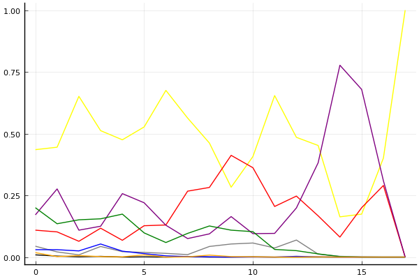
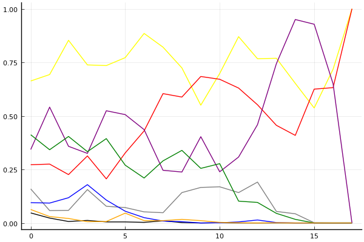

결승 1회전

## 경기 결과

| 트랙 | 문호준 | 김응태 | 유창현 | 유영혁 | 박인수 | 이재혁 | 전대웅 | 신종민 |
|:---|---:|---:|---:|---:|---:|---:|---:|---:|
| [어비스 스카이라인](../skyline) | 7 | -1 | 4 | 0 | 10 | 3 | 5 | 1 |
| [쥐라기 공룡섬 대모험](../dinoisland) | 10 | 0 | 4 | 3 | -1 | 7 | 5 | 1 |
| [아이스 아찔한 헬기점프](../heli) | 0 | 4 | 5 | 10 | 3 | 1 | 7 | -1 |
| [공동묘지 마왕의 초대](../mawang) | 4 | 1 | 3 | 0 | 10 | 7 | -1 | 5 |
| [동화 이상한 나라의 문](../gate) | 5 | 4 | 7 | 1 | 3 | -1 | 0 | 10 |
| [어비스 숨겨진 바닷길](../hiddenoceanroad) | 10 | 1 | 7 | 4 | 3 | 5 | 0 | -1 |
| [포레스트 지그재그](../zigzag) | 1 | 10 | 7 | 4 | -1 | 5 | 0 | 3 |
| [광산 꼬불꼬불 다운힐](../gwangkko) | 1 | -1 | 3 | 10 | 4 | 5 | 0 | 7 |
| [[리버스] 사막 빙글빙글 공사장](../rsabing) | 1 | 3 | 7 | 5 | 10 | 4 | -1 | 0 |
| [공동묘지 해골성 대탐험](../skullcastle) | 7 | 1 | 3 | 5 | -1 | 4 | 10 | 0 |
| [[리버스] 사막 빙글빙글 공사장](../rsabing) | 10 | -1 | 3 | 4 | 7 | 0 | 5 | 1 |
| [포레스트 지그재그](../zigzag) | 1 | 0 | 3 | 5 | 7 | 4 | 10 | -1 |
| [아이스 아찔한 헬기점프](../heli) | 5 | 0 | 4 | -1 | 10 | 3 | 1 | 7 |
| [어비스 스카이라인](../skyline) | 3 | -1 | 4 | 7 | 10 | 5 | 0 | 1 |
| [쥐라기 공룡섬 대모험](../dinoisland) | 7 | 3 | 10 | 0 | 4 | 1 | 5 | -1 |
| [어비스 숨겨진 바닷길](../hiddenoceanroad) | 7 | -1 | 5 | 4 | 1 | 10 | 3 | 0 |
| [공동묘지 해골성 대탐험](../skullcastle) | 10 | 5 | 3 | 0 | 1 | 4 | -1 | 7 |
| __total__ |__89__ |__27__ |__82__ |__61__ |__80__ |__67__ |__48__ |__39__ |

## 시뮬레이션

### 1st 확률

| 트랙 | 문호준 | 김응태 | 유창현 | 유영혁 | 박인수 | 이재혁 | 전대웅 | 신종민 |
|:---|---:|---:|---:|---:|---:|---:|---:|---:|
| 초기 | 0.435 | 0.009 | 0.109 | 0.044 | 0.171 | 0.200 | 0.030 | 0.018 |
| 어비스 스카이라인 | 0.445 | 0.004 | 0.102 | 0.021 | 0.276 | 0.135 | 0.030 | 0.002 |
| 쥐라기 공룡섬 대모험 | 0.651 | 0.001 | 0.064 | 0.009 | 0.109 | 0.151 | 0.025 | 0.006 |
| 아이스 아찔한 헬기점프 | 0.512 | 0.003 | 0.117 | 0.043 | 0.125 | 0.155 | 0.053 | 0.002 |
| 공동묘지 마왕의 초대 | 0.475 | 0.000 | 0.068 | 0.022 | 0.257 | 0.174 | 0.024 | 0.001 |
| 동화 이상한 나라의 문 | 0.527 | 0.001 | 0.127 | 0.019 | 0.220 | 0.098 | 0.014 | 0.009 |
| 어비스 숨겨진 바닷길 | 0.675 | 0.000 | 0.130 | 0.015 | 0.129 | 0.059 | 0.005 | 0.000 |
| 포레스트 지그재그 | 0.563 | 0.002 | 0.267 | 0.010 | 0.075 | 0.096 | 0.002 | 0.001 |
| 광산 꼬불꼬불 다운힐 | 0.462 | 0.000 | 0.282 | 0.043 | 0.094 | 0.126 | 0.001 | 0.008 |
| [리버스] 사막 빙글빙글 공사장 | 0.283 | 0.000 | 0.412 | 0.053 | 0.164 | 0.109 | 0.000 | 0.002 |
| 공동묘지 해골성 대탐험 | 0.407 | 0.001 | 0.362 | 0.057 | 0.095 | 0.103 | 0.000 | 0.001 |
| [리버스] 사막 빙글빙글 공사장 | 0.654 | 0.000 | 0.205 | 0.037 | 0.096 | 0.031 | 0.000 | 0.000 |
| 포레스트 지그재그 | 0.485 | 0.000 | 0.247 | 0.069 | 0.199 | 0.026 | 0.003 | 0.000 |
| 아이스 아찔한 헬기점프 | 0.452 | 0.000 | 0.167 | 0.012 | 0.382 | 0.013 | 0.001 | 0.001 |
| 어비스 스카이라인 | 0.163 | 0.000 | 0.081 | 0.003 | 0.777 | 0.002 | 0.000 | 0.000 |
| 쥐라기 공룡섬 대모험 | 0.174 | 0.000 | 0.200 | 0.001 | 0.679 | 0.000 | 0.000 | 0.000 |
| 어비스 숨겨진 바닷길 | 0.401 | 0.000 | 0.290 | 0.000 | 0.309 | 0.000 | 0.000 | 0.000 |
| 공동묘지 해골성 대탐험 | 1.000 | 0.000 | 0.000 | 0.000 | 0.000 | 0.000 | 0.000 | 0.000 |

### Advance 확률

| 트랙 | 문호준 | 김응태 | 유창현 | 유영혁 | 박인수 | 이재혁 | 전대웅 | 신종민 |
|:---|---:|---:|---:|---:|---:|---:|---:|---:|
| 초기 | 0.663 | 0.047 | 0.272 | 0.159 | 0.343 | 0.412 | 0.095 | 0.063 |
| 어비스 스카이라인 | 0.693 | 0.023 | 0.275 | 0.058 | 0.541 | 0.342 | 0.093 | 0.030 |
| 쥐라기 공룡섬 대모험 | 0.853 | 0.007 | 0.226 | 0.059 | 0.358 | 0.404 | 0.118 | 0.021 |
| 아이스 아찔한 헬기점프 | 0.738 | 0.012 | 0.313 | 0.156 | 0.325 | 0.333 | 0.179 | 0.006 |
| 공동묘지 마왕의 초대 | 0.735 | 0.005 | 0.206 | 0.078 | 0.524 | 0.394 | 0.107 | 0.007 |
| 동화 이상한 나라의 문 | 0.772 | 0.005 | 0.327 | 0.072 | 0.506 | 0.270 | 0.055 | 0.046 |
| 어비스 숨겨진 바닷길 | 0.885 | 0.003 | 0.430 | 0.052 | 0.436 | 0.210 | 0.025 | 0.011 |
| 포레스트 지그재그 | 0.821 | 0.010 | 0.604 | 0.048 | 0.246 | 0.290 | 0.009 | 0.011 |
| 광산 꼬불꼬불 다운힐 | 0.724 | 0.002 | 0.588 | 0.142 | 0.238 | 0.339 | 0.006 | 0.017 |
| [리버스] 사막 빙글빙글 공사장 | 0.550 | 0.000 | 0.684 | 0.166 | 0.403 | 0.255 | 0.000 | 0.011 |
| 공동묘지 해골성 대탐험 | 0.698 | 0.001 | 0.671 | 0.169 | 0.239 | 0.277 | 0.001 | 0.003 |
| [리버스] 사막 빙글빙글 공사장 | 0.870 | 0.000 | 0.630 | 0.142 | 0.308 | 0.102 | 0.005 | 0.001 |
| 포레스트 지그재그 | 0.767 | 0.000 | 0.552 | 0.191 | 0.459 | 0.096 | 0.014 | 0.000 |
| 아이스 아찔한 헬기점프 | 0.769 | 0.000 | 0.456 | 0.054 | 0.744 | 0.045 | 0.002 | 0.001 |
| 어비스 스카이라인 | 0.652 | 0.000 | 0.409 | 0.043 | 0.950 | 0.017 | 0.000 | 0.000 |
| 쥐라기 공룡섬 대모험 | 0.537 | 0.000 | 0.625 | 0.001 | 0.928 | 0.000 | 0.000 | 0.000 |
| 어비스 숨겨진 바닷길 | 0.718 | 0.000 | 0.632 | 0.000 | 0.650 | 0.000 | 0.000 | 0.000 |
| 공동묘지 해골성 대탐험 | 1.000 | 0.000 | 1.000 | 0.000 | 0.000 | 0.000 | 0.000 | 0.000 |

## 랭킹 변동

### [전체 랭킹](../singles-full)

| 순위 | 변동 | 이름 | 점수 | 변동 | mu | 변동 | sigma | 변동 |
|---:|---:|:---:|---:|---:|---:|---:|---:|---:|
| 1 / 85 | +0 | [문호준](../munhojun) | 3434 | +23 | 3664 | +22 | 77 | -0 |
| 2 / 85 | +1 | [박인수](../bakinsu) | 3314 | +14 | 3544 | +15 | 77 | +0 |
| 3 / 85 | -1 | [이재혁](../ijaehyeok) | 3312 | -1 | 3541 | -4 | 76 | -1 |
| 4 / 85 | +0 | [유창현](../yuchanghyeon) | 3307 | +46 | 3534 | +45 | 75 | -0 |
| 6 / 85 | +0 | [유영혁](../yuyeonghyeok) | 3197 | +13 | 3425 | +12 | 76 | -0 |
| 8 / 85 | +0 | [전대웅](../jeondaewoong) | 3124 | -12 | 3354 | -12 | 76 | -0 |
| 10 / 85 | +0 | [신종민](../shinjongmin) | 3068 | -22 | 3299 | -23 | 77 | -0 |
| 14 / 85 | -3 | [김응태](../gimeungtae) | 3025 | -56 | 3256 | -58 | 77 | -1 |

### 시즌 랭킹

| 순위 | 변동 | 이름 | 점수 | 변동 | mu | 변동 | sigma | 변동 |
|---:|---:|:---:|---:|---:|---:|---:|---:|---:|
| 1 / 32 | +0 | [문호준](../munhojun) | 3339 | +89 | 3639 | +7 | 100 | -27 |
| 2 / 32 | +0 | [박인수](../bakinsu) | 3188 | +74 | 3460 | +34 | 91 | -13 |
| 3 / 32 | +3 | [유창현](../yuchanghyeon) | 3170 | +180 | 3456 | +111 | 95 | -23 |
| 4 / 32 | -1 | [이재혁](../ijaehyeok) | 3169 | +68 | 3448 | +10 | 93 | -19 |
| 5 / 32 | +2 | [유영혁](../yuyeonghyeok) | 3066 | +80 | 3337 | +35 | 91 | -15 |
| 6 / 32 | -2 | [전대웅](../jeondaewoong) | 3021 | +13 | 3291 | -26 | 90 | -13 |
| 8 / 32 | +1 | [신종민](../shinjongmin) | 2959 | -1 | 3235 | -47 | 92 | -15 |
| 9 / 32 | -4 | [김응태](../gimeungtae) | 2924 | -66 | 3196 | -106 | 90 | -13 |

### 트랙 별 랭킹

#### [[리버스] 사막 빙글빙글 공사장](../rsabing)

| 순위 | 변동 | 이름 | 점수 | 변동 | mu | 변동 | sigma | 변동 |
|:---:|:---:|:---:|---:|---:|---:|---:|---:|---:|
| 1 / 15 | +2 | [문호준](../munhojun) | 2677 | +516 | 3843 | -431 | 389 | -316 |
| 2 / 15 | +9 | [박인수](../bakinsu) | 2533 | +1335 | 3526 | +906 | 331 | -143 |
| 3 / 15 | +3 | [유창현](../yuchanghyeon) | 2418 | +796 | 3463 | +40 | 348 | -252 |
| 4 / 15 | -3 | [전대웅](../jeondaewoong) | 2361 | -7 | 3334 | -425 | 324 | -139 |
| 5 / 15 | -3 | [이재혁](../ijaehyeok) | 2307 | +59 | 3274 | -433 | 322 | -164 |
| 6 / 15 | +9 | [유영혁](../yuyeonghyeok) | 2150 | +1789 | 3197 | +960 | 349 | -276 |
| 7 / 15 | -3 | [신종민](../shinjongmin) | 2043 | +269 | 3036 | -281 | 331 | -183 |
| 9 / 15 | +0 | [김응태](../gimeungtae) | 1758 | +395 | 2848 | -288 | 363 | -228 |

#### [공동묘지 마왕의 초대](../mawang)

| 순위 | 변동 | 이름 | 점수 | 변동 | mu | 변동 | sigma | 변동 |
|:---:|:---:|:---:|---:|---:|---:|---:|---:|---:|
| 1 / 52 | +0 | [전대웅](../jeondaewoong) | 2966 | -237 | 3772 | -324 | 269 | -29 |
| 3 / 52 | +2 | [문호준](../munhojun) | 2790 | +103 | 3588 | -2 | 266 | -35 |
| 4 / 52 | -1 | [유영혁](../yuyeonghyeok) | 2783 | -45 | 3512 | -117 | 243 | -24 |
| 6 / 52 | +1 | [유창현](../yuchanghyeon) | 2643 | +92 | 3368 | +16 | 242 | -25 |
| 7 / 52 | -1 | [김응태](../gimeungtae) | 2638 | +44 | 3441 | -62 | 268 | -35 |
| 8 / 52 | +1 | [박인수](../bakinsu) | 2624 | +336 | 3410 | +261 | 262 | -25 |
| 9 / 52 | +1 | [이재혁](../ijaehyeok) | 2617 | +360 | 3534 | +202 | 305 | -53 |
| 10 / 52 | -2 | [신종민](../shinjongmin) | 2617 | +251 | 3480 | +115 | 288 | -45 |

#### [공동묘지 해골성 대탐험](../skullcastle)

| 순위 | 변동 | 이름 | 점수 | 변동 | mu | 변동 | sigma | 변동 |
|:---:|:---:|:---:|---:|---:|---:|---:|---:|---:|
| 1 / 15 | NaN | [문호준](../munhojun) | 2961 | +2961 | 4434 | +1434 | 491 | -509 |
| 2 / 15 | +0 | [이재혁](../ijaehyeok) | 2644 | +409 | 3637 | -60 | 331 | -156 |
| 3 / 15 | -2 | [전대웅](../jeondaewoong) | 2380 | +82 | 3660 | -678 | 427 | -253 |
| 4 / 15 | +0 | [신종민](../shinjongmin) | 2376 | +620 | 3368 | +215 | 331 | -135 |
| 5 / 15 | NaN | [김응태](../gimeungtae) | 2226 | +2226 | 3439 | +439 | 404 | -596 |
| 6 / 15 | NaN | [유창현](../yuchanghyeon) | 2126 | +2126 | 3332 | +332 | 402 | -598 |
| 7 / 15 | NaN | [유영혁](../yuyeonghyeok) | 2096 | +2096 | 3340 | +340 | 414 | -586 |
| 8 / 15 | -5 | [박인수](../bakinsu) | 1989 | -90 | 3094 | -754 | 368 | -221 |

#### [광산 꼬불꼬불 다운힐](../gwangkko)

| 순위 | 변동 | 이름 | 점수 | 변동 | mu | 변동 | sigma | 변동 |
|:---:|:---:|:---:|---:|---:|---:|---:|---:|---:|
| 1 / 10 | +4 | [유영혁](../yuyeonghyeok) | 2266 | +1176 | 3680 | +816 | 471 | -120 |
| 2 / 10 | NaN | [신종민](../shinjongmin) | 2037 | +2037 | 3713 | +713 | 559 | -441 |
| 3 / 10 | -2 | [문호준](../munhojun) | 1957 | -204 | 3383 | -891 | 475 | -229 |
| 4 / 10 | -1 | [유창현](../yuchanghyeon) | 1947 | +325 | 3260 | -163 | 438 | -163 |
| 5 / 10 | NaN | [이재혁](../ijaehyeok) | 1850 | +1850 | 3478 | +478 | 543 | -457 |
| 6 / 10 | +0 | [박인수](../bakinsu) | 1713 | +937 | 3029 | +452 | 439 | -162 |
| 7 / 10 | -5 | [전대웅](../jeondaewoong) | 1657 | -230 | 3052 | -711 | 465 | -161 |
| 9 / 10 | -2 | [김응태](../gimeungtae) | 357 | -4 | 1959 | -279 | 534 | -91 |

#### [동화 이상한 나라의 문](../gate)

| 순위 | 변동 | 이름 | 점수 | 변동 | mu | 변동 | sigma | 변동 |
|:---:|:---:|:---:|---:|---:|---:|---:|---:|---:|
| 1 / 29 | +0 | [문호준](../munhojun) | 3449 | +90 | 4445 | -116 | 332 | -68 |
| 3 / 29 | +0 | [박인수](../bakinsu) | 3144 | +55 | 3971 | -54 | 276 | -36 |
| 4 / 29 | +3 | [신종민](../shinjongmin) | 3122 | +510 | 4094 | +373 | 324 | -45 |
| 5 / 29 | +5 | [유창현](../yuchanghyeon) | 2989 | +546 | 4036 | +313 | 349 | -78 |
| 6 / 29 | +0 | [김응태](../gimeungtae) | 2979 | +228 | 3893 | +73 | 305 | -52 |
| 7 / 29 | -3 | [유영혁](../yuyeonghyeok) | 2925 | +21 | 3870 | -146 | 315 | -56 |
| 8 / 29 | -3 | [전대웅](../jeondaewoong) | 2733 | -28 | 3629 | -150 | 299 | -40 |
| 11 / 29 | +0 | [이재혁](../ijaehyeok) | 2213 | -76 | 3155 | -164 | 314 | -29 |

#### [아이스 아찔한 헬기점프](../heli)

| 순위 | 변동 | 이름 | 점수 | 변동 | mu | 변동 | sigma | 변동 |
|:---:|:---:|:---:|---:|---:|---:|---:|---:|---:|
| 1 / 26 | +2 | [전대웅](../jeondaewoong) | 2667 | +161 | 3417 | -23 | 250 | -61 |
| 2 / 26 | -1 | [이재혁](../ijaehyeok) | 2609 | -112 | 3437 | -415 | 276 | -101 |
| 3 / 26 | +1 | [유영혁](../yuyeonghyeok) | 2566 | +101 | 3399 | -92 | 278 | -64 |
| 5 / 26 | +5 | [박인수](../bakinsu) | 2461 | +513 | 3259 | +298 | 266 | -72 |
| 6 / 26 | -1 | [신종민](../shinjongmin) | 2446 | +60 | 3233 | -130 | 262 | -63 |
| 7 / 26 | -1 | [김응태](../gimeungtae) | 2415 | +113 | 3186 | -102 | 257 | -72 |
| 8 / 26 | +3 | [문호준](../munhojun) | 2252 | +366 | 3128 | +7 | 292 | -120 |
| 10 / 26 | +7 | [유창현](../yuchanghyeon) | 2190 | +780 | 3027 | +465 | 279 | -105 |

#### [어비스 숨겨진 바닷길](../hiddenoceanroad)

| 순위 | 변동 | 이름 | 점수 | 변동 | mu | 변동 | sigma | 변동 |
|:---:|:---:|:---:|---:|---:|---:|---:|---:|---:|
| 1 / 32 | +2 | [문호준](../munhojun) | 3086 | +449 | 3982 | +219 | 299 | -77 |
| 2 / 32 | +0 | [이재혁](../ijaehyeok) | 3045 | +362 | 3902 | +137 | 286 | -75 |
| 4 / 32 | +6 | [유창현](../yuchanghyeon) | 2661 | +556 | 3530 | +271 | 289 | -95 |
| 5 / 32 | -1 | [박인수](../bakinsu) | 2504 | -22 | 3249 | -205 | 249 | -61 |
| 9 / 32 | +6 | [유영혁](../yuyeonghyeok) | 2236 | +449 | 2990 | +262 | 251 | -62 |
| 10 / 32 | -3 | [김응태](../gimeungtae) | 2158 | -164 | 2966 | -369 | 269 | -68 |
| 14 / 32 | -3 | [신종민](../shinjongmin) | 1966 | -117 | 2755 | -288 | 263 | -57 |
| 15 / 32 | +6 | [전대웅](../jeondaewoong) | 1918 | +320 | 2706 | +112 | 263 | -70 |

#### [어비스 스카이라인](../skyline)

| 순위 | 변동 | 이름 | 점수 | 변동 | mu | 변동 | sigma | 변동 |
|:---:|:---:|:---:|---:|---:|---:|---:|---:|---:|
| 1 / 29 | +0 | [박인수](../bakinsu) | 3225 | +508 | 4036 | +360 | 271 | -49 |
| 2 / 29 | +3 | [문호준](../munhojun) | 2861 | +314 | 3771 | -87 | 303 | -134 |
| 3 / 29 | +1 | [유영혁](../yuyeonghyeok) | 2767 | +172 | 3532 | -19 | 255 | -64 |
| 4 / 29 | +3 | [유창현](../yuchanghyeon) | 2752 | +279 | 3551 | +25 | 266 | -85 |
| 6 / 29 | +6 | [이재혁](../ijaehyeok) | 2581 | +392 | 3333 | +195 | 251 | -66 |
| 7 / 29 | +4 | [전대웅](../jeondaewoong) | 2568 | +204 | 3309 | +33 | 247 | -57 |
| 8 / 29 | +1 | [신종민](../shinjongmin) | 2533 | +115 | 3279 | -73 | 249 | -63 |
| 12 / 29 | -9 | [김응태](../gimeungtae) | 2334 | -315 | 3151 | -494 | 272 | -59 |

#### [쥐라기 공룡섬 대모험](../dinoisland)

| 순위 | 변동 | 이름 | 점수 | 변동 | mu | 변동 | sigma | 변동 |
|:---:|:---:|:---:|---:|---:|---:|---:|---:|---:|
| 1 / 32 | +2 | [문호준](../munhojun) | 3120 | +525 | 3993 | +280 | 291 | -82 |
| 2 / 32 | +0 | [이재혁](../ijaehyeok) | 2918 | +109 | 3760 | -169 | 281 | -93 |
| 3 / 32 | +9 | [유창현](../yuchanghyeon) | 2776 | +608 | 3609 | +362 | 277 | -82 |
| 4 / 32 | -3 | [박인수](../bakinsu) | 2717 | -111 | 3514 | -327 | 266 | -72 |
| 5 / 32 | -1 | [김응태](../gimeungtae) | 2614 | +67 | 3376 | -137 | 254 | -68 |
| 6 / 32 | +0 | [유영혁](../yuyeonghyeok) | 2505 | +123 | 3256 | -65 | 250 | -63 |
| 7 / 32 | +9 | [전대웅](../jeondaewoong) | 2442 | +708 | 3224 | +482 | 261 | -75 |
| 8 / 32 | -3 | [신종민](../shinjongmin) | 2392 | -150 | 3267 | -445 | 292 | -99 |

#### [포레스트 지그재그](../zigzag)

| 순위 | 변동 | 이름 | 점수 | 변동 | mu | 변동 | sigma | 변동 |
|:---:|:---:|:---:|---:|---:|---:|---:|---:|---:|
| 1 / 56 | +0 | [유영혁](../yuyeonghyeok) | 3553 | +27 | 4044 | -18 | 164 | -15 |
| 2 / 56 | +0 | [이재혁](../ijaehyeok) | 3495 | +42 | 3992 | -5 | 166 | -16 |
| 3 / 56 | +0 | [문호준](../munhojun) | 3363 | -44 | 3866 | -92 | 168 | -16 |
| 4 / 56 | +0 | [유창현](../yuchanghyeon) | 3305 | +103 | 3847 | +40 | 181 | -21 |
| 5 / 56 | +0 | [전대웅](../jeondaewoong) | 3253 | +86 | 3760 | +44 | 169 | -14 |
| 6 / 56 | +0 | [박인수](../bakinsu) | 3133 | +35 | 3621 | -2 | 162 | -12 |
| 10 / 56 | +4 | [김응태](../gimeungtae) | 2906 | +215 | 3497 | +142 | 197 | -24 |
| 14 / 56 | +1 | [신종민](../shinjongmin) | 2726 | +39 | 3452 | -109 | 242 | -49 |
