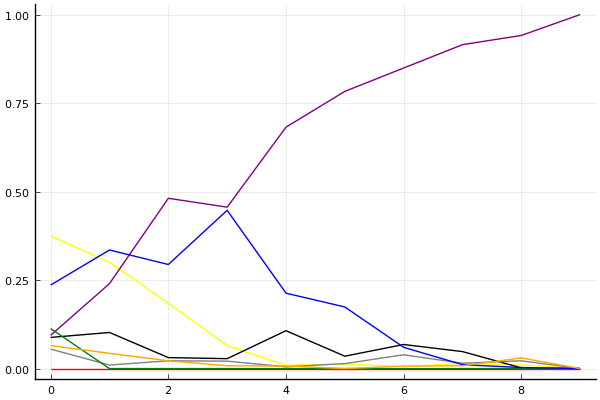
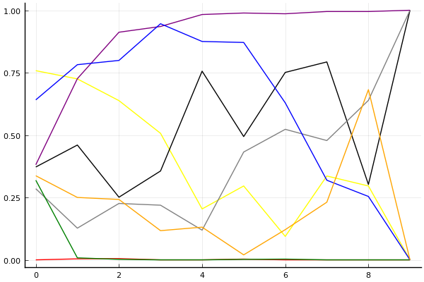
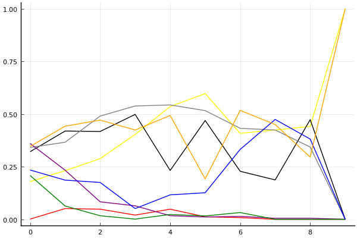

2020 시즌 2 개인전 32강 A조

## 경기 결과

| 트랙 | 전대웅 | 김기수 | 전진우 | 최윤서 | 송용준 | 이은서 | 김정제 | 최영훈 |
|:---|---:|---:|---:|---:|---:|---:|---:|---:|
| [카멜롯 펜드래건 캐슬](../pendragon) | 3 | 5 | 4 | -1 | 10 | 0 | 7 | 1 |
| [어비스 숨겨진 바닷길](../hiddenoceanroad) | 3 | -1 | 1 | 7 | 10 | 0 | 5 | 4 |
| [대저택 은밀한 지하실](../jeotaek) | 3 | 7 | 0 | 4 | 5 | -1 | 10 | 1 |
| [동화 이상한 나라의 문](../gate) | -1 | 10 | 3 | 1 | 7 | 5 | 0 | 4 |
| [황금문명 오르에트 황금 좌표](../coordinate) | 7 | 0 | 1 | 10 | 5 | 3 | 4 | -1 |
| [공동묘지 해골성 대탐험](../skullcastle) | 0 | 7 | 1 | 5 | 3 | 4 | -1 | 10 |
| [광산 위험한 제련소](../jeryeonso) | 10 | 4 | -1 | 3 | 5 | 0 | 1 | 7 |
| [[리버스] 해적 로비 절벽의 전투](../rlobby) | 5 | 0 | -1 | 7 | 3 | 1 | 4 | 10 |
| [아이스 아찔한 헬기 점프](../heli) | 5 | 10 | 3 | 7 | 4 | 0 | -1 | 1 |
| __total__ |__35__ |__42__ |__11__ |__43__ |__52__ |__12__ |__29__ |__37__ |

## 시뮬레이션

### 1st 확률

x축: 트랙, y축: 확률
1번: 옐로우, 2번: 블랙, 3번: 레드, 4번: 화이트(회색), 5번: 퍼플, 6번: 그린, 7번: 블루, 8번: 오렌지

| 트랙 | 전대웅 | 김기수 | 전진우 | 최윤서 | 송용준 | 이은서 | 김정제 | 최영훈 |
|:---|---:|---:|---:|---:|---:|---:|---:|---:|
| 초기 | 0.372 | 0.091 | 0.000 | 0.047 | 0.087 | 0.128 | 0.232 | 0.075 |
| 카멜롯 펜드래건 캐슬 | 0.271 | 0.120 | 0.000 | 0.020 | 0.238 | 0.000 | 0.328 | 0.051 |
| 어비스 숨겨진 바닷길 | 0.150 | 0.029 | 0.000 | 0.034 | 0.483 | 0.000 | 0.314 | 0.026 |
| 대저택 은밀한 지하실 | 0.062 | 0.029 | 0.000 | 0.010 | 0.452 | 0.000 | 0.471 | 0.007 |
| 동화 이상한 나라의 문 | 0.019 | 0.093 | 0.000 | 0.006 | 0.678 | 0.000 | 0.221 | 0.003 |
| 황금문명 오르에트 황금 좌표 | 0.021 | 0.035 | 0.000 | 0.031 | 0.778 | 0.000 | 0.160 | 0.001 |
| 공동묘지 해골성 대탐험 | 0.008 | 0.075 | 0.000 | 0.043 | 0.808 | 0.000 | 0.070 | 0.012 |
| 광산 위험한 제련소 | 0.013 | 0.034 | 0.000 | 0.012 | 0.938 | 0.000 | 0.008 | 0.009 |
| [리버스] 해적 로비 절벽의 전투 | 0.007 | 0.002 | 0.000 | 0.027 | 0.941 | 0.000 | 0.005 | 0.027 |
| 아이스 아찔한 헬기 점프 | 0.000 | 0.000 | 0.000 | 0.000 | 1.000 | 0.000 | 0.000 | 0.000 |

### Advance 확률

x축: 트랙, y축: 확률
1번: 옐로우, 2번: 블랙, 3번: 레드, 4번: 화이트(회색), 5번: 퍼플, 6번: 그린, 7번: 블루, 8번: 오렌지

| 트랙 | 전대웅 | 김기수 | 전진우 | 최윤서 | 송용준 | 이은서 | 김정제 | 최영훈 |
|:---|---:|---:|---:|---:|---:|---:|---:|---:|
| 초기 | 0.742 | 0.415 | 0.000 | 0.275 | 0.393 | 0.311 | 0.611 | 0.356 |
| 카멜롯 펜드래건 캐슬 | 0.735 | 0.467 | 0.005 | 0.130 | 0.690 | 0.014 | 0.782 | 0.270 |
| 어비스 숨겨진 바닷길 | 0.629 | 0.263 | 0.001 | 0.232 | 0.909 | 0.001 | 0.804 | 0.244 |
| 대저택 은밀한 지하실 | 0.511 | 0.332 | 0.002 | 0.236 | 0.947 | 0.000 | 0.947 | 0.106 |
| 동화 이상한 나라의 문 | 0.197 | 0.764 | 0.002 | 0.127 | 0.976 | 0.000 | 0.879 | 0.113 |
| 황금문명 오르에트 황금 좌표 | 0.280 | 0.472 | 0.000 | 0.446 | 0.988 | 0.000 | 0.894 | 0.026 |
| 공동묘지 해골성 대탐험 | 0.108 | 0.732 | 0.000 | 0.543 | 0.981 | 0.001 | 0.620 | 0.120 |
| 광산 위험한 제련소 | 0.333 | 0.780 | 0.000 | 0.481 | 0.995 | 0.000 | 0.323 | 0.239 |
| [리버스] 해적 로비 절벽의 전투 | 0.293 | 0.313 | 0.000 | 0.671 | 0.998 | 0.000 | 0.230 | 0.673 |
| 아이스 아찔한 헬기 점프 | 0.000 | 1.000 | 0.000 | 1.000 | 1.000 | 0.000 | 0.000 | 0.000 |

### Repechage 확률

x축: 트랙, y축: 확률
1번: 옐로우, 2번: 블랙, 3번: 레드, 4번: 화이트(회색), 5번: 퍼플, 6번: 그린, 7번: 블루, 8번: 오렌지

| 트랙 | 전대웅 | 김기수 | 전진우 | 최윤서 | 송용준 | 이은서 | 김정제 | 최영훈 |
|:---|---:|---:|---:|---:|---:|---:|---:|---:|
| 초기 | 0.192 | 0.328 | 0.007 | 0.314 | 0.336 | 0.237 | 0.260 | 0.309 |
| 카멜롯 펜드래건 캐슬 | 0.216 | 0.399 | 0.046 | 0.369 | 0.262 | 0.053 | 0.186 | 0.440 |
| 어비스 숨겨진 바닷길 | 0.303 | 0.424 | 0.037 | 0.449 | 0.079 | 0.017 | 0.174 | 0.506 |
| 대저택 은밀한 지하실 | 0.397 | 0.527 | 0.018 | 0.521 | 0.051 | 0.001 | 0.053 | 0.423 |
| 동화 이상한 나라의 문 | 0.543 | 0.225 | 0.043 | 0.523 | 0.024 | 0.014 | 0.113 | 0.524 |
| 황금문명 오르에트 황금 좌표 | 0.590 | 0.480 | 0.022 | 0.505 | 0.012 | 0.021 | 0.102 | 0.213 |
| 공동묘지 해골성 대탐험 | 0.387 | 0.245 | 0.007 | 0.398 | 0.018 | 0.028 | 0.347 | 0.549 |
| 광산 위험한 제련소 | 0.436 | 0.201 | 0.000 | 0.442 | 0.005 | 0.000 | 0.446 | 0.424 |
| [리버스] 해적 로비 절벽의 전투 | 0.430 | 0.475 | 0.000 | 0.307 | 0.002 | 0.000 | 0.407 | 0.304 |
| 아이스 아찔한 헬기 점프 | 1.000 | 0.000 | 0.000 | 0.000 | 0.000 | 0.000 | 0.000 | 1.000 |

## 랭킹 변동

### [전체 랭킹](../singles-full)

| 순위 | 변동 | 이름 | 점수 | 변동 | mu | 변동 | sigma | 변동 |
|---:|---:|:---:|---:|---:|---:|---:|---:|---:|
| 9 / 86 | -1 | [전대웅](../jeondaewoong) | 3088 | -36 | 3317 | -36 | 76 | -0 |
| 14 / 86 | -2 | [김정제](../gimjeongje) | 3007 | -48 | 3238 | -49 | 77 | -0 |
| 15 / 86 | +4 | [송용준](../songyongjun) | 2982 | +46 | 3221 | +42 | 80 | -1 |
| 17 / 86 | +0 | [김기수](../gimgisu) | 2953 | +6 | 3190 | +4 | 79 | -1 |
| 20 / 86 | +0 | [최영훈](../choiyeonghun) | 2933 | -1 | 3162 | -1 | 76 | +0 |
| 24 / 86 | +3 | [최윤서](../choiyunseo) | 2893 | +57 | 3170 | +35 | 93 | -7 |
| 65 / 86 | NaN | [이은서](../ieunseo) | 2170 | +2170 | 2750 | -250 | 193 | -807 |
| 67 / 86 | +17 | [전진우](../jeonjinwoo) | 2129 | +557 | 2621 | +194 | 164 | -121 |

### 시즌 랭킹

| 순위 | 변동 | 이름 | 점수 | 변동 | mu | 변동 | sigma | 변동 |
|---:|---:|:---:|---:|---:|---:|---:|---:|---:|
| 1 / 8 | NaN | [최윤서](../choiyunseo) | 2687 | +2687 | 3306 | +306 | 207 | -793 |
| 2 / 8 | NaN | [송용준](../songyongjun) | 2683 | +2683 | 3312 | +312 | 210 | -790 |
| 3 / 8 | NaN | [김기수](../gimgisu) | 2587 | +2587 | 3219 | +219 | 211 | -789 |
| 4 / 8 | NaN | [최영훈](../choiyeonghun) | 2501 | +2501 | 3122 | +122 | 207 | -793 |
| 5 / 8 | NaN | [전대웅](../jeondaewoong) | 2495 | +2495 | 3108 | +108 | 204 | -796 |
| 6 / 8 | NaN | [김정제](../gimjeongje) | 2245 | +2245 | 2873 | -127 | 209 | -791 |
| 7 / 8 | NaN | [이은서](../ieunseo) | 2039 | +2039 | 2659 | -341 | 207 | -793 |
| 8 / 8 | NaN | [전진우](../jeonjinwoo) | 1940 | +1940 | 2562 | -438 | 207 | -793 |

### 트랙 별 랭킹

#### [[리버스] 해적 로비 절벽의 전투](../rlobby)

| 순위 | 변동 | 이름 | 점수 | 변동 | mu | 변동 | sigma | 변동 |
|:---:|:---:|:---:|---:|---:|---:|---:|---:|---:|
| 1 / 8 | NaN | [최영훈](../choiyeonghun) | 2161 | +2161 | 4274 | +1274 | 704 | -296 |
| 2 / 8 | NaN | [최윤서](../choiyunseo) | 1887 | +1887 | 3763 | +763 | 625 | -375 |
| 3 / 8 | NaN | [전대웅](../jeondaewoong) | 1622 | +1622 | 3423 | +423 | 600 | -400 |
| 4 / 8 | NaN | [김정제](../gimjeongje) | 1363 | +1363 | 3137 | +137 | 591 | -409 |
| 5 / 8 | NaN | [송용준](../songyongjun) | 1090 | +1090 | 2863 | -137 | 591 | -409 |
| 6 / 8 | NaN | [이은서](../ieunseo) | 776 | +776 | 2577 | -423 | 600 | -400 |
| 7 / 8 | NaN | [김기수](../gimgisu) | 361 | +361 | 2237 | -763 | 625 | -375 |
| 8 / 8 | NaN | [전진우](../jeonjinwoo) | -388 | -388 | 1726 | -1274 | 704 | -296 |

#### [공동묘지 해골성 대탐험](../skullcastle)

| 순위 | 변동 | 이름 | 점수 | 변동 | mu | 변동 | sigma | 변동 |
|:---:|:---:|:---:|---:|---:|---:|---:|---:|---:|
| 5 / 20 | +8 | [최영훈](../choiyeonghun) | 2219 | +1040 | 3663 | +663 | 481 | -126 |
| 8 / 20 | -5 | [전대웅](../jeondaewoong) | 2062 | -318 | 3159 | -500 | 366 | -61 |
| 9 / 20 | +2 | [김기수](../gimgisu) | 2016 | +707 | 3218 | +430 | 401 | -92 |
| 11 / 20 | NaN | [최윤서](../choiyunseo) | 1698 | +1698 | 3326 | +326 | 543 | -457 |
| 13 / 20 | NaN | [이은서](../ieunseo) | 1514 | +1514 | 3138 | +138 | 541 | -459 |
| 15 / 20 | NaN | [송용준](../songyongjun) | 1330 | +1330 | 2956 | -44 | 542 | -458 |
| 17 / 20 | NaN | [전진우](../jeonjinwoo) | 1138 | +1138 | 2772 | -228 | 545 | -455 |
| 19 / 20 | NaN | [김정제](../gimjeongje) | -84 | -84 | 1988 | -1012 | 691 | -309 |

#### [광산 위험한 제련소](../jeryeonso)

| 순위 | 변동 | 이름 | 점수 | 변동 | mu | 변동 | sigma | 변동 |
|:---:|:---:|:---:|---:|---:|---:|---:|---:|---:|
| 4 / 44 | +0 | [전대웅](../jeondaewoong) | 2991 | +141 | 3670 | +109 | 226 | -11 |
| 10 / 44 | +4 | [최영훈](../choiyeonghun) | 2580 | +288 | 3657 | +71 | 359 | -72 |
| 12 / 44 | -1 | [김정제](../gimjeongje) | 2416 | -47 | 3048 | -79 | 211 | -11 |
| 16 / 44 | +4 | [송용준](../songyongjun) | 2166 | +314 | 3143 | +154 | 326 | -53 |
| 27 / 44 | NaN | [김기수](../gimgisu) | 1547 | +1547 | 3123 | +123 | 525 | -475 |
| 30 / 44 | NaN | [최윤서](../choiyunseo) | 1339 | +1339 | 2922 | -78 | 528 | -472 |
| 36 / 44 | NaN | [이은서](../ieunseo) | 597 | +597 | 2356 | -644 | 586 | -414 |
| 43 / 44 | NaN | [전진우](../jeonjinwoo) | -252 | -252 | 1820 | -1180 | 691 | -309 |

#### [대저택 은밀한 지하실](../jeotaek)

| 순위 | 변동 | 이름 | 점수 | 변동 | mu | 변동 | sigma | 변동 |
|:---:|:---:|:---:|---:|---:|---:|---:|---:|---:|
| 7 / 70 | +0 | [전대웅](../jeondaewoong) | 2914 | -45 | 3534 | -85 | 207 | -13 |
| 8 / 70 | -3 | [최영훈](../choiyeonghun) | 2904 | -148 | 3628 | -209 | 241 | -20 |
| 14 / 70 | +0 | [송용준](../songyongjun) | 2591 | +93 | 3263 | +40 | 224 | -18 |
| 15 / 70 | +3 | [김정제](../gimjeongje) | 2519 | +190 | 3162 | +154 | 214 | -12 |
| 23 / 70 | +17 | [김기수](../gimgisu) | 2192 | +516 | 3222 | +287 | 343 | -76 |
| 40 / 70 | NaN | [최윤서](../choiyunseo) | 1711 | +1711 | 3211 | +211 | 500 | -500 |
| 60 / 70 | +5 | [전진우](../jeonjinwoo) | 389 | +733 | 1998 | +241 | 536 | -164 |
| 67 / 70 | NaN | [이은서](../ieunseo) | -334 | -334 | 1773 | -1227 | 702 | -298 |

#### [동화 이상한 나라의 문](../gate)

| 순위 | 변동 | 이름 | 점수 | 변동 | mu | 변동 | sigma | 변동 |
|:---:|:---:|:---:|---:|---:|---:|---:|---:|---:|
| 10 / 32 | -2 | [전대웅](../jeondaewoong) | 2415 | -318 | 3237 | -392 | 274 | -25 |
| 12 / 32 | +1 | [최영훈](../choiyeonghun) | 2195 | +82 | 3084 | -39 | 296 | -40 |
| 14 / 32 | +1 | [김기수](../gimgisu) | 2138 | +401 | 3038 | +306 | 300 | -32 |
| 16 / 32 | +6 | [송용준](../songyongjun) | 1775 | +1000 | 3078 | +501 | 434 | -166 |
| 19 / 32 | NaN | [이은서](../ieunseo) | 1608 | +1608 | 3166 | +166 | 519 | -481 |
| 23 / 32 | NaN | [전진우](../jeonjinwoo) | 1263 | +1263 | 2820 | -180 | 519 | -481 |
| 25 / 32 | NaN | [김정제](../gimjeongje) | 900 | +900 | 2481 | -519 | 527 | -473 |
| 26 / 32 | +3 | [최윤서](../choiyunseo) | 872 | +1260 | 2268 | +542 | 465 | -239 |

#### [아이스 아찔한 헬기 점프](../heli)

| 순위 | 변동 | 이름 | 점수 | 변동 | mu | 변동 | sigma | 변동 |
|:---:|:---:|:---:|---:|---:|---:|---:|---:|---:|
| 1 / 31 | +0 | [전대웅](../jeondaewoong) | 2711 | +43 | 3413 | -4 | 234 | -16 |
| 3 / 31 | +6 | [김기수](../gimgisu) | 2576 | +339 | 3495 | +255 | 306 | -28 |
| 13 / 31 | NaN | [최윤서](../choiyunseo) | 1936 | +1936 | 3561 | +561 | 542 | -458 |
| 16 / 31 | -1 | [최영훈](../choiyeonghun) | 1697 | +29 | 2650 | -86 | 318 | -39 |
| 19 / 31 | NaN | [송용준](../songyongjun) | 1469 | +1469 | 3076 | +76 | 536 | -464 |
| 22 / 31 | NaN | [전진우](../jeonjinwoo) | 1215 | +1215 | 2836 | -164 | 540 | -460 |
| 28 / 31 | NaN | [이은서](../ieunseo) | 483 | +483 | 2248 | -752 | 588 | -412 |
| 29 / 31 | NaN | [김정제](../gimjeongje) | -317 | -317 | 1738 | -1262 | 685 | -315 |

#### [어비스 숨겨진 바닷길](../hiddenoceanroad)

| 순위 | 변동 | 이름 | 점수 | 변동 | mu | 변동 | sigma | 변동 |
|:---:|:---:|:---:|---:|---:|---:|---:|---:|---:|
| 8 / 35 | +0 | [최영훈](../choiyeonghun) | 2317 | +43 | 3192 | -74 | 292 | -39 |
| 13 / 35 | +2 | [전대웅](../jeondaewoong) | 1998 | +80 | 2724 | +18 | 242 | -21 |
| 15 / 35 | -4 | [김기수](../gimgisu) | 1944 | -214 | 2791 | -289 | 282 | -25 |
| 17 / 35 | +11 | [최윤서](../choiyunseo) | 1779 | +1003 | 3094 | +517 | 438 | -162 |
| 21 / 35 | NaN | [김정제](../gimjeongje) | 1624 | +1624 | 3186 | +186 | 521 | -479 |
| 24 / 35 | +8 | [송용준](../songyongjun) | 1594 | +1982 | 3091 | +1366 | 499 | -205 |
| 29 / 35 | NaN | [전진우](../jeonjinwoo) | 1088 | +1088 | 2649 | -351 | 520 | -480 |
| 32 / 35 | NaN | [이은서](../ieunseo) | 859 | +859 | 2451 | -549 | 531 | -469 |

#### [카멜롯 펜드래건 캐슬](../pendragon)

| 순위 | 변동 | 이름 | 점수 | 변동 | mu | 변동 | sigma | 변동 |
|:---:|:---:|:---:|---:|---:|---:|---:|---:|---:|
| 1 / 8 | NaN | [송용준](../songyongjun) | 2161 | +2161 | 4274 | +1274 | 704 | -296 |
| 2 / 8 | NaN | [김정제](../gimjeongje) | 1887 | +1887 | 3763 | +763 | 625 | -375 |
| 3 / 8 | NaN | [김기수](../gimgisu) | 1622 | +1622 | 3423 | +423 | 600 | -400 |
| 4 / 8 | NaN | [전진우](../jeonjinwoo) | 1363 | +1363 | 3137 | +137 | 591 | -409 |
| 5 / 8 | NaN | [전대웅](../jeondaewoong) | 1090 | +1090 | 2863 | -137 | 591 | -409 |
| 6 / 8 | NaN | [최영훈](../choiyeonghun) | 776 | +776 | 2577 | -423 | 600 | -400 |
| 7 / 8 | NaN | [이은서](../ieunseo) | 361 | +361 | 2237 | -763 | 625 | -375 |
| 8 / 8 | NaN | [최윤서](../choiyunseo) | -388 | -388 | 1726 | -1274 | 704 | -296 |

#### [황금문명 오르에트 황금 좌표](../coordinate)

| 순위 | 변동 | 이름 | 점수 | 변동 | mu | 변동 | sigma | 변동 |
|:---:|:---:|:---:|---:|---:|---:|---:|---:|---:|
| 1 / 8 | NaN | [최윤서](../choiyunseo) | 2161 | +2161 | 4274 | +1274 | 704 | -296 |
| 2 / 8 | NaN | [전대웅](../jeondaewoong) | 1887 | +1887 | 3763 | +763 | 625 | -375 |
| 3 / 8 | NaN | [송용준](../songyongjun) | 1622 | +1622 | 3423 | +423 | 600 | -400 |
| 4 / 8 | NaN | [김정제](../gimjeongje) | 1363 | +1363 | 3137 | +137 | 591 | -409 |
| 5 / 8 | NaN | [이은서](../ieunseo) | 1090 | +1090 | 2863 | -137 | 591 | -409 |
| 6 / 8 | NaN | [전진우](../jeonjinwoo) | 776 | +776 | 2577 | -423 | 600 | -400 |
| 7 / 8 | NaN | [김기수](../gimgisu) | 361 | +361 | 2237 | -763 | 625 | -375 |
| 8 / 8 | NaN | [최영훈](../choiyeonghun) | -388 | -388 | 1726 | -1274 | 704 | -296 |
