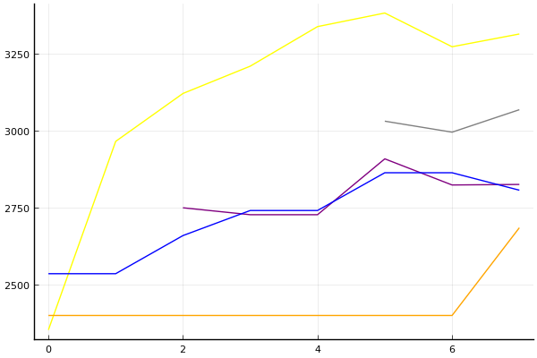

2020 시즌 2 32강 B조

### 선수

박인수
노준현
유관영
신종민
한승철
윤준혁
임재원
우성민

### 경기 시뮬레이션

| 순위 | 박인수 | 노준현 | 유관영 | 신종민 | 한승철 | 윤준혁 | 임재원 | 우성민 |
|:---:|---:|---:|---:|---:|---:|---:|---:|---:|
| 1위 | 0.670 | 0.068 | 0.071 | 0.122 | 0.008 | 0.068 | 0.006 | 0.006 |
| 2위 | 0.212 | 0.126 | 0.126 | 0.300 | 0.064 | 0.121 | 0.049 | 0.051 |
| 3위 | 0.074 | 0.139 | 0.127 | 0.237 | 0.111 | 0.136 | 0.100 | 0.097 |
| 4위 | 0.028 | 0.127 | 0.130 | 0.155 | 0.154 | 0.141 | 0.139 | 0.149 |
| 5위 | 0.011 | 0.129 | 0.124 | 0.092 | 0.179 | 0.125 | 0.174 | 0.166 |
| 6위 | 0.003 | 0.121 | 0.124 | 0.055 | 0.178 | 0.120 | 0.192 | 0.190 |
| 7위 | 0.002 | 0.127 | 0.136 | 0.028 | 0.172 | 0.130 | 0.187 | 0.188 |
| 8위 | 0.000 | 0.163 | 0.162 | 0.011 | 0.133 | 0.160 | 0.154 | 0.153 |
| 진출 | 0.956 | 0.334 | 0.324 | 0.659 | 0.184 | 0.324 | 0.155 | 0.155 |
| 패부 | 0.039 | 0.256 | 0.254 | 0.247 | 0.333 | 0.265 | 0.313 | 0.315 |
| 탈락 | 0.005 | 0.410 | 0.422 | 0.094 | 0.483 | 0.410 | 0.532 | 0.531 |

### 전체 랭킹

x축: 시즌, y축: 점수
1번: 옐로우, 2번: 블랙, 3번: 레드, 4번: 화이트(회색), 5번: 퍼플, 6번: 그린, 7번: 블루, 8번: 오렌지

| 순위 | 이름 | 점수 | mu | sigma | 주행 | 8인전 1-2-Mid-Lo | 8인전 평균득점 | 8인전 표준편차 | 2인전 전적 |
|---:|:---:|---:|---:|---:|---:|:---:|---:|---:|:---:|
| 2 / 85 | [박인수](../bakinsu) | 3314 | 3544 | 77 | 280 | 27-12-31-31 | 4.76 | 3.91 | 0-0 |
| 10 / 85 | [신종민](../shinjongmin) | 3068 | 3299 | 77 | 134 | 13-13-31-42 | 3.58 | 3.59 | 0-0 |
| 28 / 85 | [한승철](../hanseungcheol) | 2825 | 3062 | 79 | 96 | 8-11-43-38 | 3.11 | 3.34 | 0-0 |
| 30 / 85 | [임재원](../imjaewon) | 2806 | 3041 | 78 | 102 | 4-13-42-41 | 2.98 | 3.05 | 0-0 |
| 35 / 85 | [우성민](../useongmin) | 2684 | 3036 | 117 | 27 | 8-4-46-42 | 2.77 | 2.94 | 0-0 |
| NaN / 85 | [노준현](../nojunhyeon) | 0 | 3000 | 1000 | 0 | 0-0-0-0 | 0.00 | 0.00 | 0-0 |
| NaN / 85 | [유관영](../yugwanyeong) | 0 | 3000 | 1000 | 0 | 0-0-0-0 | 0.00 | 0.00 | 0-0 |
| NaN / 85 | [윤준혁](../yunjunhyeok) | 0 | 3000 | 1000 | 0 | 0-0-0-0 | 0.00 | 0.00 | 0-0 |

### 시즌 랭킹

#### [2020 시즌 1](../singles=s2020_1)

| 순위 | 이름 | 점수 | mu | sigma | 주행 | 8인전 1-2-Mid-Lo | 8인전 평균득점 | 8인전 표준편차 | 2인전 전적 |
|---:|:---:|---:|---:|---:|---:|:---:|---:|---:|:---:|
| 2 / 32 | [박인수](../bakinsu) | 3188 | 3460 | 91 | 54 | 28-11-35-26 | 4.96 | 3.85 | 0-0 |
| 8 / 32 | [신종민](../shinjongmin) | 2959 | 3235 | 92 | 50 | 9-19-23-49 | 3.33 | 3.46 | 0-0 |
| 16 / 32 | [한승철](../hanseungcheol) | 2522 | 2903 | 127 | 23 | 0-19-62-19 | 3.44 | 2.42 | 0-0 |
| 21 / 32 | [우성민](../useongmin) | 2391 | 2823 | 144 | 18 | 6-6-41-47 | 2.41 | 2.90 | 0-0 |
| 29 / 32 | [임재원](../imjaewon) | 1964 | 2568 | 202 | 10 | 0-0-40-60 | 1.30 | 2.45 | 0-0 |
| NaN / 32 | [노준현](../nojunhyeon) | 0 | 3000 | 1000 | 0 | 0-0-0-0 | 0.00 | 0.00 | 0-0 |
| NaN / 32 | [유관영](../yugwanyeong) | 0 | 3000 | 1000 | 0 | 0-0-0-0 | 0.00 | 0.00 | 0-0 |
| NaN / 32 | [윤준혁](../yunjunhyeok) | 0 | 3000 | 1000 | 0 | 0-0-0-0 | 0.00 | 0.00 | 0-0 |

#### [2019 시즌 2](../singles=s2019_2)

| 순위 | 이름 | 점수 | mu | sigma | 주행 | 8인전 1-2-Mid-Lo | 8인전 평균득점 | 8인전 표준편차 | 2인전 전적 |
|---:|:---:|---:|---:|---:|---:|:---:|---:|---:|:---:|
| 5 / 32 | [박인수](../bakinsu) | 3050 | 3348 | 99 | 42 | 24-12-31-33 | 4.33 | 4.01 | 0-0 |
| 12 / 32 | [신종민](../shinjongmin) | 2859 | 3151 | 97 | 42 | 12-7-50-31 | 3.67 | 3.26 | 0-0 |
| 25 / 32 | [한승철](../hanseungcheol) | 2089 | 2690 | 200 | 10 | 10-10-40-40 | 2.60 | 3.66 | 0-0 |
| NaN / 32 | [노준현](../nojunhyeon) | 0 | 3000 | 1000 | 0 | 0-0-0-0 | 0.00 | 0.00 | 0-0 |
| NaN / 32 | [유관영](../yugwanyeong) | 0 | 3000 | 1000 | 0 | 0-0-0-0 | 0.00 | 0.00 | 0-0 |
| NaN / 32 | [윤준혁](../yunjunhyeok) | 0 | 3000 | 1000 | 0 | 0-0-0-0 | 0.00 | 0.00 | 0-0 |
| NaN / 32 | [임재원](../imjaewon) | 0 | 3000 | 1000 | 0 | 0-0-0-0 | 0.00 | 0.00 | 0-0 |
| NaN / 32 | [우성민](../useongmin) | 0 | 3000 | 1000 | 0 | 0-0-0-0 | 0.00 | 0.00 | 0-0 |

#### [2019 시즌 1](../singles=s2019_1)

| 순위 | 이름 | 점수 | mu | sigma | 주행 | 8인전 1-2-Mid-Lo | 8인전 평균득점 | 8인전 표준편차 | 2인전 전적 |
|---:|:---:|---:|---:|---:|---:|:---:|---:|---:|:---:|
| 2 / 32 | [박인수](../bakinsu) | 3337 | 3642 | 102 | 47 | 34-15-29-22 | 5.85 | 3.68 | 0-0 |
| 6 / 32 | [신종민](../shinjongmin) | 2964 | 3261 | 99 | 42 | 19-14-21-45 | 3.76 | 4.07 | 0-0 |
| 11 / 32 | [임재원](../imjaewon) | 2783 | 3071 | 96 | 42 | 5-12-45-38 | 3.26 | 2.71 | 0-0 |
| 12 / 32 | [한승철](../hanseungcheol) | 2725 | 3056 | 111 | 31 | 13-16-29-42 | 3.84 | 3.54 | 0-0 |
| NaN / 32 | [노준현](../nojunhyeon) | 0 | 3000 | 1000 | 0 | 0-0-0-0 | 0.00 | 0.00 | 0-0 |
| NaN / 32 | [유관영](../yugwanyeong) | 0 | 3000 | 1000 | 0 | 0-0-0-0 | 0.00 | 0.00 | 0-0 |
| NaN / 32 | [윤준혁](../yunjunhyeok) | 0 | 3000 | 1000 | 0 | 0-0-0-0 | 0.00 | 0.00 | 0-0 |
| NaN / 32 | [우성민](../useongmin) | 0 | 3000 | 1000 | 0 | 0-0-0-0 | 0.00 | 0.00 | 0-0 |

#### [2018 듀얼 레이스 X](../singles=s2018_2)

| 순위 | 이름 | 점수 | mu | sigma | 주행 | 8인전 1-2-Mid-Lo | 8인전 평균득점 | 8인전 표준편차 | 2인전 전적 |
|---:|:---:|---:|---:|---:|---:|:---:|---:|---:|:---:|
| 1 / 8 | [박인수](../bakinsu) | 3198 | 3733 | 178 | 16 | 38-12-38-12 | 6.50 | 3.34 | 0-0 |
| NaN / 8 | [노준현](../nojunhyeon) | 0 | 3000 | 1000 | 0 | 0-0-0-0 | 0.00 | 0.00 | 0-0 |
| NaN / 8 | [유관영](../yugwanyeong) | 0 | 3000 | 1000 | 0 | 0-0-0-0 | 0.00 | 0.00 | 0-0 |
| NaN / 8 | [신종민](../shinjongmin) | 0 | 3000 | 1000 | 0 | 0-0-0-0 | 0.00 | 0.00 | 0-0 |
| NaN / 8 | [한승철](../hanseungcheol) | 0 | 3000 | 1000 | 0 | 0-0-0-0 | 0.00 | 0.00 | 0-0 |
| NaN / 8 | [윤준혁](../yunjunhyeok) | 0 | 3000 | 1000 | 0 | 0-0-0-0 | 0.00 | 0.00 | 0-0 |
| NaN / 8 | [임재원](../imjaewon) | 0 | 3000 | 1000 | 0 | 0-0-0-0 | 0.00 | 0.00 | 0-0 |
| NaN / 8 | [우성민](../useongmin) | 0 | 3000 | 1000 | 0 | 0-0-0-0 | 0.00 | 0.00 | 0-0 |

#### [2018 듀얼 레이스 3](../singles=s2018_1)

| 순위 | 이름 | 점수 | mu | sigma | 주행 | 8인전 1-2-Mid-Lo | 8인전 평균득점 | 8인전 표준편차 | 2인전 전적 |
|---:|:---:|---:|---:|---:|---:|:---:|---:|---:|:---:|
| 4 / 32 | [박인수](../bakinsu) | 3129 | 3436 | 102 | 40 | 28-12-30-30 | 4.92 | 4.02 | 0-0 |
| 16 / 32 | [임재원](../imjaewon) | 2561 | 3012 | 150 | 16 | 0-25-38-38 | 3.44 | 3.01 | 0-0 |
| 26 / 32 | [한승철](../hanseungcheol) | 1986 | 2676 | 230 | 8 | 0-0-50-50 | 1.63 | 2.33 | 0-0 |
| NaN / 32 | [노준현](../nojunhyeon) | 0 | 3000 | 1000 | 0 | 0-0-0-0 | 0.00 | 0.00 | 0-0 |
| NaN / 32 | [유관영](../yugwanyeong) | 0 | 3000 | 1000 | 0 | 0-0-0-0 | 0.00 | 0.00 | 0-0 |
| NaN / 32 | [신종민](../shinjongmin) | 0 | 3000 | 1000 | 0 | 0-0-0-0 | 0.00 | 0.00 | 0-0 |
| NaN / 32 | [윤준혁](../yunjunhyeok) | 0 | 3000 | 1000 | 0 | 0-0-0-0 | 0.00 | 0.00 | 0-0 |
| NaN / 32 | [우성민](../useongmin) | 0 | 3000 | 1000 | 0 | 0-0-0-0 | 0.00 | 0.00 | 0-0 |

#### [2017 Kespa Cup](../singles=s2017_2)

| 순위 | 이름 | 점수 | mu | sigma | 주행 | 8인전 1-2-Mid-Lo | 8인전 평균득점 | 8인전 표준편차 | 2인전 전적 |
|---:|:---:|---:|---:|---:|---:|:---:|---:|---:|:---:|
| 4 / 32 | [박인수](../bakinsu) | 3209 | 3504 | 98 | 46 | 27-11-30-32 | 4.62 | 3.95 | 0-0 |
| 13 / 32 | [한승철](../hanseungcheol) | 2758 | 3130 | 124 | 24 | 8-4-46-42 | 2.67 | 3.71 | 0-0 |
| 15 / 32 | [임재원](../imjaewon) | 2652 | 3023 | 124 | 25 | 4-8-44-44 | 2.40 | 3.48 | 0-0 |
| NaN / 32 | [노준현](../nojunhyeon) | 0 | 3000 | 1000 | 0 | 0-0-0-0 | 0.00 | 0.00 | 0-0 |
| NaN / 32 | [유관영](../yugwanyeong) | 0 | 3000 | 1000 | 0 | 0-0-0-0 | 0.00 | 0.00 | 0-0 |
| NaN / 32 | [신종민](../shinjongmin) | 0 | 3000 | 1000 | 0 | 0-0-0-0 | 0.00 | 0.00 | 0-0 |
| NaN / 32 | [윤준혁](../yunjunhyeok) | 0 | 3000 | 1000 | 0 | 0-0-0-0 | 0.00 | 0.00 | 0-0 |
| NaN / 32 | [우성민](../useongmin) | 0 | 3000 | 1000 | 0 | 0-0-0-0 | 0.00 | 0.00 | 0-0 |

#### [2017 듀얼 레이스 2](../singles=s2017_1)

| 순위 | 이름 | 점수 | mu | sigma | 주행 | 8인전 1-2-Mid-Lo | 8인전 평균득점 | 8인전 표준편차 | 2인전 전적 |
|---:|:---:|---:|---:|---:|---:|:---:|---:|---:|:---:|
| 10 / 16 | [박인수](../bakinsu) | 2606 | 2959 | 118 | 28 | 16-5-26-53 | 2.79 | 3.87 | 0-0 |
| NaN / 16 | [노준현](../nojunhyeon) | 0 | 3000 | 1000 | 0 | 0-0-0-0 | 0.00 | 0.00 | 0-0 |
| NaN / 16 | [유관영](../yugwanyeong) | 0 | 3000 | 1000 | 0 | 0-0-0-0 | 0.00 | 0.00 | 0-0 |
| NaN / 16 | [신종민](../shinjongmin) | 0 | 3000 | 1000 | 0 | 0-0-0-0 | 0.00 | 0.00 | 0-0 |
| NaN / 16 | [한승철](../hanseungcheol) | 0 | 3000 | 1000 | 0 | 0-0-0-0 | 0.00 | 0.00 | 0-0 |
| NaN / 16 | [윤준혁](../yunjunhyeok) | 0 | 3000 | 1000 | 0 | 0-0-0-0 | 0.00 | 0.00 | 0-0 |
| NaN / 16 | [임재원](../imjaewon) | 0 | 3000 | 1000 | 0 | 0-0-0-0 | 0.00 | 0.00 | 0-0 |
| NaN / 16 | [우성민](../useongmin) | 0 | 3000 | 1000 | 0 | 0-0-0-0 | 0.00 | 0.00 | 0-0 |

#### [2016 듀얼 레이스](../singles=s2016_1)

| 순위 | 이름 | 점수 | mu | sigma | 주행 | 8인전 1-2-Mid-Lo | 8인전 평균득점 | 8인전 표준편차 | 2인전 전적 |
|---:|:---:|---:|---:|---:|---:|:---:|---:|---:|:---:|
| 13 / 32 | [임재원](../imjaewon) | 2534 | 3148 | 205 | 9 | 11-22-33-33 | 4.33 | 3.50 | 0-0 |
| 15 / 32 | [우성민](../useongmin) | 2399 | 3000 | 201 | 9 | 11-0-56-33 | 3.44 | 3.09 | 0-0 |
| 19 / 32 | [박인수](../bakinsu) | 2352 | 2956 | 202 | 9 | 11-11-22-56 | 3.11 | 3.62 | 0-0 |
| NaN / 32 | [노준현](../nojunhyeon) | 0 | 3000 | 1000 | 0 | 0-0-0-0 | 0.00 | 0.00 | 0-0 |
| NaN / 32 | [유관영](../yugwanyeong) | 0 | 3000 | 1000 | 0 | 0-0-0-0 | 0.00 | 0.00 | 0-0 |
| NaN / 32 | [신종민](../shinjongmin) | 0 | 3000 | 1000 | 0 | 0-0-0-0 | 0.00 | 0.00 | 0-0 |
| NaN / 32 | [한승철](../hanseungcheol) | 0 | 3000 | 1000 | 0 | 0-0-0-0 | 0.00 | 0.00 | 0-0 |
| NaN / 32 | [윤준혁](../yunjunhyeok) | 0 | 3000 | 1000 | 0 | 0-0-0-0 | 0.00 | 0.00 | 0-0 |

### 트랙 랭킹

#### [어비스 숨겨진 바닷길](../hiddenoceanroad)

| 순위 | 이름 | 점수 | mu | sigma | 주행 | 8인전 1-2-Mid-Lo | 8인전 평균득점 | 8인전 표준편차 | 2인전 전적 |
|---:|:---:|---:|---:|---:|---:|:---:|---:|---:|:---:|
| 5 / 32 | [박인수](../bakinsu) | 2504 | 3249 | 249 | 6 | 17-0-67-17 | 4.00 | 3.10 | 0-0 |
| 14 / 32 | [신종민](../shinjongmin) | 1966 | 2755 | 263 | 6 | 0-0-20-80 | 0.60 | 1.95 | 0-0 |
| 18 / 32 | [한승철](../hanseungcheol) | 1722 | 2779 | 352 | 3 | 0-0-50-50 | 2.00 | 1.41 | 0-0 |
| 27 / 32 | [우성민](../useongmin) | 866 | 2247 | 460 | 3 | 0-0-0-100 | -0.50 | 0.71 | 0-0 |
| NaN / 32 | [노준현](../nojunhyeon) | 0 | 3000 | 1000 | 0 | 0-0-0-0 | 0.00 | 0.00 | 0-0 |
| NaN / 32 | [유관영](../yugwanyeong) | 0 | 3000 | 1000 | 0 | 0-0-0-0 | 0.00 | 0.00 | 0-0 |
| NaN / 32 | [윤준혁](../yunjunhyeok) | 0 | 3000 | 1000 | 0 | 0-0-0-0 | 0.00 | 0.00 | 0-0 |
| 31 / 32 | [임재원](../imjaewon) | -388 | 1726 | 704 | 1 | 0-0-0-100 | -1.00 | 0.00 | 0-0 |

#### [대저택 은밀한 지하실](../jeotaek)

| 순위 | 이름 | 점수 | mu | sigma | 주행 | 8인전 1-2-Mid-Lo | 8인전 평균득점 | 8인전 표준편차 | 2인전 전적 |
|---:|:---:|---:|---:|---:|---:|:---:|---:|---:|:---:|
| 2 / 68 | [박인수](../bakinsu) | 3216 | 3728 | 171 | 14 | 29-21-21-29 | 5.29 | 4.01 | 0-0 |
| 12 / 68 | [한승철](../hanseungcheol) | 2713 | 3412 | 233 | 7 | 14-29-14-43 | 4.14 | 3.85 | 0-0 |
| 19 / 68 | [신종민](../shinjongmin) | 2269 | 3090 | 274 | 5 | 0-20-20-60 | 1.80 | 3.56 | 0-0 |
| 21 / 68 | [임재원](../imjaewon) | 2215 | 2909 | 232 | 8 | 0-12-38-50 | 2.38 | 3.20 | 0-0 |
| 47 / 68 | [우성민](../useongmin) | 1363 | 3137 | 591 | 1 | 0-0-100-0 | 4.00 | 0.00 | 0-0 |
| NaN / 68 | [노준현](../nojunhyeon) | 0 | 3000 | 1000 | 0 | 0-0-0-0 | 0.00 | 0.00 | 0-0 |
| NaN / 68 | [유관영](../yugwanyeong) | 0 | 3000 | 1000 | 0 | 0-0-0-0 | 0.00 | 0.00 | 0-0 |
| NaN / 68 | [윤준혁](../yunjunhyeok) | 0 | 3000 | 1000 | 0 | 0-0-0-0 | 0.00 | 0.00 | 0-0 |

#### [동화 이상한 나라의 문](../gate)

| 순위 | 이름 | 점수 | mu | sigma | 주행 | 8인전 1-2-Mid-Lo | 8인전 평균득점 | 8인전 표준편차 | 2인전 전적 |
|---:|:---:|---:|---:|---:|---:|:---:|---:|---:|:---:|
| 3 / 29 | [박인수](../bakinsu) | 3144 | 3971 | 276 | 5 | 0-20-80-0 | 4.80 | 1.48 | 0-0 |
| 4 / 29 | [신종민](../shinjongmin) | 3122 | 4094 | 324 | 4 | 67-0-0-33 | 7.00 | 5.20 | 0-0 |
| 16 / 29 | [우성민](../useongmin) | 1715 | 3048 | 444 | 2 | 0-0-100-0 | 3.00 | 0.00 | 0-0 |
| 18 / 29 | [한승철](../hanseungcheol) | 1600 | 2740 | 380 | 3 | 0-0-100-0 | 3.50 | 0.71 | 0-0 |
| 26 / 29 | [임재원](../imjaewon) | 361 | 2237 | 625 | 1 | 0-0-0-100 | 0.00 | 0.00 | 0-0 |
| NaN / 29 | [노준현](../nojunhyeon) | 0 | 3000 | 1000 | 0 | 0-0-0-0 | 0.00 | 0.00 | 0-0 |
| NaN / 29 | [유관영](../yugwanyeong) | 0 | 3000 | 1000 | 0 | 0-0-0-0 | 0.00 | 0.00 | 0-0 |
| NaN / 29 | [윤준혁](../yunjunhyeok) | 0 | 3000 | 1000 | 0 | 0-0-0-0 | 0.00 | 0.00 | 0-0 |

#### [광산 위험한 제련소](../jeryeonso)

| 순위 | 이름 | 점수 | mu | sigma | 주행 | 8인전 1-2-Mid-Lo | 8인전 평균득점 | 8인전 표준편차 | 2인전 전적 |
|---:|:---:|---:|---:|---:|---:|:---:|---:|---:|:---:|
| 1 / 40 | [박인수](../bakinsu) | 3165 | 3797 | 211 | 10 | 44-0-33-22 | 6.00 | 4.24 | 0-0 |
| 9 / 40 | [임재원](../imjaewon) | 2612 | 3570 | 319 | 4 | 0-50-50-0 | 5.75 | 1.50 | 0-0 |
| 35 / 40 | [한승철](../hanseungcheol) | 425 | 1627 | 401 | 4 | 0-0-0-100 | -1.50 | 2.52 | 0-0 |
| NaN / 40 | [노준현](../nojunhyeon) | 0 | 3000 | 1000 | 0 | 0-0-0-0 | 0.00 | 0.00 | 0-0 |
| NaN / 40 | [유관영](../yugwanyeong) | 0 | 3000 | 1000 | 0 | 0-0-0-0 | 0.00 | 0.00 | 0-0 |
| NaN / 40 | [신종민](../shinjongmin) | 0 | 3000 | 1000 | 0 | 0-0-0-0 | 0.00 | 0.00 | 0-0 |
| NaN / 40 | [윤준혁](../yunjunhyeok) | 0 | 3000 | 1000 | 0 | 0-0-0-0 | 0.00 | 0.00 | 0-0 |
| NaN / 40 | [우성민](../useongmin) | 0 | 3000 | 1000 | 0 | 0-0-0-0 | 0.00 | 0.00 | 0-0 |

#### [공동묘지 해골성 대탐험](../skullcastle)

| 순위 | 이름 | 점수 | mu | sigma | 주행 | 8인전 1-2-Mid-Lo | 8인전 평균득점 | 8인전 표준편차 | 2인전 전적 |
|---:|:---:|---:|---:|---:|---:|:---:|---:|---:|:---:|
| 4 / 15 | [신종민](../shinjongmin) | 2376 | 3368 | 331 | 4 | 0-33-33-33 | 4.00 | 3.61 | 0-0 |
| 8 / 15 | [박인수](../bakinsu) | 1989 | 3094 | 368 | 3 | 0-33-0-67 | 2.33 | 4.16 | 0-0 |
| 14 / 15 | [한승철](../hanseungcheol) | 845 | 2684 | 613 | 1 | 0-0-0-0 | 0.00 | 0.00 | 0-0 |
| NaN / 15 | [노준현](../nojunhyeon) | 0 | 3000 | 1000 | 0 | 0-0-0-0 | 0.00 | 0.00 | 0-0 |
| NaN / 15 | [유관영](../yugwanyeong) | 0 | 3000 | 1000 | 0 | 0-0-0-0 | 0.00 | 0.00 | 0-0 |
| NaN / 15 | [윤준혁](../yunjunhyeok) | 0 | 3000 | 1000 | 0 | 0-0-0-0 | 0.00 | 0.00 | 0-0 |
| NaN / 15 | [임재원](../imjaewon) | 0 | 3000 | 1000 | 0 | 0-0-0-0 | 0.00 | 0.00 | 0-0 |
| NaN / 15 | [우성민](../useongmin) | 0 | 3000 | 1000 | 0 | 0-0-0-0 | 0.00 | 0.00 | 0-0 |

#### [아이스 부서진 빙산](../boobing)

| 순위 | 이름 | 점수 | mu | sigma | 주행 | 8인전 1-2-Mid-Lo | 8인전 평균득점 | 8인전 표준편차 | 2인전 전적 |
|---:|:---:|---:|---:|---:|---:|:---:|---:|---:|:---:|
| 16 / 32 | [박인수](../bakinsu) | 1363 | 3137 | 591 | 1 | 0-0-100-0 | 4.00 | 0.00 | 0-0 |
| 23 / 32 | [임재원](../imjaewon) | 776 | 2577 | 600 | 1 | 0-0-0-100 | 1.00 | 0.00 | 0-0 |
| 27 / 32 | [우성민](../useongmin) | 361 | 2237 | 625 | 1 | 0-0-0-100 | 0.00 | 0.00 | 0-0 |
| NaN / 32 | [노준현](../nojunhyeon) | 0 | 3000 | 1000 | 0 | 0-0-0-0 | 0.00 | 0.00 | 0-0 |
| NaN / 32 | [유관영](../yugwanyeong) | 0 | 3000 | 1000 | 0 | 0-0-0-0 | 0.00 | 0.00 | 0-0 |
| NaN / 32 | [신종민](../shinjongmin) | 0 | 3000 | 1000 | 0 | 0-0-0-0 | 0.00 | 0.00 | 0-0 |
| NaN / 32 | [한승철](../hanseungcheol) | 0 | 3000 | 1000 | 0 | 0-0-0-0 | 0.00 | 0.00 | 0-0 |
| NaN / 32 | [윤준혁](../yunjunhyeok) | 0 | 3000 | 1000 | 0 | 0-0-0-0 | 0.00 | 0.00 | 0-0 |

### 상대전적

경기 별: 

| 선수 | __박인수__ | __노준현__ | __유관영__ | __신종민__ | __한승철__ | __윤준혁__ | __임재원__ | __우성민__ |
|:---:|:---:|:---:|:---:|:---:|:---:|:---:|:---:|:---:|
| __박인수__ | - | 0-0 | 0-0 | 5-1 | 3-0 | 0-0 | 2-1 | 0-1 |
| __노준현__ | 0-0 | - | 0-0 | 0-0 | 0-0 | 0-0 | 0-0 | 0-0 |
| __유관영__ | 0-0 | 0-0 | - | 0-0 | 0-0 | 0-0 | 0-0 | 0-0 |
| __신종민__ | 1-5 | 0-0 | 0-0 | - | 3-0 | 0-0 | 0-0 | 0-0 |
| __한승철__ | 0-3 | 0-0 | 0-0 | 0-3 | - | 0-0 | 2-1 | 1-0 |
| __윤준혁__ | 0-0 | 0-0 | 0-0 | 0-0 | 0-0 | - | 0-0 | 0-0 |
| __임재원__ | 1-2 | 0-0 | 0-0 | 0-0 | 1-2 | 0-0 | - | 1-0 |
| __우성민__ | 1-0 | 0-0 | 0-0 | 0-0 | 0-1 | 0-0 | 0-1 | - |

| 선수 | __박인수__ | __노준현__ | __유관영__ | __신종민__ | __한승철__ | __윤준혁__ | __임재원__ | __우성민__ |
|:---:|:---:|:---:|:---:|:---:|:---:|:---:|:---:|:---:|
| __박인수__ | - | NaN | NaN | 0.833 | 1.000 | NaN | 0.667 | 0.000 |
| __노준현__ | NaN | - | NaN | NaN | NaN | NaN | NaN | NaN |
| __유관영__ | NaN | NaN | - | NaN | NaN | NaN | NaN | NaN |
| __신종민__ | 0.167 | NaN | NaN | - | 1.000 | NaN | NaN | NaN |
| __한승철__ | 0.000 | NaN | NaN | 0.000 | - | NaN | 0.667 | 1.000 |
| __윤준혁__ | NaN | NaN | NaN | NaN | NaN | - | NaN | NaN |
| __임재원__ | 0.333 | NaN | NaN | NaN | 0.333 | NaN | - | 1.000 |
| __우성민__ | 1.000 | NaN | NaN | NaN | 0.000 | NaN | 0.000 | - |

트랙 별: 

| 선수 | __박인수__ | __노준현__ | __유관영__ | __신종민__ | __한승철__ | __윤준혁__ | __임재원__ | __우성민__ |
|:---:|:---:|:---:|:---:|:---:|:---:|:---:|:---:|:---:|
| __박인수__ | - | 0-0 | 0-0 | 46-25 | 15-9 | 0-0 | 18-8 | 5-4 |
| __노준현__ | 0-0 | - | 0-0 | 0-0 | 0-0 | 0-0 | 0-0 | 0-0 |
| __유관영__ | 0-0 | 0-0 | - | 0-0 | 0-0 | 0-0 | 0-0 | 0-0 |
| __신종민__ | 25-46 | 0-0 | 0-0 | - | 15-8 | 0-0 | 0-0 | 0-0 |
| __한승철__ | 9-15 | 0-0 | 0-0 | 8-15 | - | 0-0 | 13-10 | 5-2 |
| __윤준혁__ | 0-0 | 0-0 | 0-0 | 0-0 | 0-0 | - | 0-0 | 0-0 |
| __임재원__ | 8-18 | 0-0 | 0-0 | 0-0 | 10-13 | 0-0 | - | 6-3 |
| __우성민__ | 4-5 | 0-0 | 0-0 | 0-0 | 2-5 | 0-0 | 3-6 | - |

| 선수 | __박인수__ | __노준현__ | __유관영__ | __신종민__ | __한승철__ | __윤준혁__ | __임재원__ | __우성민__ |
|:---:|:---:|:---:|:---:|:---:|:---:|:---:|:---:|:---:|
| __박인수__ | - | NaN | NaN | 0.648 | 0.625 | NaN | 0.692 | 0.556 |
| __노준현__ | NaN | - | NaN | NaN | NaN | NaN | NaN | NaN |
| __유관영__ | NaN | NaN | - | NaN | NaN | NaN | NaN | NaN |
| __신종민__ | 0.352 | NaN | NaN | - | 0.652 | NaN | NaN | NaN |
| __한승철__ | 0.375 | NaN | NaN | 0.348 | - | NaN | 0.565 | 0.714 |
| __윤준혁__ | NaN | NaN | NaN | NaN | NaN | - | NaN | NaN |
| __임재원__ | 0.308 | NaN | NaN | NaN | 0.435 | NaN | - | 0.667 |
| __우성민__ | 0.444 | NaN | NaN | NaN | 0.286 | NaN | 0.333 | - |
