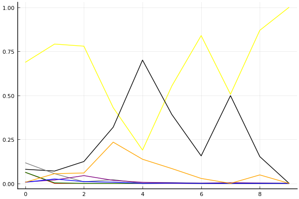
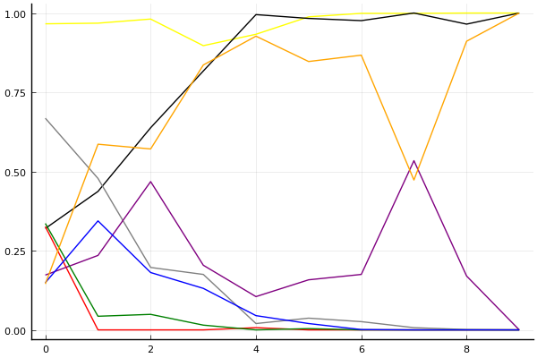
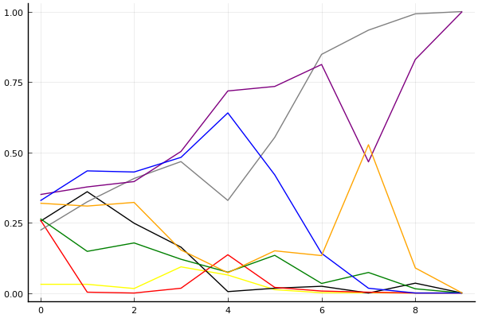

2020 시즌 2 개인전 32강 B조

## 경기 결과

| 트랙 | 박인수 | 노준현 | 유관영 | 신종민 | 한승철 | 윤준혁 | 임재원 | 우성민 |
|:---|---:|---:|---:|---:|---:|---:|---:|---:|
| [카멜롯 펜드래건 캐슬](../pendragon) | 5 | 4 | -1 | 0 | 3 | 1 | 7 | 10 |
| [대저택 은밀한 지하실](../jeotaek) | 7 | 5 | -1 | 0 | 10 | 3 | 1 | 4 |
| [어비스 숨겨진 바닷길](../hiddenoceanroad) | 0 | 7 | 5 | 4 | -1 | 1 | 3 | 10 |
| [아이스 아찔한 헬기 점프](../heli) | 7 | 10 | 4 | -1 | 3 | 0 | 1 | 5 |
| [황금문명 오르에트 황금 좌표](../coordinate) | 10 | 3 | -1 | 7 | 5 | 4 | 1 | 0 |
| [아이스 부서진 빙산](../boobing) | 10 | 4 | 1 | 7 | 5 | 0 | -1 | 3 |
| [[리버스] 해적 로비 절벽의 전투](../rlobby) | 4 | 10 | 1 | 3 | 7 | 5 | -1 | 0 |
| [공동묘지 해골성 대탐험](../skullcastle) | 5 | 0 | -1 | 7 | 4 | 3 | 1 | 10 |
| [동화 이상한 나라의 문](../gate) | 10 | 7 | 4 | -1 | 5 | 3 | 0 | 1 |
| __total__ |__58__ |__50__ |__11__ |__26__ |__41__ |__20__ |__12__ |__43__ |

## 시뮬레이션

### 1st 확률

x축: 트랙, y축: 확률
1번: 옐로우, 2번: 블랙, 3번: 레드, 4번: 화이트(회색), 5번: 퍼플, 6번: 그린, 7번: 블루, 8번: 오렌지

| 트랙 | 박인수 | 노준현 | 유관영 | 신종민 | 한승철 | 윤준혁 | 임재원 | 우성민 |
|:---|---:|---:|---:|---:|---:|---:|---:|---:|
| 초기 | 0.687 | 0.080 | 0.063 | 0.117 | 0.008 | 0.063 | 0.006 | 0.006 |
| 카멜롯 펜드래건 캐슬 | 0.791 | 0.070 | 0.000 | 0.055 | 0.019 | 0.003 | 0.025 | 0.055 |
| 대저택 은밀한 지하실 | 0.779 | 0.124 | 0.000 | 0.009 | 0.044 | 0.000 | 0.010 | 0.059 |
| 어비스 숨겨진 바닷길 | 0.430 | 0.319 | 0.000 | 0.021 | 0.017 | 0.000 | 0.007 | 0.234 |
| 아이스 아찔한 헬기 점프 | 0.189 | 0.700 | 0.000 | 0.000 | 0.006 | 0.000 | 0.000 | 0.137 |
| 황금문명 오르에트 황금 좌표 | 0.553 | 0.391 | 0.000 | 0.001 | 0.004 | 0.001 | 0.001 | 0.084 |
| 아이스 부서진 빙산 | 0.839 | 0.156 | 0.000 | 0.000 | 0.001 | 0.000 | 0.000 | 0.028 |
| [리버스] 해적 로비 절벽의 전투 | 0.506 | 0.498 | 0.000 | 0.000 | 0.004 | 0.000 | 0.000 | 0.000 |
| 공동묘지 해골성 대탐험 | 0.869 | 0.152 | 0.000 | 0.000 | 0.002 | 0.000 | 0.000 | 0.048 |
| 동화 이상한 나라의 문 | 1.000 | 0.000 | 0.000 | 0.000 | 0.000 | 0.000 | 0.000 | 0.000 |

### Advance 확률

x축: 트랙, y축: 확률
1번: 옐로우, 2번: 블랙, 3번: 레드, 4번: 화이트(회색), 5번: 퍼플, 6번: 그린, 7번: 블루, 8번: 오렌지

| 트랙 | 박인수 | 노준현 | 유관영 | 신종민 | 한승철 | 윤준혁 | 임재원 | 우성민 |
|:---|---:|---:|---:|---:|---:|---:|---:|---:|
| 초기 | 0.966 | 0.320 | 0.326 | 0.668 | 0.173 | 0.336 | 0.149 | 0.145 |
| 카멜롯 펜드래건 캐슬 | 0.968 | 0.437 | 0.000 | 0.478 | 0.235 | 0.043 | 0.344 | 0.586 |
| 대저택 은밀한 지하실 | 0.981 | 0.638 | 0.000 | 0.197 | 0.468 | 0.049 | 0.181 | 0.571 |
| 어비스 숨겨진 바닷길 | 0.897 | 0.817 | 0.000 | 0.175 | 0.204 | 0.015 | 0.131 | 0.836 |
| 아이스 아찔한 헬기 점프 | 0.933 | 0.995 | 0.007 | 0.020 | 0.105 | 0.000 | 0.045 | 0.927 |
| 황금문명 오르에트 황금 좌표 | 0.988 | 0.983 | 0.000 | 0.037 | 0.158 | 0.004 | 0.020 | 0.847 |
| 아이스 부서진 빙산 | 0.999 | 0.976 | 0.000 | 0.026 | 0.175 | 0.000 | 0.001 | 0.867 |
| [리버스] 해적 로비 절벽의 전투 | 0.999 | 1.000 | 0.000 | 0.007 | 0.534 | 0.000 | 0.000 | 0.473 |
| 공동묘지 해골성 대탐험 | 1.000 | 0.965 | 0.000 | 0.001 | 0.170 | 0.000 | 0.000 | 0.911 |
| 동화 이상한 나라의 문 | 1.000 | 1.000 | 0.000 | 0.000 | 0.000 | 0.000 | 0.000 | 1.000 |

### Repechage 확률

x축: 트랙, y축: 확률
1번: 옐로우, 2번: 블랙, 3번: 레드, 4번: 화이트(회색), 5번: 퍼플, 6번: 그린, 7번: 블루, 8번: 오렌지

| 트랙 | 박인수 | 노준현 | 유관영 | 신종민 | 한승철 | 윤준혁 | 임재원 | 우성민 |
|:---|---:|---:|---:|---:|---:|---:|---:|---:|
| 초기 | 0.031 | 0.255 | 0.260 | 0.223 | 0.350 | 0.264 | 0.328 | 0.319 |
| 카멜롯 펜드래건 캐슬 | 0.031 | 0.360 | 0.003 | 0.324 | 0.377 | 0.148 | 0.434 | 0.309 |
| 대저택 은밀한 지하실 | 0.016 | 0.248 | 0.000 | 0.407 | 0.396 | 0.178 | 0.430 | 0.322 |
| 어비스 숨겨진 바닷길 | 0.093 | 0.163 | 0.017 | 0.467 | 0.503 | 0.120 | 0.482 | 0.153 |
| 아이스 아찔한 헬기 점프 | 0.064 | 0.005 | 0.136 | 0.329 | 0.718 | 0.074 | 0.640 | 0.072 |
| 황금문명 오르에트 황금 좌표 | 0.012 | 0.017 | 0.020 | 0.553 | 0.734 | 0.134 | 0.420 | 0.150 |
| 아이스 부서진 빙산 | 0.001 | 0.024 | 0.007 | 0.848 | 0.812 | 0.034 | 0.141 | 0.133 |
| [리버스] 해적 로비 절벽의 전투 | 0.001 | 0.000 | 0.003 | 0.934 | 0.466 | 0.073 | 0.017 | 0.527 |
| 공동묘지 해골성 대탐험 | 0.000 | 0.035 | 0.000 | 0.992 | 0.830 | 0.015 | 0.000 | 0.089 |
| 동화 이상한 나라의 문 | 0.000 | 0.000 | 0.000 | 1.000 | 1.000 | 0.000 | 0.000 | 0.000 |

## 랭킹 변동

### [전체 랭킹](../singles-full)

| 순위 | 변동 | 이름 | 점수 | 변동 | mu | 변동 | sigma | 변동 |
|---:|---:|:---:|---:|---:|---:|---:|---:|---:|
| 2 / 89 | +0 | [박인수](../bakinsu) | 3320 | +6 | 3551 | +7 | 77 | +0 |
| 13 / 89 | -3 | [신종민](../shinjongmin) | 3012 | -56 | 3243 | -56 | 77 | +0 |
| 26 / 89 | +2 | [한승철](../hanseungcheol) | 2867 | +42 | 3102 | +40 | 78 | -1 |
| 29 / 89 | NaN | [노준현](../nojunhyeon) | 2816 | +2816 | 3405 | +405 | 196 | -804 |
| 31 / 89 | +4 | [우성민](../useongmin) | 2796 | +112 | 3109 | +72 | 104 | -13 |
| 33 / 89 | -3 | [임재원](../imjaewon) | 2757 | -49 | 2991 | -50 | 78 | -0 |
| 57 / 89 | NaN | [윤준혁](../yunjunhyeok) | 2394 | +2394 | 2957 | -43 | 188 | -812 |
| 72 / 89 | NaN | [유관영](../yugwanyeong) | 2093 | +2093 | 2725 | -275 | 211 | -789 |

### 시즌 랭킹

| 순위 | 변동 | 이름 | 점수 | 변동 | mu | 변동 | sigma | 변동 |
|---:|---:|:---:|---:|---:|---:|---:|---:|---:|
| 1 / 16 | NaN | [박인수](../bakinsu) | 2923 | +2923 | 3566 | +566 | 214 | -786 |
| 2 / 16 | NaN | [노준현](../nojunhyeon) | 2739 | +2739 | 3370 | +370 | 210 | -790 |
| 5 / 16 | NaN | [한승철](../hanseungcheol) | 2591 | +2591 | 3202 | +202 | 203 | -797 |
| 9 / 16 | NaN | [우성민](../useongmin) | 2488 | +2488 | 3125 | +125 | 212 | -788 |
| 11 / 16 | NaN | [신종민](../shinjongmin) | 2231 | +2231 | 2864 | -136 | 211 | -789 |
| 12 / 16 | NaN | [윤준혁](../yunjunhyeok) | 2217 | +2217 | 2817 | -183 | 200 | -800 |
| 15 / 16 | NaN | [유관영](../yugwanyeong) | 1931 | +1931 | 2586 | -414 | 219 | -781 |
| 16 / 16 | NaN | [임재원](../imjaewon) | 1917 | +1917 | 2542 | -458 | 208 | -792 |

### 트랙 별 랭킹

#### [[리버스] 해적 로비 절벽의 전투](../rlobby)

| 순위 | 변동 | 이름 | 점수 | 변동 | mu | 변동 | sigma | 변동 |
|:---:|:---:|:---:|---:|---:|---:|---:|---:|---:|
| 1 / 16 | NaN | [노준현](../nojunhyeon) | 2161 | +2161 | 4274 | +1274 | 704 | -296 |
| 4 / 16 | NaN | [한승철](../hanseungcheol) | 1887 | +1887 | 3763 | +763 | 625 | -375 |
| 5 / 16 | NaN | [윤준혁](../yunjunhyeok) | 1622 | +1622 | 3423 | +423 | 600 | -400 |
| 8 / 16 | NaN | [박인수](../bakinsu) | 1363 | +1363 | 3137 | +137 | 591 | -409 |
| 9 / 16 | NaN | [신종민](../shinjongmin) | 1090 | +1090 | 2863 | -137 | 591 | -409 |
| 11 / 16 | NaN | [유관영](../yugwanyeong) | 776 | +776 | 2577 | -423 | 600 | -400 |
| 13 / 16 | NaN | [우성민](../useongmin) | 361 | +361 | 2237 | -763 | 625 | -375 |
| 16 / 16 | NaN | [임재원](../imjaewon) | -388 | -388 | 1726 | -1274 | 704 | -296 |

#### [공동묘지 해골성 대탐험](../skullcastle)

| 순위 | 변동 | 이름 | 점수 | 변동 | mu | 변동 | sigma | 변동 |
|:---:|:---:|:---:|---:|---:|---:|---:|---:|---:|
| 3 / 25 | +0 | [신종민](../shinjongmin) | 2562 | +187 | 3465 | +97 | 301 | -30 |
| 6 / 25 | +4 | [박인수](../bakinsu) | 2196 | +207 | 3165 | +71 | 323 | -45 |
| 9 / 25 | NaN | [우성민](../useongmin) | 2070 | +2070 | 4105 | +1105 | 678 | -322 |
| 15 / 25 | +3 | [한승철](../hanseungcheol) | 1506 | +660 | 2854 | +170 | 449 | -163 |
| 20 / 25 | NaN | [윤준혁](../yunjunhyeok) | 1072 | +1072 | 2736 | -264 | 554 | -446 |
| 21 / 25 | NaN | [임재원](../imjaewon) | 757 | +757 | 2475 | -525 | 573 | -427 |
| 22 / 25 | NaN | [노준현](../nojunhyeon) | 344 | +344 | 2156 | -844 | 604 | -396 |
| 25 / 25 | NaN | [유관영](../yugwanyeong) | -400 | -400 | 1664 | -1336 | 688 | -312 |

#### [대저택 은밀한 지하실](../jeotaek)

| 순위 | 변동 | 이름 | 점수 | 변동 | mu | 변동 | sigma | 변동 |
|:---:|:---:|:---:|---:|---:|---:|---:|---:|---:|
| 2 / 73 | +0 | [박인수](../bakinsu) | 3242 | +26 | 3738 | +10 | 165 | -5 |
| 9 / 73 | +3 | [한승철](../hanseungcheol) | 2881 | +169 | 3546 | +133 | 221 | -12 |
| 19 / 73 | +2 | [임재원](../imjaewon) | 2230 | +15 | 2882 | -27 | 218 | -14 |
| 23 / 73 | -4 | [신종민](../shinjongmin) | 2186 | -82 | 2946 | -144 | 253 | -20 |
| 33 / 73 | +15 | [우성민](../useongmin) | 1931 | +568 | 3210 | +73 | 426 | -165 |
| 38 / 73 | NaN | [노준현](../nojunhyeon) | 1862 | +1862 | 3423 | +423 | 520 | -480 |
| 47 / 73 | NaN | [윤준혁](../yunjunhyeok) | 1454 | +1454 | 3007 | +7 | 518 | -482 |
| 67 / 73 | NaN | [유관영](../yugwanyeong) | -52 | -52 | 1988 | -1012 | 680 | -320 |

#### [동화 이상한 나라의 문](../gate)

| 순위 | 변동 | 이름 | 점수 | 변동 | mu | 변동 | sigma | 변동 |
|:---:|:---:|:---:|---:|---:|---:|---:|---:|---:|
| 3 / 35 | +0 | [박인수](../bakinsu) | 3288 | +144 | 4075 | +104 | 262 | -13 |
| 7 / 35 | -3 | [신종민](../shinjongmin) | 2733 | -389 | 3608 | -486 | 292 | -32 |
| 15 / 35 | NaN | [노준현](../nojunhyeon) | 2067 | +2067 | 3722 | +722 | 552 | -448 |
| 16 / 35 | +4 | [한승철](../hanseungcheol) | 2044 | +443 | 3025 | +285 | 327 | -53 |
| 17 / 35 | +0 | [우성민](../useongmin) | 1887 | +173 | 2972 | -75 | 362 | -83 |
| 20 / 35 | NaN | [유관영](../yugwanyeong) | 1673 | +1673 | 3237 | +237 | 521 | -479 |
| 23 / 35 | NaN | [윤준혁](../yunjunhyeok) | 1510 | +1510 | 3068 | +68 | 519 | -481 |
| 27 / 35 | +2 | [임재원](../imjaewon) | 1167 | +806 | 2490 | +253 | 441 | -184 |

#### [아이스 부서진 빙산](../boobing)

| 순위 | 변동 | 이름 | 점수 | 변동 | mu | 변동 | sigma | 변동 |
|:---:|:---:|:---:|---:|---:|---:|---:|---:|---:|
| 6 / 37 | +10 | [박인수](../bakinsu) | 2263 | +900 | 3737 | +600 | 491 | -100 |
| 10 / 37 | NaN | [신종민](../shinjongmin) | 1782 | +1782 | 3551 | +551 | 590 | -410 |
| 16 / 37 | NaN | [한승철](../hanseungcheol) | 1522 | +1522 | 3248 | +248 | 575 | -425 |
| 19 / 37 | NaN | [노준현](../nojunhyeon) | 1274 | +1274 | 2972 | -28 | 566 | -434 |
| 23 / 37 | +4 | [우성민](../useongmin) | 1072 | +711 | 2471 | +234 | 466 | -159 |
| 28 / 37 | NaN | [유관영](../yugwanyeong) | 765 | +765 | 2464 | -536 | 566 | -434 |
| 29 / 37 | -6 | [임재원](../imjaewon) | 472 | -304 | 1950 | -627 | 493 | -108 |
| 30 / 37 | NaN | [윤준혁](../yunjunhyeok) | 445 | +445 | 2189 | -811 | 581 | -419 |

#### [아이스 아찔한 헬기 점프](../heli)

| 순위 | 변동 | 이름 | 점수 | 변동 | mu | 변동 | sigma | 변동 |
|:---:|:---:|:---:|---:|---:|---:|---:|---:|---:|
| 3 / 34 | +3 | [박인수](../bakinsu) | 2602 | +141 | 3349 | +90 | 249 | -17 |
| 9 / 34 | -2 | [신종민](../shinjongmin) | 2238 | -208 | 2976 | -257 | 246 | -16 |
| 13 / 34 | NaN | [노준현](../nojunhyeon) | 2065 | +2065 | 4092 | +1092 | 676 | -324 |
| 15 / 34 | +6 | [우성민](../useongmin) | 1905 | +601 | 3158 | +201 | 418 | -133 |
| 19 / 34 | +1 | [한승철](../hanseungcheol) | 1630 | +272 | 2707 | +41 | 359 | -77 |
| 23 / 34 | NaN | [유관영](../yugwanyeong) | 1451 | +1451 | 3033 | +33 | 527 | -473 |
| 28 / 34 | NaN | [윤준혁](../yunjunhyeok) | 836 | +836 | 2427 | -573 | 530 | -470 |
| 29 / 34 | +1 | [임재원](../imjaewon) | 836 | +1223 | 2239 | +513 | 468 | -237 |

#### [어비스 숨겨진 바닷길](../hiddenoceanroad)

| 순위 | 변동 | 이름 | 점수 | 변동 | mu | 변동 | sigma | 변동 |
|:---:|:---:|:---:|---:|---:|---:|---:|---:|---:|
| 5 / 38 | +0 | [박인수](../bakinsu) | 2376 | -127 | 3070 | -179 | 231 | -17 |
| 12 / 38 | +2 | [신종민](../shinjongmin) | 2063 | +97 | 2789 | +35 | 242 | -21 |
| 19 / 38 | +12 | [우성민](../useongmin) | 1753 | +887 | 2916 | +668 | 387 | -73 |
| 20 / 38 | NaN | [노준현](../nojunhyeon) | 1722 | +1722 | 3335 | +335 | 538 | -462 |
| 26 / 38 | -7 | [한승철](../hanseungcheol) | 1566 | -156 | 2512 | -267 | 315 | -37 |
| 27 / 38 | NaN | [유관영](../yugwanyeong) | 1556 | +1556 | 3129 | +129 | 524 | -476 |
| 32 / 38 | NaN | [윤준혁](../yunjunhyeok) | 1088 | +1088 | 2623 | -377 | 511 | -489 |
| 34 / 38 | +1 | [임재원](../imjaewon) | 1005 | +1392 | 2373 | +648 | 456 | -248 |

#### [카멜롯 펜드래건 캐슬](../pendragon)

| 순위 | 변동 | 이름 | 점수 | 변동 | mu | 변동 | sigma | 변동 |
|:---:|:---:|:---:|---:|---:|---:|---:|---:|---:|
| 2 / 16 | NaN | [우성민](../useongmin) | 2161 | +2161 | 4274 | +1274 | 704 | -296 |
| 3 / 16 | NaN | [임재원](../imjaewon) | 1887 | +1887 | 3763 | +763 | 625 | -375 |
| 5 / 16 | NaN | [박인수](../bakinsu) | 1622 | +1622 | 3423 | +423 | 600 | -400 |
| 8 / 16 | NaN | [노준현](../nojunhyeon) | 1363 | +1363 | 3137 | +137 | 591 | -409 |
| 10 / 16 | NaN | [한승철](../hanseungcheol) | 1090 | +1090 | 2863 | -137 | 591 | -409 |
| 11 / 16 | NaN | [윤준혁](../yunjunhyeok) | 776 | +776 | 2577 | -423 | 600 | -400 |
| 13 / 16 | NaN | [신종민](../shinjongmin) | 361 | +361 | 2237 | -763 | 625 | -375 |
| 15 / 16 | NaN | [유관영](../yugwanyeong) | -388 | -388 | 1726 | -1274 | 704 | -296 |

#### [황금문명 오르에트 황금 좌표](../coordinate)

| 순위 | 변동 | 이름 | 점수 | 변동 | mu | 변동 | sigma | 변동 |
|:---:|:---:|:---:|---:|---:|---:|---:|---:|---:|
| 2 / 16 | NaN | [박인수](../bakinsu) | 2161 | +2161 | 4274 | +1274 | 704 | -296 |
| 4 / 16 | NaN | [신종민](../shinjongmin) | 1887 | +1887 | 3763 | +763 | 625 | -375 |
| 5 / 16 | NaN | [한승철](../hanseungcheol) | 1622 | +1622 | 3423 | +423 | 600 | -400 |
| 7 / 16 | NaN | [윤준혁](../yunjunhyeok) | 1363 | +1363 | 3137 | +137 | 591 | -409 |
| 9 / 16 | NaN | [노준현](../nojunhyeon) | 1090 | +1090 | 2863 | -137 | 591 | -409 |
| 12 / 16 | NaN | [임재원](../imjaewon) | 776 | +776 | 2577 | -423 | 600 | -400 |
| 13 / 16 | NaN | [우성민](../useongmin) | 361 | +361 | 2237 | -763 | 625 | -375 |
| 15 / 16 | NaN | [유관영](../yugwanyeong) | -388 | -388 | 1726 | -1274 | 704 | -296 |
