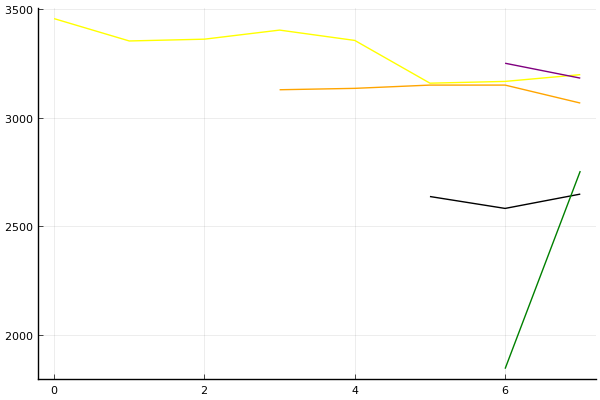

2020 시즌 2 32강 C조

### 선수

유영혁
김지민
김현민
김주영
박도현
최민석
최태원
정승하

### 경기 시뮬레이션

| 순위 | 유영혁 | 김지민 | 김현민 | 김주영 | 박도현 | 최민석 | 최태원 | 정승하 |
|:---:|---:|---:|---:|---:|---:|---:|---:|---:|
| 1위 | 0.385 | 0.005 | 0.000 | 0.020 | 0.376 | 0.010 | 0.074 | 0.157 |
| 2위 | 0.293 | 0.022 | 0.004 | 0.058 | 0.295 | 0.042 | 0.097 | 0.221 |
| 3위 | 0.173 | 0.053 | 0.012 | 0.110 | 0.176 | 0.101 | 0.135 | 0.255 |
| 4위 | 0.089 | 0.112 | 0.030 | 0.184 | 0.086 | 0.165 | 0.158 | 0.187 |
| 5위 | 0.037 | 0.177 | 0.068 | 0.213 | 0.044 | 0.206 | 0.156 | 0.100 |
| 6위 | 0.018 | 0.226 | 0.123 | 0.196 | 0.018 | 0.218 | 0.137 | 0.052 |
| 7위 | 0.004 | 0.256 | 0.238 | 0.149 | 0.004 | 0.176 | 0.129 | 0.024 |
| 8위 | 0.001 | 0.150 | 0.526 | 0.069 | 0.001 | 0.082 | 0.114 | 0.005 |
| 진출 | 0.851 | 0.079 | 0.016 | 0.188 | 0.847 | 0.154 | 0.306 | 0.633 |
| 패부 | 0.126 | 0.289 | 0.097 | 0.398 | 0.130 | 0.370 | 0.314 | 0.287 |
| 탈락 | 0.023 | 0.632 | 0.887 | 0.414 | 0.023 | 0.476 | 0.380 | 0.081 |

### 전체 랭킹

x축: 시즌, y축: 점수
1번: 옐로우, 2번: 블랙, 3번: 레드, 4번: 화이트(회색), 5번: 퍼플, 6번: 그린, 7번: 블루, 8번: 오렌지

| 순위 | 이름 | 점수 | mu | sigma | 주행 | 8인전 1-2-Mid-Lo | 8인전 평균득점 | 8인전 표준편차 | 2인전 전적 |
|---:|:---:|---:|---:|---:|---:|:---:|---:|---:|:---:|
| 6 / 85 | [유영혁](../yuyeonghyeok) | 3197 | 3425 | 76 | 300 | 16-16-41-27 | 4.46 | 3.36 | 0-0 |
| 7 / 85 | [박도현](../bakdohyeon) | 3182 | 3418 | 79 | 100 | 14-21-38-28 | 4.40 | 3.37 | 0-0 |
| 11 / 85 | [정승하](../jeongseungha) | 3067 | 3300 | 78 | 116 | 9-13-44-34 | 3.72 | 3.19 | 0-0 |
| 32 / 85 | [최민석](../choiminseok) | 2754 | 3046 | 97 | 43 | 6-8-31-56 | 2.25 | 3.14 | 0-0 |
| 36 / 85 | [김지민](../gimjimin) | 2648 | 2976 | 109 | 31 | 0-13-42-45 | 2.68 | 2.68 | 0-0 |
| 51 / 85 | [김주영](../gimjuyeong) | 2438 | 3067 | 210 | 8 | 14-14-14-57 | 3.00 | 4.00 | 0-0 |
| 67 / 85 | [김현민](../gimhyunmin) | 2122 | 2777 | 219 | 7 | 0-0-29-71 | 1.14 | 1.77 | 0-0 |
| NaN / 85 | [최태원](../choitaiwon) | 0 | 3000 | 1000 | 0 | 0-0-0-0 | 0.00 | 0.00 | 0-0 |

### 시즌 랭킹

#### [2020 시즌 1](../singles=s2020_1)

| 순위 | 이름 | 점수 | mu | sigma | 주행 | 8인전 1-2-Mid-Lo | 8인전 평균득점 | 8인전 표준편차 | 2인전 전적 |
|---:|:---:|---:|---:|---:|---:|:---:|---:|---:|:---:|
| 5 / 32 | [유영혁](../yuyeonghyeok) | 3066 | 3337 | 91 | 52 | 15-13-38-33 | 4.15 | 3.46 | 0-0 |
| 7 / 32 | [박도현](../bakdohyeon) | 2964 | 3246 | 94 | 47 | 13-21-34-32 | 4.09 | 3.51 | 0-0 |
| 13 / 32 | [최민석](../choiminseok) | 2671 | 2991 | 107 | 35 | 7-7-36-50 | 2.50 | 3.27 | 0-0 |
| 17 / 32 | [정승하](../jeongseungha) | 2483 | 2893 | 137 | 20 | 0-21-32-47 | 2.79 | 3.07 | 0-0 |
| 25 / 32 | [김지민](../gimjimin) | 2171 | 2857 | 229 | 7 | 0-0-57-43 | 2.43 | 1.81 | 0-0 |
| 27 / 32 | [김주영](../gimjuyeong) | 2134 | 2813 | 226 | 8 | 14-14-14-57 | 3.00 | 4.00 | 0-0 |
| 31 / 32 | [김현민](../gimhyunmin) | 1807 | 2525 | 239 | 7 | 0-0-29-71 | 1.14 | 1.77 | 0-0 |
| NaN / 32 | [최태원](../choitaiwon) | 0 | 3000 | 1000 | 0 | 0-0-0-0 | 0.00 | 0.00 | 0-0 |

#### [2019 시즌 2](../singles=s2019_2)

| 순위 | 이름 | 점수 | mu | sigma | 주행 | 8인전 1-2-Mid-Lo | 8인전 평균득점 | 8인전 표준편차 | 2인전 전적 |
|---:|:---:|---:|---:|---:|---:|:---:|---:|---:|:---:|
| 3 / 32 | [박도현](../bakdohyeon) | 3198 | 3475 | 92 | 53 | 14-20-41-24 | 4.69 | 3.24 | 0-0 |
| 6 / 32 | [유영혁](../yuyeonghyeok) | 3041 | 3330 | 96 | 42 | 12-10-45-33 | 3.76 | 3.11 | 0-0 |
| 29 / 32 | [김지민](../gimjimin) | 1849 | 2592 | 248 | 7 | 0-14-14-71 | 1.57 | 3.15 | 0-0 |
| 31 / 32 | [최민석](../choiminseok) | 1792 | 2469 | 226 | 8 | 0-12-12-75 | 1.38 | 2.62 | 0-0 |
| NaN / 32 | [김현민](../gimhyunmin) | 0 | 3000 | 1000 | 0 | 0-0-0-0 | 0.00 | 0.00 | 0-0 |
| NaN / 32 | [김주영](../gimjuyeong) | 0 | 3000 | 1000 | 0 | 0-0-0-0 | 0.00 | 0.00 | 0-0 |
| NaN / 32 | [최태원](../choitaiwon) | 0 | 3000 | 1000 | 0 | 0-0-0-0 | 0.00 | 0.00 | 0-0 |
| NaN / 32 | [정승하](../jeongseungha) | 0 | 3000 | 1000 | 0 | 0-0-0-0 | 0.00 | 0.00 | 0-0 |

#### [2019 시즌 1](../singles=s2019_1)

| 순위 | 이름 | 점수 | mu | sigma | 주행 | 8인전 1-2-Mid-Lo | 8인전 평균득점 | 8인전 표준편차 | 2인전 전적 |
|---:|:---:|---:|---:|---:|---:|:---:|---:|---:|:---:|
| 4 / 32 | [정승하](../jeongseungha) | 3056 | 3351 | 99 | 41 | 12-10-44-34 | 3.76 | 3.37 | 0-0 |
| 17 / 32 | [김지민](../gimjimin) | 2493 | 2930 | 146 | 17 | 0-18-47-35 | 3.24 | 2.75 | 0-0 |
| 19 / 32 | [유영혁](../yuyeonghyeok) | 2401 | 2802 | 134 | 21 | 5-14-29-52 | 2.52 | 3.33 | 0-0 |
| NaN / 32 | [김현민](../gimhyunmin) | 0 | 3000 | 1000 | 0 | 0-0-0-0 | 0.00 | 0.00 | 0-0 |
| NaN / 32 | [김주영](../gimjuyeong) | 0 | 3000 | 1000 | 0 | 0-0-0-0 | 0.00 | 0.00 | 0-0 |
| NaN / 32 | [박도현](../bakdohyeon) | 0 | 3000 | 1000 | 0 | 0-0-0-0 | 0.00 | 0.00 | 0-0 |
| NaN / 32 | [최민석](../choiminseok) | 0 | 3000 | 1000 | 0 | 0-0-0-0 | 0.00 | 0.00 | 0-0 |
| NaN / 32 | [최태원](../choitaiwon) | 0 | 3000 | 1000 | 0 | 0-0-0-0 | 0.00 | 0.00 | 0-0 |

#### [2018 듀얼 레이스 X](../singles=s2018_2)

| 순위 | 이름 | 점수 | mu | sigma | 주행 | 8인전 1-2-Mid-Lo | 8인전 평균득점 | 8인전 표준편차 | 2인전 전적 |
|---:|:---:|---:|---:|---:|---:|:---:|---:|---:|:---:|
| 4 / 8 | [유영혁](../yuyeonghyeok) | 2583 | 3102 | 173 | 14 | 12-12-50-25 | 4.00 | 3.21 | 0-0 |
| 5 / 8 | [정승하](../jeongseungha) | 2403 | 3068 | 222 | 8 | 12-0-50-38 | 3.38 | 3.62 | 0-0 |
| NaN / 8 | [김지민](../gimjimin) | 0 | 3000 | 1000 | 0 | 0-0-0-0 | 0.00 | 0.00 | 0-0 |
| NaN / 8 | [김현민](../gimhyunmin) | 0 | 3000 | 1000 | 0 | 0-0-0-0 | 0.00 | 0.00 | 0-0 |
| NaN / 8 | [김주영](../gimjuyeong) | 0 | 3000 | 1000 | 0 | 0-0-0-0 | 0.00 | 0.00 | 0-0 |
| NaN / 8 | [박도현](../bakdohyeon) | 0 | 3000 | 1000 | 0 | 0-0-0-0 | 0.00 | 0.00 | 0-0 |
| NaN / 8 | [최민석](../choiminseok) | 0 | 3000 | 1000 | 0 | 0-0-0-0 | 0.00 | 0.00 | 0-0 |
| NaN / 8 | [최태원](../choitaiwon) | 0 | 3000 | 1000 | 0 | 0-0-0-0 | 0.00 | 0.00 | 0-0 |

#### [2018 듀얼 레이스 3](../singles=s2018_1)

| 순위 | 이름 | 점수 | mu | sigma | 주행 | 8인전 1-2-Mid-Lo | 8인전 평균득점 | 8인전 표준편차 | 2인전 전적 |
|---:|:---:|---:|---:|---:|---:|:---:|---:|---:|:---:|
| 2 / 32 | [유영혁](../yuyeonghyeok) | 3338 | 3643 | 101 | 44 | 24-24-29-24 | 5.41 | 3.45 | 0-0 |
| 5 / 32 | [정승하](../jeongseungha) | 3100 | 3387 | 95 | 47 | 10-15-48-28 | 4.20 | 2.97 | 0-0 |
| NaN / 32 | [김지민](../gimjimin) | 0 | 3000 | 1000 | 0 | 0-0-0-0 | 0.00 | 0.00 | 0-0 |
| NaN / 32 | [김현민](../gimhyunmin) | 0 | 3000 | 1000 | 0 | 0-0-0-0 | 0.00 | 0.00 | 0-0 |
| NaN / 32 | [김주영](../gimjuyeong) | 0 | 3000 | 1000 | 0 | 0-0-0-0 | 0.00 | 0.00 | 0-0 |
| NaN / 32 | [박도현](../bakdohyeon) | 0 | 3000 | 1000 | 0 | 0-0-0-0 | 0.00 | 0.00 | 0-0 |
| NaN / 32 | [최민석](../choiminseok) | 0 | 3000 | 1000 | 0 | 0-0-0-0 | 0.00 | 0.00 | 0-0 |
| NaN / 32 | [최태원](../choitaiwon) | 0 | 3000 | 1000 | 0 | 0-0-0-0 | 0.00 | 0.00 | 0-0 |

#### [2017 Kespa Cup](../singles=s2017_2)

| 순위 | 이름 | 점수 | mu | sigma | 주행 | 8인전 1-2-Mid-Lo | 8인전 평균득점 | 8인전 표준편차 | 2인전 전적 |
|---:|:---:|---:|---:|---:|---:|:---:|---:|---:|:---:|
| 2 / 32 | [유영혁](../yuyeonghyeok) | 3387 | 3706 | 106 | 40 | 21-32-32-14 | 5.71 | 3.25 | 0-0 |
| NaN / 32 | [김지민](../gimjimin) | 0 | 3000 | 1000 | 0 | 0-0-0-0 | 0.00 | 0.00 | 0-0 |
| NaN / 32 | [김현민](../gimhyunmin) | 0 | 3000 | 1000 | 0 | 0-0-0-0 | 0.00 | 0.00 | 0-0 |
| NaN / 32 | [김주영](../gimjuyeong) | 0 | 3000 | 1000 | 0 | 0-0-0-0 | 0.00 | 0.00 | 0-0 |
| NaN / 32 | [박도현](../bakdohyeon) | 0 | 3000 | 1000 | 0 | 0-0-0-0 | 0.00 | 0.00 | 0-0 |
| NaN / 32 | [최민석](../choiminseok) | 0 | 3000 | 1000 | 0 | 0-0-0-0 | 0.00 | 0.00 | 0-0 |
| NaN / 32 | [최태원](../choitaiwon) | 0 | 3000 | 1000 | 0 | 0-0-0-0 | 0.00 | 0.00 | 0-0 |
| NaN / 32 | [정승하](../jeongseungha) | 0 | 3000 | 1000 | 0 | 0-0-0-0 | 0.00 | 0.00 | 0-0 |

#### [2017 듀얼 레이스 2](../singles=s2017_1)

| 순위 | 이름 | 점수 | mu | sigma | 주행 | 8인전 1-2-Mid-Lo | 8인전 평균득점 | 8인전 표준편차 | 2인전 전적 |
|---:|:---:|---:|---:|---:|---:|:---:|---:|---:|:---:|
| 2 / 16 | [유영혁](../yuyeonghyeok) | 2935 | 3217 | 94 | 55 | 9-12-59-19 | 4.28 | 2.99 | 0-0 |
| NaN / 16 | [김지민](../gimjimin) | 0 | 3000 | 1000 | 0 | 0-0-0-0 | 0.00 | 0.00 | 0-0 |
| NaN / 16 | [김현민](../gimhyunmin) | 0 | 3000 | 1000 | 0 | 0-0-0-0 | 0.00 | 0.00 | 0-0 |
| NaN / 16 | [김주영](../gimjuyeong) | 0 | 3000 | 1000 | 0 | 0-0-0-0 | 0.00 | 0.00 | 0-0 |
| NaN / 16 | [박도현](../bakdohyeon) | 0 | 3000 | 1000 | 0 | 0-0-0-0 | 0.00 | 0.00 | 0-0 |
| NaN / 16 | [최민석](../choiminseok) | 0 | 3000 | 1000 | 0 | 0-0-0-0 | 0.00 | 0.00 | 0-0 |
| NaN / 16 | [최태원](../choitaiwon) | 0 | 3000 | 1000 | 0 | 0-0-0-0 | 0.00 | 0.00 | 0-0 |
| NaN / 16 | [정승하](../jeongseungha) | 0 | 3000 | 1000 | 0 | 0-0-0-0 | 0.00 | 0.00 | 0-0 |

#### [2016 듀얼 레이스](../singles=s2016_1)

| 순위 | 이름 | 점수 | mu | sigma | 주행 | 8인전 1-2-Mid-Lo | 8인전 평균득점 | 8인전 표준편차 | 2인전 전적 |
|---:|:---:|---:|---:|---:|---:|:---:|---:|---:|:---:|
| 1 / 32 | [유영혁](../yuyeonghyeok) | 3455 | 3814 | 120 | 32 | 29-10-48-14 | 5.76 | 3.24 | 0-0 |
| NaN / 32 | [김지민](../gimjimin) | 0 | 3000 | 1000 | 0 | 0-0-0-0 | 0.00 | 0.00 | 0-0 |
| NaN / 32 | [김현민](../gimhyunmin) | 0 | 3000 | 1000 | 0 | 0-0-0-0 | 0.00 | 0.00 | 0-0 |
| NaN / 32 | [김주영](../gimjuyeong) | 0 | 3000 | 1000 | 0 | 0-0-0-0 | 0.00 | 0.00 | 0-0 |
| NaN / 32 | [박도현](../bakdohyeon) | 0 | 3000 | 1000 | 0 | 0-0-0-0 | 0.00 | 0.00 | 0-0 |
| NaN / 32 | [최민석](../choiminseok) | 0 | 3000 | 1000 | 0 | 0-0-0-0 | 0.00 | 0.00 | 0-0 |
| NaN / 32 | [최태원](../choitaiwon) | 0 | 3000 | 1000 | 0 | 0-0-0-0 | 0.00 | 0.00 | 0-0 |
| NaN / 32 | [정승하](../jeongseungha) | 0 | 3000 | 1000 | 0 | 0-0-0-0 | 0.00 | 0.00 | 0-0 |

### 트랙 랭킹

#### [어비스 숨겨진 바닷길](../hiddenoceanroad)

| 순위 | 이름 | 점수 | mu | sigma | 주행 | 8인전 1-2-Mid-Lo | 8인전 평균득점 | 8인전 표준편차 | 2인전 전적 |
|---:|:---:|---:|---:|---:|---:|:---:|---:|---:|:---:|
| 3 / 32 | [박도현](../bakdohyeon) | 2710 | 3568 | 286 | 5 | 20-20-60-0 | 6.00 | 2.65 | 0-0 |
| 9 / 32 | [유영혁](../yuyeonghyeok) | 2236 | 2990 | 251 | 6 | 0-0-50-50 | 2.17 | 1.72 | 0-0 |
| 12 / 32 | [정승하](../jeongseungha) | 2076 | 3381 | 435 | 3 | 0-50-50-0 | 5.00 | 2.83 | 0-0 |
| 13 / 32 | [최민석](../choiminseok) | 2002 | 2963 | 320 | 4 | 0-0-33-67 | 1.67 | 3.06 | 0-0 |
| 22 / 32 | [김현민](../gimhyunmin) | 1363 | 3137 | 591 | 1 | 0-0-100-0 | 4.00 | 0.00 | 0-0 |
| 26 / 32 | [김주영](../gimjuyeong) | 913 | 2491 | 526 | 2 | 0-0-100-0 | 3.00 | 0.00 | 0-0 |
| 29 / 32 | [김지민](../gimjimin) | 776 | 2577 | 600 | 1 | 0-0-0-100 | 1.00 | 0.00 | 0-0 |
| NaN / 32 | [최태원](../choitaiwon) | 0 | 3000 | 1000 | 0 | 0-0-0-0 | 0.00 | 0.00 | 0-0 |

#### [대저택 은밀한 지하실](../jeotaek)

| 순위 | 이름 | 점수 | mu | sigma | 주행 | 8인전 1-2-Mid-Lo | 8인전 평균득점 | 8인전 표준편차 | 2인전 전적 |
|---:|:---:|---:|---:|---:|---:|:---:|---:|---:|:---:|
| 1 / 68 | [유영혁](../yuyeonghyeok) | 3529 | 4103 | 192 | 13 | 42-17-33-8 | 7.00 | 3.05 | 0-0 |
| 11 / 68 | [정승하](../jeongseungha) | 2785 | 3354 | 190 | 10 | 10-10-30-50 | 3.30 | 3.59 | 0-0 |
| 32 / 68 | [김지민](../gimjimin) | 1915 | 3085 | 390 | 2 | 0-0-50-50 | 2.50 | 2.12 | 0-0 |
| NaN / 68 | [김현민](../gimhyunmin) | 0 | 3000 | 1000 | 0 | 0-0-0-0 | 0.00 | 0.00 | 0-0 |
| NaN / 68 | [김주영](../gimjuyeong) | 0 | 3000 | 1000 | 0 | 0-0-0-0 | 0.00 | 0.00 | 0-0 |
| NaN / 68 | [박도현](../bakdohyeon) | 0 | 3000 | 1000 | 0 | 0-0-0-0 | 0.00 | 0.00 | 0-0 |
| NaN / 68 | [최민석](../choiminseok) | 0 | 3000 | 1000 | 0 | 0-0-0-0 | 0.00 | 0.00 | 0-0 |
| NaN / 68 | [최태원](../choitaiwon) | 0 | 3000 | 1000 | 0 | 0-0-0-0 | 0.00 | 0.00 | 0-0 |

#### [동화 이상한 나라의 문](../gate)

| 순위 | 이름 | 점수 | mu | sigma | 주행 | 8인전 1-2-Mid-Lo | 8인전 평균득점 | 8인전 표준편차 | 2인전 전적 |
|---:|:---:|---:|---:|---:|---:|:---:|---:|---:|:---:|
| 2 / 29 | [박도현](../bakdohyeon) | 3355 | 4247 | 297 | 5 | 20-60-20-0 | 7.00 | 2.12 | 0-0 |
| 7 / 29 | [유영혁](../yuyeonghyeok) | 2925 | 3870 | 315 | 4 | 25-0-50-25 | 4.75 | 3.86 | 0-0 |
| 10 / 29 | [최민석](../choiminseok) | 2537 | 3508 | 324 | 4 | 0-0-67-33 | 2.67 | 1.53 | 0-0 |
| 12 / 29 | [김주영](../gimjuyeong) | 2161 | 4274 | 704 | 1 | 100-0-0-0 | 10.00 | 0.00 | 0-0 |
| 24 / 29 | [정승하](../jeongseungha) | 657 | 2152 | 498 | 2 | 0-0-0-100 | 0.00 | 1.41 | 0-0 |
| NaN / 29 | [김지민](../gimjimin) | 0 | 3000 | 1000 | 0 | 0-0-0-0 | 0.00 | 0.00 | 0-0 |
| NaN / 29 | [김현민](../gimhyunmin) | 0 | 3000 | 1000 | 0 | 0-0-0-0 | 0.00 | 0.00 | 0-0 |
| NaN / 29 | [최태원](../choitaiwon) | 0 | 3000 | 1000 | 0 | 0-0-0-0 | 0.00 | 0.00 | 0-0 |

#### [광산 위험한 제련소](../jeryeonso)

| 순위 | 이름 | 점수 | mu | sigma | 주행 | 8인전 1-2-Mid-Lo | 8인전 평균득점 | 8인전 표준편차 | 2인전 전적 |
|---:|:---:|---:|---:|---:|---:|:---:|---:|---:|:---:|
| 3 / 40 | [유영혁](../yuyeonghyeok) | 3010 | 3703 | 231 | 8 | 0-71-0-29 | 5.14 | 3.18 | 0-0 |
| 12 / 40 | [정승하](../jeongseungha) | 2355 | 3186 | 277 | 5 | 0-20-40-40 | 3.00 | 3.39 | 0-0 |
| NaN / 40 | [김지민](../gimjimin) | 0 | 3000 | 1000 | 0 | 0-0-0-0 | 0.00 | 0.00 | 0-0 |
| NaN / 40 | [김현민](../gimhyunmin) | 0 | 3000 | 1000 | 0 | 0-0-0-0 | 0.00 | 0.00 | 0-0 |
| NaN / 40 | [김주영](../gimjuyeong) | 0 | 3000 | 1000 | 0 | 0-0-0-0 | 0.00 | 0.00 | 0-0 |
| NaN / 40 | [박도현](../bakdohyeon) | 0 | 3000 | 1000 | 0 | 0-0-0-0 | 0.00 | 0.00 | 0-0 |
| NaN / 40 | [최민석](../choiminseok) | 0 | 3000 | 1000 | 0 | 0-0-0-0 | 0.00 | 0.00 | 0-0 |
| NaN / 40 | [최태원](../choitaiwon) | 0 | 3000 | 1000 | 0 | 0-0-0-0 | 0.00 | 0.00 | 0-0 |

#### [공동묘지 해골성 대탐험](../skullcastle)

| 순위 | 이름 | 점수 | mu | sigma | 주행 | 8인전 1-2-Mid-Lo | 8인전 평균득점 | 8인전 표준편차 | 2인전 전적 |
|---:|:---:|---:|---:|---:|---:|:---:|---:|---:|:---:|
| 7 / 15 | [유영혁](../yuyeonghyeok) | 2096 | 3340 | 414 | 2 | 0-0-50-50 | 2.50 | 3.54 | 0-0 |
| 9 / 15 | [최민석](../choiminseok) | 1524 | 2904 | 460 | 2 | 0-0-0-100 | 0.00 | 0.00 | 0-0 |
| 12 / 15 | [박도현](../bakdohyeon) | 1271 | 2923 | 551 | 1 | 0-0-0-100 | 1.00 | 0.00 | 0-0 |
| NaN / 15 | [김지민](../gimjimin) | 0 | 3000 | 1000 | 0 | 0-0-0-0 | 0.00 | 0.00 | 0-0 |
| NaN / 15 | [김현민](../gimhyunmin) | 0 | 3000 | 1000 | 0 | 0-0-0-0 | 0.00 | 0.00 | 0-0 |
| NaN / 15 | [김주영](../gimjuyeong) | 0 | 3000 | 1000 | 0 | 0-0-0-0 | 0.00 | 0.00 | 0-0 |
| NaN / 15 | [최태원](../choitaiwon) | 0 | 3000 | 1000 | 0 | 0-0-0-0 | 0.00 | 0.00 | 0-0 |
| NaN / 15 | [정승하](../jeongseungha) | 0 | 3000 | 1000 | 0 | 0-0-0-0 | 0.00 | 0.00 | 0-0 |

#### [아이스 부서진 빙산](../boobing)

| 순위 | 이름 | 점수 | mu | sigma | 주행 | 8인전 1-2-Mid-Lo | 8인전 평균득점 | 8인전 표준편차 | 2인전 전적 |
|---:|:---:|---:|---:|---:|---:|:---:|---:|---:|:---:|
| 1 / 32 | [유영혁](../yuyeonghyeok) | 3470 | 5002 | 511 | 3 | 100-0-0-0 | 10.00 | 0.00 | 0-0 |
| NaN / 32 | [김지민](../gimjimin) | 0 | 3000 | 1000 | 0 | 0-0-0-0 | 0.00 | 0.00 | 0-0 |
| NaN / 32 | [김현민](../gimhyunmin) | 0 | 3000 | 1000 | 0 | 0-0-0-0 | 0.00 | 0.00 | 0-0 |
| NaN / 32 | [김주영](../gimjuyeong) | 0 | 3000 | 1000 | 0 | 0-0-0-0 | 0.00 | 0.00 | 0-0 |
| NaN / 32 | [박도현](../bakdohyeon) | 0 | 3000 | 1000 | 0 | 0-0-0-0 | 0.00 | 0.00 | 0-0 |
| NaN / 32 | [최민석](../choiminseok) | 0 | 3000 | 1000 | 0 | 0-0-0-0 | 0.00 | 0.00 | 0-0 |
| NaN / 32 | [최태원](../choitaiwon) | 0 | 3000 | 1000 | 0 | 0-0-0-0 | 0.00 | 0.00 | 0-0 |
| NaN / 32 | [정승하](../jeongseungha) | 0 | 3000 | 1000 | 0 | 0-0-0-0 | 0.00 | 0.00 | 0-0 |

### 상대전적

경기 별: 

| 선수 | __유영혁__ | __김지민__ | __김현민__ | __김주영__ | __박도현__ | __최민석__ | __최태원__ | __정승하__ |
|:---:|:---:|:---:|:---:|:---:|:---:|:---:|:---:|:---:|
| __유영혁__ | - | 1-0 | 1-0 | 0-0 | 4-3 | 1-0 | 0-0 | 4-0 |
| __김지민__ | 0-1 | - | 1-0 | 0-0 | 0-0 | 0-0 | 0-0 | 0-1 |
| __김현민__ | 0-1 | 0-1 | - | 0-0 | 0-0 | 0-0 | 0-0 | 0-0 |
| __김주영__ | 0-0 | 0-0 | 0-0 | - | 0-0 | 0-0 | 0-0 | 0-0 |
| __박도현__ | 3-4 | 0-0 | 0-0 | 0-0 | - | 2-1 | 0-0 | 1-0 |
| __최민석__ | 0-1 | 0-0 | 0-0 | 0-0 | 1-2 | - | 0-0 | 0-0 |
| __최태원__ | 0-0 | 0-0 | 0-0 | 0-0 | 0-0 | 0-0 | - | 0-0 |
| __정승하__ | 0-4 | 1-0 | 0-0 | 0-0 | 0-1 | 0-0 | 0-0 | - |

| 선수 | __유영혁__ | __김지민__ | __김현민__ | __김주영__ | __박도현__ | __최민석__ | __최태원__ | __정승하__ |
|:---:|:---:|:---:|:---:|:---:|:---:|:---:|:---:|:---:|
| __유영혁__ | - | 1.000 | 1.000 | NaN | 0.571 | 1.000 | NaN | 1.000 |
| __김지민__ | 0.000 | - | 1.000 | NaN | NaN | NaN | NaN | 0.000 |
| __김현민__ | 0.000 | 0.000 | - | NaN | NaN | NaN | NaN | NaN |
| __김주영__ | NaN | NaN | NaN | - | NaN | NaN | NaN | NaN |
| __박도현__ | 0.429 | NaN | NaN | NaN | - | 0.667 | NaN | 1.000 |
| __최민석__ | 0.000 | NaN | NaN | NaN | 0.333 | - | NaN | NaN |
| __최태원__ | NaN | NaN | NaN | NaN | NaN | NaN | - | NaN |
| __정승하__ | 0.000 | 1.000 | NaN | NaN | 0.000 | NaN | NaN | - |

트랙 별: 

| 선수 | __유영혁__ | __김지민__ | __김현민__ | __김주영__ | __박도현__ | __최민석__ | __최태원__ | __정승하__ |
|:---:|:---:|:---:|:---:|:---:|:---:|:---:|:---:|:---:|
| __유영혁__ | - | 5-2 | 5-2 | 0-0 | 28-42 | 8-1 | 0-0 | 21-11 |
| __김지민__ | 2-5 | - | 5-2 | 0-0 | 0-0 | 0-0 | 0-0 | 3-4 |
| __김현민__ | 2-5 | 2-5 | - | 0-0 | 0-0 | 0-0 | 0-0 | 0-0 |
| __김주영__ | 0-0 | 0-0 | 0-0 | - | 0-0 | 0-0 | 0-0 | 0-0 |
| __박도현__ | 42-28 | 0-0 | 0-0 | 0-0 | - | 19-9 | 0-0 | 7-3 |
| __최민석__ | 1-8 | 0-0 | 0-0 | 0-0 | 9-19 | - | 0-0 | 0-0 |
| __최태원__ | 0-0 | 0-0 | 0-0 | 0-0 | 0-0 | 0-0 | - | 0-0 |
| __정승하__ | 11-21 | 4-3 | 0-0 | 0-0 | 3-7 | 0-0 | 0-0 | - |

| 선수 | __유영혁__ | __김지민__ | __김현민__ | __김주영__ | __박도현__ | __최민석__ | __최태원__ | __정승하__ |
|:---:|:---:|:---:|:---:|:---:|:---:|:---:|:---:|:---:|
| __유영혁__ | - | 0.714 | 0.714 | NaN | 0.400 | 0.889 | NaN | 0.656 |
| __김지민__ | 0.286 | - | 0.714 | NaN | NaN | NaN | NaN | 0.429 |
| __김현민__ | 0.286 | 0.286 | - | NaN | NaN | NaN | NaN | NaN |
| __김주영__ | NaN | NaN | NaN | - | NaN | NaN | NaN | NaN |
| __박도현__ | 0.600 | NaN | NaN | NaN | - | 0.679 | NaN | 0.700 |
| __최민석__ | 0.111 | NaN | NaN | NaN | 0.321 | - | NaN | NaN |
| __최태원__ | NaN | NaN | NaN | NaN | NaN | NaN | - | NaN |
| __정승하__ | 0.344 | 0.571 | NaN | NaN | 0.300 | NaN | NaN | - |
