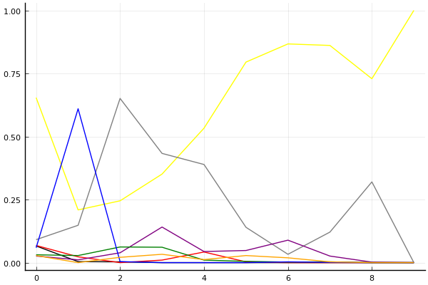
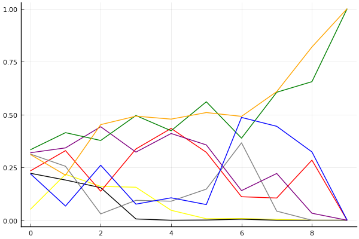

2020 시즌 2 개인전 32강 D조

## 경기 결과

| 트랙 | 이재혁 | 권승주 | 정승민B | 배성빈 | 박현수 | 김승래 | 이정우 | 정유민 |
|:---|---:|---:|---:|---:|---:|---:|---:|---:|
| [카멜롯 펜드래건 캐슬](../pendragon) | 0 | 1 | 3 | 10 | 4 | 5 | 7 | -1 |
| [어비스 숨겨진 바닷길](../hiddenoceanroad) | 3 | 1 | 0 | 10 | 4 | 5 | -1 | 7 |
| [대저택 은밀한 지하실](../jeotaek) | 7 | -5 | 5 | 1 | 10 | 3 | 0 | 4 |
| [황금문명 오르에트 황금 좌표](../coordinate) | 10 | 0 | 7 | 5 | 1 | -1 | 3 | 4 |
| [[리버스] 해적 로비 절벽의 전투](../rlobby) | 10 | 3 | -1 | 0 | 5 | 4 | 1 | 7 |
| [아이스 아찔한 헬기 점프](../heli) | 5 | 4 | 0 | -1 | 7 | 1 | 10 | 3 |
| [광산 위험한 제련소](../jeryeonso) | 5 | -1 | 4 | 10 | 0 | 7 | 3 | 1 |
| [동화 이상한 나라의 문](../gate) | 7 | 5 | 3 | 10 | 4 | 0 | -1 | 1 |
| [공동묘지 해골성 대탐험](../skullcastle) | 10 | 1 | 0 | 5 | 4 | 7 | -1 | 3 |
| __total__ |__57__ |__9__ |__21__ |__50__ |__39__ |__31__ |__21__ |__29__ |

## 시뮬레이션

### 1st 확률

x축: 트랙, y축: 확률
1번: 옐로우, 2번: 블랙, 3번: 레드, 4번: 화이트(회색), 5번: 퍼플, 6번: 그린, 7번: 블루, 8번: 오렌지

| 트랙 | 이재혁 | 권승주 | 정승민B | 배성빈 | 박현수 | 김승래 | 이정우 | 정유민 |
|:---|---:|---:|---:|---:|---:|---:|---:|---:|
| 초기 | 0.654 | 0.066 | 0.068 | 0.091 | 0.026 | 0.031 | 0.059 | 0.028 |
| 카멜롯 펜드래건 캐슬 | 0.209 | 0.004 | 0.023 | 0.148 | 0.011 | 0.028 | 0.610 | 0.000 |
| 어비스 숨겨진 바닷길 | 0.245 | 0.003 | 0.000 | 0.651 | 0.039 | 0.062 | 0.004 | 0.021 |
| 대저택 은밀한 지하실 | 0.351 | 0.000 | 0.010 | 0.433 | 0.141 | 0.061 | 0.000 | 0.033 |
| 황금문명 오르에트 황금 좌표 | 0.533 | 0.000 | 0.042 | 0.389 | 0.044 | 0.010 | 0.000 | 0.012 |
| [리버스] 해적 로비 절벽의 전투 | 0.795 | 0.000 | 0.003 | 0.140 | 0.048 | 0.005 | 0.000 | 0.028 |
| 아이스 아찔한 헬기 점프 | 0.867 | 0.000 | 0.000 | 0.033 | 0.089 | 0.002 | 0.003 | 0.019 |
| 광산 위험한 제련소 | 0.861 | 0.000 | 0.000 | 0.121 | 0.026 | 0.003 | 0.001 | 0.003 |
| 동화 이상한 나라의 문 | 0.729 | 0.000 | 0.000 | 0.320 | 0.002 | 0.000 | 0.000 | 0.000 |
| 공동묘지 해골성 대탐험 | 1.000 | 0.000 | 0.000 | 0.000 | 0.000 | 0.000 | 0.000 | 0.000 |

### Advance 확률

x축: 트랙, y축: 확률
1번: 옐로우, 2번: 블랙, 3번: 레드, 4번: 화이트(회색), 5번: 퍼플, 6번: 그린, 7번: 블루, 8번: 오렌지

| 트랙 | 이재혁 | 권승주 | 정승민B | 배성빈 | 박현수 | 김승래 | 이정우 | 정유민 |
|:---|---:|---:|---:|---:|---:|---:|---:|---:|
| 초기 | 0.936 | 0.299 | 0.283 | 0.462 | 0.243 | 0.293 | 0.290 | 0.302 |
| 카멜롯 펜드래건 캐슬 | 0.731 | 0.054 | 0.200 | 0.686 | 0.189 | 0.254 | 0.917 | 0.044 |
| 어비스 숨겨진 바닷길 | 0.808 | 0.039 | 0.029 | 0.967 | 0.352 | 0.516 | 0.107 | 0.262 |
| 대저택 은밀한 지하실 | 0.828 | 0.000 | 0.101 | 0.901 | 0.625 | 0.380 | 0.012 | 0.238 |
| 황금문명 오르에트 황금 좌표 | 0.948 | 0.000 | 0.369 | 0.906 | 0.498 | 0.149 | 0.011 | 0.225 |
| [리버스] 해적 로비 절벽의 전투 | 0.993 | 0.000 | 0.041 | 0.845 | 0.613 | 0.166 | 0.004 | 0.430 |
| 아이스 아찔한 헬기 점프 | 0.992 | 0.000 | 0.011 | 0.602 | 0.853 | 0.086 | 0.117 | 0.423 |
| 광산 위험한 제련소 | 0.996 | 0.000 | 0.007 | 0.957 | 0.764 | 0.127 | 0.056 | 0.187 |
| 동화 이상한 나라의 문 | 1.000 | 0.000 | 0.000 | 1.000 | 0.967 | 0.014 | 0.001 | 0.045 |
| 공동묘지 해골성 대탐험 | 1.000 | 0.000 | 0.000 | 1.000 | 1.000 | 0.000 | 0.000 | 0.000 |

### Repechage 확률

x축: 트랙, y축: 확률
1번: 옐로우, 2번: 블랙, 3번: 레드, 4번: 화이트(회색), 5번: 퍼플, 6번: 그린, 7번: 블루, 8번: 오렌지

| 트랙 | 이재혁 | 권승주 | 정승민B | 배성빈 | 박현수 | 김승래 | 이정우 | 정유민 |
|:---|---:|---:|---:|---:|---:|---:|---:|---:|
| 초기 | 0.051 | 0.222 | 0.233 | 0.313 | 0.319 | 0.333 | 0.220 | 0.311 |
| 카멜롯 펜드래건 캐슬 | 0.217 | 0.190 | 0.329 | 0.255 | 0.342 | 0.414 | 0.067 | 0.213 |
| 어비스 숨겨진 바닷길 | 0.160 | 0.154 | 0.137 | 0.030 | 0.442 | 0.377 | 0.260 | 0.452 |
| 대저택 은밀한 지하실 | 0.156 | 0.006 | 0.337 | 0.094 | 0.322 | 0.495 | 0.076 | 0.492 |
| 황금문명 오르에트 황금 좌표 | 0.047 | 0.000 | 0.434 | 0.090 | 0.410 | 0.423 | 0.106 | 0.478 |
| [리버스] 해적 로비 절벽의 전투 | 0.007 | 0.001 | 0.321 | 0.147 | 0.356 | 0.560 | 0.074 | 0.509 |
| 아이스 아찔한 헬기 점프 | 0.008 | 0.005 | 0.111 | 0.366 | 0.140 | 0.388 | 0.486 | 0.491 |
| 광산 위험한 제련소 | 0.004 | 0.000 | 0.105 | 0.043 | 0.221 | 0.605 | 0.444 | 0.608 |
| 동화 이상한 나라의 문 | 0.000 | 0.000 | 0.284 | 0.000 | 0.033 | 0.655 | 0.323 | 0.819 |
| 공동묘지 해골성 대탐험 | 0.000 | 0.000 | 0.000 | 0.000 | 0.000 | 1.000 | 0.000 | 1.000 |

## 랭킹 변동

### [전체 랭킹](../singles-full)

| 순위 | 변동 | 이름 | 점수 | 변동 | mu | 변동 | sigma | 변동 |
|---:|---:|:---:|---:|---:|---:|---:|---:|---:|
| 3 / 93 | +0 | [이재혁](../ijaehyeok) | 3317 | +4 | 3547 | +6 | 77 | +0 |
| 11 / 93 | +0 | [배성빈](../baeseongbin) | 3059 | +23 | 3290 | +24 | 77 | +0 |
| 19 / 93 | +0 | [김승래](../gimseungrae) | 2938 | -6 | 3166 | -6 | 76 | +0 |
| 21 / 93 | +2 | [박현수](../bakhyeonsu) | 2927 | +25 | 3163 | +22 | 79 | -1 |
| 36 / 93 | +2 | [정유민](../jeongyumin) | 2731 | +97 | 3132 | -42 | 134 | -46 |
| 59 / 93 | NaN | [정승민B](../jeongseungminb) | 2365 | +2365 | 2941 | -59 | 192 | -808 |
| 67 / 93 | NaN | [권승주](../glamint) | 2232 | +2232 | 2818 | -182 | 195 | -805 |
| 68 / 93 | NaN | [이정우](../ijeongu) | 2230 | +2230 | 2831 | -169 | 200 | -800 |

### 시즌 랭킹

| 순위 | 변동 | 이름 | 점수 | 변동 | mu | 변동 | sigma | 변동 |
|---:|---:|:---:|---:|---:|---:|---:|---:|---:|
| 3 / 32 | NaN | [이재혁](../ijaehyeok) | 2868 | +2868 | 3503 | +503 | 211 | -789 |
| 10 / 32 | NaN | [배성빈](../baeseongbin) | 2581 | +2581 | 3236 | +236 | 218 | -782 |
| 13 / 32 | NaN | [박현수](../bakhyeonsu) | 2500 | +2500 | 3105 | +105 | 202 | -798 |
| 18 / 32 | NaN | [김승래](../gimseungrae) | 2373 | +2373 | 2980 | -20 | 202 | -798 |
| 19 / 32 | NaN | [정유민](../jeongyumin) | 2365 | +2365 | 2971 | -29 | 202 | -798 |
| 23 / 32 | NaN | [정승민B](../jeongseungminb) | 2159 | +2159 | 2763 | -237 | 201 | -799 |
| 25 / 32 | NaN | [이정우](../ijeongu) | 2037 | +2037 | 2668 | -332 | 210 | -790 |
| 27 / 32 | NaN | [권승주](../glamint) | 2018 | +2018 | 2640 | -360 | 207 | -793 |

### 트랙 별 랭킹

#### [[리버스] 해적 로비 절벽의 전투](../rlobby)

| 순위 | 변동 | 이름 | 점수 | 변동 | mu | 변동 | sigma | 변동 |
|:---:|:---:|:---:|---:|---:|---:|---:|---:|---:|
| 1 / 32 | NaN | [이재혁](../ijaehyeok) | 2161 | +2161 | 4274 | +1274 | 704 | -296 |
| 7 / 32 | NaN | [정유민](../jeongyumin) | 1887 | +1887 | 3763 | +763 | 625 | -375 |
| 12 / 32 | NaN | [박현수](../bakhyeonsu) | 1622 | +1622 | 3423 | +423 | 600 | -400 |
| 16 / 32 | NaN | [김승래](../gimseungrae) | 1363 | +1363 | 3137 | +137 | 591 | -409 |
| 20 / 32 | NaN | [권승주](../glamint) | 1090 | +1090 | 2863 | -137 | 591 | -409 |
| 23 / 32 | NaN | [이정우](../ijeongu) | 776 | +776 | 2577 | -423 | 600 | -400 |
| 25 / 32 | NaN | [배성빈](../baeseongbin) | 361 | +361 | 2237 | -763 | 625 | -375 |
| 32 / 32 | NaN | [정승민B](../jeongseungminb) | -388 | -388 | 1726 | -1274 | 704 | -296 |

#### [공동묘지 해골성 대탐험](../skullcastle)

| 순위 | 변동 | 이름 | 점수 | 변동 | mu | 변동 | sigma | 변동 |
|:---:|:---:|:---:|---:|---:|---:|---:|---:|---:|
| 2 / 36 | +0 | [이재혁](../ijaehyeok) | 2891 | +247 | 3817 | +180 | 309 | -22 |
| 12 / 36 | +7 | [배성빈](../baeseongbin) | 1980 | +488 | 3275 | +139 | 432 | -116 |
| 15 / 36 | NaN | [김승래](../gimseungrae) | 1909 | +1909 | 3609 | +609 | 567 | -433 |
| 21 / 36 | NaN | [박현수](../bakhyeonsu) | 1373 | +1373 | 3057 | +57 | 561 | -439 |
| 26 / 36 | NaN | [정유민](../jeongyumin) | 1091 | +1091 | 2802 | -198 | 570 | -430 |
| 28 / 36 | NaN | [권승주](../glamint) | 773 | +773 | 2529 | -471 | 585 | -415 |
| 30 / 36 | NaN | [정승민B](../jeongseungminb) | 357 | +357 | 2199 | -801 | 614 | -386 |
| 35 / 36 | NaN | [이정우](../ijeongu) | -391 | -391 | 1697 | -1303 | 696 | -304 |

#### [광산 위험한 제련소](../jeryeonso)

| 순위 | 변동 | 이름 | 점수 | 변동 | mu | 변동 | sigma | 변동 |
|:---:|:---:|:---:|---:|---:|---:|---:|---:|---:|
| 6 / 54 | +1 | [이재혁](../ijaehyeok) | 2695 | +31 | 3360 | -14 | 222 | -15 |
| 12 / 54 | +1 | [김승래](../gimseungrae) | 2453 | +141 | 3130 | +95 | 225 | -15 |
| 14 / 54 | +10 | [배성빈](../baeseongbin) | 2342 | +547 | 3453 | +365 | 370 | -61 |
| 26 / 54 | -4 | [박현수](../bakhyeonsu) | 1749 | -81 | 2609 | -160 | 287 | -26 |
| 31 / 54 | NaN | [정승민B](../jeongseungminb) | 1462 | +1462 | 3031 | +31 | 523 | -477 |
| 37 / 54 | NaN | [이정우](../ijeongu) | 1231 | +1231 | 2823 | -177 | 531 | -469 |
| 39 / 54 | NaN | [정유민](../jeongyumin) | 993 | +993 | 2604 | -396 | 537 | -463 |
| 52 / 54 | NaN | [권승주](../glamint) | -180 | -180 | 1828 | -1172 | 669 | -331 |

#### [대저택 은밀한 지하실](../jeotaek)

| 순위 | 변동 | 이름 | 점수 | 변동 | mu | 변동 | sigma | 변동 |
|:---:|:---:|:---:|---:|---:|---:|---:|---:|---:|
| 4 / 77 | +0 | [김승래](../gimseungrae) | 3064 | -32 | 3566 | -51 | 167 | -6 |
| 5 / 77 | +0 | [이재혁](../ijaehyeok) | 3050 | +51 | 3628 | +23 | 193 | -10 |
| 17 / 77 | -1 | [배성빈](../baeseongbin) | 2400 | -43 | 3218 | -128 | 273 | -28 |
| 19 / 77 | +20 | [박현수](../bakhyeonsu) | 2292 | +463 | 3168 | +363 | 292 | -33 |
| 37 / 77 | NaN | [정승민B](../jeongseungminb) | 1901 | +1901 | 3435 | +435 | 511 | -489 |
| 43 / 77 | NaN | [정유민](../jeongyumin) | 1742 | +1742 | 3271 | +271 | 510 | -490 |
| 63 / 77 | NaN | [이정우](../ijeongu) | 717 | +717 | 2493 | -507 | 592 | -408 |
| 72 / 77 | NaN | [권승주](../glamint) | -188 | -188 | 1922 | -1078 | 703 | -297 |

#### [동화 이상한 나라의 문](../gate)

| 순위 | 변동 | 이름 | 점수 | 변동 | mu | 변동 | sigma | 변동 |
|:---:|:---:|:---:|---:|---:|---:|---:|---:|---:|
| 8 / 41 | +1 | [배성빈](../baeseongbin) | 2813 | +219 | 3724 | +147 | 304 | -24 |
| 11 / 41 | +0 | [이재혁](../ijaehyeok) | 2413 | +200 | 3269 | +114 | 285 | -29 |
| 23 / 41 | NaN | [권승주](../glamint) | 1575 | +1575 | 3185 | +185 | 537 | -463 |
| 28 / 41 | -6 | [김승래](../gimseungrae) | 1314 | -309 | 2674 | -750 | 453 | -147 |
| 29 / 41 | +6 | [박현수](../bakhyeonsu) | 1308 | +947 | 2654 | +417 | 449 | -177 |
| 32 / 41 | +1 | [정유민](../jeongyumin) | 1158 | +382 | 2489 | -88 | 444 | -157 |
| 33 / 41 | NaN | [정승민B](../jeongseungminb) | 1139 | +1139 | 2746 | -254 | 535 | -465 |
| 39 / 41 | NaN | [이정우](../ijeongu) | -216 | -216 | 1798 | -1202 | 672 | -328 |

#### [아이스 아찔한 헬기 점프](../heli)

| 순위 | 변동 | 이름 | 점수 | 변동 | mu | 변동 | sigma | 변동 |
|:---:|:---:|:---:|---:|---:|---:|---:|---:|---:|
| 2 / 39 | +0 | [이재혁](../ijaehyeok) | 2707 | +99 | 3481 | +43 | 258 | -18 |
| 8 / 39 | NaN | [이정우](../ijeongu) | 2279 | +2279 | 4314 | +1314 | 678 | -322 |
| 14 / 39 | NaN | [박현수](../bakhyeonsu) | 2067 | +2067 | 3819 | +819 | 584 | -416 |
| 20 / 39 | +0 | [정유민](../jeongyumin) | 1833 | +211 | 3179 | -244 | 449 | -152 |
| 23 / 39 | NaN | [권승주](../glamint) | 1611 | +1611 | 3245 | +245 | 545 | -455 |
| 30 / 39 | NaN | [김승래](../gimseungrae) | 1020 | +1020 | 2713 | -287 | 564 | -436 |
| 31 / 39 | -4 | [배성빈](../baeseongbin) | 899 | -121 | 2025 | -231 | 375 | -37 |
| 35 / 39 | NaN | [정승민B](../jeongseungminb) | 637 | +637 | 2382 | -618 | 582 | -418 |

#### [어비스 숨겨진 바닷길](../hiddenoceanroad)

| 순위 | 변동 | 이름 | 점수 | 변동 | mu | 변동 | sigma | 변동 |
|:---:|:---:|:---:|---:|---:|---:|---:|---:|---:|
| 2 / 42 | +0 | [이재혁](../ijaehyeok) | 2879 | -166 | 3663 | -239 | 261 | -25 |
| 5 / 42 | +3 | [배성빈](../baeseongbin) | 2613 | +281 | 3485 | +205 | 291 | -25 |
| 14 / 42 | +18 | [정유민](../jeongyumin) | 2001 | +911 | 3301 | +438 | 433 | -158 |
| 16 / 42 | +13 | [김승래](../gimseungrae) | 1976 | +614 | 3261 | +125 | 428 | -163 |
| 30 / 42 | +9 | [박현수](../bakhyeonsu) | 1439 | +1060 | 2727 | +551 | 429 | -170 |
| 37 / 42 | NaN | [권승주](../glamint) | 981 | +981 | 2650 | -350 | 556 | -444 |
| 41 / 42 | NaN | [정승민B](../jeongseungminb) | 500 | +500 | 2300 | -700 | 600 | -400 |
| 42 / 42 | NaN | [이정우](../ijeongu) | -306 | -306 | 1777 | -1223 | 694 | -306 |

#### [카멜롯 펜드래건 캐슬](../pendragon)

| 순위 | 변동 | 이름 | 점수 | 변동 | mu | 변동 | sigma | 변동 |
|:---:|:---:|:---:|---:|---:|---:|---:|---:|---:|
| 2 / 32 | NaN | [배성빈](../baeseongbin) | 2161 | +2161 | 4274 | +1274 | 704 | -296 |
| 8 / 32 | NaN | [이정우](../ijeongu) | 1887 | +1887 | 3763 | +763 | 625 | -375 |
| 11 / 32 | NaN | [김승래](../gimseungrae) | 1622 | +1622 | 3423 | +423 | 600 | -400 |
| 15 / 32 | NaN | [박현수](../bakhyeonsu) | 1363 | +1363 | 3137 | +137 | 591 | -409 |
| 19 / 32 | NaN | [정승민B](../jeongseungminb) | 1090 | +1090 | 2863 | -137 | 591 | -409 |
| 23 / 32 | NaN | [권승주](../glamint) | 776 | +776 | 2577 | -423 | 600 | -400 |
| 26 / 32 | NaN | [이재혁](../ijaehyeok) | 361 | +361 | 2237 | -763 | 625 | -375 |
| 32 / 32 | NaN | [정유민](../jeongyumin) | -388 | -388 | 1726 | -1274 | 704 | -296 |

#### [황금문명 오르에트 황금 좌표](../coordinate)

| 순위 | 변동 | 이름 | 점수 | 변동 | mu | 변동 | sigma | 변동 |
|:---:|:---:|:---:|---:|---:|---:|---:|---:|---:|
| 2 / 24 | NaN | [이재혁](../ijaehyeok) | 2161 | +2161 | 4274 | +1274 | 704 | -296 |
| 6 / 24 | NaN | [정승민B](../jeongseungminb) | 1887 | +1887 | 3763 | +763 | 625 | -375 |
| 8 / 24 | NaN | [배성빈](../baeseongbin) | 1622 | +1622 | 3423 | +423 | 600 | -400 |
| 12 / 24 | NaN | [정유민](../jeongyumin) | 1363 | +1363 | 3137 | +137 | 591 | -409 |
| 15 / 24 | NaN | [이정우](../ijeongu) | 1090 | +1090 | 2863 | -137 | 591 | -409 |
| 18 / 24 | NaN | [박현수](../bakhyeonsu) | 776 | +776 | 2577 | -423 | 600 | -400 |
| 20 / 24 | NaN | [권승주](../glamint) | 361 | +361 | 2237 | -763 | 625 | -375 |
| 24 / 24 | NaN | [김승래](../gimseungrae) | -388 | -388 | 1726 | -1274 | 704 | -296 |
