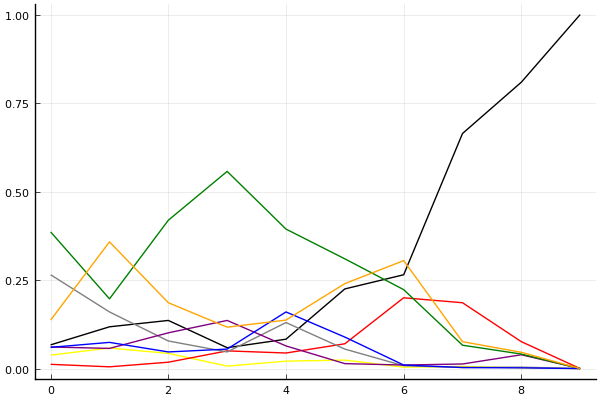

2020 시즌 2 개인전 32강 패자부활전

## 경기 결과

| 트랙 | 한승철 | 최영훈 | 김지민 | 전대웅 | 김승래 | 박도현 | 정유민 | 신종민 |
|:---|---:|---:|---:|---:|---:|---:|---:|---:|
| [카멜롯 펜드래건 캐슬](../pendragon) | 5 | 7 | 1 | 0 | 3 | -1 | 4 | 10 |
| [아이스 부서진 빙산](../boobing) | 1 | 4 | 5 | 0 | 7 | 10 | 3 | -1 |
| [황금문명 오르에트 황금 좌표](../coordinate) | -1 | 0 | 10 | 1 | 5 | 7 | 4 | 3 |
| [[리버스] 해적 로비 절벽의 전투](../rlobby) | 5 | 4 | 1 | 10 | -1 | 0 | 7 | 3 |
| [광산 위험한 제련소](../jeryeonso) | 5 | 10 | 4 | 0 | -1 | 3 | 1 | 7 |
| [대저택 은밀한 지하실](../jeotaek) | 0 | 5 | 10 | 1 | 3 | 4 | -1 | 7 |
| [아이스 아찔한 헬기 점프](../heli) | 4 | 10 | 5 | 0 | 7 | 1 | 3 | -1 |
| [공동묘지 해골성 대탐험](../skullcastle) | 5 | 4 | -1 | 10 | 7 | 3 | 0 | 1 |
| [동화 이상한 나라의 문](../gate) | 10 | 7 | 0 | -1 | 5 | 3 | 4 | 1 |
| __total__ |__34__ |__51__ |__35__ |__21__ |__35__ |__30__ |__25__ |__30__ |

## 시뮬레이션

### 1st 확률

x축: 트랙, y축: 확률
1번: 옐로우, 2번: 블랙, 3번: 레드, 4번: 화이트(회색), 5번: 퍼플, 6번: 그린, 7번: 블루, 8번: 오렌지

| 트랙 | 한승철 | 최영훈 | 김지민 | 전대웅 | 김승래 | 박도현 | 정유민 | 신종민 |
|:---|---:|---:|---:|---:|---:|---:|---:|---:|
| 초기 | 0.038 | 0.067 | 0.012 | 0.265 | 0.061 | 0.386 | 0.060 | 0.137 |
| 카멜롯 펜드래건 캐슬 | 0.058 | 0.118 | 0.005 | 0.160 | 0.057 | 0.197 | 0.074 | 0.358 |
| 아이스 부서진 빙산 | 0.043 | 0.136 | 0.018 | 0.078 | 0.101 | 0.419 | 0.047 | 0.186 |
| 황금문명 오르에트 황금 좌표 | 0.007 | 0.059 | 0.050 | 0.047 | 0.136 | 0.557 | 0.055 | 0.117 |
| [리버스] 해적 로비 절벽의 전투 | 0.021 | 0.083 | 0.044 | 0.130 | 0.064 | 0.394 | 0.160 | 0.137 |
| 광산 위험한 제련소 | 0.024 | 0.225 | 0.070 | 0.055 | 0.014 | 0.310 | 0.089 | 0.240 |
| 대저택 은밀한 지하실 | 0.004 | 0.265 | 0.200 | 0.008 | 0.010 | 0.223 | 0.010 | 0.305 |
| 아이스 아찔한 헬기 점프 | 0.006 | 0.664 | 0.186 | 0.003 | 0.013 | 0.066 | 0.003 | 0.076 |
| 공동묘지 해골성 대탐험 | 0.002 | 0.809 | 0.076 | 0.004 | 0.039 | 0.041 | 0.002 | 0.046 |
| 동화 이상한 나라의 문 | 0.000 | 1.000 | 0.000 | 0.000 | 0.000 | 0.000 | 0.000 | 0.000 |

### Advance 확률

x축: 트랙, y축: 확률
1번: 옐로우, 2번: 블랙, 3번: 레드, 4번: 화이트(회색), 5번: 퍼플, 6번: 그린, 7번: 블루, 8번: 오렌지

| 트랙 | 한승철 | 최영훈 | 김지민 | 전대웅 | 김승래 | 박도현 | 정유민 | 신종민 |
|:---|---:|---:|---:|---:|---:|---:|---:|---:|
| 초기 | 0.316 | 0.451 | 0.177 | 0.770 | 0.462 | 0.842 | 0.420 | 0.662 |
| 카멜롯 펜드래건 캐슬 | 0.378 | 0.602 | 0.118 | 0.630 | 0.421 | 0.696 | 0.436 | 0.853 |
| 아이스 부서진 빙산 | 0.317 | 0.646 | 0.196 | 0.440 | 0.588 | 0.870 | 0.382 | 0.706 |
| 황금문명 오르에트 황금 좌표 | 0.134 | 0.490 | 0.500 | 0.295 | 0.679 | 0.935 | 0.448 | 0.651 |
| [리버스] 해적 로비 절벽의 전투 | 0.174 | 0.494 | 0.401 | 0.573 | 0.387 | 0.854 | 0.640 | 0.614 |
| 광산 위험한 제련소 | 0.234 | 0.779 | 0.433 | 0.372 | 0.215 | 0.816 | 0.509 | 0.771 |
| 대저택 은밀한 지하실 | 0.105 | 0.867 | 0.853 | 0.185 | 0.170 | 0.832 | 0.198 | 0.891 |
| 아이스 아찔한 헬기 점프 | 0.104 | 0.988 | 0.962 | 0.051 | 0.362 | 0.627 | 0.208 | 0.813 |
| 공동묘지 해골성 대탐험 | 0.165 | 0.996 | 0.861 | 0.194 | 0.655 | 0.568 | 0.072 | 0.647 |
| 동화 이상한 나라의 문 | 1.000 | 1.000 | 1.000 | 0.000 | 1.000 | 0.000 | 0.000 | 0.000 |

## 랭킹 변동

### [전체 랭킹](../singles-full)

| 순위 | 변동 | 이름 | 점수 | 변동 | mu | 변동 | sigma | 변동 |
|---:|---:|:---:|---:|---:|---:|---:|---:|---:|
| 8 / 93 | -1 | [박도현](../bakdohyeon) | 3098 | -38 | 3330 | -40 | 77 | -1 |
| 11 / 93 | -2 | [전대웅](../jeondaewoong) | 3037 | -52 | 3266 | -51 | 76 | +0 |
| 14 / 93 | -1 | [신종민](../shinjongmin) | 2992 | -20 | 3222 | -20 | 77 | -0 |
| 15 / 93 | +5 | [최영훈](../choiyeonghun) | 2988 | +55 | 3217 | +55 | 76 | -0 |
| 20 / 93 | -1 | [김승래](../gimseungrae) | 2948 | +10 | 3176 | +9 | 76 | -0 |
| 24 / 93 | +2 | [한승철](../hanseungcheol) | 2894 | +27 | 3127 | +25 | 78 | -1 |
| 33 / 93 | +4 | [김지민](../gimjimin) | 2794 | +75 | 3073 | +53 | 93 | -7 |
| 34 / 93 | +2 | [정유민](../jeongyumin) | 2775 | +44 | 3111 | -21 | 112 | -22 |

### 시즌 랭킹

| 순위 | 변동 | 이름 | 점수 | 변동 | mu | 변동 | sigma | 변동 |
|---:|---:|:---:|---:|---:|---:|---:|---:|---:|
| 4 / 32 | +8 | [최영훈](../choiyeonghun) | 2839 | +338 | 3270 | +148 | 144 | -63 |
| 6 / 32 | +2 | [한승철](../hanseungcheol) | 2727 | +136 | 3153 | -49 | 142 | -62 |
| 9 / 32 | +7 | [김지민](../gimjimin) | 2665 | +203 | 3115 | -26 | 150 | -76 |
| 11 / 32 | +7 | [김승래](../gimseungrae) | 2620 | +247 | 3047 | +67 | 142 | -60 |
| 12 / 32 | +5 | [박도현](../bakdohyeon) | 2587 | +188 | 3037 | -56 | 150 | -81 |
| 16 / 32 | +3 | [정유민](../jeongyumin) | 2533 | +168 | 2955 | -16 | 141 | -61 |
| 17 / 32 | -3 | [전대웅](../jeondaewoong) | 2528 | +33 | 2960 | -148 | 144 | -60 |
| 18 / 32 | +3 | [신종민](../shinjongmin) | 2503 | +272 | 2940 | +76 | 146 | -66 |

### 트랙 별 랭킹

#### [[리버스] 해적 로비 절벽의 전투](../rlobby)

| 순위 | 변동 | 이름 | 점수 | 변동 | mu | 변동 | sigma | 변동 |
|:---:|:---:|:---:|---:|---:|---:|---:|---:|---:|
| 1 / 32 | +9 | [전대웅](../jeondaewoong) | 2736 | +1113 | 4161 | +738 | 475 | -125 |
| 2 / 32 | +5 | [정유민](../jeongyumin) | 2687 | +801 | 4067 | +304 | 460 | -165 |
| 3 / 32 | +3 | [한승철](../hanseungcheol) | 2524 | +637 | 3880 | +117 | 452 | -173 |
| 4 / 32 | +0 | [최영훈](../choiyeonghun) | 2450 | +289 | 3876 | -398 | 475 | -229 |
| 8 / 32 | +0 | [김지민](../gimjimin) | 1968 | +81 | 3327 | -436 | 453 | -172 |
| 10 / 32 | +7 | [신종민](../shinjongmin) | 1823 | +734 | 3135 | +272 | 437 | -154 |
| 14 / 32 | +4 | [박도현](../bakdohyeon) | 1382 | +293 | 2738 | -125 | 452 | -139 |
| 18 / 32 | -2 | [김승래](../gimseungrae) | 1125 | -237 | 2568 | -569 | 481 | -111 |

#### [공동묘지 해골성 대탐험](../skullcastle)

| 순위 | 변동 | 이름 | 점수 | 변동 | mu | 변동 | sigma | 변동 |
|:---:|:---:|:---:|---:|---:|---:|---:|---:|---:|
| 3 / 36 | +7 | [전대웅](../jeondaewoong) | 2536 | +473 | 3509 | +350 | 324 | -41 |
| 4 / 36 | -1 | [신종민](../shinjongmin) | 2505 | -58 | 3317 | -149 | 271 | -30 |
| 5 / 36 | +10 | [김승래](../gimseungrae) | 2478 | +570 | 3738 | +129 | 420 | -147 |
| 6 / 36 | -1 | [최영훈](../choiyeonghun) | 2393 | +174 | 3518 | -145 | 375 | -107 |
| 10 / 36 | +4 | [박도현](../bakdohyeon) | 2146 | +201 | 3190 | -37 | 348 | -79 |
| 12 / 36 | +8 | [한승철](../hanseungcheol) | 2086 | +581 | 3169 | +315 | 361 | -89 |
| 22 / 36 | +4 | [정유민](../jeongyumin) | 1358 | +267 | 2651 | -151 | 431 | -139 |
| 25 / 36 | -3 | [김지민](../gimjimin) | 1136 | -195 | 2471 | -476 | 445 | -94 |

#### [광산 위험한 제련소](../jeryeonso)

| 순위 | 변동 | 이름 | 점수 | 변동 | mu | 변동 | sigma | 변동 |
|:---:|:---:|:---:|---:|---:|---:|---:|---:|---:|
| 4 / 55 | +0 | [전대웅](../jeondaewoong) | 2845 | -147 | 3480 | -190 | 212 | -14 |
| 5 / 55 | +5 | [최영훈](../choiyeonghun) | 2832 | +252 | 3826 | +168 | 331 | -28 |
| 13 / 55 | -1 | [김승래](../gimseungrae) | 2343 | -110 | 2983 | -146 | 213 | -12 |
| 22 / 55 | +7 | [김지민](../gimjimin) | 1909 | +325 | 3116 | -114 | 402 | -146 |
| 24 / 55 | NaN | [신종민](../shinjongmin) | 1832 | +1832 | 3491 | +491 | 553 | -447 |
| 32 / 55 | +7 | [정유민](../jeongyumin) | 1468 | +475 | 2655 | +51 | 396 | -141 |
| 39 / 55 | +7 | [한승철](../hanseungcheol) | 1234 | +809 | 2238 | +611 | 335 | -66 |
| 41 / 55 | +10 | [박도현](../bakdohyeon) | 1215 | +1291 | 2551 | +560 | 445 | -244 |

#### [대저택 은밀한 지하실](../jeotaek)

| 순위 | 변동 | 이름 | 점수 | 변동 | mu | 변동 | sigma | 변동 |
|:---:|:---:|:---:|---:|---:|---:|---:|---:|---:|
| 4 / 78 | +0 | [김승래](../gimseungrae) | 3059 | -5 | 3542 | -24 | 161 | -6 |
| 6 / 78 | +2 | [최영훈](../choiyeonghun) | 2963 | +59 | 3632 | +4 | 223 | -18 |
| 8 / 78 | -1 | [전대웅](../jeondaewoong) | 2893 | -21 | 3478 | -56 | 195 | -12 |
| 10 / 78 | -1 | [한승철](../hanseungcheol) | 2818 | -63 | 3443 | -103 | 208 | -13 |
| 16 / 78 | +19 | [김지민](../gimjimin) | 2478 | +563 | 3484 | +399 | 335 | -54 |
| 17 / 78 | +7 | [신종민](../shinjongmin) | 2426 | +240 | 3125 | +179 | 233 | -20 |
| 36 / 78 | NaN | [박도현](../bakdohyeon) | 1912 | +1912 | 3388 | +388 | 492 | -508 |
| 49 / 78 | -6 | [정유민](../jeongyumin) | 1595 | -147 | 2853 | -419 | 419 | -91 |

#### [동화 이상한 나라의 문](../gate)

| 순위 | 변동 | 이름 | 점수 | 변동 | mu | 변동 | sigma | 변동 |
|:---:|:---:|:---:|---:|---:|---:|---:|---:|---:|
| 3 / 41 | -1 | [박도현](../bakdohyeon) | 3186 | -133 | 3919 | -210 | 245 | -26 |
| 9 / 41 | +0 | [신종민](../shinjongmin) | 2678 | -55 | 3460 | -148 | 261 | -31 |
| 10 / 41 | +2 | [최영훈](../choiyeonghun) | 2441 | +246 | 3237 | +152 | 265 | -31 |
| 11 / 41 | +4 | [한승철](../hanseungcheol) | 2433 | +389 | 3312 | +287 | 293 | -34 |
| 13 / 41 | -3 | [전대웅](../jeondaewoong) | 2289 | -125 | 3053 | -184 | 255 | -20 |
| 16 / 41 | +12 | [김승래](../gimseungrae) | 1965 | +651 | 3033 | +359 | 356 | -97 |
| 19 / 41 | +1 | [김지민](../gimjimin) | 1810 | +136 | 3017 | -285 | 403 | -140 |
| 20 / 41 | +12 | [정유민](../jeongyumin) | 1804 | +646 | 2855 | +366 | 350 | -94 |

#### [아이스 부서진 빙산](../boobing)

| 순위 | 변동 | 이름 | 점수 | 변동 | mu | 변동 | sigma | 변동 |
|:---:|:---:|:---:|---:|---:|---:|---:|---:|---:|
| 5 / 46 | +18 | [박도현](../bakdohyeon) | 2400 | +1240 | 3806 | +853 | 469 | -129 |
| 6 / 46 | -2 | [전대웅](../jeondaewoong) | 2371 | -286 | 3525 | -566 | 385 | -93 |
| 8 / 46 | +11 | [김지민](../gimjimin) | 2241 | +785 | 3552 | +301 | 437 | -161 |
| 9 / 46 | +8 | [최영훈](../choiyeonghun) | 2190 | +568 | 3491 | +68 | 434 | -167 |
| 10 / 46 | NaN | [김승래](../gimseungrae) | 2189 | +2189 | 3832 | +832 | 548 | -452 |
| 14 / 46 | +4 | [한승철](../hanseungcheol) | 1903 | +381 | 3176 | -72 | 424 | -151 |
| 18 / 46 | NaN | [정유민](../jeongyumin) | 1689 | +1689 | 3260 | +260 | 524 | -476 |
| 22 / 46 | -11 | [신종민](../shinjongmin) | 1520 | -262 | 2918 | -633 | 466 | -124 |

#### [아이스 아찔한 헬기 점프](../heli)

| 순위 | 변동 | 이름 | 점수 | 변동 | mu | 변동 | sigma | 변동 |
|:---:|:---:|:---:|---:|---:|---:|---:|---:|---:|
| 2 / 39 | -1 | [전대웅](../jeondaewoong) | 2626 | -85 | 3279 | -134 | 218 | -16 |
| 6 / 39 | +0 | [박도현](../bakdohyeon) | 2491 | -47 | 3278 | -144 | 262 | -32 |
| 11 / 39 | -1 | [신종민](../shinjongmin) | 2152 | -86 | 2846 | -130 | 231 | -15 |
| 13 / 39 | +8 | [최영훈](../choiyeonghun) | 2120 | +423 | 2977 | +327 | 286 | -32 |
| 17 / 39 | +3 | [정유민](../jeongyumin) | 2046 | +213 | 3105 | -74 | 353 | -96 |
| 18 / 39 | +4 | [한승철](../hanseungcheol) | 1945 | +315 | 2859 | +152 | 305 | -54 |
| 20 / 39 | +10 | [김승래](../gimseungrae) | 1936 | +915 | 3164 | +451 | 410 | -155 |
| 22 / 39 | +6 | [김지민](../gimjimin) | 1890 | +800 | 3131 | +268 | 414 | -177 |

#### [카멜롯 펜드래건 캐슬](../pendragon)

| 순위 | 변동 | 이름 | 점수 | 변동 | mu | 변동 | sigma | 변동 |
|:---:|:---:|:---:|---:|---:|---:|---:|---:|---:|
| 9 / 32 | +16 | [신종민](../shinjongmin) | 1699 | +1338 | 3130 | +892 | 477 | -148 |
| 10 / 32 | +14 | [최영훈](../choiyeonghun) | 1694 | +919 | 3017 | +441 | 441 | -159 |
| 11 / 32 | +7 | [한승철](../hanseungcheol) | 1692 | +603 | 2983 | +119 | 430 | -161 |
| 12 / 32 | -1 | [김승래](../gimseungrae) | 1683 | +61 | 2973 | -450 | 430 | -170 |
| 19 / 32 | +1 | [김지민](../gimjimin) | 1329 | +239 | 2617 | -247 | 429 | -162 |
| 20 / 32 | -3 | [전대웅](../jeondaewoong) | 1153 | +63 | 2464 | -400 | 437 | -154 |
| 22 / 32 | +10 | [정유민](../jeongyumin) | 1076 | +1464 | 2464 | +738 | 463 | -242 |
| 23 / 32 | -9 | [박도현](../bakdohyeon) | 970 | -392 | 2355 | -781 | 462 | -130 |

#### [황금문명 오르에트 황금 좌표](../coordinate)

| 순위 | 변동 | 이름 | 점수 | 변동 | mu | 변동 | sigma | 변동 |
|:---:|:---:|:---:|---:|---:|---:|---:|---:|---:|
| 4 / 26 | NaN | [김지민](../gimjimin) | 2160 | +2160 | 4228 | +1228 | 689 | -311 |
| 5 / 26 | +0 | [신종민](../shinjongmin) | 1965 | +78 | 3311 | -452 | 448 | -177 |
| 6 / 26 | NaN | [박도현](../bakdohyeon) | 1933 | +1933 | 3707 | +707 | 591 | -409 |
| 8 / 26 | +4 | [정유민](../jeongyumin) | 1881 | +519 | 3192 | +55 | 437 | -154 |
| 9 / 26 | -5 | [전대웅](../jeondaewoong) | 1786 | -101 | 3145 | -618 | 453 | -172 |
| 12 / 26 | +12 | [김승래](../gimseungrae) | 1429 | +1816 | 2873 | +1147 | 481 | -223 |
| 15 / 26 | -8 | [한승철](../hanseungcheol) | 1114 | -508 | 2546 | -877 | 477 | -123 |
| 22 / 26 | +1 | [최영훈](../choiyeonghun) | 611 | +999 | 2106 | +381 | 498 | -206 |
