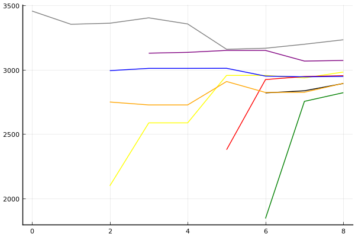

2020 시즌 2 16강 1경기

### 선수

송용준
최윤서
김기수
유영혁
정승하
최민석
김승래
한승철

### 경기 시뮬레이션

| 순위 | 송용준 | 최윤서 | 김기수 | 유영혁 | 정승하 | 최민석 | 김승래 | 한승철 |
|:---:|---:|---:|---:|---:|---:|---:|---:|---:|
| 1위 | 0.083 | 0.050 | 0.060 | 0.557 | 0.174 | 0.019 | 0.050 | 0.032 |
| 2위 | 0.155 | 0.106 | 0.116 | 0.212 | 0.223 | 0.059 | 0.108 | 0.073 |
| 3위 | 0.152 | 0.131 | 0.143 | 0.106 | 0.171 | 0.081 | 0.134 | 0.101 |
| 4위 | 0.146 | 0.144 | 0.147 | 0.056 | 0.143 | 0.110 | 0.144 | 0.126 |
| 5위 | 0.135 | 0.148 | 0.148 | 0.036 | 0.110 | 0.135 | 0.152 | 0.141 |
| 6위 | 0.132 | 0.148 | 0.134 | 0.019 | 0.082 | 0.158 | 0.147 | 0.154 |
| 7위 | 0.115 | 0.143 | 0.133 | 0.010 | 0.059 | 0.199 | 0.139 | 0.177 |
| 8위 | 0.081 | 0.131 | 0.119 | 0.004 | 0.039 | 0.240 | 0.126 | 0.196 |
| 승자전 | 0.536 | 0.430 | 0.466 | 0.930 | 0.711 | 0.269 | 0.435 | 0.333 |

### 전체 랭킹

x축: 시즌, y축: 점수
1번: 옐로우, 2번: 블랙, 3번: 레드, 4번: 화이트(회색), 5번: 퍼플, 6번: 그린, 7번: 블루, 8번: 오렌지

| 순위 | 이름 | 점수 | mu | sigma | 주행 | 8인전 1-2-Mid-Lo | 8인전 평균득점 | 8인전 표준편차 | 2인전 전적 |
|---:|:---:|---:|---:|---:|---:|:---:|---:|---:|:---:|
| 5 / 93 | [유영혁](../yuyeonghyeok) | 3232 | 3462 | 76 | 307 | 17-16-40-27 | 4.55 | 3.41 | 0-0 |
| 9 / 93 | [정승하](../jeongseungha) | 3072 | 3303 | 77 | 123 | 10-14-43-33 | 3.81 | 3.20 | 0-0 |
| 16 / 93 | [송용준](../songyongjun) | 2982 | 3221 | 80 | 87 | 8-8-49-34 | 3.30 | 3.06 | 0-0 |
| 18 / 93 | [김기수](../gimgisu) | 2953 | 3190 | 79 | 101 | 12-10-33-46 | 3.13 | 3.54 | 0-0 |
| 20 / 93 | [김승래](../gimseungrae) | 2948 | 3176 | 76 | 181 | 7-15-40-38 | 3.40 | 3.16 | 0-0 |
| 24 / 93 | [한승철](../hanseungcheol) | 2894 | 3127 | 78 | 114 | 8-10-46-36 | 3.29 | 3.31 | 0-0 |
| 25 / 93 | [최윤서](../choiyunseo) | 2893 | 3170 | 93 | 48 | 11-13-40-36 | 3.62 | 3.29 | 0-0 |
| 29 / 93 | [최민석](../choiminseok) | 2821 | 3098 | 92 | 50 | 7-9-33-51 | 2.65 | 3.24 | 0-0 |

### 시즌 랭킹

#### [2020 시즌 2](../singles=s2020_2)

| 순위 | 이름 | 점수 | mu | sigma | 주행 | 8인전 1-2-Mid-Lo | 8인전 평균득점 | 8인전 표준편차 | 2인전 전적 |
|---:|:---:|---:|---:|---:|---:|:---:|---:|---:|:---:|
| 1 / 32 | [유영혁](../yuyeonghyeok) | 3083 | 3870 | 262 | 7 | 57-29-0-14 | 7.71 | 3.68 | 0-0 |
| 6 / 32 | [한승철](../hanseungcheol) | 2727 | 3153 | 142 | 18 | 11-6-61-22 | 4.17 | 3.11 | 0-0 |
| 7 / 32 | [최윤서](../choiyunseo) | 2687 | 3306 | 207 | 9 | 11-33-33-22 | 4.78 | 3.42 | 0-0 |
| 8 / 32 | [송용준](../songyongjun) | 2683 | 3312 | 210 | 9 | 22-11-67-0 | 5.78 | 2.68 | 0-0 |
| 10 / 32 | [최민석](../choiminseok) | 2632 | 3334 | 234 | 7 | 14-14-43-29 | 4.71 | 3.20 | 0-0 |
| 11 / 32 | [김승래](../gimseungrae) | 2620 | 3047 | 142 | 18 | 0-28-44-28 | 3.67 | 2.97 | 0-0 |
| 13 / 32 | [김기수](../gimgisu) | 2587 | 3219 | 211 | 9 | 22-22-22-33 | 4.67 | 4.24 | 0-0 |
| 15 / 32 | [정승하](../jeongseungha) | 2577 | 3284 | 236 | 7 | 14-29-43-14 | 5.14 | 3.24 | 0-0 |

#### [2020 시즌 1](../singles=s2020_1)

| 순위 | 이름 | 점수 | mu | sigma | 주행 | 8인전 1-2-Mid-Lo | 8인전 평균득점 | 8인전 표준편차 | 2인전 전적 |
|---:|:---:|---:|---:|---:|---:|:---:|---:|---:|:---:|
| 5 / 32 | [유영혁](../yuyeonghyeok) | 3066 | 3337 | 91 | 52 | 15-13-38-33 | 4.15 | 3.46 | 0-0 |
| 12 / 32 | [김기수](../gimgisu) | 2721 | 3051 | 110 | 32 | 8-8-32-52 | 2.68 | 3.41 | 0-0 |
| 13 / 32 | [최민석](../choiminseok) | 2671 | 2991 | 107 | 35 | 7-7-36-50 | 2.50 | 3.27 | 0-0 |
| 16 / 32 | [한승철](../hanseungcheol) | 2522 | 2903 | 127 | 23 | 0-19-62-19 | 3.44 | 2.42 | 0-0 |
| 17 / 32 | [정승하](../jeongseungha) | 2483 | 2893 | 137 | 20 | 0-21-32-47 | 2.79 | 3.07 | 0-0 |
| 23 / 32 | [김승래](../gimseungrae) | 2263 | 2865 | 201 | 9 | 0-11-33-56 | 2.56 | 2.74 | 0-0 |
| 24 / 32 | [최윤서](../choiyunseo) | 2208 | 2821 | 204 | 9 | 0-11-44-44 | 2.56 | 2.88 | 0-0 |
| 26 / 32 | [송용준](../songyongjun) | 2139 | 2834 | 231 | 7 | 0-0-57-43 | 2.43 | 2.44 | 0-0 |

#### [2019 시즌 2](../singles=s2019_2)

| 순위 | 이름 | 점수 | mu | sigma | 주행 | 8인전 1-2-Mid-Lo | 8인전 평균득점 | 8인전 표준편차 | 2인전 전적 |
|---:|:---:|---:|---:|---:|---:|:---:|---:|---:|:---:|
| 6 / 32 | [유영혁](../yuyeonghyeok) | 3041 | 3330 | 96 | 42 | 12-10-45-33 | 3.76 | 3.11 | 0-0 |
| 8 / 32 | [김기수](../gimgisu) | 2977 | 3267 | 97 | 43 | 14-9-35-42 | 3.49 | 3.57 | 0-0 |
| 13 / 32 | [김승래](../gimseungrae) | 2854 | 3155 | 100 | 39 | 13-13-31-44 | 3.62 | 3.51 | 0-0 |
| 14 / 32 | [최윤서](../choiyunseo) | 2807 | 3144 | 112 | 30 | 14-7-41-38 | 3.59 | 3.35 | 0-0 |
| 25 / 32 | [한승철](../hanseungcheol) | 2089 | 2690 | 200 | 10 | 10-10-40-40 | 2.60 | 3.66 | 0-0 |
| 31 / 32 | [최민석](../choiminseok) | 1792 | 2469 | 226 | 8 | 0-12-12-75 | 1.38 | 2.62 | 0-0 |
| NaN / 32 | [송용준](../songyongjun) | 0 | 3000 | 1000 | 0 | 0-0-0-0 | 0.00 | 0.00 | 0-0 |
| NaN / 32 | [정승하](../jeongseungha) | 0 | 3000 | 1000 | 0 | 0-0-0-0 | 0.00 | 0.00 | 0-0 |

#### [2019 시즌 1](../singles=s2019_1)

| 순위 | 이름 | 점수 | mu | sigma | 주행 | 8인전 1-2-Mid-Lo | 8인전 평균득점 | 8인전 표준편차 | 2인전 전적 |
|---:|:---:|---:|---:|---:|---:|:---:|---:|---:|:---:|
| 4 / 32 | [정승하](../jeongseungha) | 3056 | 3351 | 99 | 41 | 12-10-44-34 | 3.76 | 3.37 | 0-0 |
| 7 / 32 | [송용준](../songyongjun) | 2943 | 3225 | 94 | 46 | 9-7-50-35 | 3.30 | 3.05 | 0-0 |
| 8 / 32 | [김승래](../gimseungrae) | 2918 | 3188 | 90 | 52 | 4-12-48-37 | 3.04 | 2.80 | 0-0 |
| 12 / 32 | [한승철](../hanseungcheol) | 2725 | 3056 | 111 | 31 | 13-16-29-42 | 3.84 | 3.54 | 0-0 |
| 19 / 32 | [유영혁](../yuyeonghyeok) | 2401 | 2802 | 134 | 21 | 5-14-29-52 | 2.52 | 3.33 | 0-0 |
| 22 / 32 | [김기수](../gimgisu) | 2229 | 2675 | 149 | 17 | 6-6-35-53 | 2.06 | 3.11 | 0-0 |
| NaN / 32 | [최윤서](../choiyunseo) | 0 | 3000 | 1000 | 0 | 0-0-0-0 | 0.00 | 0.00 | 0-0 |
| NaN / 32 | [최민석](../choiminseok) | 0 | 3000 | 1000 | 0 | 0-0-0-0 | 0.00 | 0.00 | 0-0 |

#### [2018 듀얼 레이스 X](../singles=s2018_2)

| 순위 | 이름 | 점수 | mu | sigma | 주행 | 8인전 1-2-Mid-Lo | 8인전 평균득점 | 8인전 표준편차 | 2인전 전적 |
|---:|:---:|---:|---:|---:|---:|:---:|---:|---:|:---:|
| 4 / 8 | [유영혁](../yuyeonghyeok) | 2583 | 3102 | 173 | 14 | 12-12-50-25 | 4.00 | 3.21 | 0-0 |
| 5 / 8 | [정승하](../jeongseungha) | 2403 | 3068 | 222 | 8 | 12-0-50-38 | 3.38 | 3.62 | 0-0 |
| NaN / 8 | [송용준](../songyongjun) | 0 | 3000 | 1000 | 0 | 0-0-0-0 | 0.00 | 0.00 | 0-0 |
| NaN / 8 | [최윤서](../choiyunseo) | 0 | 3000 | 1000 | 0 | 0-0-0-0 | 0.00 | 0.00 | 0-0 |
| NaN / 8 | [김기수](../gimgisu) | 0 | 3000 | 1000 | 0 | 0-0-0-0 | 0.00 | 0.00 | 0-0 |
| NaN / 8 | [최민석](../choiminseok) | 0 | 3000 | 1000 | 0 | 0-0-0-0 | 0.00 | 0.00 | 0-0 |
| NaN / 8 | [김승래](../gimseungrae) | 0 | 3000 | 1000 | 0 | 0-0-0-0 | 0.00 | 0.00 | 0-0 |
| NaN / 8 | [한승철](../hanseungcheol) | 0 | 3000 | 1000 | 0 | 0-0-0-0 | 0.00 | 0.00 | 0-0 |

#### [2018 듀얼 레이스 3](../singles=s2018_1)

| 순위 | 이름 | 점수 | mu | sigma | 주행 | 8인전 1-2-Mid-Lo | 8인전 평균득점 | 8인전 표준편차 | 2인전 전적 |
|---:|:---:|---:|---:|---:|---:|:---:|---:|---:|:---:|
| 2 / 32 | [유영혁](../yuyeonghyeok) | 3338 | 3643 | 101 | 44 | 24-24-29-24 | 5.41 | 3.45 | 0-0 |
| 5 / 32 | [정승하](../jeongseungha) | 3100 | 3387 | 95 | 47 | 10-15-48-28 | 4.20 | 2.97 | 0-0 |
| 11 / 32 | [김승래](../gimseungrae) | 2830 | 3152 | 107 | 33 | 6-15-36-42 | 3.24 | 3.14 | 0-0 |
| 19 / 32 | [송용준](../songyongjun) | 2407 | 2840 | 144 | 18 | 6-17-39-39 | 2.94 | 3.37 | 0-0 |
| 26 / 32 | [한승철](../hanseungcheol) | 1986 | 2676 | 230 | 8 | 0-0-50-50 | 1.63 | 2.33 | 0-0 |
| NaN / 32 | [최윤서](../choiyunseo) | 0 | 3000 | 1000 | 0 | 0-0-0-0 | 0.00 | 0.00 | 0-0 |
| NaN / 32 | [김기수](../gimgisu) | 0 | 3000 | 1000 | 0 | 0-0-0-0 | 0.00 | 0.00 | 0-0 |
| NaN / 32 | [최민석](../choiminseok) | 0 | 3000 | 1000 | 0 | 0-0-0-0 | 0.00 | 0.00 | 0-0 |

#### [2017 Kespa Cup](../singles=s2017_2)

| 순위 | 이름 | 점수 | mu | sigma | 주행 | 8인전 1-2-Mid-Lo | 8인전 평균득점 | 8인전 표준편차 | 2인전 전적 |
|---:|:---:|---:|---:|---:|---:|:---:|---:|---:|:---:|
| 2 / 32 | [유영혁](../yuyeonghyeok) | 3387 | 3706 | 106 | 40 | 21-32-32-14 | 5.71 | 3.25 | 0-0 |
| 7 / 32 | [김승래](../gimseungrae) | 3068 | 3407 | 113 | 30 | 13-17-40-30 | 4.03 | 3.59 | 0-0 |
| 13 / 32 | [한승철](../hanseungcheol) | 2758 | 3130 | 124 | 24 | 8-4-46-42 | 2.67 | 3.71 | 0-0 |
| 24 / 32 | [송용준](../songyongjun) | 1958 | 2664 | 235 | 7 | 0-0-43-57 | 1.86 | 1.86 | 0-0 |
| NaN / 32 | [최윤서](../choiyunseo) | 0 | 3000 | 1000 | 0 | 0-0-0-0 | 0.00 | 0.00 | 0-0 |
| NaN / 32 | [김기수](../gimgisu) | 0 | 3000 | 1000 | 0 | 0-0-0-0 | 0.00 | 0.00 | 0-0 |
| NaN / 32 | [정승하](../jeongseungha) | 0 | 3000 | 1000 | 0 | 0-0-0-0 | 0.00 | 0.00 | 0-0 |
| NaN / 32 | [최민석](../choiminseok) | 0 | 3000 | 1000 | 0 | 0-0-0-0 | 0.00 | 0.00 | 0-0 |

#### [2017 듀얼 레이스 2](../singles=s2017_1)

| 순위 | 이름 | 점수 | mu | sigma | 주행 | 8인전 1-2-Mid-Lo | 8인전 평균득점 | 8인전 표준편차 | 2인전 전적 |
|---:|:---:|---:|---:|---:|---:|:---:|---:|---:|:---:|
| 2 / 16 | [유영혁](../yuyeonghyeok) | 2935 | 3217 | 94 | 55 | 9-12-59-19 | 4.28 | 2.99 | 0-0 |
| NaN / 16 | [송용준](../songyongjun) | 0 | 3000 | 1000 | 0 | 0-0-0-0 | 0.00 | 0.00 | 0-0 |
| NaN / 16 | [최윤서](../choiyunseo) | 0 | 3000 | 1000 | 0 | 0-0-0-0 | 0.00 | 0.00 | 0-0 |
| NaN / 16 | [김기수](../gimgisu) | 0 | 3000 | 1000 | 0 | 0-0-0-0 | 0.00 | 0.00 | 0-0 |
| NaN / 16 | [정승하](../jeongseungha) | 0 | 3000 | 1000 | 0 | 0-0-0-0 | 0.00 | 0.00 | 0-0 |
| NaN / 16 | [최민석](../choiminseok) | 0 | 3000 | 1000 | 0 | 0-0-0-0 | 0.00 | 0.00 | 0-0 |
| NaN / 16 | [김승래](../gimseungrae) | 0 | 3000 | 1000 | 0 | 0-0-0-0 | 0.00 | 0.00 | 0-0 |
| NaN / 16 | [한승철](../hanseungcheol) | 0 | 3000 | 1000 | 0 | 0-0-0-0 | 0.00 | 0.00 | 0-0 |

#### [2016 듀얼 레이스](../singles=s2016_1)

| 순위 | 이름 | 점수 | mu | sigma | 주행 | 8인전 1-2-Mid-Lo | 8인전 평균득점 | 8인전 표준편차 | 2인전 전적 |
|---:|:---:|---:|---:|---:|---:|:---:|---:|---:|:---:|
| 1 / 32 | [유영혁](../yuyeonghyeok) | 3455 | 3814 | 120 | 32 | 29-10-48-14 | 5.76 | 3.24 | 0-0 |
| NaN / 32 | [송용준](../songyongjun) | 0 | 3000 | 1000 | 0 | 0-0-0-0 | 0.00 | 0.00 | 0-0 |
| NaN / 32 | [최윤서](../choiyunseo) | 0 | 3000 | 1000 | 0 | 0-0-0-0 | 0.00 | 0.00 | 0-0 |
| NaN / 32 | [김기수](../gimgisu) | 0 | 3000 | 1000 | 0 | 0-0-0-0 | 0.00 | 0.00 | 0-0 |
| NaN / 32 | [정승하](../jeongseungha) | 0 | 3000 | 1000 | 0 | 0-0-0-0 | 0.00 | 0.00 | 0-0 |
| NaN / 32 | [최민석](../choiminseok) | 0 | 3000 | 1000 | 0 | 0-0-0-0 | 0.00 | 0.00 | 0-0 |
| NaN / 32 | [김승래](../gimseungrae) | 0 | 3000 | 1000 | 0 | 0-0-0-0 | 0.00 | 0.00 | 0-0 |
| NaN / 32 | [한승철](../hanseungcheol) | 0 | 3000 | 1000 | 0 | 0-0-0-0 | 0.00 | 0.00 | 0-0 |

### 트랙 랭킹

#### [카멜롯 펜드래건 캐슬](../pendragon)

| 순위 | 이름 | 점수 | mu | sigma | 주행 | 8인전 1-2-Mid-Lo | 8인전 평균득점 | 8인전 표준편차 | 2인전 전적 |
|---:|:---:|---:|---:|---:|---:|:---:|---:|---:|:---:|
| 3 / 32 | [송용준](../songyongjun) | 2161 | 4274 | 704 | 1 | 100-0-0-0 | 10.00 | 0.00 | 0-0 |
| 1 / 32 | [정승하](../jeongseungha) | 2161 | 4274 | 704 | 1 | 100-0-0-0 | 10.00 | 0.00 | 0-0 |
| 7 / 32 | [유영혁](../yuyeonghyeok) | 1887 | 3763 | 625 | 1 | 0-100-0-0 | 7.00 | 0.00 | 0-0 |
| 11 / 32 | [한승철](../hanseungcheol) | 1692 | 2983 | 430 | 2 | 0-0-100-0 | 4.00 | 1.41 | 0-0 |
| 12 / 32 | [김승래](../gimseungrae) | 1683 | 2973 | 430 | 2 | 0-0-100-0 | 4.00 | 1.41 | 0-0 |
| 15 / 32 | [김기수](../gimgisu) | 1622 | 3423 | 600 | 1 | 0-0-100-0 | 5.00 | 0.00 | 0-0 |
| 14 / 32 | [최민석](../choiminseok) | 1622 | 3423 | 600 | 1 | 0-0-100-0 | 5.00 | 0.00 | 0-0 |
| 31 / 32 | [최윤서](../choiyunseo) | -388 | 1726 | 704 | 1 | 0-0-0-100 | -1.00 | 0.00 | 0-0 |

#### [어비스 숨겨진 바닷길](../hiddenoceanroad)

| 순위 | 이름 | 점수 | mu | sigma | 주행 | 8인전 1-2-Mid-Lo | 8인전 평균득점 | 8인전 표준편차 | 2인전 전적 |
|---:|:---:|---:|---:|---:|---:|:---:|---:|---:|:---:|
| 6 / 42 | [유영혁](../yuyeonghyeok) | 2452 | 3159 | 236 | 7 | 14-0-43-43 | 3.29 | 3.35 | 0-0 |
| 10 / 42 | [최민석](../choiminseok) | 2272 | 3124 | 284 | 5 | 0-25-25-50 | 3.00 | 3.65 | 0-0 |
| 11 / 42 | [정승하](../jeongseungha) | 2180 | 3241 | 354 | 4 | 0-33-67-0 | 4.67 | 2.08 | 0-0 |
| 16 / 42 | [김승래](../gimseungrae) | 1976 | 3261 | 428 | 2 | 0-0-100-0 | 4.50 | 0.71 | 0-0 |
| 17 / 42 | [김기수](../gimgisu) | 1944 | 2791 | 282 | 5 | 0-25-25-50 | 2.50 | 3.70 | 0-0 |
| 19 / 42 | [최윤서](../choiyunseo) | 1779 | 3094 | 438 | 2 | 0-50-0-50 | 4.00 | 4.24 | 0-0 |
| 27 / 42 | [송용준](../songyongjun) | 1594 | 3091 | 499 | 2 | 50-0-0-50 | 4.50 | 7.78 | 0-0 |
| 28 / 42 | [한승철](../hanseungcheol) | 1566 | 2512 | 315 | 4 | 0-0-33-67 | 1.00 | 2.00 | 0-0 |

#### [대저택 은밀한 지하실](../jeotaek)

| 순위 | 이름 | 점수 | mu | sigma | 주행 | 8인전 1-2-Mid-Lo | 8인전 평균득점 | 8인전 표준편차 | 2인전 전적 |
|---:|:---:|---:|---:|---:|---:|:---:|---:|---:|:---:|
| 1 / 78 | [유영혁](../yuyeonghyeok) | 3529 | 4103 | 192 | 13 | 42-17-33-8 | 7.00 | 3.05 | 0-0 |
| 4 / 78 | [김승래](../gimseungrae) | 3059 | 3542 | 161 | 14 | 7-21-57-14 | 4.50 | 2.53 | 0-0 |
| 10 / 78 | [한승철](../hanseungcheol) | 2818 | 3443 | 208 | 9 | 22-22-11-44 | 4.33 | 4.18 | 0-0 |
| 12 / 78 | [정승하](../jeongseungha) | 2785 | 3354 | 190 | 10 | 10-10-30-50 | 3.30 | 3.59 | 0-0 |
| 14 / 78 | [송용준](../songyongjun) | 2591 | 3263 | 224 | 7 | 0-0-71-29 | 3.29 | 2.43 | 0-0 |
| 25 / 78 | [김기수](../gimgisu) | 2192 | 3222 | 343 | 3 | 0-67-0-33 | 4.33 | 4.62 | 0-0 |
| 44 / 78 | [최윤서](../choiyunseo) | 1711 | 3211 | 500 | 1 | 0-0-100-0 | 4.00 | 0.00 | 0-0 |
| NaN / 78 | [최민석](../choiminseok) | 0 | 3000 | 1000 | 0 | 0-0-0-0 | 0.00 | 0.00 | 0-0 |

#### [황금문명 오르에트 황금 좌표](../coordinate)

| 순위 | 이름 | 점수 | mu | sigma | 주행 | 8인전 1-2-Mid-Lo | 8인전 평균득점 | 8인전 표준편차 | 2인전 전적 |
|---:|:---:|---:|---:|---:|---:|:---:|---:|---:|:---:|
| 1 / 26 | [최윤서](../choiyunseo) | 2161 | 4274 | 704 | 1 | 100-0-0-0 | 10.00 | 0.00 | 0-0 |
| 11 / 26 | [송용준](../songyongjun) | 1622 | 3423 | 600 | 1 | 0-0-100-0 | 5.00 | 0.00 | 0-0 |
| 12 / 26 | [김승래](../gimseungrae) | 1429 | 2873 | 481 | 2 | 0-0-50-50 | 2.00 | 4.24 | 0-0 |
| 15 / 26 | [한승철](../hanseungcheol) | 1114 | 2546 | 477 | 2 | 0-0-50-50 | 2.00 | 4.24 | 0-0 |
| 25 / 26 | [김기수](../gimgisu) | 361 | 2237 | 625 | 1 | 0-0-0-100 | 0.00 | 0.00 | 0-0 |
| NaN / 26 | [유영혁](../yuyeonghyeok) | 0 | 3000 | 1000 | 0 | 0-0-0-0 | 0.00 | 0.00 | 0-0 |
| NaN / 26 | [정승하](../jeongseungha) | 0 | 3000 | 1000 | 0 | 0-0-0-0 | 0.00 | 0.00 | 0-0 |
| NaN / 26 | [최민석](../choiminseok) | 0 | 3000 | 1000 | 0 | 0-0-0-0 | 0.00 | 0.00 | 0-0 |

#### [동화 이상한 나라의 문](../gate)

| 순위 | 이름 | 점수 | mu | sigma | 주행 | 8인전 1-2-Mid-Lo | 8인전 평균득점 | 8인전 표준편차 | 2인전 전적 |
|---:|:---:|---:|---:|---:|---:|:---:|---:|---:|:---:|
| 4 / 41 | [유영혁](../yuyeonghyeok) | 3078 | 3927 | 283 | 5 | 20-20-40-20 | 5.20 | 3.49 | 0-0 |
| 7 / 41 | [최민석](../choiminseok) | 2889 | 3772 | 294 | 5 | 25-0-50-25 | 4.50 | 3.87 | 0-0 |
| 11 / 41 | [한승철](../hanseungcheol) | 2433 | 3312 | 293 | 5 | 25-0-75-0 | 5.50 | 3.11 | 0-0 |
| 14 / 41 | [김기수](../gimgisu) | 2138 | 3038 | 300 | 5 | 25-0-0-75 | 2.25 | 5.19 | 0-0 |
| 16 / 41 | [김승래](../gimseungrae) | 1965 | 3033 | 356 | 3 | 0-0-67-33 | 3.33 | 2.89 | 0-0 |
| 22 / 41 | [송용준](../songyongjun) | 1775 | 3078 | 434 | 2 | 0-50-0-50 | 4.00 | 4.24 | 0-0 |
| 29 / 41 | [정승하](../jeongseungha) | 1368 | 2573 | 402 | 3 | 0-0-33-67 | 1.00 | 2.00 | 0-0 |
| 36 / 41 | [최윤서](../choiyunseo) | 872 | 2268 | 465 | 2 | 0-0-0-100 | 0.00 | 1.41 | 0-0 |

#### [[리버스] 해적 로비 절벽의 전투](../rlobby)

| 순위 | 이름 | 점수 | mu | sigma | 주행 | 8인전 1-2-Mid-Lo | 8인전 평균득점 | 8인전 표준편차 | 2인전 전적 |
|---:|:---:|---:|---:|---:|---:|:---:|---:|---:|:---:|
| 3 / 32 | [한승철](../hanseungcheol) | 2524 | 3880 | 452 | 2 | 0-50-50-0 | 6.00 | 1.41 | 0-0 |
| 6 / 32 | [유영혁](../yuyeonghyeok) | 2161 | 4274 | 704 | 1 | 100-0-0-0 | 10.00 | 0.00 | 0-0 |
| 9 / 32 | [최윤서](../choiyunseo) | 1887 | 3763 | 625 | 1 | 0-100-0-0 | 7.00 | 0.00 | 0-0 |
| 12 / 32 | [정승하](../jeongseungha) | 1622 | 3423 | 600 | 1 | 0-0-100-0 | 5.00 | 0.00 | 0-0 |
| 18 / 32 | [김승래](../gimseungrae) | 1125 | 2568 | 481 | 2 | 0-0-50-50 | 1.50 | 3.54 | 0-0 |
| 19 / 32 | [송용준](../songyongjun) | 1090 | 2863 | 591 | 1 | 0-0-100-0 | 3.00 | 0.00 | 0-0 |
| 24 / 32 | [최민석](../choiminseok) | 776 | 2577 | 600 | 1 | 0-0-0-100 | 1.00 | 0.00 | 0-0 |
| 28 / 32 | [김기수](../gimgisu) | 361 | 2237 | 625 | 1 | 0-0-0-100 | 0.00 | 0.00 | 0-0 |

#### [광산 위험한 제련소](../jeryeonso)

| 순위 | 이름 | 점수 | mu | sigma | 주행 | 8인전 1-2-Mid-Lo | 8인전 평균득점 | 8인전 표준편차 | 2인전 전적 |
|---:|:---:|---:|---:|---:|---:|:---:|---:|---:|:---:|
| 2 / 55 | [유영혁](../yuyeonghyeok) | 3140 | 3808 | 223 | 9 | 12-62-0-25 | 5.75 | 3.41 | 0-0 |
| 13 / 55 | [김승래](../gimseungrae) | 2343 | 2983 | 213 | 9 | 0-22-33-44 | 2.78 | 3.35 | 0-0 |
| 15 / 55 | [정승하](../jeongseungha) | 2242 | 3019 | 259 | 6 | 0-17-33-50 | 2.50 | 3.27 | 0-0 |
| 17 / 55 | [송용준](../songyongjun) | 2166 | 3143 | 326 | 4 | 0-25-50-25 | 3.50 | 3.42 | 0-0 |
| 25 / 55 | [최민석](../choiminseok) | 1800 | 3456 | 552 | 1 | 0-0-100-0 | 5.00 | 0.00 | 0-0 |
| 31 / 55 | [김기수](../gimgisu) | 1547 | 3123 | 525 | 1 | 0-0-100-0 | 4.00 | 0.00 | 0-0 |
| 37 / 55 | [최윤서](../choiyunseo) | 1339 | 2922 | 528 | 1 | 0-0-100-0 | 3.00 | 0.00 | 0-0 |
| 39 / 55 | [한승철](../hanseungcheol) | 1234 | 2238 | 335 | 5 | 0-0-20-80 | -0.20 | 3.63 | 0-0 |

#### [공동묘지 해골성 대탐험](../skullcastle)

| 순위 | 이름 | 점수 | mu | sigma | 주행 | 8인전 1-2-Mid-Lo | 8인전 평균득점 | 8인전 표준편차 | 2인전 전적 |
|---:|:---:|---:|---:|---:|---:|:---:|---:|---:|:---:|
| 5 / 36 | [김승래](../gimseungrae) | 2478 | 3738 | 420 | 2 | 0-100-0-0 | 7.00 | 0.00 | 0-0 |
| 12 / 36 | [한승철](../hanseungcheol) | 2086 | 3169 | 361 | 3 | 0-0-100-0 | 4.50 | 0.71 | 0-0 |
| 14 / 36 | [김기수](../gimgisu) | 2016 | 3218 | 401 | 3 | 0-50-0-50 | 3.00 | 5.66 | 0-0 |
| 16 / 36 | [정승하](../jeongseungha) | 1950 | 3725 | 592 | 1 | 0-100-0-0 | 7.00 | 0.00 | 0-0 |
| 17 / 36 | [최민석](../choiminseok) | 1899 | 3033 | 378 | 3 | 0-0-50-50 | 2.00 | 2.83 | 0-0 |
| 18 / 36 | [유영혁](../yuyeonghyeok) | 1884 | 2959 | 358 | 3 | 0-0-33-67 | 1.67 | 2.89 | 0-0 |
| 19 / 36 | [최윤서](../choiyunseo) | 1698 | 3326 | 543 | 1 | 0-0-100-0 | 5.00 | 0.00 | 0-0 |
| 23 / 36 | [송용준](../songyongjun) | 1330 | 2956 | 542 | 1 | 0-0-100-0 | 3.00 | 0.00 | 0-0 |

#### [아이스 부서진 빙산](../boobing)

| 순위 | 이름 | 점수 | mu | sigma | 주행 | 8인전 1-2-Mid-Lo | 8인전 평균득점 | 8인전 표준편차 | 2인전 전적 |
|---:|:---:|---:|---:|---:|---:|:---:|---:|---:|:---:|
| 1 / 46 | [유영혁](../yuyeonghyeok) | 3711 | 5133 | 474 | 4 | 100-0-0-0 | 10.00 | 0.00 | 0-0 |
| 10 / 46 | [김승래](../gimseungrae) | 2189 | 3832 | 548 | 1 | 0-100-0-0 | 7.00 | 0.00 | 0-0 |
| 13 / 46 | [정승하](../jeongseungha) | 2089 | 4007 | 639 | 1 | 0-100-0-0 | 7.00 | 0.00 | 0-0 |
| 14 / 46 | [한승철](../hanseungcheol) | 1903 | 3176 | 424 | 2 | 0-0-50-50 | 3.00 | 2.83 | 0-0 |
| 31 / 46 | [최민석](../choiminseok) | 830 | 2648 | 606 | 1 | 0-0-0-100 | 1.00 | 0.00 | 0-0 |
| NaN / 46 | [송용준](../songyongjun) | 0 | 3000 | 1000 | 0 | 0-0-0-0 | 0.00 | 0.00 | 0-0 |
| NaN / 46 | [최윤서](../choiyunseo) | 0 | 3000 | 1000 | 0 | 0-0-0-0 | 0.00 | 0.00 | 0-0 |
| NaN / 46 | [김기수](../gimgisu) | 0 | 3000 | 1000 | 0 | 0-0-0-0 | 0.00 | 0.00 | 0-0 |

#### [아이스 아찔한 헬기 점프](../heli)

| 순위 | 이름 | 점수 | mu | sigma | 주행 | 8인전 1-2-Mid-Lo | 8인전 평균득점 | 8인전 표준편차 | 2인전 전적 |
|---:|:---:|---:|---:|---:|---:|:---:|---:|---:|:---:|
| 4 / 39 | [김기수](../gimgisu) | 2576 | 3495 | 306 | 4 | 33-0-33-33 | 5.33 | 4.51 | 0-0 |
| 5 / 39 | [유영혁](../yuyeonghyeok) | 2566 | 3399 | 278 | 6 | 33-17-17-33 | 5.00 | 5.02 | 0-0 |
| 12 / 39 | [최민석](../choiminseok) | 2130 | 3078 | 316 | 4 | 0-0-67-33 | 2.33 | 2.89 | 0-0 |
| 18 / 39 | [한승철](../hanseungcheol) | 1945 | 2859 | 305 | 4 | 0-0-100-0 | 3.33 | 0.58 | 0-0 |
| 19 / 39 | [최윤서](../choiyunseo) | 1936 | 3561 | 542 | 1 | 0-100-0-0 | 7.00 | 0.00 | 0-0 |
| 20 / 39 | [김승래](../gimseungrae) | 1936 | 3164 | 410 | 2 | 0-50-0-50 | 4.00 | 4.24 | 0-0 |
| 26 / 39 | [정승하](../jeongseungha) | 1525 | 3175 | 550 | 1 | 0-0-100-0 | 4.00 | 0.00 | 0-0 |
| 27 / 39 | [송용준](../songyongjun) | 1469 | 3076 | 536 | 1 | 0-0-100-0 | 4.00 | 0.00 | 0-0 |

### 상대전적

경기 별: 

| 선수 | __송용준__ | __최윤서__ | __김기수__ | __유영혁__ | __정승하__ | __최민석__ | __김승래__ | __한승철__ |
|:---:|:---:|:---:|:---:|:---:|:---:|:---:|:---:|:---:|
| __송용준__ | - | 1-0 | 2-1 | 1-1 | 1-2 | 0-0 | 2-1 | 1-2 |
| __최윤서__ | 0-1 | - | 1-2 | 0-1 | 0-1 | 0-0 | 2-0 | 1-0 |
| __김기수__ | 1-2 | 2-1 | - | 1-3 | 0-1 | 3-0 | 1-0 | 3-2 |
| __유영혁__ | 1-1 | 1-0 | 3-1 | - | 5-0 | 2-0 | 3-1 | 5-2 |
| __정승하__ | 2-1 | 1-0 | 1-0 | 0-5 | - | 1-0 | 4-1 | 0-0 |
| __최민석__ | 0-0 | 0-0 | 0-3 | 0-2 | 0-1 | - | 0-0 | 1-1 |
| __김승래__ | 1-2 | 0-2 | 0-1 | 1-3 | 1-4 | 0-0 | - | 4-0 |
| __한승철__ | 2-1 | 0-1 | 2-3 | 2-5 | 0-0 | 1-1 | 0-4 | - |

| 선수 | __송용준__ | __최윤서__ | __김기수__ | __유영혁__ | __정승하__ | __최민석__ | __김승래__ | __한승철__ |
|:---:|:---:|:---:|:---:|:---:|:---:|:---:|:---:|:---:|
| __송용준__ | - | 1.000 | 0.667 | 0.500 | 0.333 | NaN | 0.667 | 0.333 |
| __최윤서__ | 0.000 | - | 0.333 | 0.000 | 0.000 | NaN | 1.000 | 1.000 |
| __김기수__ | 0.333 | 0.667 | - | 0.250 | 0.000 | 1.000 | 1.000 | 0.600 |
| __유영혁__ | 0.500 | 1.000 | 0.750 | - | 1.000 | 1.000 | 0.750 | 0.714 |
| __정승하__ | 0.667 | 1.000 | 1.000 | 0.000 | - | 1.000 | 0.800 | NaN |
| __최민석__ | NaN | NaN | 0.000 | 0.000 | 0.000 | - | NaN | 0.500 |
| __김승래__ | 0.333 | 0.000 | 0.000 | 0.250 | 0.200 | NaN | - | 1.000 |
| __한승철__ | 0.667 | 0.000 | 0.400 | 0.286 | NaN | 0.500 | 0.000 | - |

트랙 별: 

| 선수 | __송용준__ | __최윤서__ | __김기수__ | __유영혁__ | __정승하__ | __최민석__ | __김승래__ | __한승철__ |
|:---:|:---:|:---:|:---:|:---:|:---:|:---:|:---:|:---:|
| __송용준__ | - | 5-4 | 11-12 | 4-8 | 14-17 | 0-0 | 16-18 | 8-11 |
| __최윤서__ | 4-5 | - | 11-17 | 4-5 | 4-5 | 0-0 | 16-13 | 7-3 |
| __김기수__ | 12-11 | 17-11 | - | 16-26 | 3-4 | 13-12 | 6-4 | 23-20 |
| __유영혁__ | 8-4 | 5-4 | 26-16 | - | 26-13 | 13-3 | 21-15 | 32-21 |
| __정승하__ | 17-14 | 5-4 | 4-3 | 13-26 | - | 4-3 | 31-21 | 0-0 |
| __최민석__ | 0-0 | 0-0 | 12-13 | 3-13 | 3-4 | - | 0-0 | 9-7 |
| __김승래__ | 18-16 | 13-16 | 4-6 | 15-21 | 21-31 | 0-0 | - | 21-13 |
| __한승철__ | 11-8 | 3-7 | 20-23 | 21-32 | 0-0 | 7-9 | 13-21 | - |

| 선수 | __송용준__ | __최윤서__ | __김기수__ | __유영혁__ | __정승하__ | __최민석__ | __김승래__ | __한승철__ |
|:---:|:---:|:---:|:---:|:---:|:---:|:---:|:---:|:---:|
| __송용준__ | - | 0.556 | 0.478 | 0.333 | 0.452 | NaN | 0.471 | 0.421 |
| __최윤서__ | 0.444 | - | 0.393 | 0.444 | 0.444 | NaN | 0.552 | 0.700 |
| __김기수__ | 0.522 | 0.607 | - | 0.381 | 0.429 | 0.520 | 0.600 | 0.535 |
| __유영혁__ | 0.667 | 0.556 | 0.619 | - | 0.667 | 0.813 | 0.583 | 0.604 |
| __정승하__ | 0.548 | 0.556 | 0.571 | 0.333 | - | 0.571 | 0.596 | NaN |
| __최민석__ | NaN | NaN | 0.480 | 0.188 | 0.429 | - | NaN | 0.563 |
| __김승래__ | 0.529 | 0.448 | 0.400 | 0.417 | 0.404 | NaN | - | 0.618 |
| __한승철__ | 0.579 | 0.300 | 0.465 | 0.396 | NaN | 0.438 | 0.382 | - |
