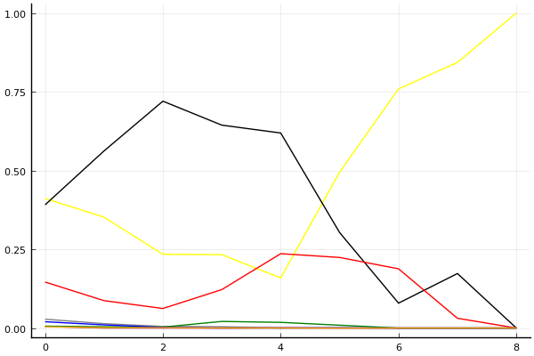

2020 시즌 2 개인전 16강 2경기

## 경기 결과

| 트랙 | 박인수 | 이재혁 | 노준현 | 배성빈 | 우성민 | 박현수 | 최영훈 | 김지민 |
|:---|---:|---:|---:|---:|---:|---:|---:|---:|
| [카멜롯 펜드래건 캐슬](../pendragon) | 7 | 10 | 4 | 0 | -1 | 1 | 3 | 5 |
| [아이스 아찔한 헬기 점프](../heli) | 4 | 10 | 5 | 3 | -1 | 7 | 0 | 1 |
| [[리버스] 해적 로비 절벽의 전투](../rlobby) | 5 | 3 | 7 | -1 | 1 | 10 | 0 | 4 |
| [황금문명 오르에트 황금 좌표](../coordinate) | 4 | 5 | 7 | 0 | 10 | 3 | -1 | 1 |
| [공동묘지 해골성 대탐험](../skullcastle) | 10 | -1 | 4 | 0 | 3 | 1 | 7 | 5 |
| [동화 이상한 나라의 문](../gate) | 10 | 4 | 7 | 5 | 3 | 0 | 1 | -1 |
| [아이스 부서진 빙산](../boobing) | 7 | 10 | 4 | 0 | -1 | 3 | 5 | 1 |
| [광산 위험한 제련소](../jeryeonso) | 3 | 7 | -1 | 4 | 0 | 10 | 1 | 5 |
| __total__ |__50__ |__48__ |__37__ |__11__ |__14__ |__35__ |__16__ |__21__ |

## 시뮬레이션

### 1st 확률

x축: 트랙, y축: 확률
1번: 옐로우, 2번: 블랙, 3번: 레드, 4번: 화이트(회색), 5번: 퍼플, 6번: 그린, 7번: 블루, 8번: 오렌지

| 트랙 | 박인수 | 이재혁 | 노준현 | 배성빈 | 우성민 | 박현수 | 최영훈 | 김지민 |
|:---|---:|---:|---:|---:|---:|---:|---:|---:|
| 초기 | 0.411 | 0.391 | 0.146 | 0.028 | 0.005 | 0.006 | 0.020 | 0.004 |
| 카멜롯 펜드래건 캐슬 | 0.352 | 0.562 | 0.087 | 0.014 | 0.000 | 0.004 | 0.010 | 0.001 |
| 아이스 아찔한 헬기 점프 | 0.234 | 0.720 | 0.062 | 0.005 | 0.000 | 0.003 | 0.002 | 0.001 |
| [리버스] 해적 로비 절벽의 전투 | 0.233 | 0.644 | 0.122 | 0.004 | 0.000 | 0.021 | 0.000 | 0.000 |
| 황금문명 오르에트 황금 좌표 | 0.159 | 0.619 | 0.236 | 0.000 | 0.001 | 0.018 | 0.000 | 0.000 |
| 공동묘지 해골성 대탐험 | 0.495 | 0.303 | 0.224 | 0.000 | 0.000 | 0.009 | 0.001 | 0.000 |
| 동화 이상한 나라의 문 | 0.759 | 0.079 | 0.188 | 0.000 | 0.000 | 0.000 | 0.000 | 0.000 |
| 아이스 부서진 빙산 | 0.843 | 0.173 | 0.031 | 0.000 | 0.000 | 0.000 | 0.000 | 0.000 |
| 광산 위험한 제련소 | 1.000 | 0.000 | 0.000 | 0.000 | 0.000 | 0.000 | 0.000 | 0.000 |

### Advance 확률

x축: 트랙, y축: 확률
1번: 옐로우, 2번: 블랙, 3번: 레드, 4번: 화이트(회색), 5번: 퍼플, 6번: 그린, 7번: 블루, 8번: 오렌지

| 트랙 | 박인수 | 이재혁 | 노준현 | 배성빈 | 우성민 | 박현수 | 최영훈 | 김지민 |
|:---|---:|---:|---:|---:|---:|---:|---:|---:|
| 초기 | 0.934 | 0.947 | 0.743 | 0.501 | 0.193 | 0.259 | 0.346 | 0.156 |
| 카멜롯 펜드래건 캐슬 | 0.962 | 0.991 | 0.784 | 0.401 | 0.085 | 0.226 | 0.387 | 0.257 |
| 아이스 아찔한 헬기 점프 | 0.963 | 0.995 | 0.866 | 0.343 | 0.031 | 0.443 | 0.245 | 0.208 |
| [리버스] 해적 로비 절벽의 전투 | 0.965 | 0.995 | 0.935 | 0.118 | 0.005 | 0.790 | 0.089 | 0.167 |
| 황금문명 오르에트 황금 좌표 | 0.979 | 1.000 | 0.984 | 0.039 | 0.064 | 0.860 | 0.026 | 0.095 |
| 공동묘지 해골성 대탐험 | 1.000 | 0.994 | 0.990 | 0.016 | 0.068 | 0.726 | 0.061 | 0.202 |
| 동화 이상한 나라의 문 | 1.000 | 0.999 | 1.000 | 0.022 | 0.095 | 0.821 | 0.030 | 0.078 |
| 아이스 부서진 빙산 | 1.000 | 1.000 | 1.000 | 0.002 | 0.013 | 0.951 | 0.031 | 0.030 |
| 광산 위험한 제련소 | 1.000 | 1.000 | 1.000 | 0.000 | 0.000 | 1.000 | 0.000 | 0.000 |

## 랭킹 변동

### [전체 랭킹](../singles-full)

| 순위 | 변동 | 이름 | 점수 | 변동 | mu | 변동 | sigma | 변동 |
|---:|---:|:---:|---:|---:|---:|---:|---:|---:|
| 2 / 93 | +0 | [박인수](../bakinsu) | 3343 | +23 | 3574 | +23 | 77 | -0 |
| 3 / 93 | +0 | [이재혁](../ijaehyeok) | 3329 | +12 | 3559 | +13 | 77 | +0 |
| 12 / 93 | -2 | [배성빈](../baeseongbin) | 3011 | -47 | 3242 | -48 | 77 | -0 |
| 14 / 93 | +16 | [노준현](../nojunhyeon) | 2999 | +183 | 3427 | +23 | 143 | -53 |
| 18 / 93 | +2 | [박현수](../bakhyeonsu) | 2969 | +42 | 3203 | +40 | 78 | -1 |
| 19 / 93 | -3 | [최영훈](../choiyeonghun) | 2968 | -20 | 3196 | -20 | 76 | -0 |
| 31 / 93 | +2 | [김지민](../gimjimin) | 2835 | +40 | 3099 | +26 | 88 | -5 |
| 33 / 93 | -1 | [우성민](../useongmin) | 2779 | -16 | 3070 | -38 | 97 | -7 |

### 시즌 랭킹

| 순위 | 변동 | 이름 | 점수 | 변동 | mu | 변동 | sigma | 변동 |
|---:|---:|:---:|---:|---:|---:|---:|---:|---:|
| 1 / 32 | +2 | [박인수](../bakinsu) | 3191 | +268 | 3646 | +80 | 152 | -62 |
| 3 / 32 | +3 | [이재혁](../ijaehyeok) | 3116 | +248 | 3573 | +71 | 152 | -59 |
| 5 / 32 | +6 | [노준현](../nojunhyeon) | 2967 | +227 | 3412 | +41 | 148 | -62 |
| 8 / 32 | +11 | [박현수](../bakhyeonsu) | 2832 | +333 | 3271 | +166 | 146 | -56 |
| 9 / 32 | -2 | [최영훈](../choiyeonghun) | 2830 | -9 | 3191 | -79 | 120 | -23 |
| 11 / 32 | +2 | [김지민](../gimjimin) | 2775 | +110 | 3144 | +29 | 123 | -27 |
| 15 / 32 | +0 | [배성빈](../baeseongbin) | 2614 | +33 | 3069 | -167 | 152 | -67 |
| 17 / 32 | +3 | [우성민](../useongmin) | 2554 | +66 | 3011 | -114 | 152 | -60 |

### 트랙 별 랭킹

#### [[리버스] 해적 로비 절벽의 전투](../rlobby)

| 순위 | 변동 | 이름 | 점수 | 변동 | mu | 변동 | sigma | 변동 |
|:---:|:---:|:---:|---:|---:|---:|---:|---:|---:|
| 1 / 32 | +6 | [노준현](../nojunhyeon) | 2758 | +597 | 4241 | -34 | 494 | -210 |
| 3 / 32 | +10 | [박현수](../bakhyeonsu) | 2704 | +1081 | 4144 | +721 | 480 | -120 |
| 6 / 32 | +2 | [김지민](../gimjimin) | 2308 | +341 | 3420 | +93 | 370 | -82 |
| 7 / 32 | +10 | [박인수](../bakinsu) | 2220 | +857 | 3532 | +396 | 437 | -154 |
| 8 / 32 | -3 | [이재혁](../ijaehyeok) | 2200 | +39 | 3614 | -660 | 471 | -233 |
| 10 / 32 | -6 | [최영훈](../choiyeonghun) | 2117 | -333 | 3292 | -584 | 392 | -84 |
| 18 / 32 | +8 | [우성민](../useongmin) | 1298 | +937 | 2654 | +417 | 452 | -173 |
| 26 / 32 | -1 | [배성빈](../baeseongbin) | 371 | +10 | 1976 | -262 | 535 | -90 |

#### [공동묘지 해골성 대탐험](../skullcastle)

| 순위 | 변동 | 이름 | 점수 | 변동 | mu | 변동 | sigma | 변동 |
|:---:|:---:|:---:|---:|---:|---:|---:|---:|---:|
| 2 / 36 | +6 | [최영훈](../choiyeonghun) | 2618 | +225 | 3581 | +63 | 321 | -54 |
| 3 / 36 | -1 | [이재혁](../ijaehyeok) | 2616 | -274 | 3453 | -364 | 279 | -30 |
| 4 / 36 | +8 | [박인수](../bakinsu) | 2542 | +345 | 3420 | +255 | 293 | -30 |
| 17 / 36 | +0 | [우성민](../useongmin) | 2118 | +48 | 3446 | -659 | 443 | -236 |
| 18 / 36 | +0 | [배성빈](../baeseongbin) | 1991 | +11 | 3044 | -231 | 351 | -81 |
| 19 / 36 | +6 | [김지민](../gimjimin) | 1817 | +681 | 2886 | +415 | 356 | -88 |
| 20 / 36 | +2 | [박현수](../bakhyeonsu) | 1758 | +385 | 2978 | -79 | 407 | -155 |
| 21 / 36 | +10 | [노준현](../nojunhyeon) | 1530 | +1187 | 2792 | +637 | 421 | -183 |

#### [광산 위험한 제련소](../jeryeonso)

| 순위 | 변동 | 이름 | 점수 | 변동 | mu | 변동 | sigma | 변동 |
|:---:|:---:|:---:|---:|---:|---:|---:|---:|---:|
| 2 / 57 | -1 | [박인수](../bakinsu) | 3113 | -52 | 3708 | -89 | 198 | -12 |
| 6 / 57 | +1 | [이재혁](../ijaehyeok) | 2792 | +97 | 3415 | +55 | 208 | -14 |
| 7 / 57 | -2 | [최영훈](../choiyeonghun) | 2693 | -139 | 3567 | -259 | 291 | -40 |
| 13 / 57 | +2 | [배성빈](../baeseongbin) | 2487 | +145 | 3422 | -31 | 312 | -59 |
| 17 / 57 | +7 | [김지민](../gimjimin) | 2284 | +375 | 3274 | +158 | 330 | -72 |
| 20 / 57 | +9 | [박현수](../bakhyeonsu) | 2152 | +403 | 2934 | +325 | 261 | -26 |
| 46 / 57 | NaN | [우성민](../useongmin) | 785 | +785 | 2562 | -438 | 592 | -408 |
| 54 / 57 | NaN | [노준현](../nojunhyeon) | -154 | -154 | 1972 | -1028 | 709 | -291 |

#### [동화 이상한 나라의 문](../gate)

| 순위 | 변동 | 이름 | 점수 | 변동 | mu | 변동 | sigma | 변동 |
|:---:|:---:|:---:|---:|---:|---:|---:|---:|---:|
| 2 / 41 | +0 | [박인수](../bakinsu) | 3436 | +147 | 4182 | +107 | 249 | -13 |
| 7 / 41 | +0 | [배성빈](../baeseongbin) | 2914 | +101 | 3733 | +10 | 273 | -30 |
| 10 / 41 | +5 | [노준현](../nojunhyeon) | 2676 | +610 | 3934 | +212 | 419 | -132 |
| 11 / 41 | +1 | [이재혁](../ijaehyeok) | 2534 | +121 | 3310 | +41 | 258 | -27 |
| 13 / 41 | -2 | [최영훈](../choiyeonghun) | 2431 | -9 | 3162 | -74 | 244 | -22 |
| 16 / 41 | +3 | [우성민](../useongmin) | 2104 | +217 | 3034 | +62 | 310 | -52 |
| 24 / 41 | -3 | [김지민](../gimjimin) | 1624 | -186 | 2683 | -334 | 353 | -50 |
| 28 / 41 | +2 | [박현수](../bakhyeonsu) | 1508 | +200 | 2611 | -43 | 368 | -81 |

#### [아이스 부서진 빙산](../boobing)

| 순위 | 변동 | 이름 | 점수 | 변동 | mu | 변동 | sigma | 변동 |
|:---:|:---:|:---:|---:|---:|---:|---:|---:|---:|
| 6 / 52 | +4 | [박인수](../bakinsu) | 2696 | +433 | 3911 | +174 | 405 | -86 |
| 8 / 52 | +4 | [최영훈](../choiyeonghun) | 2494 | +304 | 3583 | +91 | 363 | -71 |
| 10 / 52 | NaN | [이재혁](../ijaehyeok) | 2377 | +2377 | 4354 | +1354 | 659 | -341 |
| 14 / 52 | -3 | [김지민](../gimjimin) | 2151 | -91 | 3249 | -303 | 366 | -71 |
| 17 / 52 | +10 | [노준현](../nojunhyeon) | 1928 | +654 | 3202 | +230 | 425 | -141 |
| 27 / 52 | NaN | [박현수](../bakhyeonsu) | 1490 | +1490 | 3092 | +92 | 534 | -466 |
| 35 / 52 | -3 | [우성민](../useongmin) | 944 | -127 | 2185 | -286 | 414 | -53 |
| 36 / 52 | NaN | [배성빈](../baeseongbin) | 812 | +812 | 2529 | -471 | 572 | -428 |

#### [아이스 아찔한 헬기 점프](../heli)

| 순위 | 변동 | 이름 | 점수 | 변동 | mu | 변동 | sigma | 변동 |
|:---:|:---:|:---:|---:|---:|---:|---:|---:|---:|
| 1 / 39 | +0 | [이재혁](../ijaehyeok) | 2922 | +214 | 3651 | +170 | 243 | -15 |
| 3 / 39 | +2 | [박인수](../bakinsu) | 2648 | +46 | 3343 | -6 | 232 | -18 |
| 6 / 39 | +12 | [박현수](../bakhyeonsu) | 2608 | +541 | 3903 | +84 | 432 | -152 |
| 8 / 39 | +11 | [노준현](../nojunhyeon) | 2441 | +376 | 3816 | -276 | 458 | -217 |
| 19 / 39 | -3 | [최영훈](../choiyeonghun) | 2088 | -32 | 2868 | -110 | 260 | -26 |
| 22 / 39 | +1 | [김지민](../gimjimin) | 1961 | +72 | 2984 | -147 | 341 | -73 |
| 26 / 39 | -4 | [우성민](../useongmin) | 1679 | -226 | 2754 | -404 | 358 | -60 |
| 29 / 39 | +2 | [배성빈](../baeseongbin) | 1409 | +510 | 2366 | +340 | 319 | -57 |

#### [카멜롯 펜드래건 캐슬](../pendragon)

| 순위 | 변동 | 이름 | 점수 | 변동 | mu | 변동 | sigma | 변동 |
|:---:|:---:|:---:|---:|---:|---:|---:|---:|---:|
| 4 / 32 | +10 | [박인수](../bakinsu) | 2265 | +642 | 3576 | +152 | 437 | -163 |
| 6 / 32 | +6 | [최영훈](../choiyeonghun) | 1959 | +265 | 3029 | +12 | 357 | -84 |
| 7 / 32 | +12 | [노준현](../nojunhyeon) | 1924 | +561 | 3187 | +51 | 421 | -170 |
| 8 / 32 | +20 | [이재혁](../ijaehyeok) | 1912 | +1551 | 3315 | +1078 | 468 | -158 |
| 9 / 32 | +11 | [김지민](../gimjimin) | 1897 | +568 | 2952 | +336 | 352 | -78 |
| 14 / 32 | -9 | [배성빈](../baeseongbin) | 1804 | -356 | 3207 | -1067 | 468 | -237 |
| 15 / 32 | +3 | [박현수](../bakhyeonsu) | 1706 | +343 | 2979 | -158 | 424 | -167 |
| 19 / 32 | -13 | [우성민](../useongmin) | 1486 | -675 | 2980 | -1294 | 498 | -206 |

#### [황금문명 오르에트 황금 좌표](../coordinate)

| 순위 | 변동 | 이름 | 점수 | 변동 | mu | 변동 | sigma | 변동 |
|:---:|:---:|:---:|---:|---:|---:|---:|---:|---:|
| 1 / 29 | +1 | [이재혁](../ijaehyeok) | 2474 | +313 | 3889 | -385 | 472 | -233 |
| 3 / 29 | +0 | [박인수](../bakinsu) | 2327 | +166 | 3738 | -536 | 470 | -234 |
| 4 / 29 | +15 | [노준현](../nojunhyeon) | 2149 | +1059 | 3463 | +599 | 438 | -153 |
| 5 / 29 | +22 | [우성민](../useongmin) | 2023 | +1662 | 3428 | +1191 | 468 | -157 |
| 6 / 29 | -2 | [김지민](../gimjimin) | 1971 | -189 | 3385 | -843 | 471 | -218 |
| 13 / 29 | +12 | [박현수](../bakhyeonsu) | 1617 | +841 | 2930 | +354 | 438 | -163 |
| 15 / 29 | -4 | [배성빈](../baeseongbin) | 1541 | -81 | 2912 | -511 | 457 | -144 |
| 27 / 29 | -1 | [최영훈](../choiyeonghun) | 591 | -20 | 1935 | -172 | 448 | -51 |
