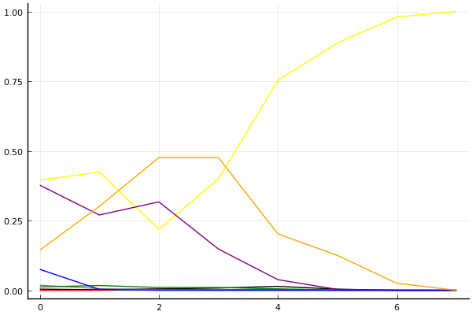
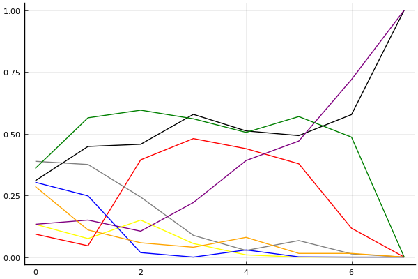

2020 시즌 2 개인전 32강 C조

## 경기 결과

| 트랙 | 유영혁 | 김지민 | 김현민 | 김주영 | 박도현 | 최민석 | 최태원 | 정승하 |
|:---|---:|---:|---:|---:|---:|---:|---:|---:|
| [카멜롯 펜드래건 캐슬](../pendragon) | 7 | 3 | -1 | 0 | 4 | 5 | 1 | 10 |
| [공동묘지 해골성 대탐험](../skullcastle) | 0 | 3 | 10 | 1 | 5 | 4 | -1 | 7 |
| [[리버스] 해적 로비 절벽의 전투](../rlobby) | 10 | 7 | 4 | 0 | 3 | 1 | -1 | 5 |
| [광산 위험한 제련소](../jeryeonso) | 10 | 4 | 3 | 1 | -1 | 5 | 7 | 0 |
| [아이스 부서진 빙산](../boobing) | 10 | 4 | 0 | 5 | 3 | 1 | -1 | 7 |
| [동화 이상한 나라의 문](../gate) | 7 | 4 | 0 | 1 | 5 | 10 | -1 | 3 |
| [어비스 숨겨진 바닷길](../hiddenoceanroad) | 10 | 3 | -1 | 1 | 5 | 7 | 0 | 4 |
| __total__ |__54__ |__28__ |__15__ |__9__ |__24__ |__33__ |__4__ |__36__ |

## 시뮬레이션

### 1st 확률

x축: 트랙, y축: 확률
1번: 옐로우, 2번: 블랙, 3번: 레드, 4번: 화이트(회색), 5번: 퍼플, 6번: 그린, 7번: 블루, 8번: 오렌지

| 트랙 | 유영혁 | 김지민 | 김현민 | 김주영 | 박도현 | 최민석 | 최태원 | 정승하 |
|:---|---:|---:|---:|---:|---:|---:|---:|---:|
| 초기 | 0.395 | 0.004 | 0.000 | 0.018 | 0.377 | 0.012 | 0.075 | 0.144 |
| 카멜롯 펜드래건 캐슬 | 0.424 | 0.002 | 0.000 | 0.006 | 0.270 | 0.017 | 0.003 | 0.301 |
| 공동묘지 해골성 대탐험 | 0.219 | 0.005 | 0.003 | 0.001 | 0.317 | 0.010 | 0.000 | 0.476 |
| [리버스] 해적 로비 절벽의 전투 | 0.399 | 0.008 | 0.002 | 0.000 | 0.148 | 0.010 | 0.000 | 0.476 |
| 광산 위험한 제련소 | 0.753 | 0.014 | 0.003 | 0.000 | 0.038 | 0.005 | 0.000 | 0.202 |
| 아이스 부서진 빙산 | 0.887 | 0.004 | 0.000 | 0.000 | 0.003 | 0.001 | 0.000 | 0.125 |
| 동화 이상한 나라의 문 | 0.980 | 0.000 | 0.000 | 0.000 | 0.000 | 0.001 | 0.000 | 0.025 |
| 어비스 숨겨진 바닷길 | 1.000 | 0.000 | 0.000 | 0.000 | 0.000 | 0.000 | 0.000 | 0.000 |

### Advance 확률

x축: 트랙, y축: 확률
1번: 옐로우, 2번: 블랙, 3번: 레드, 4번: 화이트(회색), 5번: 퍼플, 6번: 그린, 7번: 블루, 8번: 오렌지

| 트랙 | 유영혁 | 김지민 | 김현민 | 김주영 | 박도현 | 최민석 | 최태원 | 정승하 |
|:---|---:|---:|---:|---:|---:|---:|---:|---:|
| 초기 | 0.849 | 0.074 | 0.021 | 0.195 | 0.849 | 0.158 | 0.297 | 0.638 |
| 카멜롯 펜드래건 캐슬 | 0.918 | 0.094 | 0.002 | 0.067 | 0.837 | 0.215 | 0.040 | 0.883 |
| 공동묘지 해골성 대탐험 | 0.836 | 0.088 | 0.049 | 0.033 | 0.882 | 0.235 | 0.000 | 0.937 |
| [리버스] 해적 로비 절벽의 전투 | 0.942 | 0.166 | 0.084 | 0.004 | 0.757 | 0.138 | 0.000 | 0.958 |
| 광산 위험한 제련소 | 0.991 | 0.287 | 0.121 | 0.006 | 0.506 | 0.256 | 0.005 | 0.915 |
| 아이스 부서진 빙산 | 1.000 | 0.443 | 0.078 | 0.004 | 0.408 | 0.167 | 0.000 | 0.985 |
| 동화 이상한 나라의 문 | 1.000 | 0.404 | 0.005 | 0.000 | 0.210 | 0.510 | 0.000 | 0.985 |
| 어비스 숨겨진 바닷길 | 1.000 | 0.000 | 0.000 | 0.000 | 0.000 | 1.000 | 0.000 | 1.000 |

### Repechage 확률

x축: 트랙, y축: 확률
1번: 옐로우, 2번: 블랙, 3번: 레드, 4번: 화이트(회색), 5번: 퍼플, 6번: 그린, 7번: 블루, 8번: 오렌지

| 트랙 | 유영혁 | 김지민 | 김현민 | 김주영 | 박도현 | 최민석 | 최태원 | 정승하 |
|:---|---:|---:|---:|---:|---:|---:|---:|---:|
| 초기 | 0.133 | 0.309 | 0.093 | 0.388 | 0.133 | 0.359 | 0.303 | 0.286 |
| 카멜롯 펜드래건 캐슬 | 0.075 | 0.448 | 0.046 | 0.375 | 0.150 | 0.564 | 0.248 | 0.110 |
| 공동묘지 해골성 대탐험 | 0.150 | 0.457 | 0.394 | 0.243 | 0.105 | 0.595 | 0.018 | 0.058 |
| [리버스] 해적 로비 절벽의 전투 | 0.055 | 0.578 | 0.480 | 0.088 | 0.221 | 0.560 | 0.000 | 0.040 |
| 광산 위험한 제련소 | 0.009 | 0.511 | 0.439 | 0.027 | 0.391 | 0.505 | 0.029 | 0.080 |
| 아이스 부서진 빙산 | 0.000 | 0.492 | 0.378 | 0.067 | 0.470 | 0.569 | 0.001 | 0.015 |
| 동화 이상한 나라의 문 | 0.000 | 0.577 | 0.117 | 0.013 | 0.719 | 0.486 | 0.000 | 0.015 |
| 어비스 숨겨진 바닷길 | 0.000 | 1.000 | 0.000 | 0.000 | 1.000 | 0.000 | 0.000 | 0.000 |

## 랭킹 변동

### [전체 랭킹](../singles-full)

| 순위 | 변동 | 이름 | 점수 | 변동 | mu | 변동 | sigma | 변동 |
|---:|---:|:---:|---:|---:|---:|---:|---:|---:|
| 5 / 90 | +1 | [유영혁](../yuyeonghyeok) | 3232 | +35 | 3462 | +37 | 76 | +1 |
| 7 / 90 | +0 | [박도현](../bakdohyeon) | 3136 | -45 | 3371 | -47 | 78 | -1 |
| 10 / 90 | +0 | [정승하](../jeongseungha) | 3072 | +5 | 3303 | +4 | 77 | -0 |
| 29 / 90 | +5 | [최민석](../choiminseok) | 2821 | +67 | 3098 | +52 | 92 | -5 |
| 36 / 90 | +1 | [김지민](../gimjimin) | 2719 | +71 | 3019 | +44 | 100 | -9 |
| 49 / 90 | +3 | [김주영](../gimjuyeong) | 2452 | +14 | 2912 | -156 | 153 | -57 |
| 63 / 90 | +8 | [김현민](../gimhyunmin) | 2269 | +147 | 2749 | -29 | 160 | -59 |
| 88 / 90 | NaN | [최태원](../choitaiwon) | 1672 | +1672 | 2403 | -597 | 243 | -757 |

### 시즌 랭킹

| 순위 | 변동 | 이름 | 점수 | 변동 | mu | 변동 | sigma | 변동 |
|---:|---:|:---:|---:|---:|---:|---:|---:|---:|
| 1 / 24 | NaN | [유영혁](../yuyeonghyeok) | 3083 | +3083 | 3870 | +870 | 262 | -738 |
| 6 / 24 | NaN | [최민석](../choiminseok) | 2632 | +2632 | 3334 | +334 | 234 | -766 |
| 9 / 24 | NaN | [정승하](../jeongseungha) | 2577 | +2577 | 3284 | +284 | 236 | -764 |
| 13 / 24 | NaN | [김지민](../gimjimin) | 2462 | +2462 | 3140 | +140 | 226 | -774 |
| 14 / 24 | NaN | [박도현](../bakdohyeon) | 2400 | +2400 | 3093 | +93 | 231 | -769 |
| 19 / 24 | NaN | [김주영](../gimjuyeong) | 2020 | +2020 | 2722 | -278 | 234 | -766 |
| 22 / 24 | NaN | [김현민](../gimhyunmin) | 1928 | +1928 | 2658 | -342 | 243 | -757 |
| 24 / 24 | NaN | [최태원](../choitaiwon) | 1465 | +1465 | 2264 | -736 | 266 | -734 |

### 트랙 별 랭킹

#### [[리버스] 해적 로비 절벽의 전투](../rlobby)

| 순위 | 변동 | 이름 | 점수 | 변동 | mu | 변동 | sigma | 변동 |
|:---:|:---:|:---:|---:|---:|---:|---:|---:|---:|
| 1 / 24 | NaN | [유영혁](../yuyeonghyeok) | 2161 | +2161 | 4274 | +1274 | 704 | -296 |
| 6 / 24 | NaN | [김지민](../gimjimin) | 1887 | +1887 | 3763 | +763 | 625 | -375 |
| 9 / 24 | NaN | [정승하](../jeongseungha) | 1622 | +1622 | 3423 | +423 | 600 | -400 |
| 11 / 24 | NaN | [김현민](../gimhyunmin) | 1363 | +1363 | 3137 | +137 | 591 | -409 |
| 14 / 24 | NaN | [박도현](../bakdohyeon) | 1090 | +1090 | 2863 | -137 | 591 | -409 |
| 18 / 24 | NaN | [최민석](../choiminseok) | 776 | +776 | 2577 | -423 | 600 | -400 |
| 20 / 24 | NaN | [김주영](../gimjuyeong) | 361 | +361 | 2237 | -763 | 625 | -375 |
| 24 / 24 | NaN | [최태원](../choitaiwon) | -388 | -388 | 1726 | -1274 | 704 | -296 |

#### [공동묘지 해골성 대탐험](../skullcastle)

| 순위 | 변동 | 이름 | 점수 | 변동 | mu | 변동 | sigma | 변동 |
|:---:|:---:|:---:|---:|---:|---:|---:|---:|---:|
| 7 / 30 | NaN | [김현민](../gimhyunmin) | 2177 | +2177 | 4242 | +1242 | 688 | -312 |
| 12 / 30 | NaN | [정승하](../jeongseungha) | 1950 | +1950 | 3725 | +725 | 592 | -408 |
| 13 / 30 | +5 | [박도현](../bakdohyeon) | 1945 | +674 | 3227 | +304 | 428 | -123 |
| 14 / 30 | -1 | [최민석](../choiminseok) | 1899 | +375 | 3033 | +128 | 378 | -82 |
| 15 / 30 | -7 | [유영혁](../yuyeonghyeok) | 1884 | -212 | 2959 | -381 | 358 | -56 |
| 20 / 30 | NaN | [김지민](../gimjimin) | 1332 | +1332 | 2947 | -53 | 538 | -462 |
| 23 / 30 | NaN | [김주영](../gimjuyeong) | 1113 | +1113 | 2743 | -257 | 543 | -457 |
| 28 / 30 | NaN | [최태원](../choitaiwon) | -109 | -109 | 1949 | -1051 | 686 | -314 |

#### [광산 위험한 제련소](../jeryeonso)

| 순위 | 변동 | 이름 | 점수 | 변동 | mu | 변동 | sigma | 변동 |
|:---:|:---:|:---:|---:|---:|---:|---:|---:|---:|
| 2 / 50 | +1 | [유영혁](../yuyeonghyeok) | 3140 | +130 | 3808 | +105 | 223 | -8 |
| 14 / 50 | -1 | [정승하](../jeongseungha) | 2242 | -113 | 3019 | -167 | 259 | -18 |
| 19 / 50 | NaN | [최태원](../choitaiwon) | 2042 | +2042 | 3714 | +714 | 557 | -443 |
| 23 / 50 | NaN | [최민석](../choiminseok) | 1800 | +1800 | 3456 | +456 | 552 | -448 |
| 29 / 50 | NaN | [김지민](../gimjimin) | 1584 | +1584 | 3229 | +229 | 548 | -452 |
| 33 / 50 | NaN | [김현민](../gimhyunmin) | 1377 | +1377 | 3016 | +16 | 546 | -454 |
| 36 / 50 | NaN | [김주영](../gimjuyeong) | 1167 | +1167 | 2804 | -196 | 545 | -455 |
| 48 / 50 | NaN | [박도현](../bakdohyeon) | -76 | -76 | 1991 | -1009 | 689 | -311 |

#### [동화 이상한 나라의 문](../gate)

| 순위 | 변동 | 이름 | 점수 | 변동 | mu | 변동 | sigma | 변동 |
|:---:|:---:|:---:|---:|---:|---:|---:|---:|---:|
| 2 / 38 | +0 | [박도현](../bakdohyeon) | 3319 | -37 | 4129 | -118 | 270 | -27 |
| 4 / 38 | +2 | [유영혁](../yuyeonghyeok) | 3078 | +153 | 3927 | +57 | 283 | -32 |
| 7 / 38 | +2 | [최민석](../choiminseok) | 2889 | +352 | 3772 | +264 | 294 | -29 |
| 18 / 38 | -5 | [김주영](../gimjuyeong) | 1796 | -365 | 3261 | -1013 | 488 | -216 |
| 20 / 38 | NaN | [김지민](../gimjimin) | 1674 | +1674 | 3302 | +302 | 543 | -457 |
| 27 / 38 | +5 | [정승하](../jeongseungha) | 1368 | +711 | 2573 | +420 | 402 | -97 |
| 34 / 38 | NaN | [김현민](../gimhyunmin) | 606 | +606 | 2420 | -580 | 604 | -396 |
| 37 / 38 | NaN | [최태원](../choitaiwon) | -247 | -247 | 1866 | -1134 | 704 | -296 |

#### [아이스 부서진 빙산](../boobing)

| 순위 | 변동 | 이름 | 점수 | 변동 | mu | 변동 | sigma | 변동 |
|:---:|:---:|:---:|---:|---:|---:|---:|---:|---:|
| 1 / 44 | +0 | [유영혁](../yuyeonghyeok) | 3711 | +241 | 5133 | +130 | 474 | -37 |
| 9 / 44 | NaN | [정승하](../jeongseungha) | 2089 | +2089 | 4007 | +1007 | 639 | -361 |
| 13 / 44 | NaN | [김주영](../gimjuyeong) | 1751 | +1751 | 3580 | +580 | 610 | -390 |
| 19 / 44 | NaN | [김지민](../gimjimin) | 1456 | +1456 | 3251 | +251 | 598 | -402 |
| 23 / 44 | NaN | [박도현](../bakdohyeon) | 1161 | +1161 | 2953 | -47 | 597 | -403 |
| 29 / 44 | NaN | [최민석](../choiminseok) | 830 | +830 | 2648 | -352 | 606 | -394 |
| 36 / 44 | NaN | [김현민](../gimhyunmin) | 401 | +401 | 2294 | -706 | 631 | -369 |
| 40 / 44 | NaN | [최태원](../choitaiwon) | -363 | -363 | 1769 | -1231 | 711 | -289 |

#### [어비스 숨겨진 바닷길](../hiddenoceanroad)

| 순위 | 변동 | 이름 | 점수 | 변동 | mu | 변동 | sigma | 변동 |
|:---:|:---:|:---:|---:|---:|---:|---:|---:|---:|
| 3 / 39 | +0 | [박도현](../bakdohyeon) | 2727 | +16 | 3503 | -65 | 259 | -27 |
| 5 / 39 | +4 | [유영혁](../yuyeonghyeok) | 2452 | +215 | 3159 | +168 | 236 | -16 |
| 10 / 39 | +3 | [최민석](../choiminseok) | 2272 | +270 | 3124 | +160 | 284 | -37 |
| 11 / 39 | +0 | [정승하](../jeongseungha) | 2180 | +104 | 3241 | -141 | 354 | -82 |
| 28 / 39 | +9 | [김지민](../gimjimin) | 1388 | +613 | 2681 | +104 | 431 | -170 |
| 31 / 39 | +4 | [김주영](../gimjuyeong) | 1256 | +343 | 2478 | -13 | 407 | -119 |
| 36 / 39 | -8 | [김현민](../gimhyunmin) | 943 | -420 | 2348 | -789 | 468 | -123 |
| 38 / 39 | NaN | [최태원](../choitaiwon) | 681 | +681 | 2332 | -668 | 550 | -450 |

#### [카멜롯 펜드래건 캐슬](../pendragon)

| 순위 | 변동 | 이름 | 점수 | 변동 | mu | 변동 | sigma | 변동 |
|:---:|:---:|:---:|---:|---:|---:|---:|---:|---:|
| 1 / 24 | NaN | [정승하](../jeongseungha) | 2161 | +2161 | 4274 | +1274 | 704 | -296 |
| 6 / 24 | NaN | [유영혁](../yuyeonghyeok) | 1887 | +1887 | 3763 | +763 | 625 | -375 |
| 8 / 24 | NaN | [최민석](../choiminseok) | 1622 | +1622 | 3423 | +423 | 600 | -400 |
| 11 / 24 | NaN | [박도현](../bakdohyeon) | 1363 | +1363 | 3137 | +137 | 591 | -409 |
| 15 / 24 | NaN | [김지민](../gimjimin) | 1090 | +1090 | 2863 | -137 | 591 | -409 |
| 17 / 24 | NaN | [최태원](../choitaiwon) | 776 | +776 | 2577 | -423 | 600 | -400 |
| 21 / 24 | NaN | [김주영](../gimjuyeong) | 361 | +361 | 2237 | -763 | 625 | -375 |
| 24 / 24 | NaN | [김현민](../gimhyunmin) | -388 | -388 | 1726 | -1274 | 704 | -296 |
