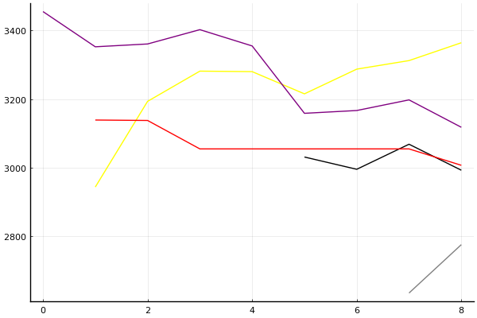

2021 시즌 1 개인전 32강 A조

### 선수

이재혁
신종민
김정제
정유민
유영혁
홍승민
유민선
이명재

### 경기 시뮬레이션

| 순위 | 이재혁 | 신종민 | 김정제 | 정유민 | 유영혁 | 홍승민 | 유민선 | 이명재 |
|:---:|---:|---:|---:|---:|---:|---:|---:|---:|
| 1위 | 0.665 | 0.030 | 0.038 | 0.009 | 0.110 | 0.058 | 0.055 | 0.056 |
| 2위 | 0.200 | 0.119 | 0.140 | 0.050 | 0.243 | 0.102 | 0.097 | 0.101 |
| 3위 | 0.074 | 0.162 | 0.167 | 0.085 | 0.213 | 0.112 | 0.110 | 0.107 |
| 4위 | 0.035 | 0.183 | 0.176 | 0.124 | 0.163 | 0.108 | 0.112 | 0.114 |
| 5위 | 0.016 | 0.167 | 0.174 | 0.157 | 0.121 | 0.119 | 0.120 | 0.120 |
| 6위 | 0.006 | 0.153 | 0.147 | 0.194 | 0.084 | 0.133 | 0.128 | 0.135 |
| 7위 | 0.002 | 0.119 | 0.102 | 0.213 | 0.048 | 0.162 | 0.163 | 0.159 |
| 8위 | 0.001 | 0.068 | 0.057 | 0.168 | 0.019 | 0.206 | 0.215 | 0.208 |
| 1위 | 0.665 | 0.030 | 0.038 | 0.009 | 0.110 | 0.058 | 0.055 | 0.056 |
| 진출 | 0.940 | 0.310 | 0.345 | 0.143 | 0.565 | 0.271 | 0.263 | 0.264 |
| 패부 | 0.052 | 0.351 | 0.349 | 0.281 | 0.284 | 0.227 | 0.232 | 0.234 |

### 전체 랭킹

x축: 시즌, y축: 점수
1번: 옐로우, 2번: 블랙, 3번: 레드, 4번: 화이트(회색), 5번: 퍼플, 6번: 그린, 7번: 블루, 8번: 오렌지

| 순위 | 이름 | 점수 | mu | sigma | 주행 | 8인전 1-2-Mid-Lo | 8인전 평균득점 | 8인전 표준편차 | 2인전 전적 |
|---:|:---:|---:|---:|---:|---:|:---:|---:|---:|:---:|
| 2 / 93 | [이재혁](../ijaehyeok) | 3364 | 3600 | 78 | 283 | 28-11-37-25 | 4.99 | 3.77 | 0-0 |
| 6 / 93 | [유영혁](../yuyeonghyeok) | 3118 | 3346 | 76 | 347 | 17-15-39-29 | 4.40 | 3.45 | 0-0 |
| 14 / 93 | [김정제](../gimjeongje) | 3007 | 3238 | 77 | 130 | 15-11-40-35 | 3.82 | 3.49 | 0-0 |
| 17 / 93 | [신종민](../shinjongmin) | 2992 | 3222 | 77 | 152 | 12-15-30-42 | 3.52 | 3.58 | 0-0 |
| 33 / 93 | [정유민](../jeongyumin) | 2775 | 3111 | 112 | 28 | 4-11-50-36 | 3.18 | 2.70 | 0-0 |
| NaN / 93 | [홍승민](../hongseungmin) | 0 | 3000 | 1000 | 0 | 0-0-0-0 | 0.00 | 0.00 | 0-0 |
| NaN / 93 | [유민선](../yuminseon) | 0 | 3000 | 1000 | 0 | 0-0-0-0 | 0.00 | 0.00 | 0-0 |
| NaN / 93 | [이명재](../imyeongjae) | 0 | 3000 | 1000 | 0 | 0-0-0-0 | 0.00 | 0.00 | 0-0 |

### 시즌 랭킹

#### [2020 시즌 2](../singles-s2020_2)

| 순위 | 이름 | 점수 | mu | sigma | 주행 | 8인전 1-2-Mid-Lo | 8인전 평균득점 | 8인전 표준편차 | 2인전 전적 |
|---:|:---:|---:|---:|---:|---:|:---:|---:|---:|:---:|
| 1 / 32 | [이재혁](../ijaehyeok) | 3395 | 3703 | 103 | 43 | 36-13-33-18 | 5.85 | 3.80 | 0-0 |
| 6 / 32 | [유영혁](../yuyeonghyeok) | 3092 | 3378 | 95 | 47 | 21-13-30-36 | 4.13 | 3.90 | 0-0 |
| 18 / 32 | [정유민](../jeongyumin) | 2533 | 2955 | 141 | 18 | 0-17-50-33 | 3.00 | 2.50 | 0-0 |
| 20 / 32 | [신종민](../shinjongmin) | 2503 | 2940 | 146 | 18 | 6-28-22-44 | 3.11 | 3.60 | 0-0 |
| 21 / 32 | [김정제](../gimjeongje) | 2245 | 2873 | 209 | 9 | 11-11-33-44 | 3.22 | 3.80 | 0-0 |
| NaN / 32 | [홍승민](../hongseungmin) | 0 | 3000 | 1000 | 0 | 0-0-0-0 | 0.00 | 0.00 | 0-0 |
| NaN / 32 | [유민선](../yuminseon) | 0 | 3000 | 1000 | 0 | 0-0-0-0 | 0.00 | 0.00 | 0-0 |
| NaN / 32 | [이명재](../imyeongjae) | 0 | 3000 | 1000 | 0 | 0-0-0-0 | 0.00 | 0.00 | 0-0 |

#### [2020 시즌 1](../singles-s2020_1)

| 순위 | 이름 | 점수 | mu | sigma | 주행 | 8인전 1-2-Mid-Lo | 8인전 평균득점 | 8인전 표준편차 | 2인전 전적 |
|---:|:---:|---:|---:|---:|---:|:---:|---:|---:|:---:|
| 4 / 32 | [이재혁](../ijaehyeok) | 3169 | 3448 | 93 | 50 | 21-12-42-26 | 4.65 | 3.50 | 0-0 |
| 5 / 32 | [유영혁](../yuyeonghyeok) | 3066 | 3337 | 91 | 52 | 15-13-38-33 | 4.15 | 3.46 | 0-0 |
| 8 / 32 | [신종민](../shinjongmin) | 2959 | 3235 | 92 | 50 | 9-19-23-49 | 3.33 | 3.46 | 0-0 |
| 20 / 32 | [정유민](../jeongyumin) | 2413 | 2986 | 191 | 10 | 10-0-50-40 | 3.50 | 3.14 | 0-0 |
| NaN / 32 | [김정제](../gimjeongje) | 0 | 3000 | 1000 | 0 | 0-0-0-0 | 0.00 | 0.00 | 0-0 |
| NaN / 32 | [홍승민](../hongseungmin) | 0 | 3000 | 1000 | 0 | 0-0-0-0 | 0.00 | 0.00 | 0-0 |
| NaN / 32 | [유민선](../yuminseon) | 0 | 3000 | 1000 | 0 | 0-0-0-0 | 0.00 | 0.00 | 0-0 |
| NaN / 32 | [이명재](../imyeongjae) | 0 | 3000 | 1000 | 0 | 0-0-0-0 | 0.00 | 0.00 | 0-0 |

#### [2019 시즌 2](../singles-s2019_2)

| 순위 | 이름 | 점수 | mu | sigma | 주행 | 8인전 1-2-Mid-Lo | 8인전 평균득점 | 8인전 표준편차 | 2인전 전적 |
|---:|:---:|---:|---:|---:|---:|:---:|---:|---:|:---:|
| 1 / 32 | [이재혁](../ijaehyeok) | 3288 | 3573 | 95 | 53 | 33-8-35-24 | 5.20 | 4.05 | 0-0 |
| 6 / 32 | [유영혁](../yuyeonghyeok) | 3041 | 3330 | 96 | 42 | 12-10-45-33 | 3.76 | 3.11 | 0-0 |
| 12 / 32 | [신종민](../shinjongmin) | 2859 | 3151 | 97 | 42 | 12-7-50-31 | 3.67 | 3.26 | 0-0 |
| NaN / 32 | [김정제](../gimjeongje) | 0 | 3000 | 1000 | 0 | 0-0-0-0 | 0.00 | 0.00 | 0-0 |
| NaN / 32 | [정유민](../jeongyumin) | 0 | 3000 | 1000 | 0 | 0-0-0-0 | 0.00 | 0.00 | 0-0 |
| NaN / 32 | [홍승민](../hongseungmin) | 0 | 3000 | 1000 | 0 | 0-0-0-0 | 0.00 | 0.00 | 0-0 |
| NaN / 32 | [유민선](../yuminseon) | 0 | 3000 | 1000 | 0 | 0-0-0-0 | 0.00 | 0.00 | 0-0 |
| NaN / 32 | [이명재](../imyeongjae) | 0 | 3000 | 1000 | 0 | 0-0-0-0 | 0.00 | 0.00 | 0-0 |

#### [2019 시즌 1](../singles-s2019_1)

| 순위 | 이름 | 점수 | mu | sigma | 주행 | 8인전 1-2-Mid-Lo | 8인전 평균득점 | 8인전 표준편차 | 2인전 전적 |
|---:|:---:|---:|---:|---:|---:|:---:|---:|---:|:---:|
| 6 / 32 | [신종민](../shinjongmin) | 2964 | 3261 | 99 | 42 | 19-14-21-45 | 3.76 | 4.07 | 0-0 |
| 19 / 32 | [유영혁](../yuyeonghyeok) | 2401 | 2802 | 134 | 21 | 5-14-29-52 | 2.52 | 3.33 | 0-0 |
| 26 / 32 | [이재혁](../ijaehyeok) | 2139 | 2772 | 211 | 11 | 22-11-22-44 | 3.44 | 4.61 | 0-0 |
| NaN / 32 | [김정제](../gimjeongje) | 0 | 3000 | 1000 | 0 | 0-0-0-0 | 0.00 | 0.00 | 0-0 |
| NaN / 32 | [정유민](../jeongyumin) | 0 | 3000 | 1000 | 0 | 0-0-0-0 | 0.00 | 0.00 | 0-0 |
| NaN / 32 | [홍승민](../hongseungmin) | 0 | 3000 | 1000 | 0 | 0-0-0-0 | 0.00 | 0.00 | 0-0 |
| NaN / 32 | [유민선](../yuminseon) | 0 | 3000 | 1000 | 0 | 0-0-0-0 | 0.00 | 0.00 | 0-0 |
| NaN / 32 | [이명재](../imyeongjae) | 0 | 3000 | 1000 | 0 | 0-0-0-0 | 0.00 | 0.00 | 0-0 |

#### [2018 듀얼 레이스 X](../singles-s2018_2)

| 순위 | 이름 | 점수 | mu | sigma | 주행 | 8인전 1-2-Mid-Lo | 8인전 평균득점 | 8인전 표준편차 | 2인전 전적 |
|---:|:---:|---:|---:|---:|---:|:---:|---:|---:|:---:|
| 2 / 8 | [이재혁](../ijaehyeok) | 2733 | 3241 | 170 | 16 | 12-25-38-25 | 4.50 | 3.38 | 0-0 |
| 4 / 8 | [유영혁](../yuyeonghyeok) | 2583 | 3102 | 173 | 14 | 12-12-50-25 | 4.00 | 3.21 | 0-0 |
| NaN / 8 | [신종민](../shinjongmin) | 0 | 3000 | 1000 | 0 | 0-0-0-0 | 0.00 | 0.00 | 0-0 |
| NaN / 8 | [김정제](../gimjeongje) | 0 | 3000 | 1000 | 0 | 0-0-0-0 | 0.00 | 0.00 | 0-0 |
| NaN / 8 | [정유민](../jeongyumin) | 0 | 3000 | 1000 | 0 | 0-0-0-0 | 0.00 | 0.00 | 0-0 |
| NaN / 8 | [홍승민](../hongseungmin) | 0 | 3000 | 1000 | 0 | 0-0-0-0 | 0.00 | 0.00 | 0-0 |
| NaN / 8 | [유민선](../yuminseon) | 0 | 3000 | 1000 | 0 | 0-0-0-0 | 0.00 | 0.00 | 0-0 |
| NaN / 8 | [이명재](../imyeongjae) | 0 | 3000 | 1000 | 0 | 0-0-0-0 | 0.00 | 0.00 | 0-0 |

#### [2018 듀얼 레이스 3](../singles-s2018_1)

| 순위 | 이름 | 점수 | mu | sigma | 주행 | 8인전 1-2-Mid-Lo | 8인전 평균득점 | 8인전 표준편차 | 2인전 전적 |
|---:|:---:|---:|---:|---:|---:|:---:|---:|---:|:---:|
| 2 / 32 | [유영혁](../yuyeonghyeok) | 3338 | 3643 | 101 | 44 | 24-24-29-24 | 5.41 | 3.45 | 0-0 |
| 3 / 32 | [이재혁](../ijaehyeok) | 3218 | 3505 | 96 | 49 | 24-14-38-24 | 4.90 | 3.63 | 0-0 |
| 12 / 32 | [김정제](../gimjeongje) | 2825 | 3116 | 97 | 43 | 12-9-42-37 | 3.40 | 3.32 | 0-0 |
| NaN / 32 | [신종민](../shinjongmin) | 0 | 3000 | 1000 | 0 | 0-0-0-0 | 0.00 | 0.00 | 0-0 |
| NaN / 32 | [정유민](../jeongyumin) | 0 | 3000 | 1000 | 0 | 0-0-0-0 | 0.00 | 0.00 | 0-0 |
| NaN / 32 | [홍승민](../hongseungmin) | 0 | 3000 | 1000 | 0 | 0-0-0-0 | 0.00 | 0.00 | 0-0 |
| NaN / 32 | [유민선](../yuminseon) | 0 | 3000 | 1000 | 0 | 0-0-0-0 | 0.00 | 0.00 | 0-0 |
| NaN / 32 | [이명재](../imyeongjae) | 0 | 3000 | 1000 | 0 | 0-0-0-0 | 0.00 | 0.00 | 0-0 |

#### [2017 Kespa Cup](../singles-s2017_2)

| 순위 | 이름 | 점수 | mu | sigma | 주행 | 8인전 1-2-Mid-Lo | 8인전 평균득점 | 8인전 표준편차 | 2인전 전적 |
|---:|:---:|---:|---:|---:|---:|:---:|---:|---:|:---:|
| 2 / 32 | [유영혁](../yuyeonghyeok) | 3387 | 3706 | 106 | 40 | 21-32-32-14 | 5.71 | 3.25 | 0-0 |
| 3 / 32 | [이재혁](../ijaehyeok) | 3317 | 3655 | 113 | 36 | 41-4-33-22 | 5.67 | 3.98 | 0-0 |
| 5 / 32 | [김정제](../gimjeongje) | 3132 | 3481 | 117 | 29 | 21-14-38-28 | 4.41 | 3.77 | 0-0 |
| NaN / 32 | [신종민](../shinjongmin) | 0 | 3000 | 1000 | 0 | 0-0-0-0 | 0.00 | 0.00 | 0-0 |
| NaN / 32 | [정유민](../jeongyumin) | 0 | 3000 | 1000 | 0 | 0-0-0-0 | 0.00 | 0.00 | 0-0 |
| NaN / 32 | [홍승민](../hongseungmin) | 0 | 3000 | 1000 | 0 | 0-0-0-0 | 0.00 | 0.00 | 0-0 |
| NaN / 32 | [유민선](../yuminseon) | 0 | 3000 | 1000 | 0 | 0-0-0-0 | 0.00 | 0.00 | 0-0 |
| NaN / 32 | [이명재](../imyeongjae) | 0 | 3000 | 1000 | 0 | 0-0-0-0 | 0.00 | 0.00 | 0-0 |

#### [2017 듀얼 레이스 2](../singles-s2017_1)

| 순위 | 이름 | 점수 | mu | sigma | 주행 | 8인전 1-2-Mid-Lo | 8인전 평균득점 | 8인전 표준편차 | 2인전 전적 |
|---:|:---:|---:|---:|---:|---:|:---:|---:|---:|:---:|
| 2 / 16 | [유영혁](../yuyeonghyeok) | 2935 | 3217 | 94 | 55 | 9-12-59-19 | 4.28 | 2.99 | 0-0 |
| 6 / 16 | [김정제](../gimjeongje) | 2786 | 3072 | 95 | 49 | 16-9-41-34 | 4.03 | 3.43 | 0-0 |
| 9 / 16 | [이재혁](../ijaehyeok) | 2686 | 3035 | 117 | 27 | 11-6-44-39 | 3.50 | 3.13 | 0-0 |
| NaN / 16 | [신종민](../shinjongmin) | 0 | 3000 | 1000 | 0 | 0-0-0-0 | 0.00 | 0.00 | 0-0 |
| NaN / 16 | [정유민](../jeongyumin) | 0 | 3000 | 1000 | 0 | 0-0-0-0 | 0.00 | 0.00 | 0-0 |
| NaN / 16 | [홍승민](../hongseungmin) | 0 | 3000 | 1000 | 0 | 0-0-0-0 | 0.00 | 0.00 | 0-0 |
| NaN / 16 | [유민선](../yuminseon) | 0 | 3000 | 1000 | 0 | 0-0-0-0 | 0.00 | 0.00 | 0-0 |
| NaN / 16 | [이명재](../imyeongjae) | 0 | 3000 | 1000 | 0 | 0-0-0-0 | 0.00 | 0.00 | 0-0 |

#### [2016 듀얼 레이스](../singles-s2016_1)

| 순위 | 이름 | 점수 | mu | sigma | 주행 | 8인전 1-2-Mid-Lo | 8인전 평균득점 | 8인전 표준편차 | 2인전 전적 |
|---:|:---:|---:|---:|---:|---:|:---:|---:|---:|:---:|
| 1 / 32 | [유영혁](../yuyeonghyeok) | 3455 | 3814 | 120 | 32 | 29-10-48-14 | 5.76 | 3.24 | 0-0 |
| NaN / 32 | [이재혁](../ijaehyeok) | 0 | 3000 | 1000 | 0 | 0-0-0-0 | 0.00 | 0.00 | 0-0 |
| NaN / 32 | [신종민](../shinjongmin) | 0 | 3000 | 1000 | 0 | 0-0-0-0 | 0.00 | 0.00 | 0-0 |
| NaN / 32 | [김정제](../gimjeongje) | 0 | 3000 | 1000 | 0 | 0-0-0-0 | 0.00 | 0.00 | 0-0 |
| NaN / 32 | [정유민](../jeongyumin) | 0 | 3000 | 1000 | 0 | 0-0-0-0 | 0.00 | 0.00 | 0-0 |
| NaN / 32 | [홍승민](../hongseungmin) | 0 | 3000 | 1000 | 0 | 0-0-0-0 | 0.00 | 0.00 | 0-0 |
| NaN / 32 | [유민선](../yuminseon) | 0 | 3000 | 1000 | 0 | 0-0-0-0 | 0.00 | 0.00 | 0-0 |
| NaN / 32 | [이명재](../imyeongjae) | 0 | 3000 | 1000 | 0 | 0-0-0-0 | 0.00 | 0.00 | 0-0 |

### 트랙 랭킹

#### [월드 이탈리아 피사의 사탑](../pizza)

| 순위 | 이름 | 점수 | mu | sigma | 주행 | 8인전 1-2-Mid-Lo | 8인전 평균득점 | 8인전 표준편차 | 2인전 전적 |
|---:|:---:|---:|---:|---:|---:|:---:|---:|---:|:---:|
| 1 / 32 | [이재혁](../ijaehyeok) | 3137 | 3968 | 277 | 6 | 67-0-17-17 | 7.17 | 4.67 | 0-0 |
| 10 / 32 | [유영혁](../yuyeonghyeok) | 2430 | 3242 | 271 | 5 | 0-0-60-40 | 2.80 | 2.17 | 0-0 |
| 13 / 32 | [신종민](../shinjongmin) | 2192 | 3056 | 288 | 5 | 0-20-40-40 | 3.00 | 3.39 | 0-0 |
| NaN / 32 | [김정제](../gimjeongje) | 0 | 3000 | 1000 | 0 | 0-0-0-0 | 0.00 | 0.00 | 0-0 |
| NaN / 32 | [정유민](../jeongyumin) | 0 | 3000 | 1000 | 0 | 0-0-0-0 | 0.00 | 0.00 | 0-0 |
| NaN / 32 | [홍승민](../hongseungmin) | 0 | 3000 | 1000 | 0 | 0-0-0-0 | 0.00 | 0.00 | 0-0 |
| NaN / 32 | [유민선](../yuminseon) | 0 | 3000 | 1000 | 0 | 0-0-0-0 | 0.00 | 0.00 | 0-0 |
| NaN / 32 | [이명재](../imyeongjae) | 0 | 3000 | 1000 | 0 | 0-0-0-0 | 0.00 | 0.00 | 0-0 |

#### [노르테유 익스프레스](../noex)

| 순위 | 이름 | 점수 | mu | sigma | 주행 | 8인전 1-2-Mid-Lo | 8인전 평균득점 | 8인전 표준편차 | 2인전 전적 |
|---:|:---:|---:|---:|---:|---:|:---:|---:|---:|:---:|
| 3 / 68 | [이재혁](../ijaehyeok) | 3576 | 4187 | 204 | 11 | 44-22-33-0 | 7.44 | 2.70 | 0-0 |
| 4 / 68 | [유영혁](../yuyeonghyeok) | 3262 | 3807 | 182 | 13 | 20-10-50-20 | 4.60 | 3.53 | 0-0 |
| 7 / 68 | [김정제](../gimjeongje) | 3081 | 3760 | 226 | 8 | 25-25-38-12 | 5.38 | 3.81 | 0-0 |
| 16 / 68 | [신종민](../shinjongmin) | 2536 | 3382 | 282 | 4 | 0-25-0-75 | 2.00 | 3.37 | 0-0 |
| NaN / 68 | [정유민](../jeongyumin) | 0 | 3000 | 1000 | 0 | 0-0-0-0 | 0.00 | 0.00 | 0-0 |
| NaN / 68 | [홍승민](../hongseungmin) | 0 | 3000 | 1000 | 0 | 0-0-0-0 | 0.00 | 0.00 | 0-0 |
| NaN / 68 | [유민선](../yuminseon) | 0 | 3000 | 1000 | 0 | 0-0-0-0 | 0.00 | 0.00 | 0-0 |
| NaN / 68 | [이명재](../imyeongjae) | 0 | 3000 | 1000 | 0 | 0-0-0-0 | 0.00 | 0.00 | 0-0 |

#### [광산 위험한 제련소](../jeryeonso)

| 순위 | 이름 | 점수 | mu | sigma | 주행 | 8인전 1-2-Mid-Lo | 8인전 평균득점 | 8인전 표준편차 | 2인전 전적 |
|---:|:---:|---:|---:|---:|---:|:---:|---:|---:|:---:|
| 3 / 57 | [유영혁](../yuyeonghyeok) | 3067 | 3627 | 187 | 12 | 9-45-18-27 | 5.09 | 3.21 | 0-0 |
| 4 / 57 | [이재혁](../ijaehyeok) | 2869 | 3455 | 195 | 11 | 20-10-40-30 | 4.50 | 3.95 | 0-0 |
| 16 / 57 | [김정제](../gimjeongje) | 2416 | 3048 | 211 | 9 | 0-11-56-33 | 2.78 | 2.28 | 0-0 |
| 28 / 57 | [신종민](../shinjongmin) | 1832 | 3491 | 553 | 1 | 0-100-0-0 | 7.00 | 0.00 | 0-0 |
| 34 / 57 | [정유민](../jeongyumin) | 1468 | 2655 | 396 | 2 | 0-0-0-100 | 1.00 | 0.00 | 0-0 |
| NaN / 57 | [홍승민](../hongseungmin) | 0 | 3000 | 1000 | 0 | 0-0-0-0 | 0.00 | 0.00 | 0-0 |
| NaN / 57 | [유민선](../yuminseon) | 0 | 3000 | 1000 | 0 | 0-0-0-0 | 0.00 | 0.00 | 0-0 |
| NaN / 57 | [이명재](../imyeongjae) | 0 | 3000 | 1000 | 0 | 0-0-0-0 | 0.00 | 0.00 | 0-0 |

#### [공동묘지 해골 손가락](../haeson)

| 순위 | 이름 | 점수 | mu | sigma | 주행 | 8인전 1-2-Mid-Lo | 8인전 평균득점 | 8인전 표준편차 | 2인전 전적 |
|---:|:---:|---:|---:|---:|---:|:---:|---:|---:|:---:|
| 2 / 46 | [이재혁](../ijaehyeok) | 3074 | 3661 | 196 | 12 | 33-0-44-22 | 5.22 | 3.93 | 0-0 |
| 3 / 46 | [유영혁](../yuyeonghyeok) | 3067 | 3698 | 210 | 9 | 0-29-71-0 | 4.71 | 1.70 | 0-0 |
| 13 / 46 | [신종민](../shinjongmin) | 2293 | 3540 | 416 | 3 | 67-0-0-33 | 6.33 | 6.35 | 0-0 |
| 19 / 46 | [김정제](../gimjeongje) | 2052 | 2907 | 285 | 5 | 0-20-20-60 | 2.20 | 3.27 | 0-0 |
| NaN / 46 | [정유민](../jeongyumin) | 0 | 3000 | 1000 | 0 | 0-0-0-0 | 0.00 | 0.00 | 0-0 |
| NaN / 46 | [홍승민](../hongseungmin) | 0 | 3000 | 1000 | 0 | 0-0-0-0 | 0.00 | 0.00 | 0-0 |
| NaN / 46 | [유민선](../yuminseon) | 0 | 3000 | 1000 | 0 | 0-0-0-0 | 0.00 | 0.00 | 0-0 |
| NaN / 46 | [이명재](../imyeongjae) | 0 | 3000 | 1000 | 0 | 0-0-0-0 | 0.00 | 0.00 | 0-0 |

### 상대전적

경기 별: 

| 선수 | __이재혁__ | __신종민__ | __김정제__ | __정유민__ | __유영혁__ | __홍승민__ | __유민선__ | __이명재__ |
|:---:|:---:|:---:|:---:|:---:|:---:|:---:|:---:|:---:|
| __이재혁__ | - | 5-2 | 5-1 | 1-0 | 8-9 | 0-0 | 0-0 | 0-0 |
| __신종민__ | 2-5 | - | 0-0 | 1-0 | 3-2 | 0-0 | 0-0 | 0-0 |
| __김정제__ | 1-5 | 0-0 | - | 0-0 | 2-6 | 0-0 | 0-0 | 0-0 |
| __정유민__ | 0-1 | 0-1 | 0-0 | - | 0-0 | 0-0 | 0-0 | 0-0 |
| __유영혁__ | 9-8 | 2-3 | 6-2 | 0-0 | - | 0-0 | 0-0 | 0-0 |
| __홍승민__ | 0-0 | 0-0 | 0-0 | 0-0 | 0-0 | - | 0-0 | 0-0 |
| __유민선__ | 0-0 | 0-0 | 0-0 | 0-0 | 0-0 | 0-0 | - | 0-0 |
| __이명재__ | 0-0 | 0-0 | 0-0 | 0-0 | 0-0 | 0-0 | 0-0 | - |

| 선수 | __이재혁__ | __신종민__ | __김정제__ | __정유민__ | __유영혁__ | __홍승민__ | __유민선__ | __이명재__ |
|:---:|:---:|:---:|:---:|:---:|:---:|:---:|:---:|:---:|
| __이재혁__ | - | 0.714 | 0.833 | 1.000 | 0.471 | NaN | NaN | NaN |
| __신종민__ | 0.286 | - | NaN | 1.000 | 0.600 | NaN | NaN | NaN |
| __김정제__ | 0.167 | NaN | - | NaN | 0.250 | NaN | NaN | NaN |
| __정유민__ | 0.000 | 0.000 | NaN | - | NaN | NaN | NaN | NaN |
| __유영혁__ | 0.529 | 0.400 | 0.750 | NaN | - | NaN | NaN | NaN |
| __홍승민__ | NaN | NaN | NaN | NaN | NaN | - | NaN | NaN |
| __유민선__ | NaN | NaN | NaN | NaN | NaN | NaN | - | NaN |
| __이명재__ | NaN | NaN | NaN | NaN | NaN | NaN | NaN | - |

트랙 별: 

| 선수 | __이재혁__ | __신종민__ | __김정제__ | __정유민__ | __유영혁__ | __홍승민__ | __유민선__ | __이명재__ |
|:---:|:---:|:---:|:---:|:---:|:---:|:---:|:---:|:---:|
| __이재혁__ | - | 38-28 | 32-23 | 8-1 | 86-79 | 0-0 | 0-0 | 0-0 |
| __신종민__ | 28-38 | - | 0-0 | 4-5 | 20-29 | 0-0 | 0-0 | 0-0 |
| __김정제__ | 23-32 | 0-0 | - | 0-0 | 28-50 | 0-0 | 0-0 | 0-0 |
| __정유민__ | 1-8 | 5-4 | 0-0 | - | 0-0 | 0-0 | 0-0 | 0-0 |
| __유영혁__ | 79-86 | 29-20 | 50-28 | 0-0 | - | 0-0 | 0-0 | 0-0 |
| __홍승민__ | 0-0 | 0-0 | 0-0 | 0-0 | 0-0 | - | 0-0 | 0-0 |
| __유민선__ | 0-0 | 0-0 | 0-0 | 0-0 | 0-0 | 0-0 | - | 0-0 |
| __이명재__ | 0-0 | 0-0 | 0-0 | 0-0 | 0-0 | 0-0 | 0-0 | - |

| 선수 | __이재혁__ | __신종민__ | __김정제__ | __정유민__ | __유영혁__ | __홍승민__ | __유민선__ | __이명재__ |
|:---:|:---:|:---:|:---:|:---:|:---:|:---:|:---:|:---:|
| __이재혁__ | - | 0.576 | 0.582 | 0.889 | 0.521 | NaN | NaN | NaN |
| __신종민__ | 0.424 | - | NaN | 0.444 | 0.408 | NaN | NaN | NaN |
| __김정제__ | 0.418 | NaN | - | NaN | 0.359 | NaN | NaN | NaN |
| __정유민__ | 0.111 | 0.556 | NaN | - | NaN | NaN | NaN | NaN |
| __유영혁__ | 0.479 | 0.592 | 0.641 | NaN | - | NaN | NaN | NaN |
| __홍승민__ | NaN | NaN | NaN | NaN | NaN | - | NaN | NaN |
| __유민선__ | NaN | NaN | NaN | NaN | NaN | NaN | - | NaN |
| __이명재__ | NaN | NaN | NaN | NaN | NaN | NaN | NaN | - |
