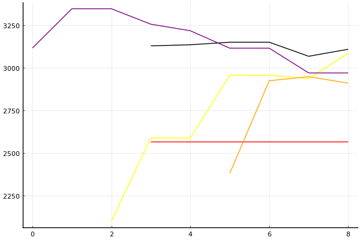

2021 시즌 1 개인전 32강 B조

### 선수

송용준
정승하
한상현
장건
김승태
동준용
노준현
김기수

### 경기 시뮬레이션

| 순위 | 송용준 | 정승하 | 한상현 | 장건 | 김승태 | 동준용 | 노준현 | 김기수 |
|:---:|---:|---:|---:|---:|---:|---:|---:|---:|
| 1위 | 0.240 | 0.255 | 0.007 | 0.108 | 0.075 | 0.105 | 0.199 | 0.041 |
| 2위 | 0.211 | 0.230 | 0.022 | 0.090 | 0.124 | 0.091 | 0.204 | 0.082 |
| 3위 | 0.177 | 0.177 | 0.041 | 0.093 | 0.149 | 0.097 | 0.174 | 0.113 |
| 4위 | 0.135 | 0.137 | 0.072 | 0.104 | 0.164 | 0.106 | 0.149 | 0.140 |
| 5위 | 0.104 | 0.095 | 0.110 | 0.119 | 0.164 | 0.121 | 0.117 | 0.165 |
| 6위 | 0.073 | 0.062 | 0.172 | 0.136 | 0.151 | 0.127 | 0.084 | 0.179 |
| 7위 | 0.042 | 0.031 | 0.243 | 0.157 | 0.111 | 0.156 | 0.054 | 0.173 |
| 8위 | 0.019 | 0.013 | 0.334 | 0.194 | 0.062 | 0.197 | 0.020 | 0.107 |
| 1위 | 0.240 | 0.255 | 0.007 | 0.108 | 0.075 | 0.105 | 0.199 | 0.041 |
| 진출 | 0.627 | 0.662 | 0.070 | 0.291 | 0.348 | 0.293 | 0.577 | 0.237 |
| 패부 | 0.239 | 0.232 | 0.181 | 0.223 | 0.328 | 0.227 | 0.266 | 0.305 |

### 전체 랭킹

x축: 시즌, y축: 점수
1번: 옐로우, 2번: 블랙, 3번: 레드, 4번: 화이트(회색), 5번: 퍼플, 6번: 그린, 7번: 블루, 8번: 오렌지

| 순위 | 이름 | 점수 | mu | sigma | 주행 | 8인전 1-2-Mid-Lo | 8인전 평균득점 | 8인전 표준편차 | 2인전 전적 |
|---:|:---:|---:|---:|---:|---:|:---:|---:|---:|:---:|
| 8 / 93 | [정승하](../jeongseungha) | 3108 | 3336 | 76 | 154 | 9-14-45-32 | 3.83 | 3.12 | 0-0 |
| 10 / 93 | [송용준](../songyongjun) | 3085 | 3320 | 78 | 132 | 9-9-50-32 | 3.53 | 3.08 | 0-0 |
| 16 / 93 | [노준현](../nojunhyeon) | 2993 | 3302 | 103 | 35 | 9-20-40-31 | 4.00 | 3.21 | 0-0 |
| 19 / 93 | [김승태](../gimseungtae) | 2969 | 3199 | 77 | 178 | 21-10-35-34 | 4.14 | 3.87 | 0-0 |
| 25 / 93 | [김기수](../gimgisu) | 2909 | 3140 | 77 | 121 | 11-9-35-46 | 3.04 | 3.42 | 0-0 |
| 42 / 93 | [한상현](../hansanghyeon) | 2565 | 2995 | 143 | 16 | 0-6-56-38 | 2.81 | 2.14 | 0-0 |
| NaN / 93 | [장건](../janggeon) | 0 | 3000 | 1000 | 0 | 0-0-0-0 | 0.00 | 0.00 | 0-0 |
| NaN / 93 | [동준용](../dongjunyong) | 0 | 3000 | 1000 | 0 | 0-0-0-0 | 0.00 | 0.00 | 0-0 |

### 시즌 랭킹

#### [2020 시즌 2](../singles-s2020_2)

| 순위 | 이름 | 점수 | mu | sigma | 주행 | 8인전 1-2-Mid-Lo | 8인전 평균득점 | 8인전 표준편차 | 2인전 전적 |
|---:|:---:|---:|---:|---:|---:|:---:|---:|---:|:---:|
| 3 / 32 | [송용준](../songyongjun) | 3180 | 3457 | 92 | 54 | 12-12-53-22 | 4.35 | 3.09 | 0-0 |
| 4 / 32 | [정승하](../jeongseungha) | 3153 | 3455 | 100 | 38 | 8-18-47-26 | 4.13 | 2.94 | 0-0 |
| 7 / 32 | [노준현](../nojunhyeon) | 3023 | 3337 | 105 | 35 | 9-20-40-31 | 4.00 | 3.21 | 0-0 |
| 13 / 32 | [김기수](../gimgisu) | 2761 | 3102 | 114 | 29 | 10-10-38-41 | 3.24 | 3.40 | 0-0 |
| NaN / 32 | [한상현](../hansanghyeon) | 0 | 3000 | 1000 | 0 | 0-0-0-0 | 0.00 | 0.00 | 0-0 |
| NaN / 32 | [장건](../janggeon) | 0 | 3000 | 1000 | 0 | 0-0-0-0 | 0.00 | 0.00 | 0-0 |
| NaN / 32 | [김승태](../gimseungtae) | 0 | 3000 | 1000 | 0 | 0-0-0-0 | 0.00 | 0.00 | 0-0 |
| NaN / 32 | [동준용](../dongjunyong) | 0 | 3000 | 1000 | 0 | 0-0-0-0 | 0.00 | 0.00 | 0-0 |

#### [2020 시즌 1](../singles-s2020_1)

| 순위 | 이름 | 점수 | mu | sigma | 주행 | 8인전 1-2-Mid-Lo | 8인전 평균득점 | 8인전 표준편차 | 2인전 전적 |
|---:|:---:|---:|---:|---:|---:|:---:|---:|---:|:---:|
| 12 / 32 | [김기수](../gimgisu) | 2721 | 3051 | 110 | 32 | 8-8-32-52 | 2.68 | 3.41 | 0-0 |
| 17 / 32 | [정승하](../jeongseungha) | 2483 | 2893 | 137 | 20 | 0-21-32-47 | 2.79 | 3.07 | 0-0 |
| 19 / 32 | [김승태](../gimseungtae) | 2414 | 2780 | 122 | 26 | 5-11-32-53 | 2.26 | 3.21 | 0-0 |
| 26 / 32 | [송용준](../songyongjun) | 2139 | 2834 | 231 | 7 | 0-0-57-43 | 2.43 | 2.44 | 0-0 |
| NaN / 32 | [한상현](../hansanghyeon) | 0 | 3000 | 1000 | 0 | 0-0-0-0 | 0.00 | 0.00 | 0-0 |
| NaN / 32 | [장건](../janggeon) | 0 | 3000 | 1000 | 0 | 0-0-0-0 | 0.00 | 0.00 | 0-0 |
| NaN / 32 | [동준용](../dongjunyong) | 0 | 3000 | 1000 | 0 | 0-0-0-0 | 0.00 | 0.00 | 0-0 |
| NaN / 32 | [노준현](../nojunhyeon) | 0 | 3000 | 1000 | 0 | 0-0-0-0 | 0.00 | 0.00 | 0-0 |

#### [2019 시즌 2](../singles-s2019_2)

| 순위 | 이름 | 점수 | mu | sigma | 주행 | 8인전 1-2-Mid-Lo | 8인전 평균득점 | 8인전 표준편차 | 2인전 전적 |
|---:|:---:|---:|---:|---:|---:|:---:|---:|---:|:---:|
| 8 / 32 | [김기수](../gimgisu) | 2977 | 3267 | 97 | 43 | 14-9-35-42 | 3.49 | 3.57 | 0-0 |
| NaN / 32 | [송용준](../songyongjun) | 0 | 3000 | 1000 | 0 | 0-0-0-0 | 0.00 | 0.00 | 0-0 |
| NaN / 32 | [정승하](../jeongseungha) | 0 | 3000 | 1000 | 0 | 0-0-0-0 | 0.00 | 0.00 | 0-0 |
| NaN / 32 | [한상현](../hansanghyeon) | 0 | 3000 | 1000 | 0 | 0-0-0-0 | 0.00 | 0.00 | 0-0 |
| NaN / 32 | [장건](../janggeon) | 0 | 3000 | 1000 | 0 | 0-0-0-0 | 0.00 | 0.00 | 0-0 |
| NaN / 32 | [김승태](../gimseungtae) | 0 | 3000 | 1000 | 0 | 0-0-0-0 | 0.00 | 0.00 | 0-0 |
| NaN / 32 | [동준용](../dongjunyong) | 0 | 3000 | 1000 | 0 | 0-0-0-0 | 0.00 | 0.00 | 0-0 |
| NaN / 32 | [노준현](../nojunhyeon) | 0 | 3000 | 1000 | 0 | 0-0-0-0 | 0.00 | 0.00 | 0-0 |

#### [2019 시즌 1](../singles-s2019_1)

| 순위 | 이름 | 점수 | mu | sigma | 주행 | 8인전 1-2-Mid-Lo | 8인전 평균득점 | 8인전 표준편차 | 2인전 전적 |
|---:|:---:|---:|---:|---:|---:|:---:|---:|---:|:---:|
| 4 / 32 | [정승하](../jeongseungha) | 3056 | 3351 | 99 | 41 | 12-10-44-34 | 3.76 | 3.37 | 0-0 |
| 7 / 32 | [송용준](../songyongjun) | 2943 | 3225 | 94 | 46 | 9-7-50-35 | 3.30 | 3.05 | 0-0 |
| 9 / 32 | [김승태](../gimseungtae) | 2911 | 3210 | 99 | 42 | 21-7-43-29 | 4.31 | 3.80 | 0-0 |
| 22 / 32 | [김기수](../gimgisu) | 2229 | 2675 | 149 | 17 | 6-6-35-53 | 2.06 | 3.11 | 0-0 |
| NaN / 32 | [한상현](../hansanghyeon) | 0 | 3000 | 1000 | 0 | 0-0-0-0 | 0.00 | 0.00 | 0-0 |
| NaN / 32 | [장건](../janggeon) | 0 | 3000 | 1000 | 0 | 0-0-0-0 | 0.00 | 0.00 | 0-0 |
| NaN / 32 | [동준용](../dongjunyong) | 0 | 3000 | 1000 | 0 | 0-0-0-0 | 0.00 | 0.00 | 0-0 |
| NaN / 32 | [노준현](../nojunhyeon) | 0 | 3000 | 1000 | 0 | 0-0-0-0 | 0.00 | 0.00 | 0-0 |

#### [2018 듀얼 레이스 X](../singles-s2018_2)

| 순위 | 이름 | 점수 | mu | sigma | 주행 | 8인전 1-2-Mid-Lo | 8인전 평균득점 | 8인전 표준편차 | 2인전 전적 |
|---:|:---:|---:|---:|---:|---:|:---:|---:|---:|:---:|
| 5 / 8 | [정승하](../jeongseungha) | 2403 | 3068 | 222 | 8 | 12-0-50-38 | 3.38 | 3.62 | 0-0 |
| 6 / 8 | [김승태](../gimseungtae) | 2177 | 2841 | 221 | 8 | 12-0-38-50 | 2.75 | 3.65 | 0-0 |
| NaN / 8 | [송용준](../songyongjun) | 0 | 3000 | 1000 | 0 | 0-0-0-0 | 0.00 | 0.00 | 0-0 |
| NaN / 8 | [한상현](../hansanghyeon) | 0 | 3000 | 1000 | 0 | 0-0-0-0 | 0.00 | 0.00 | 0-0 |
| NaN / 8 | [장건](../janggeon) | 0 | 3000 | 1000 | 0 | 0-0-0-0 | 0.00 | 0.00 | 0-0 |
| NaN / 8 | [동준용](../dongjunyong) | 0 | 3000 | 1000 | 0 | 0-0-0-0 | 0.00 | 0.00 | 0-0 |
| NaN / 8 | [노준현](../nojunhyeon) | 0 | 3000 | 1000 | 0 | 0-0-0-0 | 0.00 | 0.00 | 0-0 |
| NaN / 8 | [김기수](../gimgisu) | 0 | 3000 | 1000 | 0 | 0-0-0-0 | 0.00 | 0.00 | 0-0 |

#### [2018 듀얼 레이스 3](../singles-s2018_1)

| 순위 | 이름 | 점수 | mu | sigma | 주행 | 8인전 1-2-Mid-Lo | 8인전 평균득점 | 8인전 표준편차 | 2인전 전적 |
|---:|:---:|---:|---:|---:|---:|:---:|---:|---:|:---:|
| 5 / 32 | [정승하](../jeongseungha) | 3100 | 3387 | 95 | 47 | 10-15-48-28 | 4.20 | 2.97 | 0-0 |
| 7 / 32 | [김승태](../gimseungtae) | 3059 | 3383 | 108 | 34 | 18-15-35-32 | 4.12 | 3.79 | 0-0 |
| 18 / 32 | [한상현](../hansanghyeon) | 2471 | 2915 | 148 | 16 | 0-6-56-38 | 2.81 | 2.14 | 0-0 |
| 19 / 32 | [송용준](../songyongjun) | 2407 | 2840 | 144 | 18 | 6-17-39-39 | 2.94 | 3.37 | 0-0 |
| NaN / 32 | [장건](../janggeon) | 0 | 3000 | 1000 | 0 | 0-0-0-0 | 0.00 | 0.00 | 0-0 |
| NaN / 32 | [동준용](../dongjunyong) | 0 | 3000 | 1000 | 0 | 0-0-0-0 | 0.00 | 0.00 | 0-0 |
| NaN / 32 | [노준현](../nojunhyeon) | 0 | 3000 | 1000 | 0 | 0-0-0-0 | 0.00 | 0.00 | 0-0 |
| NaN / 32 | [김기수](../gimgisu) | 0 | 3000 | 1000 | 0 | 0-0-0-0 | 0.00 | 0.00 | 0-0 |

#### [2017 Kespa Cup](../singles-s2017_2)

| 순위 | 이름 | 점수 | mu | sigma | 주행 | 8인전 1-2-Mid-Lo | 8인전 평균득점 | 8인전 표준편차 | 2인전 전적 |
|---:|:---:|---:|---:|---:|---:|:---:|---:|---:|:---:|
| 24 / 32 | [송용준](../songyongjun) | 1958 | 2664 | 235 | 7 | 0-0-43-57 | 1.86 | 1.86 | 0-0 |
| NaN / 32 | [정승하](../jeongseungha) | 0 | 3000 | 1000 | 0 | 0-0-0-0 | 0.00 | 0.00 | 0-0 |
| NaN / 32 | [한상현](../hansanghyeon) | 0 | 3000 | 1000 | 0 | 0-0-0-0 | 0.00 | 0.00 | 0-0 |
| NaN / 32 | [장건](../janggeon) | 0 | 3000 | 1000 | 0 | 0-0-0-0 | 0.00 | 0.00 | 0-0 |
| NaN / 32 | [김승태](../gimseungtae) | 0 | 3000 | 1000 | 0 | 0-0-0-0 | 0.00 | 0.00 | 0-0 |
| NaN / 32 | [동준용](../dongjunyong) | 0 | 3000 | 1000 | 0 | 0-0-0-0 | 0.00 | 0.00 | 0-0 |
| NaN / 32 | [노준현](../nojunhyeon) | 0 | 3000 | 1000 | 0 | 0-0-0-0 | 0.00 | 0.00 | 0-0 |
| NaN / 32 | [김기수](../gimgisu) | 0 | 3000 | 1000 | 0 | 0-0-0-0 | 0.00 | 0.00 | 0-0 |

#### [2017 듀얼 레이스 2](../singles-s2017_1)

| 순위 | 이름 | 점수 | mu | sigma | 주행 | 8인전 1-2-Mid-Lo | 8인전 평균득점 | 8인전 표준편차 | 2인전 전적 |
|---:|:---:|---:|---:|---:|---:|:---:|---:|---:|:---:|
| 1 / 16 | [김승태](../gimseungtae) | 3097 | 3448 | 117 | 35 | 41-0-32-27 | 5.36 | 4.25 | 0-0 |
| NaN / 16 | [송용준](../songyongjun) | 0 | 3000 | 1000 | 0 | 0-0-0-0 | 0.00 | 0.00 | 0-0 |
| NaN / 16 | [정승하](../jeongseungha) | 0 | 3000 | 1000 | 0 | 0-0-0-0 | 0.00 | 0.00 | 0-0 |
| NaN / 16 | [한상현](../hansanghyeon) | 0 | 3000 | 1000 | 0 | 0-0-0-0 | 0.00 | 0.00 | 0-0 |
| NaN / 16 | [장건](../janggeon) | 0 | 3000 | 1000 | 0 | 0-0-0-0 | 0.00 | 0.00 | 0-0 |
| NaN / 16 | [동준용](../dongjunyong) | 0 | 3000 | 1000 | 0 | 0-0-0-0 | 0.00 | 0.00 | 0-0 |
| NaN / 16 | [노준현](../nojunhyeon) | 0 | 3000 | 1000 | 0 | 0-0-0-0 | 0.00 | 0.00 | 0-0 |
| NaN / 16 | [김기수](../gimgisu) | 0 | 3000 | 1000 | 0 | 0-0-0-0 | 0.00 | 0.00 | 0-0 |

#### [2016 듀얼 레이스](../singles-s2016_1)

| 순위 | 이름 | 점수 | mu | sigma | 주행 | 8인전 1-2-Mid-Lo | 8인전 평균득점 | 8인전 표준편차 | 2인전 전적 |
|---:|:---:|---:|---:|---:|---:|:---:|---:|---:|:---:|
| 4 / 32 | [김승태](../gimseungtae) | 3116 | 3465 | 117 | 33 | 23-23-23-32 | 4.77 | 4.02 | 0-0 |
| NaN / 32 | [송용준](../songyongjun) | 0 | 3000 | 1000 | 0 | 0-0-0-0 | 0.00 | 0.00 | 0-0 |
| NaN / 32 | [정승하](../jeongseungha) | 0 | 3000 | 1000 | 0 | 0-0-0-0 | 0.00 | 0.00 | 0-0 |
| NaN / 32 | [한상현](../hansanghyeon) | 0 | 3000 | 1000 | 0 | 0-0-0-0 | 0.00 | 0.00 | 0-0 |
| NaN / 32 | [장건](../janggeon) | 0 | 3000 | 1000 | 0 | 0-0-0-0 | 0.00 | 0.00 | 0-0 |
| NaN / 32 | [동준용](../dongjunyong) | 0 | 3000 | 1000 | 0 | 0-0-0-0 | 0.00 | 0.00 | 0-0 |
| NaN / 32 | [노준현](../nojunhyeon) | 0 | 3000 | 1000 | 0 | 0-0-0-0 | 0.00 | 0.00 | 0-0 |
| NaN / 32 | [김기수](../gimgisu) | 0 | 3000 | 1000 | 0 | 0-0-0-0 | 0.00 | 0.00 | 0-0 |

### 트랙 랭킹

#### [월드 이탈리아 피사의 사탑](../pizza)

| 순위 | 이름 | 점수 | mu | sigma | 주행 | 8인전 1-2-Mid-Lo | 8인전 평균득점 | 8인전 표준편차 | 2인전 전적 |
|---:|:---:|---:|---:|---:|---:|:---:|---:|---:|:---:|
| 17 / 32 | [김기수](../gimgisu) | 1890 | 2776 | 295 | 5 | 0-0-40-60 | 1.20 | 2.28 | 0-0 |
| NaN / 32 | [송용준](../songyongjun) | 0 | 3000 | 1000 | 0 | 0-0-0-0 | 0.00 | 0.00 | 0-0 |
| NaN / 32 | [정승하](../jeongseungha) | 0 | 3000 | 1000 | 0 | 0-0-0-0 | 0.00 | 0.00 | 0-0 |
| NaN / 32 | [한상현](../hansanghyeon) | 0 | 3000 | 1000 | 0 | 0-0-0-0 | 0.00 | 0.00 | 0-0 |
| NaN / 32 | [장건](../janggeon) | 0 | 3000 | 1000 | 0 | 0-0-0-0 | 0.00 | 0.00 | 0-0 |
| NaN / 32 | [김승태](../gimseungtae) | 0 | 3000 | 1000 | 0 | 0-0-0-0 | 0.00 | 0.00 | 0-0 |
| NaN / 32 | [동준용](../dongjunyong) | 0 | 3000 | 1000 | 0 | 0-0-0-0 | 0.00 | 0.00 | 0-0 |
| NaN / 32 | [노준현](../nojunhyeon) | 0 | 3000 | 1000 | 0 | 0-0-0-0 | 0.00 | 0.00 | 0-0 |

#### [노르테유 익스프레스](../noex)

| 순위 | 이름 | 점수 | mu | sigma | 주행 | 8인전 1-2-Mid-Lo | 8인전 평균득점 | 8인전 표준편차 | 2인전 전적 |
|---:|:---:|---:|---:|---:|---:|:---:|---:|---:|:---:|
| 6 / 68 | [정승하](../jeongseungha) | 3108 | 3706 | 199 | 10 | 22-11-44-22 | 4.78 | 3.70 | 0-0 |
| 10 / 68 | [송용준](../songyongjun) | 2887 | 3521 | 211 | 8 | 0-12-75-12 | 3.75 | 2.05 | 0-0 |
| 11 / 68 | [김승태](../gimseungtae) | 2850 | 3476 | 209 | 9 | 0-22-44-33 | 3.56 | 2.92 | 0-0 |
| 40 / 68 | [한상현](../hansanghyeon) | 1440 | 2999 | 519 | 1 | 0-0-0-100 | 1.00 | 0.00 | 0-0 |
| 47 / 68 | [김기수](../gimgisu) | 1342 | 2618 | 425 | 2 | 0-0-50-50 | 2.00 | 2.83 | 0-0 |
| NaN / 68 | [장건](../janggeon) | 0 | 3000 | 1000 | 0 | 0-0-0-0 | 0.00 | 0.00 | 0-0 |
| NaN / 68 | [동준용](../dongjunyong) | 0 | 3000 | 1000 | 0 | 0-0-0-0 | 0.00 | 0.00 | 0-0 |
| NaN / 68 | [노준현](../nojunhyeon) | 0 | 3000 | 1000 | 0 | 0-0-0-0 | 0.00 | 0.00 | 0-0 |

#### [광산 위험한 제련소](../jeryeonso)

| 순위 | 이름 | 점수 | mu | sigma | 주행 | 8인전 1-2-Mid-Lo | 8인전 평균득점 | 8인전 표준편차 | 2인전 전적 |
|---:|:---:|---:|---:|---:|---:|:---:|---:|---:|:---:|
| 12 / 57 | [송용준](../songyongjun) | 2595 | 3310 | 238 | 7 | 0-43-29-29 | 4.00 | 3.42 | 0-0 |
| 13 / 57 | [정승하](../jeongseungha) | 2575 | 3242 | 222 | 8 | 12-12-38-38 | 3.50 | 3.82 | 0-0 |
| 14 / 57 | [김승태](../gimseungtae) | 2549 | 3509 | 320 | 4 | 25-25-25-25 | 5.00 | 4.69 | 0-0 |
| 21 / 57 | [김기수](../gimgisu) | 2140 | 3115 | 325 | 3 | 0-0-67-33 | 3.33 | 2.08 | 0-0 |
| 44 / 57 | [한상현](../hansanghyeon) | 947 | 2537 | 530 | 1 | 0-0-0-100 | 0.00 | 0.00 | 0-0 |
| 46 / 57 | [노준현](../nojunhyeon) | 843 | 2274 | 477 | 2 | 0-0-0-100 | -0.50 | 0.71 | 0-0 |
| NaN / 57 | [장건](../janggeon) | 0 | 3000 | 1000 | 0 | 0-0-0-0 | 0.00 | 0.00 | 0-0 |
| NaN / 57 | [동준용](../dongjunyong) | 0 | 3000 | 1000 | 0 | 0-0-0-0 | 0.00 | 0.00 | 0-0 |

#### [공동묘지 해골 손가락](../haeson)

| 순위 | 이름 | 점수 | mu | sigma | 주행 | 8인전 1-2-Mid-Lo | 8인전 평균득점 | 8인전 표준편차 | 2인전 전적 |
|---:|:---:|---:|---:|---:|---:|:---:|---:|---:|:---:|
| 7 / 46 | [정승하](../jeongseungha) | 2669 | 3781 | 371 | 3 | 50-0-50-0 | 7.00 | 4.24 | 0-0 |
| 11 / 46 | [김승태](../gimseungtae) | 2539 | 3617 | 359 | 3 | 33-0-33-33 | 5.00 | 5.00 | 0-0 |
| 17 / 46 | [한상현](../hansanghyeon) | 2116 | 3373 | 419 | 2 | 0-50-50-0 | 5.50 | 2.12 | 0-0 |
| 27 / 46 | [송용준](../songyongjun) | 1618 | 2835 | 406 | 2 | 0-0-100-0 | 3.00 | 0.00 | 0-0 |
| 30 / 46 | [김기수](../gimgisu) | 1562 | 2790 | 409 | 2 | 0-0-0-100 | 0.50 | 0.71 | 0-0 |
| NaN / 46 | [장건](../janggeon) | 0 | 3000 | 1000 | 0 | 0-0-0-0 | 0.00 | 0.00 | 0-0 |
| NaN / 46 | [동준용](../dongjunyong) | 0 | 3000 | 1000 | 0 | 0-0-0-0 | 0.00 | 0.00 | 0-0 |
| NaN / 46 | [노준현](../nojunhyeon) | 0 | 3000 | 1000 | 0 | 0-0-0-0 | 0.00 | 0.00 | 0-0 |

### 상대전적

경기 별: 

| 선수 | __송용준__ | __정승하__ | __한상현__ | __장건__ | __김승태__ | __동준용__ | __노준현__ | __김기수__ |
|:---:|:---:|:---:|:---:|:---:|:---:|:---:|:---:|:---:|
| __송용준__ | - | 2-4 | 1-0 | 0-0 | 1-2 | 0-0 | 2-0 | 3-1 |
| __정승하__ | 4-2 | - | 0-0 | 0-0 | 3-3 | 0-0 | 1-0 | 2-0 |
| __한상현__ | 0-1 | 0-0 | - | 0-0 | 0-0 | 0-0 | 0-0 | 0-0 |
| __장건__ | 0-0 | 0-0 | 0-0 | - | 0-0 | 0-0 | 0-0 | 0-0 |
| __김승태__ | 2-1 | 3-3 | 0-0 | 0-0 | - | 0-0 | 0-0 | 1-1 |
| __동준용__ | 0-0 | 0-0 | 0-0 | 0-0 | 0-0 | - | 0-0 | 0-0 |
| __노준현__ | 0-2 | 0-1 | 0-0 | 0-0 | 0-0 | 0-0 | - | 0-0 |
| __김기수__ | 1-3 | 0-2 | 0-0 | 0-0 | 1-1 | 0-0 | 0-0 | - |

| 선수 | __송용준__ | __정승하__ | __한상현__ | __장건__ | __김승태__ | __동준용__ | __노준현__ | __김기수__ |
|:---:|:---:|:---:|:---:|:---:|:---:|:---:|:---:|:---:|
| __송용준__ | - | 0.333 | 1.000 | NaN | 0.333 | NaN | 1.000 | 0.750 |
| __정승하__ | 0.667 | - | NaN | NaN | 0.500 | NaN | 1.000 | 1.000 |
| __한상현__ | 0.000 | NaN | - | NaN | NaN | NaN | NaN | NaN |
| __장건__ | NaN | NaN | NaN | - | NaN | NaN | NaN | NaN |
| __김승태__ | 0.667 | 0.500 | NaN | NaN | - | NaN | NaN | 0.500 |
| __동준용__ | NaN | NaN | NaN | NaN | NaN | - | NaN | NaN |
| __노준현__ | 0.000 | 0.000 | NaN | NaN | NaN | NaN | - | NaN |
| __김기수__ | 0.250 | 0.000 | NaN | NaN | 0.500 | NaN | NaN | - |

트랙 별: 

| 선수 | __송용준__ | __정승하__ | __한상현__ | __장건__ | __김승태__ | __동준용__ | __노준현__ | __김기수__ |
|:---:|:---:|:---:|:---:|:---:|:---:|:---:|:---:|:---:|
| __송용준__ | - | 30-32 | 5-5 | 0-0 | 10-13 | 0-0 | 8-10 | 17-15 |
| __정승하__ | 32-30 | - | 0-0 | 0-0 | 24-24 | 0-0 | 5-4 | 12-4 |
| __한상현__ | 5-5 | 0-0 | - | 0-0 | 0-0 | 0-0 | 0-0 | 0-0 |
| __장건__ | 0-0 | 0-0 | 0-0 | - | 0-0 | 0-0 | 0-0 | 0-0 |
| __김승태__ | 13-10 | 24-24 | 0-0 | 0-0 | - | 0-0 | 0-0 | 10-7 |
| __동준용__ | 0-0 | 0-0 | 0-0 | 0-0 | 0-0 | - | 0-0 | 0-0 |
| __노준현__ | 10-8 | 4-5 | 0-0 | 0-0 | 0-0 | 0-0 | - | 0-0 |
| __김기수__ | 15-17 | 4-12 | 0-0 | 0-0 | 7-10 | 0-0 | 0-0 | - |

| 선수 | __송용준__ | __정승하__ | __한상현__ | __장건__ | __김승태__ | __동준용__ | __노준현__ | __김기수__ |
|:---:|:---:|:---:|:---:|:---:|:---:|:---:|:---:|:---:|
| __송용준__ | - | 0.484 | 0.500 | NaN | 0.435 | NaN | 0.444 | 0.531 |
| __정승하__ | 0.516 | - | NaN | NaN | 0.500 | NaN | 0.556 | 0.750 |
| __한상현__ | 0.500 | NaN | - | NaN | NaN | NaN | NaN | NaN |
| __장건__ | NaN | NaN | NaN | - | NaN | NaN | NaN | NaN |
| __김승태__ | 0.565 | 0.500 | NaN | NaN | - | NaN | NaN | 0.588 |
| __동준용__ | NaN | NaN | NaN | NaN | NaN | - | NaN | NaN |
| __노준현__ | 0.556 | 0.444 | NaN | NaN | NaN | NaN | - | NaN |
| __김기수__ | 0.469 | 0.250 | NaN | NaN | 0.412 | NaN | NaN | - |
