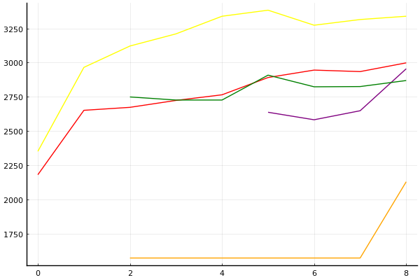

2021 시즌 1 개인전 32강 C조

### 선수

박인수
신민식
최영훈
이정우
김지민
한승철
최은성
전진우

### 경기 시뮬레이션

| 순위 | 박인수 | 신민식 | 최영훈 | 이정우 | 김지민 | 한승철 | 최은성 | 전진우 |
|:---:|---:|---:|---:|---:|---:|---:|---:|---:|
| 1위 | 0.746 | 0.064 | 0.071 | 0.001 | 0.052 | 0.018 | 0.067 | 0.000 |
| 2위 | 0.176 | 0.147 | 0.248 | 0.013 | 0.215 | 0.108 | 0.137 | 0.001 |
| 3위 | 0.051 | 0.146 | 0.246 | 0.034 | 0.232 | 0.167 | 0.144 | 0.004 |
| 4위 | 0.019 | 0.151 | 0.194 | 0.062 | 0.207 | 0.210 | 0.149 | 0.011 |
| 5위 | 0.006 | 0.154 | 0.136 | 0.120 | 0.161 | 0.224 | 0.155 | 0.031 |
| 6위 | 0.002 | 0.159 | 0.076 | 0.231 | 0.093 | 0.181 | 0.158 | 0.091 |
| 7위 | 0.000 | 0.114 | 0.026 | 0.364 | 0.033 | 0.076 | 0.124 | 0.240 |
| 8위 | 0.000 | 0.065 | 0.003 | 0.175 | 0.006 | 0.016 | 0.066 | 0.621 |
| 진출 | 0.973 | 0.358 | 0.566 | 0.048 | 0.499 | 0.293 | 0.348 | 0.005 |
| 패부 | 0.026 | 0.305 | 0.330 | 0.182 | 0.368 | 0.434 | 0.304 | 0.042 |

### 전체 랭킹

x축: 시즌, y축: 점수
1번: 옐로우, 2번: 블랙, 3번: 레드, 4번: 화이트(회색), 5번: 퍼플, 6번: 그린, 7번: 블루, 8번: 오렌지

| 순위 | 이름 | 점수 | mu | sigma | 주행 | 8인전 1-2-Mid-Lo | 8인전 평균득점 | 8인전 표준편차 | 2인전 전적 |
|---:|:---:|---:|---:|---:|---:|:---:|---:|---:|:---:|
| 3 / 93 | [박인수](../bakinsu) | 3338 | 3569 | 77 | 320 | 27-12-33-28 | 4.89 | 3.84 | 3-4 |
| 15 / 93 | [최영훈](../choiyeonghun) | 2998 | 3226 | 76 | 212 | 11-12-42-35 | 3.62 | 3.29 | 0-0 |
| 20 / 93 | [김지민](../gimjimin) | 2955 | 3193 | 79 | 88 | 8-9-43-40 | 3.30 | 3.11 | 0-0 |
| 28 / 93 | [한승철](../hanseungcheol) | 2869 | 3099 | 77 | 134 | 8-10-45-37 | 3.19 | 3.28 | 0-0 |
| 68 / 93 | [이정우](../ijeongu) | 2230 | 2831 | 200 | 9 | 11-11-22-56 | 2.33 | 3.91 | 0-0 |
| 73 / 93 | [전진우](../jeonjinwoo) | 2129 | 2621 | 164 | 14 | 0-0-36-64 | 1.29 | 2.13 | 0-0 |
| NaN / 93 | [신민식](../shinminshik) | 0 | 3000 | 1000 | 0 | 0-0-0-0 | 0.00 | 0.00 | 0-0 |
| NaN / 93 | [최은성](../choieunseong) | 0 | 3000 | 1000 | 0 | 0-0-0-0 | 0.00 | 0.00 | 0-0 |

### 시즌 랭킹

#### [2020 시즌 2](../singles-s2020_2)

| 순위 | 이름 | 점수 | mu | sigma | 주행 | 8인전 1-2-Mid-Lo | 8인전 평균득점 | 8인전 표준편차 | 2인전 전적 |
|---:|:---:|---:|---:|---:|---:|:---:|---:|---:|:---:|
| 2 / 32 | [박인수](../bakinsu) | 3353 | 3658 | 102 | 40 | 26-18-46-10 | 5.69 | 3.22 | 0-1 |
| 8 / 32 | [최영훈](../choiyeonghun) | 3010 | 3273 | 88 | 59 | 17-14-32-37 | 3.97 | 3.69 | 0-0 |
| 9 / 32 | [김지민](../gimjimin) | 3005 | 3268 | 88 | 57 | 12-7-44-37 | 3.63 | 3.29 | 0-0 |
| 12 / 32 | [한승철](../hanseungcheol) | 2794 | 3099 | 101 | 38 | 8-8-50-34 | 3.37 | 3.18 | 0-0 |
| 25 / 32 | [이정우](../ijeongu) | 2037 | 2668 | 210 | 9 | 11-11-22-56 | 2.33 | 3.91 | 0-0 |
| 28 / 32 | [전진우](../jeonjinwoo) | 1940 | 2562 | 207 | 9 | 0-0-33-67 | 1.22 | 1.79 | 0-0 |
| NaN / 32 | [신민식](../shinminshik) | 0 | 3000 | 1000 | 0 | 0-0-0-0 | 0.00 | 0.00 | 0-0 |
| NaN / 32 | [최은성](../choieunseong) | 0 | 3000 | 1000 | 0 | 0-0-0-0 | 0.00 | 0.00 | 0-0 |

#### [2020 시즌 1](../singles-s2020_1)

| 순위 | 이름 | 점수 | mu | sigma | 주행 | 8인전 1-2-Mid-Lo | 8인전 평균득점 | 8인전 표준편차 | 2인전 전적 |
|---:|:---:|---:|---:|---:|---:|:---:|---:|---:|:---:|
| 2 / 32 | [박인수](../bakinsu) | 3188 | 3460 | 91 | 54 | 28-11-35-26 | 4.96 | 3.85 | 0-0 |
| 14 / 32 | [최영훈](../choiyeonghun) | 2652 | 2971 | 107 | 34 | 11-7-37-44 | 3.15 | 3.43 | 0-0 |
| 16 / 32 | [한승철](../hanseungcheol) | 2522 | 2903 | 127 | 23 | 0-19-62-19 | 3.44 | 2.42 | 0-0 |
| 25 / 32 | [김지민](../gimjimin) | 2171 | 2857 | 229 | 7 | 0-0-57-43 | 2.43 | 1.81 | 0-0 |
| NaN / 32 | [신민식](../shinminshik) | 0 | 3000 | 1000 | 0 | 0-0-0-0 | 0.00 | 0.00 | 0-0 |
| NaN / 32 | [이정우](../ijeongu) | 0 | 3000 | 1000 | 0 | 0-0-0-0 | 0.00 | 0.00 | 0-0 |
| NaN / 32 | [최은성](../choieunseong) | 0 | 3000 | 1000 | 0 | 0-0-0-0 | 0.00 | 0.00 | 0-0 |
| NaN / 32 | [전진우](../jeonjinwoo) | 0 | 3000 | 1000 | 0 | 0-0-0-0 | 0.00 | 0.00 | 0-0 |

#### [2019 시즌 2](../singles-s2019_2)

| 순위 | 이름 | 점수 | mu | sigma | 주행 | 8인전 1-2-Mid-Lo | 8인전 평균득점 | 8인전 표준편차 | 2인전 전적 |
|---:|:---:|---:|---:|---:|---:|:---:|---:|---:|:---:|
| 5 / 32 | [박인수](../bakinsu) | 3050 | 3348 | 99 | 42 | 24-12-31-33 | 4.33 | 4.01 | 0-0 |
| 9 / 32 | [최영훈](../choiyeonghun) | 2893 | 3200 | 102 | 36 | 8-17-47-28 | 3.86 | 3.05 | 0-0 |
| 25 / 32 | [한승철](../hanseungcheol) | 2089 | 2690 | 200 | 10 | 10-10-40-40 | 2.60 | 3.66 | 0-0 |
| 29 / 32 | [김지민](../gimjimin) | 1849 | 2592 | 248 | 7 | 0-14-14-71 | 1.57 | 3.15 | 0-0 |
| NaN / 32 | [신민식](../shinminshik) | 0 | 3000 | 1000 | 0 | 0-0-0-0 | 0.00 | 0.00 | 0-0 |
| NaN / 32 | [이정우](../ijeongu) | 0 | 3000 | 1000 | 0 | 0-0-0-0 | 0.00 | 0.00 | 0-0 |
| NaN / 32 | [최은성](../choieunseong) | 0 | 3000 | 1000 | 0 | 0-0-0-0 | 0.00 | 0.00 | 0-0 |
| NaN / 32 | [전진우](../jeonjinwoo) | 0 | 3000 | 1000 | 0 | 0-0-0-0 | 0.00 | 0.00 | 0-0 |

#### [2019 시즌 1](../singles-s2019_1)

| 순위 | 이름 | 점수 | mu | sigma | 주행 | 8인전 1-2-Mid-Lo | 8인전 평균득점 | 8인전 표준편차 | 2인전 전적 |
|---:|:---:|---:|---:|---:|---:|:---:|---:|---:|:---:|
| 2 / 32 | [박인수](../bakinsu) | 3337 | 3642 | 102 | 47 | 34-15-29-22 | 5.85 | 3.68 | 3-3 |
| 12 / 32 | [한승철](../hanseungcheol) | 2725 | 3056 | 111 | 31 | 13-16-29-42 | 3.84 | 3.54 | 0-0 |
| 13 / 32 | [최영훈](../choiyeonghun) | 2714 | 3045 | 110 | 31 | 13-6-52-29 | 3.81 | 3.22 | 0-0 |
| 17 / 32 | [김지민](../gimjimin) | 2493 | 2930 | 146 | 17 | 0-18-47-35 | 3.24 | 2.75 | 0-0 |
| NaN / 32 | [신민식](../shinminshik) | 0 | 3000 | 1000 | 0 | 0-0-0-0 | 0.00 | 0.00 | 0-0 |
| NaN / 32 | [이정우](../ijeongu) | 0 | 3000 | 1000 | 0 | 0-0-0-0 | 0.00 | 0.00 | 0-0 |
| NaN / 32 | [최은성](../choieunseong) | 0 | 3000 | 1000 | 0 | 0-0-0-0 | 0.00 | 0.00 | 0-0 |
| NaN / 32 | [전진우](../jeonjinwoo) | 0 | 3000 | 1000 | 0 | 0-0-0-0 | 0.00 | 0.00 | 0-0 |

#### [2018 듀얼 레이스 X](../singles-s2018_2)

| 순위 | 이름 | 점수 | mu | sigma | 주행 | 8인전 1-2-Mid-Lo | 8인전 평균득점 | 8인전 표준편차 | 2인전 전적 |
|---:|:---:|---:|---:|---:|---:|:---:|---:|---:|:---:|
| 1 / 8 | [박인수](../bakinsu) | 3198 | 3733 | 178 | 16 | 38-12-38-12 | 6.50 | 3.34 | 2-0 |
| 7 / 8 | [최영훈](../choiyeonghun) | 2020 | 2694 | 225 | 8 | 0-12-38-50 | 2.13 | 2.80 | 0-0 |
| NaN / 8 | [신민식](../shinminshik) | 0 | 3000 | 1000 | 0 | 0-0-0-0 | 0.00 | 0.00 | 0-0 |
| NaN / 8 | [이정우](../ijeongu) | 0 | 3000 | 1000 | 0 | 0-0-0-0 | 0.00 | 0.00 | 0-0 |
| NaN / 8 | [김지민](../gimjimin) | 0 | 3000 | 1000 | 0 | 0-0-0-0 | 0.00 | 0.00 | 0-0 |
| NaN / 8 | [한승철](../hanseungcheol) | 0 | 3000 | 1000 | 0 | 0-0-0-0 | 0.00 | 0.00 | 0-0 |
| NaN / 8 | [최은성](../choieunseong) | 0 | 3000 | 1000 | 0 | 0-0-0-0 | 0.00 | 0.00 | 0-0 |
| NaN / 8 | [전진우](../jeonjinwoo) | 0 | 3000 | 1000 | 0 | 0-0-0-0 | 0.00 | 0.00 | 0-0 |

#### [2018 듀얼 레이스 3](../singles-s2018_1)

| 순위 | 이름 | 점수 | mu | sigma | 주행 | 8인전 1-2-Mid-Lo | 8인전 평균득점 | 8인전 표준편차 | 2인전 전적 |
|---:|:---:|---:|---:|---:|---:|:---:|---:|---:|:---:|
| 4 / 32 | [박인수](../bakinsu) | 3129 | 3436 | 102 | 40 | 28-12-30-30 | 4.92 | 4.02 | 0-0 |
| 22 / 32 | [최영훈](../choiyeonghun) | 2302 | 2952 | 217 | 8 | 0-12-50-38 | 3.13 | 2.59 | 0-0 |
| 26 / 32 | [한승철](../hanseungcheol) | 1986 | 2676 | 230 | 8 | 0-0-50-50 | 1.63 | 2.33 | 0-0 |
| NaN / 32 | [신민식](../shinminshik) | 0 | 3000 | 1000 | 0 | 0-0-0-0 | 0.00 | 0.00 | 0-0 |
| NaN / 32 | [이정우](../ijeongu) | 0 | 3000 | 1000 | 0 | 0-0-0-0 | 0.00 | 0.00 | 0-0 |
| NaN / 32 | [김지민](../gimjimin) | 0 | 3000 | 1000 | 0 | 0-0-0-0 | 0.00 | 0.00 | 0-0 |
| NaN / 32 | [최은성](../choieunseong) | 0 | 3000 | 1000 | 0 | 0-0-0-0 | 0.00 | 0.00 | 0-0 |
| NaN / 32 | [전진우](../jeonjinwoo) | 0 | 3000 | 1000 | 0 | 0-0-0-0 | 0.00 | 0.00 | 0-0 |

#### [2017 Kespa Cup](../singles-s2017_2)

| 순위 | 이름 | 점수 | mu | sigma | 주행 | 8인전 1-2-Mid-Lo | 8인전 평균득점 | 8인전 표준편차 | 2인전 전적 |
|---:|:---:|---:|---:|---:|---:|:---:|---:|---:|:---:|
| 4 / 32 | [박인수](../bakinsu) | 3209 | 3504 | 98 | 46 | 27-11-30-32 | 4.62 | 3.95 | 0-0 |
| 13 / 32 | [한승철](../hanseungcheol) | 2758 | 3130 | 124 | 24 | 8-4-46-42 | 2.67 | 3.71 | 0-0 |
| 18 / 32 | [최영훈](../choiyeonghun) | 2356 | 2969 | 204 | 9 | 11-0-44-44 | 3.22 | 3.35 | 0-0 |
| 31 / 32 | [전진우](../jeonjinwoo) | 1603 | 2491 | 296 | 5 | 0-0-40-60 | 1.40 | 2.88 | 0-0 |
| NaN / 32 | [신민식](../shinminshik) | 0 | 3000 | 1000 | 0 | 0-0-0-0 | 0.00 | 0.00 | 0-0 |
| NaN / 32 | [이정우](../ijeongu) | 0 | 3000 | 1000 | 0 | 0-0-0-0 | 0.00 | 0.00 | 0-0 |
| NaN / 32 | [김지민](../gimjimin) | 0 | 3000 | 1000 | 0 | 0-0-0-0 | 0.00 | 0.00 | 0-0 |
| NaN / 32 | [최은성](../choieunseong) | 0 | 3000 | 1000 | 0 | 0-0-0-0 | 0.00 | 0.00 | 0-0 |

#### [2017 듀얼 레이스 2](../singles-s2017_1)

| 순위 | 이름 | 점수 | mu | sigma | 주행 | 8인전 1-2-Mid-Lo | 8인전 평균득점 | 8인전 표준편차 | 2인전 전적 |
|---:|:---:|---:|---:|---:|---:|:---:|---:|---:|:---:|
| 10 / 16 | [박인수](../bakinsu) | 2606 | 2959 | 118 | 28 | 16-5-26-53 | 2.79 | 3.87 | 0-0 |
| 14 / 16 | [최영훈](../choiyeonghun) | 2435 | 2871 | 145 | 18 | 11-22-44-22 | 4.33 | 3.35 | 0-0 |
| NaN / 16 | [신민식](../shinminshik) | 0 | 3000 | 1000 | 0 | 0-0-0-0 | 0.00 | 0.00 | 0-0 |
| NaN / 16 | [이정우](../ijeongu) | 0 | 3000 | 1000 | 0 | 0-0-0-0 | 0.00 | 0.00 | 0-0 |
| NaN / 16 | [김지민](../gimjimin) | 0 | 3000 | 1000 | 0 | 0-0-0-0 | 0.00 | 0.00 | 0-0 |
| NaN / 16 | [한승철](../hanseungcheol) | 0 | 3000 | 1000 | 0 | 0-0-0-0 | 0.00 | 0.00 | 0-0 |
| NaN / 16 | [최은성](../choieunseong) | 0 | 3000 | 1000 | 0 | 0-0-0-0 | 0.00 | 0.00 | 0-0 |
| NaN / 16 | [전진우](../jeonjinwoo) | 0 | 3000 | 1000 | 0 | 0-0-0-0 | 0.00 | 0.00 | 0-0 |

#### [2016 듀얼 레이스](../singles-s2016_1)

| 순위 | 이름 | 점수 | mu | sigma | 주행 | 8인전 1-2-Mid-Lo | 8인전 평균득점 | 8인전 표준편차 | 2인전 전적 |
|---:|:---:|---:|---:|---:|---:|:---:|---:|---:|:---:|
| 19 / 32 | [박인수](../bakinsu) | 2352 | 2956 | 202 | 9 | 11-11-22-56 | 3.11 | 3.62 | 0-0 |
| 24 / 32 | [최영훈](../choiyeonghun) | 2181 | 2786 | 202 | 9 | 0-11-56-33 | 2.56 | 2.55 | 0-0 |
| NaN / 32 | [신민식](../shinminshik) | 0 | 3000 | 1000 | 0 | 0-0-0-0 | 0.00 | 0.00 | 0-0 |
| NaN / 32 | [이정우](../ijeongu) | 0 | 3000 | 1000 | 0 | 0-0-0-0 | 0.00 | 0.00 | 0-0 |
| NaN / 32 | [김지민](../gimjimin) | 0 | 3000 | 1000 | 0 | 0-0-0-0 | 0.00 | 0.00 | 0-0 |
| NaN / 32 | [한승철](../hanseungcheol) | 0 | 3000 | 1000 | 0 | 0-0-0-0 | 0.00 | 0.00 | 0-0 |
| NaN / 32 | [최은성](../choieunseong) | 0 | 3000 | 1000 | 0 | 0-0-0-0 | 0.00 | 0.00 | 0-0 |
| NaN / 32 | [전진우](../jeonjinwoo) | 0 | 3000 | 1000 | 0 | 0-0-0-0 | 0.00 | 0.00 | 0-0 |

### 트랙 랭킹

#### [월드 이탈리아 피사의 사탑](../pizza)

| 순위 | 이름 | 점수 | mu | sigma | 주행 | 8인전 1-2-Mid-Lo | 8인전 평균득점 | 8인전 표준편차 | 2인전 전적 |
|---:|:---:|---:|---:|---:|---:|:---:|---:|---:|:---:|
| 4 / 32 | [박인수](../bakinsu) | 2632 | 3615 | 327 | 5 | 60-0-20-20 | 6.40 | 5.13 | 0-0 |
| 14 / 32 | [최영훈](../choiyeonghun) | 2175 | 3078 | 301 | 4 | 0-0-75-25 | 3.00 | 2.16 | 0-0 |
| 28 / 32 | [김지민](../gimjimin) | 361 | 2237 | 625 | 1 | 0-0-0-100 | 0.00 | 0.00 | 0-0 |
| NaN / 32 | [신민식](../shinminshik) | 0 | 3000 | 1000 | 0 | 0-0-0-0 | 0.00 | 0.00 | 0-0 |
| NaN / 32 | [이정우](../ijeongu) | 0 | 3000 | 1000 | 0 | 0-0-0-0 | 0.00 | 0.00 | 0-0 |
| NaN / 32 | [최은성](../choieunseong) | 0 | 3000 | 1000 | 0 | 0-0-0-0 | 0.00 | 0.00 | 0-0 |
| NaN / 32 | [전진우](../jeonjinwoo) | 0 | 3000 | 1000 | 0 | 0-0-0-0 | 0.00 | 0.00 | 0-0 |
| 30 / 32 | [한승철](../hanseungcheol) | -388 | 1726 | 704 | 1 | 0-0-0-100 | -1.00 | 0.00 | 0-0 |

#### [노르테유 익스프레스](../noex)

| 순위 | 이름 | 점수 | mu | sigma | 주행 | 8인전 1-2-Mid-Lo | 8인전 평균득점 | 8인전 표준편차 | 2인전 전적 |
|---:|:---:|---:|---:|---:|---:|:---:|---:|---:|:---:|
| 2 / 68 | [박인수](../bakinsu) | 3605 | 4106 | 167 | 16 | 53-0-33-13 | 6.87 | 3.80 | 0-0 |
| 9 / 68 | [한승철](../hanseungcheol) | 2908 | 3672 | 255 | 6 | 17-17-50-17 | 5.00 | 3.35 | 0-0 |
| 18 / 68 | [최영훈](../choiyeonghun) | 2394 | 3239 | 282 | 5 | 20-0-40-40 | 3.80 | 3.70 | 0-0 |
| 34 / 68 | [김지민](../gimjimin) | 1668 | 2937 | 423 | 2 | 0-0-50-50 | 3.00 | 2.83 | 0-0 |
| 38 / 68 | [전진우](../jeonjinwoo) | 1577 | 3289 | 570 | 1 | 0-0-100-0 | 4.00 | 0.00 | 0-0 |
| NaN / 68 | [신민식](../shinminshik) | 0 | 3000 | 1000 | 0 | 0-0-0-0 | 0.00 | 0.00 | 0-0 |
| NaN / 68 | [이정우](../ijeongu) | 0 | 3000 | 1000 | 0 | 0-0-0-0 | 0.00 | 0.00 | 0-0 |
| NaN / 68 | [최은성](../choieunseong) | 0 | 3000 | 1000 | 0 | 0-0-0-0 | 0.00 | 0.00 | 0-0 |

#### [광산 위험한 제련소](../jeryeonso)

| 순위 | 이름 | 점수 | mu | sigma | 주행 | 8인전 1-2-Mid-Lo | 8인전 평균득점 | 8인전 표준편차 | 2인전 전적 |
|---:|:---:|---:|---:|---:|---:|:---:|---:|---:|:---:|
| 2 / 57 | [박인수](../bakinsu) | 3120 | 3682 | 188 | 12 | 36-0-45-18 | 5.55 | 3.93 | 0-0 |
| 6 / 57 | [김지민](../gimjimin) | 2824 | 3546 | 240 | 6 | 17-17-67-0 | 5.67 | 2.42 | 0-0 |
| 8 / 57 | [최영훈](../choiyeonghun) | 2701 | 3383 | 227 | 8 | 25-25-25-25 | 5.13 | 4.05 | 0-0 |
| 38 / 57 | [한승철](../hanseungcheol) | 1401 | 2233 | 277 | 7 | 0-0-14-86 | -0.29 | 2.98 | 0-0 |
| 41 / 57 | [이정우](../ijeongu) | 1231 | 2823 | 531 | 1 | 0-0-100-0 | 3.00 | 0.00 | 0-0 |
| NaN / 57 | [신민식](../shinminshik) | 0 | 3000 | 1000 | 0 | 0-0-0-0 | 0.00 | 0.00 | 0-0 |
| NaN / 57 | [최은성](../choieunseong) | 0 | 3000 | 1000 | 0 | 0-0-0-0 | 0.00 | 0.00 | 0-0 |
| 56 / 57 | [전진우](../jeonjinwoo) | -252 | 1820 | 691 | 1 | 0-0-0-100 | -1.00 | 0.00 | 0-0 |

#### [공동묘지 해골 손가락](../haeson)

| 순위 | 이름 | 점수 | mu | sigma | 주행 | 8인전 1-2-Mid-Lo | 8인전 평균득점 | 8인전 표준편차 | 2인전 전적 |
|---:|:---:|---:|---:|---:|---:|:---:|---:|---:|:---:|
| 5 / 46 | [박인수](../bakinsu) | 2725 | 3426 | 234 | 8 | 29-14-29-29 | 4.86 | 4.30 | 0-0 |
| 18 / 46 | [최영훈](../choiyeonghun) | 2105 | 3035 | 310 | 4 | 0-0-75-25 | 2.50 | 2.38 | 0-0 |
| 22 / 46 | [한승철](../hanseungcheol) | 1809 | 2762 | 318 | 4 | 0-0-75-25 | 2.50 | 1.73 | 0-0 |
| NaN / 46 | [신민식](../shinminshik) | 0 | 3000 | 1000 | 0 | 0-0-0-0 | 0.00 | 0.00 | 0-0 |
| NaN / 46 | [이정우](../ijeongu) | 0 | 3000 | 1000 | 0 | 0-0-0-0 | 0.00 | 0.00 | 0-0 |
| NaN / 46 | [김지민](../gimjimin) | 0 | 3000 | 1000 | 0 | 0-0-0-0 | 0.00 | 0.00 | 0-0 |
| NaN / 46 | [최은성](../choieunseong) | 0 | 3000 | 1000 | 0 | 0-0-0-0 | 0.00 | 0.00 | 0-0 |
| NaN / 46 | [전진우](../jeonjinwoo) | 0 | 3000 | 1000 | 0 | 0-0-0-0 | 0.00 | 0.00 | 0-0 |

### 상대전적

경기 별: 

| 선수 | __박인수__ | __신민식__ | __최영훈__ | __이정우__ | __김지민__ | __한승철__ | __최은성__ | __전진우__ |
|:---:|:---:|:---:|:---:|:---:|:---:|:---:|:---:|:---:|
| __박인수__ | - | 0-0 | 7-0 | 0-0 | 2-0 | 4-0 | 0-0 | 0-0 |
| __신민식__ | 0-0 | - | 0-0 | 0-0 | 0-0 | 0-0 | 0-0 | 0-0 |
| __최영훈__ | 0-7 | 0-0 | - | 0-0 | 5-1 | 6-2 | 0-0 | 1-0 |
| __이정우__ | 0-0 | 0-0 | 0-0 | - | 0-0 | 0-0 | 0-0 | 0-0 |
| __김지민__ | 0-2 | 0-0 | 1-5 | 0-0 | - | 2-1 | 0-0 | 0-0 |
| __한승철__ | 0-4 | 0-0 | 2-6 | 0-0 | 1-2 | - | 0-0 | 0-0 |
| __최은성__ | 0-0 | 0-0 | 0-0 | 0-0 | 0-0 | 0-0 | - | 0-0 |
| __전진우__ | 0-0 | 0-0 | 0-1 | 0-0 | 0-0 | 0-0 | 0-0 | - |

| 선수 | __박인수__ | __신민식__ | __최영훈__ | __이정우__ | __김지민__ | __한승철__ | __최은성__ | __전진우__ |
|:---:|:---:|:---:|:---:|:---:|:---:|:---:|:---:|:---:|
| __박인수__ | - | NaN | 1.000 | NaN | 1.000 | 1.000 | NaN | NaN |
| __신민식__ | NaN | - | NaN | NaN | NaN | NaN | NaN | NaN |
| __최영훈__ | 0.000 | NaN | - | NaN | 0.833 | 0.750 | NaN | 1.000 |
| __이정우__ | NaN | NaN | NaN | - | NaN | NaN | NaN | NaN |
| __김지민__ | 0.000 | NaN | 0.167 | NaN | - | 0.667 | NaN | NaN |
| __한승철__ | 0.000 | NaN | 0.250 | NaN | 0.333 | - | NaN | NaN |
| __최은성__ | NaN | NaN | NaN | NaN | NaN | NaN | - | NaN |
| __전진우__ | NaN | NaN | 0.000 | NaN | NaN | NaN | NaN | - |

트랙 별: 

| 선수 | __박인수__ | __신민식__ | __최영훈__ | __이정우__ | __김지민__ | __한승철__ | __최은성__ | __전진우__ |
|:---:|:---:|:---:|:---:|:---:|:---:|:---:|:---:|:---:|
| __박인수__ | - | 0-0 | 47-18 | 0-0 | 14-7 | 22-11 | 0-0 | 0-0 |
| __신민식__ | 0-0 | - | 0-0 | 0-0 | 0-0 | 0-0 | 0-0 | 0-0 |
| __최영훈__ | 18-47 | 0-0 | - | 0-0 | 31-29 | 43-32 | 0-0 | 6-3 |
| __이정우__ | 0-0 | 0-0 | 0-0 | - | 0-0 | 0-0 | 0-0 | 0-0 |
| __김지민__ | 7-14 | 0-0 | 29-31 | 0-0 | - | 14-16 | 0-0 | 0-0 |
| __한승철__ | 11-22 | 0-0 | 32-43 | 0-0 | 16-14 | - | 0-0 | 0-0 |
| __최은성__ | 0-0 | 0-0 | 0-0 | 0-0 | 0-0 | 0-0 | - | 0-0 |
| __전진우__ | 0-0 | 0-0 | 3-6 | 0-0 | 0-0 | 0-0 | 0-0 | - |

| 선수 | __박인수__ | __신민식__ | __최영훈__ | __이정우__ | __김지민__ | __한승철__ | __최은성__ | __전진우__ |
|:---:|:---:|:---:|:---:|:---:|:---:|:---:|:---:|:---:|
| __박인수__ | - | NaN | 0.723 | NaN | 0.667 | 0.667 | NaN | NaN |
| __신민식__ | NaN | - | NaN | NaN | NaN | NaN | NaN | NaN |
| __최영훈__ | 0.277 | NaN | - | NaN | 0.517 | 0.573 | NaN | 0.667 |
| __이정우__ | NaN | NaN | NaN | - | NaN | NaN | NaN | NaN |
| __김지민__ | 0.333 | NaN | 0.483 | NaN | - | 0.467 | NaN | NaN |
| __한승철__ | 0.333 | NaN | 0.427 | NaN | 0.533 | - | NaN | NaN |
| __최은성__ | NaN | NaN | NaN | NaN | NaN | NaN | - | NaN |
| __전진우__ | NaN | NaN | 0.333 | NaN | NaN | NaN | NaN | - |
