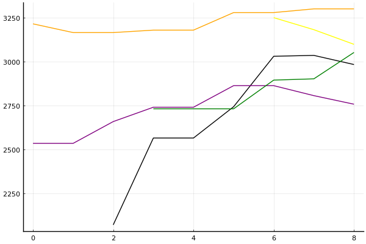

2021 시즌 1 개인전 32강 D조

### 선수

박도현
배성빈
김준휘
이은서
임재원
박현수
김태준
유창현

### 경기 시뮬레이션

| 순위 | 박도현 | 배성빈 | 김준휘 | 이은서 | 임재원 | 박현수 | 김태준 | 유창현 |
|:---:|---:|---:|---:|---:|---:|---:|---:|---:|
| 1위 | 0.143 | 0.050 | 0.068 | 0.000 | 0.003 | 0.098 | 0.069 | 0.596 |
| 2위 | 0.260 | 0.129 | 0.096 | 0.001 | 0.020 | 0.203 | 0.097 | 0.230 |
| 3위 | 0.224 | 0.188 | 0.116 | 0.006 | 0.053 | 0.224 | 0.114 | 0.100 |
| 4위 | 0.172 | 0.210 | 0.133 | 0.016 | 0.091 | 0.198 | 0.131 | 0.048 |
| 5위 | 0.113 | 0.201 | 0.157 | 0.042 | 0.164 | 0.143 | 0.161 | 0.017 |
| 6위 | 0.062 | 0.135 | 0.168 | 0.103 | 0.246 | 0.089 | 0.172 | 0.008 |
| 7위 | 0.022 | 0.070 | 0.160 | 0.240 | 0.294 | 0.036 | 0.156 | 0.002 |
| 8위 | 0.004 | 0.018 | 0.102 | 0.591 | 0.128 | 0.008 | 0.101 | 0.000 |
| 진출 | 0.627 | 0.367 | 0.280 | 0.008 | 0.076 | 0.525 | 0.279 | 0.925 |
| 패부 | 0.284 | 0.410 | 0.289 | 0.058 | 0.255 | 0.341 | 0.292 | 0.065 |

### 전체 랭킹

x축: 시즌, y축: 점수
1번: 옐로우, 2번: 블랙, 3번: 레드, 4번: 화이트(회색), 5번: 퍼플, 6번: 그린, 7번: 블루, 8번: 오렌지

| 순위 | 이름 | 점수 | mu | sigma | 주행 | 8인전 1-2-Mid-Lo | 8인전 평균득점 | 8인전 표준편차 | 2인전 전적 |
|---:|:---:|---:|---:|---:|---:|:---:|---:|---:|:---:|
| 4 / 93 | [유창현](../yuchanghyeon) | 3300 | 3532 | 77 | 231 | 18-18-38-26 | 4.60 | 3.50 | 2-4 |
| 9 / 93 | [박도현](../bakdohyeon) | 3098 | 3330 | 77 | 116 | 12-19-41-28 | 4.25 | 3.31 | 1-3 |
| 11 / 93 | [박현수](../bakhyeonsu) | 3052 | 3283 | 77 | 127 | 11-12-43-34 | 3.56 | 3.47 | 0-1 |
| 18 / 93 | [배성빈](../baeseongbin) | 2983 | 3212 | 76 | 160 | 12-9-42-37 | 3.42 | 3.41 | 0-0 |
| 36 / 93 | [임재원](../imjaewon) | 2757 | 2991 | 78 | 111 | 4-13-40-44 | 2.85 | 3.03 | 0-0 |
| 71 / 93 | [이은서](../ieunseo) | 2170 | 2750 | 193 | 9 | 0-0-33-67 | 1.33 | 2.12 | 0-0 |
| NaN / 93 | [김준휘](../gimjunhui) | 0 | 3000 | 1000 | 0 | 0-0-0-0 | 0.00 | 0.00 | 0-0 |
| NaN / 93 | [김태준](../gimtaijun) | 0 | 3000 | 1000 | 0 | 0-0-0-0 | 0.00 | 0.00 | 0-0 |

### 시즌 랭킹

#### [2020 시즌 2](../singles-s2020_2)

| 순위 | 이름 | 점수 | mu | sigma | 주행 | 8인전 1-2-Mid-Lo | 8인전 평균득점 | 8인전 표준편차 | 2인전 전적 |
|---:|:---:|---:|---:|---:|---:|:---:|---:|---:|:---:|
| 5 / 32 | [박현수](../bakhyeonsu) | 3137 | 3437 | 100 | 39 | 13-21-38-28 | 4.15 | 3.57 | 0-0 |
| 15 / 32 | [배성빈](../baeseongbin) | 2722 | 3072 | 117 | 28 | 18-4-32-46 | 3.39 | 3.77 | 0-0 |
| 17 / 32 | [박도현](../bakdohyeon) | 2587 | 3037 | 150 | 16 | 6-6-62-25 | 3.38 | 2.85 | 0-0 |
| 24 / 32 | [이은서](../ieunseo) | 2039 | 2659 | 207 | 9 | 0-0-33-67 | 1.33 | 2.12 | 0-0 |
| 31 / 32 | [임재원](../imjaewon) | 1917 | 2542 | 208 | 9 | 0-11-11-78 | 1.33 | 2.45 | 0-0 |
| NaN / 32 | [김준휘](../gimjunhui) | 0 | 3000 | 1000 | 0 | 0-0-0-0 | 0.00 | 0.00 | 0-0 |
| NaN / 32 | [김태준](../gimtaijun) | 0 | 3000 | 1000 | 0 | 0-0-0-0 | 0.00 | 0.00 | 0-0 |
| NaN / 32 | [유창현](../yuchanghyeon) | 0 | 3000 | 1000 | 0 | 0-0-0-0 | 0.00 | 0.00 | 0-0 |

#### [2020 시즌 1](../singles-s2020_1)

| 순위 | 이름 | 점수 | mu | sigma | 주행 | 8인전 1-2-Mid-Lo | 8인전 평균득점 | 8인전 표준편차 | 2인전 전적 |
|---:|:---:|---:|---:|---:|---:|:---:|---:|---:|:---:|
| 3 / 32 | [유창현](../yuchanghyeon) | 3170 | 3456 | 95 | 48 | 5-23-58-14 | 4.47 | 2.54 | 2-3 |
| 7 / 32 | [박도현](../bakdohyeon) | 2964 | 3246 | 94 | 47 | 13-21-34-32 | 4.09 | 3.51 | 0-0 |
| 11 / 32 | [배성빈](../baeseongbin) | 2813 | 3123 | 103 | 37 | 16-3-43-38 | 3.35 | 3.68 | 0-0 |
| 22 / 32 | [박현수](../bakhyeonsu) | 2277 | 2871 | 198 | 10 | 11-0-56-33 | 3.22 | 3.38 | 0-1 |
| 29 / 32 | [임재원](../imjaewon) | 1964 | 2568 | 202 | 10 | 0-0-40-60 | 1.30 | 2.45 | 0-0 |
| NaN / 32 | [김준휘](../gimjunhui) | 0 | 3000 | 1000 | 0 | 0-0-0-0 | 0.00 | 0.00 | 0-0 |
| NaN / 32 | [이은서](../ieunseo) | 0 | 3000 | 1000 | 0 | 0-0-0-0 | 0.00 | 0.00 | 0-0 |
| NaN / 32 | [김태준](../gimtaijun) | 0 | 3000 | 1000 | 0 | 0-0-0-0 | 0.00 | 0.00 | 0-0 |

#### [2019 시즌 2](../singles-s2019_2)

| 순위 | 이름 | 점수 | mu | sigma | 주행 | 8인전 1-2-Mid-Lo | 8인전 평균득점 | 8인전 표준편차 | 2인전 전적 |
|---:|:---:|---:|---:|---:|---:|:---:|---:|---:|:---:|
| 3 / 32 | [박도현](../bakdohyeon) | 3198 | 3475 | 92 | 53 | 14-20-41-24 | 4.69 | 3.24 | 1-3 |
| 7 / 32 | [배성빈](../baeseongbin) | 3013 | 3275 | 87 | 59 | 12-17-41-31 | 3.93 | 3.49 | 0-0 |
| 10 / 32 | [박현수](../bakhyeonsu) | 2887 | 3177 | 97 | 43 | 12-9-44-35 | 3.60 | 3.31 | 0-0 |
| NaN / 32 | [김준휘](../gimjunhui) | 0 | 3000 | 1000 | 0 | 0-0-0-0 | 0.00 | 0.00 | 0-0 |
| NaN / 32 | [이은서](../ieunseo) | 0 | 3000 | 1000 | 0 | 0-0-0-0 | 0.00 | 0.00 | 0-0 |
| NaN / 32 | [임재원](../imjaewon) | 0 | 3000 | 1000 | 0 | 0-0-0-0 | 0.00 | 0.00 | 0-0 |
| NaN / 32 | [김태준](../gimtaijun) | 0 | 3000 | 1000 | 0 | 0-0-0-0 | 0.00 | 0.00 | 0-0 |
| NaN / 32 | [유창현](../yuchanghyeon) | 0 | 3000 | 1000 | 0 | 0-0-0-0 | 0.00 | 0.00 | 0-0 |

#### [2019 시즌 1](../singles-s2019_1)

| 순위 | 이름 | 점수 | mu | sigma | 주행 | 8인전 1-2-Mid-Lo | 8인전 평균득점 | 8인전 표준편차 | 2인전 전적 |
|---:|:---:|---:|---:|---:|---:|:---:|---:|---:|:---:|
| 3 / 32 | [유창현](../yuchanghyeon) | 3267 | 3546 | 93 | 52 | 33-17-23-27 | 5.40 | 4.01 | 0-0 |
| 11 / 32 | [임재원](../imjaewon) | 2783 | 3071 | 96 | 42 | 5-12-45-38 | 3.26 | 2.71 | 0-0 |
| 15 / 32 | [배성빈](../baeseongbin) | 2539 | 2935 | 132 | 21 | 5-5-52-38 | 2.90 | 2.90 | 0-0 |
| NaN / 32 | [박도현](../bakdohyeon) | 0 | 3000 | 1000 | 0 | 0-0-0-0 | 0.00 | 0.00 | 0-0 |
| NaN / 32 | [김준휘](../gimjunhui) | 0 | 3000 | 1000 | 0 | 0-0-0-0 | 0.00 | 0.00 | 0-0 |
| NaN / 32 | [이은서](../ieunseo) | 0 | 3000 | 1000 | 0 | 0-0-0-0 | 0.00 | 0.00 | 0-0 |
| NaN / 32 | [박현수](../bakhyeonsu) | 0 | 3000 | 1000 | 0 | 0-0-0-0 | 0.00 | 0.00 | 0-0 |
| NaN / 32 | [김태준](../gimtaijun) | 0 | 3000 | 1000 | 0 | 0-0-0-0 | 0.00 | 0.00 | 0-0 |

#### [2018 듀얼 레이스 3](../singles-s2018_1)

| 순위 | 이름 | 점수 | mu | sigma | 주행 | 8인전 1-2-Mid-Lo | 8인전 평균득점 | 8인전 표준편차 | 2인전 전적 |
|---:|:---:|---:|---:|---:|---:|:---:|---:|---:|:---:|
| 6 / 32 | [유창현](../yuchanghyeon) | 3099 | 3372 | 91 | 52 | 15-12-42-31 | 4.17 | 3.44 | 0-0 |
| 14 / 32 | [박현수](../bakhyeonsu) | 2657 | 2977 | 107 | 35 | 9-9-43-40 | 2.91 | 3.58 | 0-0 |
| 16 / 32 | [임재원](../imjaewon) | 2561 | 3012 | 150 | 16 | 0-25-38-38 | 3.44 | 3.01 | 0-0 |
| 21 / 32 | [배성빈](../baeseongbin) | 2303 | 2939 | 212 | 8 | 0-12-50-38 | 2.88 | 2.23 | 0-0 |
| NaN / 32 | [박도현](../bakdohyeon) | 0 | 3000 | 1000 | 0 | 0-0-0-0 | 0.00 | 0.00 | 0-0 |
| NaN / 32 | [김준휘](../gimjunhui) | 0 | 3000 | 1000 | 0 | 0-0-0-0 | 0.00 | 0.00 | 0-0 |
| NaN / 32 | [이은서](../ieunseo) | 0 | 3000 | 1000 | 0 | 0-0-0-0 | 0.00 | 0.00 | 0-0 |
| NaN / 32 | [김태준](../gimtaijun) | 0 | 3000 | 1000 | 0 | 0-0-0-0 | 0.00 | 0.00 | 0-0 |

#### [2017 Kespa Cup](../singles-s2017_2)

| 순위 | 이름 | 점수 | mu | sigma | 주행 | 8인전 1-2-Mid-Lo | 8인전 평균득점 | 8인전 표준편차 | 2인전 전적 |
|---:|:---:|---:|---:|---:|---:|:---:|---:|---:|:---:|
| 15 / 32 | [임재원](../imjaewon) | 2652 | 3023 | 124 | 25 | 4-8-44-44 | 2.40 | 3.48 | 0-0 |
| 23 / 32 | [배성빈](../baeseongbin) | 1981 | 2705 | 241 | 7 | 0-0-57-43 | 1.86 | 2.19 | 0-0 |
| NaN / 32 | [박도현](../bakdohyeon) | 0 | 3000 | 1000 | 0 | 0-0-0-0 | 0.00 | 0.00 | 0-0 |
| NaN / 32 | [김준휘](../gimjunhui) | 0 | 3000 | 1000 | 0 | 0-0-0-0 | 0.00 | 0.00 | 0-0 |
| NaN / 32 | [이은서](../ieunseo) | 0 | 3000 | 1000 | 0 | 0-0-0-0 | 0.00 | 0.00 | 0-0 |
| NaN / 32 | [박현수](../bakhyeonsu) | 0 | 3000 | 1000 | 0 | 0-0-0-0 | 0.00 | 0.00 | 0-0 |
| NaN / 32 | [김태준](../gimtaijun) | 0 | 3000 | 1000 | 0 | 0-0-0-0 | 0.00 | 0.00 | 0-0 |
| NaN / 32 | [유창현](../yuchanghyeon) | 0 | 3000 | 1000 | 0 | 0-0-0-0 | 0.00 | 0.00 | 0-0 |

#### [2017 듀얼 레이스 2](../singles-s2017_1)

| 순위 | 이름 | 점수 | mu | sigma | 주행 | 8인전 1-2-Mid-Lo | 8인전 평균득점 | 8인전 표준편차 | 2인전 전적 |
|---:|:---:|---:|---:|---:|---:|:---:|---:|---:|:---:|
| 5 / 16 | [유창현](../yuchanghyeon) | 2796 | 3084 | 96 | 49 | 10-23-19-48 | 3.29 | 3.68 | 0-1 |
| NaN / 16 | [박도현](../bakdohyeon) | 0 | 3000 | 1000 | 0 | 0-0-0-0 | 0.00 | 0.00 | 0-0 |
| NaN / 16 | [배성빈](../baeseongbin) | 0 | 3000 | 1000 | 0 | 0-0-0-0 | 0.00 | 0.00 | 0-0 |
| NaN / 16 | [김준휘](../gimjunhui) | 0 | 3000 | 1000 | 0 | 0-0-0-0 | 0.00 | 0.00 | 0-0 |
| NaN / 16 | [이은서](../ieunseo) | 0 | 3000 | 1000 | 0 | 0-0-0-0 | 0.00 | 0.00 | 0-0 |
| NaN / 16 | [임재원](../imjaewon) | 0 | 3000 | 1000 | 0 | 0-0-0-0 | 0.00 | 0.00 | 0-0 |
| NaN / 16 | [박현수](../bakhyeonsu) | 0 | 3000 | 1000 | 0 | 0-0-0-0 | 0.00 | 0.00 | 0-0 |
| NaN / 16 | [김태준](../gimtaijun) | 0 | 3000 | 1000 | 0 | 0-0-0-0 | 0.00 | 0.00 | 0-0 |

#### [2016 듀얼 레이스](../singles-s2016_1)

| 순위 | 이름 | 점수 | mu | sigma | 주행 | 8인전 1-2-Mid-Lo | 8인전 평균득점 | 8인전 표준편차 | 2인전 전적 |
|---:|:---:|---:|---:|---:|---:|:---:|---:|---:|:---:|
| 2 / 32 | [유창현](../yuchanghyeon) | 3215 | 3566 | 117 | 30 | 27-18-50-5 | 5.82 | 3.13 | 0-0 |
| 13 / 32 | [임재원](../imjaewon) | 2534 | 3148 | 205 | 9 | 11-22-33-33 | 4.33 | 3.50 | 0-0 |
| NaN / 32 | [박도현](../bakdohyeon) | 0 | 3000 | 1000 | 0 | 0-0-0-0 | 0.00 | 0.00 | 0-0 |
| NaN / 32 | [배성빈](../baeseongbin) | 0 | 3000 | 1000 | 0 | 0-0-0-0 | 0.00 | 0.00 | 0-0 |
| NaN / 32 | [김준휘](../gimjunhui) | 0 | 3000 | 1000 | 0 | 0-0-0-0 | 0.00 | 0.00 | 0-0 |
| NaN / 32 | [이은서](../ieunseo) | 0 | 3000 | 1000 | 0 | 0-0-0-0 | 0.00 | 0.00 | 0-0 |
| NaN / 32 | [박현수](../bakhyeonsu) | 0 | 3000 | 1000 | 0 | 0-0-0-0 | 0.00 | 0.00 | 0-0 |
| NaN / 32 | [김태준](../gimtaijun) | 0 | 3000 | 1000 | 0 | 0-0-0-0 | 0.00 | 0.00 | 0-0 |

### 트랙 랭킹

#### [월드 이탈리아 피사의 사탑](../pizza)

| 순위 | 이름 | 점수 | mu | sigma | 주행 | 8인전 1-2-Mid-Lo | 8인전 평균득점 | 8인전 표준편차 | 2인전 전적 |
|---:|:---:|---:|---:|---:|---:|:---:|---:|---:|:---:|
| 2 / 32 | [박도현](../bakdohyeon) | 3019 | 3803 | 261 | 6 | 0-67-33-0 | 6.00 | 1.67 | 0-0 |
| 5 / 32 | [배성빈](../baeseongbin) | 2589 | 3285 | 232 | 7 | 0-29-29-43 | 3.29 | 3.09 | 0-0 |
| 12 / 32 | [박현수](../bakhyeonsu) | 2325 | 3162 | 279 | 5 | 0-20-40-40 | 3.00 | 3.16 | 0-0 |
| NaN / 32 | [김준휘](../gimjunhui) | 0 | 3000 | 1000 | 0 | 0-0-0-0 | 0.00 | 0.00 | 0-0 |
| NaN / 32 | [이은서](../ieunseo) | 0 | 3000 | 1000 | 0 | 0-0-0-0 | 0.00 | 0.00 | 0-0 |
| NaN / 32 | [임재원](../imjaewon) | 0 | 3000 | 1000 | 0 | 0-0-0-0 | 0.00 | 0.00 | 0-0 |
| NaN / 32 | [김태준](../gimtaijun) | 0 | 3000 | 1000 | 0 | 0-0-0-0 | 0.00 | 0.00 | 0-0 |
| NaN / 32 | [유창현](../yuchanghyeon) | 0 | 3000 | 1000 | 0 | 0-0-0-0 | 0.00 | 0.00 | 0-0 |

#### [노르테유 익스프레스](../noex)

| 순위 | 이름 | 점수 | mu | sigma | 주행 | 8인전 1-2-Mid-Lo | 8인전 평균득점 | 8인전 표준편차 | 2인전 전적 |
|---:|:---:|---:|---:|---:|---:|:---:|---:|---:|:---:|
| 5 / 68 | [유창현](../yuchanghyeon) | 3215 | 3760 | 182 | 12 | 33-8-33-25 | 5.25 | 3.93 | 0-0 |
| 19 / 68 | [임재원](../imjaewon) | 2265 | 2910 | 215 | 9 | 0-11-33-56 | 2.11 | 2.80 | 0-0 |
| 21 / 68 | [박현수](../bakhyeonsu) | 2216 | 3241 | 342 | 3 | 0-33-33-33 | 3.33 | 3.51 | 0-0 |
| 28 / 68 | [배성빈](../baeseongbin) | 1830 | 2860 | 343 | 3 | 0-0-67-33 | 2.33 | 1.15 | 0-0 |
| NaN / 68 | [박도현](../bakdohyeon) | 0 | 3000 | 1000 | 0 | 0-0-0-0 | 0.00 | 0.00 | 0-0 |
| NaN / 68 | [김준휘](../gimjunhui) | 0 | 3000 | 1000 | 0 | 0-0-0-0 | 0.00 | 0.00 | 0-0 |
| NaN / 68 | [이은서](../ieunseo) | 0 | 3000 | 1000 | 0 | 0-0-0-0 | 0.00 | 0.00 | 0-0 |
| NaN / 68 | [김태준](../gimtaijun) | 0 | 3000 | 1000 | 0 | 0-0-0-0 | 0.00 | 0.00 | 0-0 |

#### [광산 위험한 제련소](../jeryeonso)

| 순위 | 이름 | 점수 | mu | sigma | 주행 | 8인전 1-2-Mid-Lo | 8인전 평균득점 | 8인전 표준편차 | 2인전 전적 |
|---:|:---:|---:|---:|---:|---:|:---:|---:|---:|:---:|
| 7 / 57 | [유창현](../yuchanghyeon) | 2820 | 3564 | 248 | 6 | 17-17-50-17 | 4.83 | 3.25 | 0-0 |
| 11 / 57 | [임재원](../imjaewon) | 2612 | 3570 | 319 | 4 | 0-50-50-0 | 5.75 | 1.50 | 0-0 |
| 15 / 57 | [배성빈](../baeseongbin) | 2480 | 3304 | 274 | 5 | 20-0-80-0 | 5.00 | 2.83 | 0-0 |
| 23 / 57 | [박현수](../bakhyeonsu) | 2093 | 2830 | 246 | 7 | 14-0-29-57 | 1.86 | 4.78 | 0-0 |
| 42 / 57 | [박도현](../bakdohyeon) | 1215 | 2551 | 445 | 2 | 0-0-50-50 | 1.00 | 2.83 | 0-0 |
| 49 / 57 | [이은서](../ieunseo) | 597 | 2356 | 586 | 1 | 0-0-0-100 | 0.00 | 0.00 | 0-0 |
| NaN / 57 | [김준휘](../gimjunhui) | 0 | 3000 | 1000 | 0 | 0-0-0-0 | 0.00 | 0.00 | 0-0 |
| NaN / 57 | [김태준](../gimtaijun) | 0 | 3000 | 1000 | 0 | 0-0-0-0 | 0.00 | 0.00 | 0-0 |

#### [공동묘지 해골 손가락](../haeson)

| 순위 | 이름 | 점수 | mu | sigma | 주행 | 8인전 1-2-Mid-Lo | 8인전 평균득점 | 8인전 표준편차 | 2인전 전적 |
|---:|:---:|---:|---:|---:|---:|:---:|---:|---:|:---:|
| 8 / 46 | [배성빈](../baeseongbin) | 2622 | 3451 | 276 | 5 | 0-40-40-20 | 4.20 | 3.35 | 0-0 |
| 12 / 46 | [박현수](../bakhyeonsu) | 2469 | 3214 | 248 | 6 | 0-17-50-33 | 3.33 | 2.58 | 0-0 |
| 15 / 46 | [박도현](../bakdohyeon) | 2221 | 3291 | 357 | 3 | 0-0-50-50 | 3.00 | 2.83 | 0-0 |
| 21 / 46 | [유창현](../yuchanghyeon) | 1986 | 2889 | 301 | 4 | 0-0-25-75 | 1.00 | 1.41 | 0-0 |
| 28 / 46 | [임재원](../imjaewon) | 1591 | 2628 | 346 | 4 | 0-25-0-75 | 1.75 | 3.59 | 0-0 |
| NaN / 46 | [김준휘](../gimjunhui) | 0 | 3000 | 1000 | 0 | 0-0-0-0 | 0.00 | 0.00 | 0-0 |
| NaN / 46 | [이은서](../ieunseo) | 0 | 3000 | 1000 | 0 | 0-0-0-0 | 0.00 | 0.00 | 0-0 |
| NaN / 46 | [김태준](../gimtaijun) | 0 | 3000 | 1000 | 0 | 0-0-0-0 | 0.00 | 0.00 | 0-0 |

### 상대전적

경기 별: 

| 선수 | __박도현__ | __배성빈__ | __김준휘__ | __이은서__ | __임재원__ | __박현수__ | __김태준__ | __유창현__ |
|:---:|:---:|:---:|:---:|:---:|:---:|:---:|:---:|:---:|
| __박도현__ | - | 6-0 | 0-0 | 0-0 | 1-0 | 1-0 | 0-0 | 0-1 |
| __배성빈__ | 0-6 | - | 0-0 | 0-0 | 1-1 | 4-2 | 0-0 | 1-3 |
| __김준휘__ | 0-0 | 0-0 | - | 0-0 | 0-0 | 0-0 | 0-0 | 0-0 |
| __이은서__ | 0-0 | 0-0 | 0-0 | - | 0-0 | 0-0 | 0-0 | 0-0 |
| __임재원__ | 0-1 | 1-1 | 0-0 | 0-0 | - | 0-1 | 0-0 | 0-4 |
| __박현수__ | 0-1 | 2-4 | 0-0 | 0-0 | 1-0 | - | 0-0 | 0-3 |
| __김태준__ | 0-0 | 0-0 | 0-0 | 0-0 | 0-0 | 0-0 | - | 0-0 |
| __유창현__ | 1-0 | 3-1 | 0-0 | 0-0 | 4-0 | 3-0 | 0-0 | - |

| 선수 | __박도현__ | __배성빈__ | __김준휘__ | __이은서__ | __임재원__ | __박현수__ | __김태준__ | __유창현__ |
|:---:|:---:|:---:|:---:|:---:|:---:|:---:|:---:|:---:|
| __박도현__ | - | 1.000 | NaN | NaN | 1.000 | 1.000 | NaN | 0.000 |
| __배성빈__ | 0.000 | - | NaN | NaN | 0.500 | 0.667 | NaN | 0.250 |
| __김준휘__ | NaN | NaN | - | NaN | NaN | NaN | NaN | NaN |
| __이은서__ | NaN | NaN | NaN | - | NaN | NaN | NaN | NaN |
| __임재원__ | 0.000 | 0.500 | NaN | NaN | - | 0.000 | NaN | 0.000 |
| __박현수__ | 0.000 | 0.333 | NaN | NaN | 1.000 | - | NaN | 0.000 |
| __김태준__ | NaN | NaN | NaN | NaN | NaN | NaN | - | NaN |
| __유창현__ | 1.000 | 0.750 | NaN | NaN | 1.000 | 1.000 | NaN | - |

트랙 별: 

| 선수 | __박도현__ | __배성빈__ | __김준휘__ | __이은서__ | __임재원__ | __박현수__ | __김태준__ | __유창현__ |
|:---:|:---:|:---:|:---:|:---:|:---:|:---:|:---:|:---:|
| __박도현__ | - | 34-24 | 0-0 | 0-0 | 8-2 | 6-1 | 0-0 | 4-5 |
| __배성빈__ | 24-34 | - | 0-0 | 0-0 | 6-8 | 25-27 | 0-0 | 11-24 |
| __김준휘__ | 0-0 | 0-0 | - | 0-0 | 0-0 | 0-0 | 0-0 | 0-0 |
| __이은서__ | 0-0 | 0-0 | 0-0 | - | 0-0 | 0-0 | 0-0 | 0-0 |
| __임재원__ | 2-8 | 8-6 | 0-0 | 0-0 | - | 6-4 | 0-0 | 12-26 |
| __박현수__ | 1-6 | 27-25 | 0-0 | 0-0 | 4-6 | - | 0-0 | 8-18 |
| __김태준__ | 0-0 | 0-0 | 0-0 | 0-0 | 0-0 | 0-0 | - | 0-0 |
| __유창현__ | 5-4 | 24-11 | 0-0 | 0-0 | 26-12 | 18-8 | 0-0 | - |

| 선수 | __박도현__ | __배성빈__ | __김준휘__ | __이은서__ | __임재원__ | __박현수__ | __김태준__ | __유창현__ |
|:---:|:---:|:---:|:---:|:---:|:---:|:---:|:---:|:---:|
| __박도현__ | - | 0.586 | NaN | NaN | 0.800 | 0.857 | NaN | 0.444 |
| __배성빈__ | 0.414 | - | NaN | NaN | 0.429 | 0.481 | NaN | 0.314 |
| __김준휘__ | NaN | NaN | - | NaN | NaN | NaN | NaN | NaN |
| __이은서__ | NaN | NaN | NaN | - | NaN | NaN | NaN | NaN |
| __임재원__ | 0.200 | 0.571 | NaN | NaN | - | 0.600 | NaN | 0.316 |
| __박현수__ | 0.143 | 0.519 | NaN | NaN | 0.400 | - | NaN | 0.308 |
| __김태준__ | NaN | NaN | NaN | NaN | NaN | NaN | - | NaN |
| __유창현__ | 0.556 | 0.686 | NaN | NaN | 0.684 | 0.692 | NaN | - |
