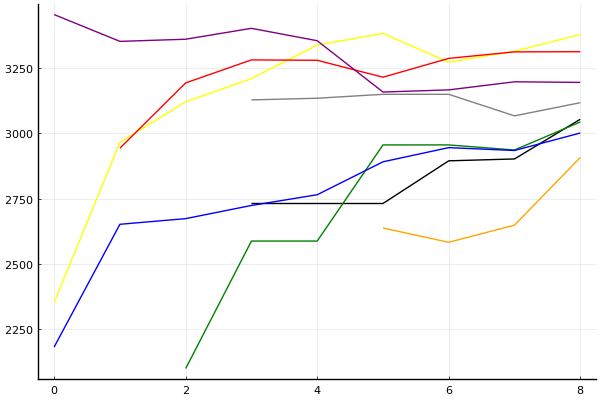
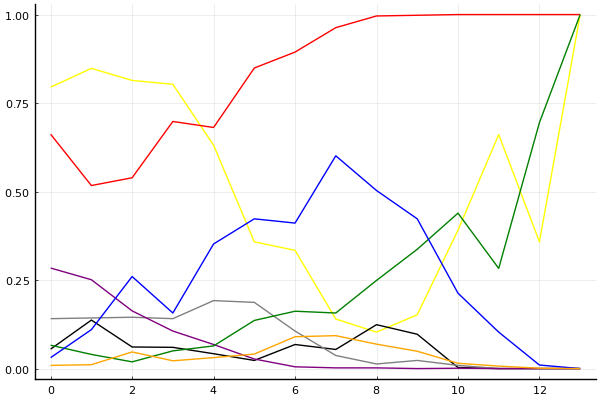

[팀전 포스트시즌 방식의 발상지](../season-design-2)! 카트리그 전적/랭킹 블로그 (ver. 1.0). 
__최종 업데이트: 2020-12-20__

## 주요 랭킹
- [팀전 - 최신 팀 파워랭킹](../power-ranking-20201108)
- [팀전 - 전체 트랙](../team-full)
- [팀전 - 스피드](../team-speed)
- [팀전 - 아이템](../team-item)
- [팀전 - 에이스 결정전](../team-ace)
- [개인전 - 종합](../singles-full)

## 참고 자료
- 2020-7-13: [개인전 점수-진출확률 변환표](../conversion)

## 사설 
- 2020-12-20: [2021 시즌 1 오프시즌](../offseason-2021-1)
- 2020-10-12: [사설 - 풀리그 방식에서의 에이스 결정전. 다승제는 과연 올바른가](../ace-in-round-robin)
- 2020-7-4: [사설 - 타이브레이커](../tiebreakers)
- 2020-6-26: [사설 - 밴픽](../ban-pick)
- 2020-5-26: [사설 - 개인전 50점/80점 선취제에 필요한 최대 트랙의 수는?](../track-optim)
- 2020-5-24: [2020 시즌 1 마무리 - 그동안 있었던 일](../season-wrapup-2020-1)
- 2020-5-19: [사설 - 내 맘대로 짜보는 리그 3 - 개인전](../season-design-3)
- 2020-5-17: [사설 - 내 맘대로 짜보는 리그 2 - 팀전](../season-design-2)
- 2020-5-13: [사설 - 내 맘대로 짜보는 리그 1](../season-design-1)
- 2020-3-1: [사설 - 2월 22일자 개인전 TMI 승부 예측](../editorial-tmi-0222)
- 2020-1-25: [사설 - 잡다한 생각들](../thoughts)
- 2020-1-17: [사설 - TMI 승부 예측](../editorial-tmi)

## 시즌
- [2020 시즌 2](../2020-2)
- [2020 시즌 1](../2020-1)

 

## 분석 방법

[TrueSkill](https://trueskill.org/). 이 방법은 Microsoft Research에서 개발한 방법으로 각 선수의 기량을 두 개의 숫자, 평균 mu(추정된 기량의 위치), 표준편차 sigma(추정된 기량의 불확실성)로 나타내고 베이지안 추론을 통해 추정된 mu와 sigma에 기반하여 순위를 매긴다. 
선수들이 경기를 많이 할수록 일반적으로 선수의 기량을 좀 더 정확히 추정할 수 있을테니 mu는 점점 제자리를 찾아가고, sigma는 점점 줄어들게 된다. 
이 블로그의 모든 분석에서 각 선수는 mu=3000, sigma=1000로 시작. 팀전 랭킹의 mu는 네 명의 mu 합산을 기준으로, sigma는 네 명의 sigma 제곱의 합의 제곱근을 기준으로 계산. 종합 랭킹의 경우 스피드전 또는 아이템전만 참가하는 선수는 1/2명으로 계산하여 이에 맞게 계산식을 적절히 변형함.  

분석의 단위:

- 개인전: 각 트랙의 순위.
- 팀전: 각 트랙의 승패. 이에 따라 기존에 문호준 선수보다 더 성적이 좋은 팀에 있었던 최영훈 선수가 더 높은 순위를 가짐.

[조금 더 자세한 설명 보러가기](../about)

### 순위표
선수들의 순위를 나타낼 때는 mu를 그대로 쓰는 대신 실력을 *보수적으로* 추정하는 값인 mu - k sigma 를 사용한다. k가 클수록 각 선수의 실력이 mu - k sigma 보다 클 확률이 매우 높아진다는 의미에서. 주로 쓰이는 k값은 3이고, 정규분포의 특성에 의해 선수의 실력이 그 값보다 높을 확률은 99% 이상이 된다. 여기에서도 k=3을 사용.

예를 들어, 2020년 1월 1일 시점 박도현의 추정된 mu는 이재혁의 그것보다 높지만 박도현이 지금까지 치른 경기 수가 적어 불확실성 sigma 크기 때문에 그만큼 점수를 깎으므로 박도현이 이재혁보다 밑에 있게 된다.

### 데이터
분석에 사용된 데이터는 [여기](https://github.com/KartRanking/KartRanking/tree/master/dat)에 공개되어 있음.

2015년 카트라이더 리그 에볼루션 이후 모든 팀전, 개인전 TV 방송 경기. 8인전, 7인전, 4인전, 2인전 모두 포함 (2017 케스파 컵과 듀얼레이스 X 포함, 티밍이 있었던 글로벌 슈퍼매치 제외)

## [팀전](../team-power-ranking)

### 순위표

| 순위 | 팀 | 경기 수 | 승 | 패 | 세트 득실 | 트랙 득실 | 승점 |
|---:|---:|---:|---:|---:|---:|---:|---:|
| 1 | SB | 7 | 6 | 1 | 10 | 28 | 18 |
| 2 | ROX | 7 | 6 | 1 | 9 | 22 | 17 |
| 3 | HLE | 7 | 5 | 2 | 5 | 9 | 14 |
| 4 | EST | 7 | 4 | 3 | 2 | 5 | 12 |
| 5 | AF | 7 | 4 | 3 | 2 | 5 | 12 |
| 6 | SGA | 7 | 2 | 5 | -4 | -11 | 8 |
| 7 | STL | 7 | 1 | 6 | -10 | -21 | 3 |
| 8 | MT | 7 | 0 | 7 | -14 | -37 | 0 |

* 순위 산정 기준: 승수-세트 득실-트랙 득실-승자승 순. EST의 승자승 우위로 4위.
* 경기수가 다른 팀들의 경우 승패차-승률-세트 득실-트랙 득실-승자승 순으로 순위 결정([9월 5일 방송 도입부](https://youtu.be/1rHcBg_H5Jk?t=155)). [3팀 이상 동률의 처리 규정에 대해서는 알려지지 않음](../tiebreakers).
* 승점: 공식 기록 아님, 2-0 승 3점, 2-1 승 2점, 1-2 패 1점, 0-2 패 0점. 

### 포스트시즌 업데이트

| 날짜 | 경기 | 레드 | 블루 | 
|:---:|:---:|:---:|:---:|
| 10/17 | WC | EST | __AF__ |
| 10/21 | 준PO | __HLE__ | AF |
| 10/24 | 결승진출전 | SB | __ROX__ |
| 11/7 | PO | SB | __HLE__ |
| 11/8 | 결승전 | ROX | __HLE__ |

- 2020-10-05: [김대겸 해설위원 유튜브](https://youtu.be/Df3vo0ENzYk?t=186)를 통해 포스트시즌에서는 8강 풀리그 상위팀에게 밴픽 어드밴티지 있음이 공개됨. 
- 2020-10-14: 김대겸 해설위원 방송을 통해 포스트시즌 밴픽 방식 공개. 
    - 스피드전 아이템전 모두 동일한 방식. 레드: 상위 진출팀, 블루: 하위 진출팀.
    - 결승전의 경우 밴픽 어드밴티지는 결승 진출전 승자가 받는 것으로 변경됨. 

    1. 트랙 1은 고정.
    2. 레드 픽 (트랙 2)
    3. 블루 밴
    4. 레드 밴
    5. 블루 픽 (트랙 3)
    6. 레드 픽 (트랙 4)
    7. 블루 픽 (트랙 5)
    8. 레드 픽 (트랙 6)
    9. 블루 픽 (트랙 7)
   

### 리뷰: [플레이오프](../t2020-2-4-1)

<!--
#### Video
<iframe
src="https://www.youtube.com/embed/Hfg1tYuBCAk" width="640" height="360" frameborder="0" scrolling="no" allowfullscreen>
</iframe>
<iframe 
src="https://www.youtube.com/embed/6-ivHY4lXzM" width="640" height="360" frameborder="0" scrolling="no" allowfullscreen>
</iframe>
-->

#### 전체

| 순위 | 팀 | 점수 | 변동 | mu | 변동 | sigma | 변동 |
|---:|---:|---:|---:|---:|---:|---:|---:|
| 1 | ROX | 12535 | +0 | 13392 | +0 | 286 | +0 |
| 2 | SB | 12192 | +28 | 13061 | +19 | 290 | -3 |
| 3 | HLE | 12093 | -10 | 12898 | -17 | 268 | -2 |
| 4 | AF | 11882 | +0 | 12813 | +0 | 310 | +0 |
| 5 | EST | 11293 | +0 | 12318 | +0 | 342 | +0 |
| 6 | SGA | 10823 | +0 | 11916 | +0 | 364 | +0 |
| 7 | STL | 9250 | +0 | 10972 | +0 | 574 | +0 |
| 8 | MT | 7957 | +0 | 10506 | +0 | 850 | +0 |

#### 스피드전

| 순위 | 팀 | 점수 | 변동 | mu | 변동 | sigma | 변동 |
|---:|---:|---:|---:|---:|---:|---:|---:|
| 1 | SB | 12400 | +309 | 13500 | +293 | 367 | -5 |
| 2 | ROX | 12334 | +0 | 13560 | +0 | 409 | +0 |
| 3 | HLE | 12135 | -249 | 13175 | -261 | 346 | -4 |
| 4 | AF | 11794 | +0 | 13134 | +0 | 447 | +0 |
| 5 | SGA | 11149 | +0 | 12722 | +0 | 524 | +0 |
| 6 | EST | 11040 | +0 | 12580 | +0 | 513 | +0 |
| 7 | STL | 8271 | +0 | 11031 | +0 | 920 | +0 |
| 8 | MT | 4279 | +0 | 8491 | +0 | 1404 | +0 |

#### 아이템전

| 순위 | 팀 | 점수 | 변동 | mu | 변동 | sigma | 변동 |
|---:|---:|---:|---:|---:|---:|---:|---:|
| 1 | ROX | 12539 | +0 | 13688 | +0 | 383 | +0 |
| 2 | SB | 12168 | -220 | 13275 | -249 | 369 | -10 |
| 3 | HLE | 12030 | +253 | 13092 | +229 | 354 | -8 |
| 4 | AF | 11565 | +0 | 12883 | +0 | 439 | +0 |
| 5 | EST | 11077 | +0 | 12470 | +0 | 464 | +0 |
| 6 | SGA | 9712 | +0 | 11580 | +0 | 623 | +0 |
| 7 | STL | 8639 | +0 | 10824 | +0 | 728 | +0 |
| 8 | MT | 7955 | +0 | 10927 | +0 | 991 | +0 |

* Note: 전체 트랙 모형은 스피드전과 아이템전의 단순 합산이 아니라 별도의 모형임.

__[경기 결과, 개인 별 랭킹 변화 보기](../t2020-2-4-1)__

### 리뷰: [결승전](../t2020-2-5-1)

<!--
#### Video
<iframe
src="https://www.youtube.com/embed/Hfg1tYuBCAk" width="640" height="360" frameborder="0" scrolling="no" allowfullscreen>
</iframe>
<iframe 
src="https://www.youtube.com/embed/6-ivHY4lXzM" width="640" height="360" frameborder="0" scrolling="no" allowfullscreen>
</iframe>
-->

#### 전체

| 순위 | 팀 | 점수 | 변동 | mu | 변동 | sigma | 변동 |
|---:|---:|---:|---:|---:|---:|---:|---:|
| 1 | HLE | 12349 | +256 | 13149 | +251 | 267 | -2 |
| 2 | ROX | 12265 | -271 | 13111 | -281 | 282 | -3 |
| 3 | SB | 12192 | +0 | 13061 | +0 | 290 | +0 |
| 4 | AF | 11882 | +0 | 12813 | +0 | 310 | +0 |
| 5 | EST | 11293 | +0 | 12318 | +0 | 342 | +0 |
| 6 | SGA | 10823 | +0 | 11916 | +0 | 364 | +0 |
| 7 | STL | 9250 | +0 | 10972 | +0 | 574 | +0 |
| 8 | MT | 7957 | +0 | 10506 | +0 | 850 | +0 |

#### 스피드전

| 순위 | 팀 | 점수 | 변동 | mu | 변동 | sigma | 변동 |
|---:|---:|---:|---:|---:|---:|---:|---:|
| 1 | SB | 12400 | +0 | 13500 | +0 | 367 | +0 |
| 2 | HLE | 12374 | +239 | 13400 | +225 | 342 | -5 |
| 3 | ROX | 12057 | -277 | 13251 | -309 | 398 | -11 |
| 4 | AF | 11794 | +0 | 13134 | +0 | 447 | +0 |
| 5 | SGA | 11149 | +0 | 12722 | +0 | 524 | +0 |
| 6 | EST | 11040 | +0 | 12580 | +0 | 513 | +0 |
| 7 | STL | 8271 | +0 | 11031 | +0 | 920 | +0 |
| 8 | MT | 4279 | +0 | 8491 | +0 | 1404 | +0 |

#### 아이템전

| 순위 | 팀 | 점수 | 변동 | mu | 변동 | sigma | 변동 |
|---:|---:|---:|---:|---:|---:|---:|---:|
| 1 | ROX | 12306 | -233 | 13429 | -259 | 374 | -9 |
| 2 | HLE | 12272 | +242 | 13314 | +222 | 347 | -7 |
| 3 | SB | 12168 | +0 | 13275 | +0 | 369 | +0 |
| 4 | AF | 11565 | +0 | 12883 | +0 | 439 | +0 |
| 5 | EST | 11077 | +0 | 12470 | +0 | 464 | +0 |
| 6 | SGA | 9712 | +0 | 11580 | +0 | 623 | +0 |
| 7 | STL | 8639 | +0 | 10824 | +0 | 728 | +0 |
| 8 | MT | 7955 | +0 | 10927 | +0 | 991 | +0 |

* Note: 전체 트랙 모형은 스피드전과 아이템전의 단순 합산이 아니라 별도의 모형임.

__[경기 결과, 개인 별 랭킹 변화 보기](../t2020-2-5-1)__

## 개인전  

<!--
### 프리뷰: [개인전 결승전 1회전](../s2020-2-6-1-p)

#### 승부예측

| 순위 | 박인수 | 박현수 | 이재혁 | 정승하 | 유영혁 | 송용준 | 최영훈 | 김지민 |
|:---:|---:|---:|---:|---:|---:|---:|---:|---:|
| 1위 | 0.548 | 0.014 | 0.317 | 0.032 | 0.091 | 0.011 | 0.003 | 0.001 |
| 진출 | 0.807 | 0.067 | 0.651 | 0.133 | 0.287 | 0.058 | 0.027 | 0.009 |

#### 랭킹 히스토리

x축: 시즌, y축: 점수
1번: 옐로우, 2번: 블랙, 3번: 레드, 4번: 화이트(회색), 5번: 퍼플, 6번: 그린, 7번: 블루, 8번: 오렌지

__[더 보기...](../s2020-2-6-1-p)__
-->

### 리뷰: [개인전 결승 1회전](../s2020-2-6-1)

#### 경기 결과

| 트랙 | 박인수 | 박현수 | 이재혁 | 정승하 | 유영혁 | 송용준 | 최영훈 | 김지민 |
|:---|---:|---:|---:|---:|---:|---:|---:|---:|
| [카멜롯 펜드래건 캐슬](../pendragon) | 4 | 7 | -1 | 3 | 1 | 0 | 10 | 5 |
| [광산 위험한 제련소](../jeryeonso) | 4 | -1 | 5 | 3 | 1 | 0 | 10 | 7 |
| [동화 이상한 나라의 문](../gate) | 4 | 3 | 10 | 5 | 1 | 7 | -1 | 0 |
| [공동묘지 해골성 대탐험](../skullcastle) | -1 | 0 | 4 | 5 | 1 | 7 | 10 | 3 |
| [어비스 숨겨진 바닷길](../hiddenoceanroad) | 0 | 1 | 10 | 3 | -1 | 7 | 4 | 5 |
| [아이스 아찔한 헬기 점프](../heli) | 3 | 10 | 5 | 0 | -1 | 4 | 1 | 7 |
| [황금문명 오르에트 황금 좌표](../coordinate) | 0 | 3 | 10 | -1 | 1 | 5 | 7 | 4 |
| [[리버스] 해적 로비 절벽의 전투](../rlobby) | 5 | 7 | 10 | 1 | 3 | 4 | -1 | 0 |
| [대저택 은밀한 지하실](../jeotaek) | 7 | 1 | 10 | 5 | 4 | 3 | -1 | 0 |
| [아이스 부서진 빙산](../boobing) | 10 | -5 | 4 | 3 | 7 | 5 | 1 | 0 |
| [아이스 부서진 빙산](../boobing) | 10 | -1 | 7 | 1 | 0 | 4 | 3 | 5 |
| [[리버스] 해적 로비 절벽의 전투](../rlobby) | 4 | 5 | 0 | 7 | 3 | 10 | -1 | 1 |
| [어비스 숨겨진 바닷길](../hiddenoceanroad) | 5 | 7 | 10 | 4 | 0 | -1 | 1 | 3 |
| __total__ |__55__ |__37__ |__84__ |__39__ |__20__ |__55__ |__43__ |__40__ |

#### 트랙 별 진출 확률 추이

#### [종합 랭킹 변동](../singles-full)

| 순위 | 변동 | 이름 | 점수 | 변동 | mu | 변동 | sigma | 변동 |
|---:|---:|:---:|---:|---:|---:|---:|---:|---:|
| 2 / 93 | +1 | [이재혁](../ijaehyeok) | 3363 | +50 | 3594 | +51 | 77 | +0 |
| 3 / 93 | -1 | [박인수](../bakinsu) | 3348 | -31 | 3577 | -32 | 76 | -0 |
| 6 / 93 | +0 | [유영혁](../yuyeonghyeok) | 3118 | -78 | 3346 | -79 | 76 | -0 |
| 8 / 93 | -1 | [정승하](../jeongseungha) | 3108 | -9 | 3336 | -11 | 76 | -1 |
| 10 / 93 | +1 | [송용준](../songyongjun) | 3087 | +44 | 3317 | +42 | 76 | -1 |
| 11 / 93 | -1 | [박현수](../bakhyeonsu) | 3052 | -2 | 3283 | -3 | 77 | -0 |
| 15 / 93 | +0 | [최영훈](../choiyeonghun) | 2998 | -3 | 3226 | -2 | 76 | +0 |
| 20 / 93 | +5 | [김지민](../gimjimin) | 2955 | +47 | 3193 | +39 | 79 | -3 |

__[더 보기...](../s2020-2-6-1)__

### 리뷰: [개인전 결승 1회전 tiebreaker](../s2020-2-6-1-t)

#### 경기 결과

| 트랙 | 박인수 | 송용준 |
|:---|---:|---:|
| [대저택 은밀한 지하실](../jeotaek) | 0 | 1 |
| __total__ |__0__ |__1__ |

#### [종합 랭킹 변동](../singles-full)

| 순위 | 변동 | 이름 | 점수 | 변동 | mu | 변동 | sigma | 변동 |
|---:|---:|:---:|---:|---:|---:|---:|---:|---:|
| 3 / 93 | +0 | [박인수](../bakinsu) | 3338 | -10 | 3569 | -9 | 77 | +0 |
| 10 / 93 | +0 | [송용준](../songyongjun) | 3095 | +8 | 3326 | +9 | 77 | +0 |

### 리뷰: [개인전 결승 2회전](../s2020-2-6-2)

#### 경기 결과

| 트랙 | 이재혁 | 송용준 |
|:---|---:|---:|
| [아이스 아찔한 헬기 점프](../heli) | 1 | 0 |
| [어비스 숨겨진 바닷길](../hiddenoceanroad) | 0 | 1 |
| [대저택 은밀한 지하실](../jeotaek) | 1 | 0 |
| [카멜롯 펜드래건 캐슬](../pendragon) | 1 | 0 |
| __total__ |__3__ |__1__ |

#### [종합 랭킹 변동](../singles-full)

| 순위 | 변동 | 이름 | 점수 | 변동 | mu | 변동 | sigma | 변동 |
|---:|---:|:---:|---:|---:|---:|---:|---:|---:|
| 2 / 93 | +0 | [이재혁](../ijaehyeok) | 3364 | +1 | 3600 | +6 | 78 | +1 |
| 10 / 93 | +0 | [송용준](../songyongjun) | 3085 | -10 | 3320 | -6 | 78 | +1 |

## 둘러보기
- __[Main Post](../main)__
- [2020 시즌 2](../2020-2)
- [2020 시즌 1](../2020-1)



